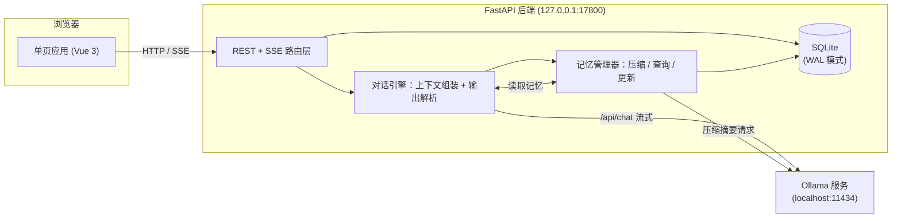
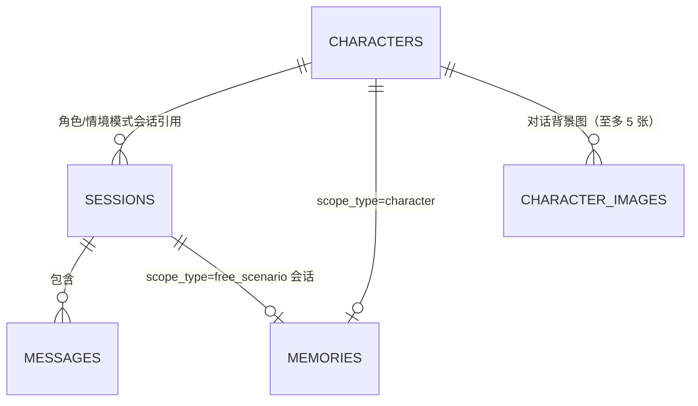

# 多模式对话机器人开发文档

基于本地 Ollama 模型的三模式对话应用：角色对话、角色情境、情境生成。本文档记录需求定义、数据模型、核心机制、API 与界面的完整设计，以及各项设计决策的取舍理由——开发与后续迭代以此为准；面向使用者的功能说明与上手步骤见 [README.md](./README.md)。

## 1. 项目概述

### 1.1 目标

做一个完全本地运行的多模式对话机器人：

- 对话生成全部走本机 Ollama 服务，不依赖任何云端 API
- 支持三种模式，覆盖"扮演一个角色聊天"、"角色+场景演绎"、"自由剧本生成"三类使用场景
- 记忆体系分两层：会话内的消息历史（短期），跨会话的长期记忆（按角色或按会话绑定），长期记忆随对话自动压缩
- 消息可编辑、可删除、可重新生成，用户对上下文有完全控制权

### 1.2 运行环境

| 项 | 值 |
|---|---|
| 操作系统 | Windows 11（不做跨系统适配承诺） |
| 模型服务 | 本机 Ollama（默认 `http://localhost:11434`） |
| 后端 | Python 3.13（uv 管理环境与依赖）/ FastAPI / SQLite（文件数据库，路径在配置中直接指定） |
| 前端 | Vue 3（CDN 引入，无构建流程）+ 原生 CSS |
| 使用场景 | 单用户本地使用，无鉴权、无多用户并发设计 |

对话模型不与启动配置绑定：首次启动取 `config.yaml` 的默认值，之后在界面随时切换，思考型与非思考型模型均兼容（见 5.2、6.6 与 10.6）。

### 1.3 技术选型理由

- **FastAPI**：原生支持 async 与 `StreamingResponse`，SSE 流式输出实现简单；自动生成 OpenAPI 文档方便调试。
- **SQLite + WAL 模式**：单文件、零部署，单用户场景下无并发瓶颈；数据全在本地，符合"本地记忆"的定位。
- **Vue 3 CDN 模式**：省去 node/npm 构建链，前端就是三个静态文件，由 FastAPI 直接托管；界面状态较多（三模式、角色/会话两级列表、右侧面板、流式生成与停止、行内编辑），纯原生 JS 会比模板语法更难维护。
- **SSE 而非 WebSocket**：通信是单向流（请求 → 生成流），SSE 足够且实现和调试都更简单。

## 2. 需求定义

### 2.1 三种对话模式

| 维度 | 角色对话模式 | 角色情境模式 | 情境生成模式 |
|---|---|---|---|
| 模式标识 | `character_chat` | `character_scenario` | `free_scenario` |
| 绑定角色 | 是（会话创建时选定） | 是（与角色对话模式共用同一套角色） | 否 |
| 生成内容 | 仅角色话语 | 角色话语 + 情境说明 | 自由生成的对话 + 情境 |
| 可配置项 | 角色信息 + 系统生成要求 | 系统生成要求 | 系统生成要求 |
| 生成要求示例 | 输出倾向（回复长度、语气、主动性） | 情境篇幅、推进速度、导演指令 | 题材、文风、篇幅、情境台词配比、导演指令 |
| 长期记忆归属 | 按角色绑定，跨会话共享 | 与角色对话模式共用同一份角色记忆 | 按会话独立保存 |

三种模式的一致规则：

- 系统生成要求挂在**会话**上，随时可改，改动只影响后续生成，不改动历史消息
- 角色对话模式与角色情境模式对同一个角色共享角色卡和长期记忆，在任一模式下聊过的关键信息，另一个模式也能记起
- 角色对话模式与角色情境模式的**会话列表相互隔离**：各自只列出本模式创建的会话（`sessions.mode` 区分），另一个模式的会话不显示、打不开，也改不了生成要求、无法重新生成；切模式 Tab 会各自恢复到本模式上次打开的会话（见 5.6、10.13）。隔离只针对会话，角色卡与长期记忆仍按上一行共用
- 长期记忆相互隔离：角色 A 与角色 B 的记忆互不可见；情境生成模式各会话之间的记忆互不可见

### 2.2 角色信息（角色卡）

角色模式下的两个模式共用，字段如下：

| 字段 | 说明 | 必填 |
|---|---|---|
| `name` | 角色名 | 是 |
| `appearance` | 外观设定（年龄、身形、衣着、标志性特征） | 否 |
| `personality` | 性格设定 | 否 |
| `speech_style` | 语言风格（口癖、语气、用词习惯） | 否 |
| `backstory` | 背景故事 | 否 |
| `avatar` | 自定义头像，存 data URL（jpg/png/webp） | 否 |

角色卡编辑立即生效，下一次生成即按新设定组装提示词。`avatar` 不进提示词（模型不需要看到头像），只用于界面显示。

**头像的存取方式**：选图后先在浏览器里**校验**（MIME 必须是 `image/*`、文件 ≤10MB、能解码、最短边 ≥256px、总像素 ≤4000 万），通过则弹出**裁剪弹窗**让用户拖动（并可用滑杆 1×～3× 缩放）选定正方形区域，确定时按取景框换算原图取样矩形、画进 **256×256** 画布并重编码为 **JPEG（质量 0.85）**，再以 data URL 提交；后端只存这一个字符串（见 10.21 的取舍理由）。上限 256KB 只是兜底。`avatar` 为空串表示不用自定义头像，界面回落到"姓名首字"占位。

最短边下限取 256、与输出边长相同，是为了**保证 1× 缩放下永不放大**：取样边长在 1× 时等于原图短边，只要它 ≥256，裁出来的就一定是原像素或下采样，不会因为放大而发糊。代价是小于 256 的图直接拒收。放大（>1×）仍可能让取样区域小于 256（例如 256 的图放到 2× 只剩 128），这种情况弹窗里会**只在此时**出现一行提示，告知实际取样像素数。

校验放在客户端而不是等后端报错，是因为这里要拦的两类问题（文件太大、分辨率不对）只有拿到原文件才判得准；服务端仍保留格式白名单与长度上限作为兜底。校验失败**不使用底部错误条**——那条只在打开会话时才渲染，从侧栏打开角色弹窗时用户根本看不到，所以改为在头像选择处就地显示。

### 2.3 系统生成要求

按模式分组的结构化配置，前端渲染为表单，数据库存 JSON。每个字段都映射为提示词中的自然语言要求；其中导演指令渲染为独立段落（见 5.1）。

**角色对话模式（输出倾向）：**

| 字段 | 类型 | 取值 |
|---|---|---|
| `reply_length` | 单选 | 简短 / 适中 / 详细 |
| `proactive` | 单选 | 低 / 中 / 高（主动推进话题的程度） |
| `extra` | 自由文本 | 任意补充要求，原样注入 |

> 曾有 `tone_hint`（语气基调，自由文本），已移除：一个角色用什么语气说话，本来就是这个角色（角色卡里的"语言风格"）加上模型自己判断的结果，再让用户在会话里指定一遍既重复又容易和角色卡打架（见 10.24）。

**角色情境模式（生成要求）：**

| 字段 | 类型 | 取值 |
|---|---|---|
| `scenario_length` | 单选 | 简短（1 句）/ 适中（1-3 句）/ 详细（3 句以上） |
| `pace` | 单选 | 平缓 / 适中 / 快速（剧情推进速度） |
| `director_notes` | 自由文本 | 导演指令：影响情境走向，不进入对话 |
| `extra` | 自由文本 | 任意补充要求 |

> 早期版本还有一个 `scenario_types` 多选标签（情境选取倾向：日常/温馨/冲突…），实测收益不明显却占一整行表单，已移除；同类需求由导演指令承担。

**情境生成模式：**

| 字段 | 类型 | 取值 |
|---|---|---|
| `genre` | 自由文本 | 题材，如"都市奇幻"、"武侠" |
| `style` | 自由文本 | 文风，如"细腻文学风"、"轻喜剧" |
| `length` | 单选 | 短 / 中 / 长（单次生成篇幅） |
| `composition` | 单选 | 只有情境 / 情境为主 / 均衡 / 台词为主（情境与台词的配比，默认均衡） |
| `extra` | 自由文本 | 任意补充要求 |

> 这个模式曾有 `director_notes`，已移除：用户在这个模式下发的每条消息本身就是对下一步的指令，再单设一个字段属于重复，还会让"当前指令"分散在两处（见 10.24）。

`composition` 决定情境与台词各占多少：`scenario_only` 明确要求不输出任何 `[DIALOG]`，`scenario_heavy` 允许情境铺陈多段、台词只作点缀。旧会话的 `gen_settings` 里没有这个键时由 `DEFAULT_SETTINGS` 兜底为 `balanced`，因此不需要数据迁移（见 5.1）。

`director_notes`（导演指令）与输出风格类字段不同：它保存对情境/剧情走向的持续性要求（如"让两人的关系逐渐缓和"），不作为消息进入对话历史，只注入 system prompt 指导生成，角色不会"说出"收到了指令。它与生成要求的其他字段一样挂在会话上、随时可改、只影响后续生成。**目前只有角色情境模式保留此字段**——角色对话模式无情境，同类需求由 `extra` 承担；情境生成模式的用户消息本身就是指令，故不设（见 10.24）。

### 2.4 共通能力

三种模式都必须实现：

1. **本地会话记忆**：会话内全部消息持久化在本地 SQLite，重开应用后完整恢复。
2. **编辑消息**：双击气泡或点"编辑"按钮修改任意一条消息（含用户消息与生成消息的话语、情境说明）；角色情境模式下情境框恒可编辑，两个输入框带"情境说明""话语内容"标签。
3. **删除消息**：删除单条，或级联删除某条及其之后的所有消息。
4. **重新生成**：对任意一条生成消息触发重新生成，以该消息之前的上下文为基准替换生成；**对用户消息同样可触发**，此时保留该消息本身、只重做它之后的回复。会话绑定的角色已被删除时该操作不可用（前端不提供按钮，接口也会拒绝，见 5.5）
5. **记忆自动压缩**：上下文超过阈值时自动把较早的消息归档为长期记忆摘要，过程不需要用户操作；压缩后的内容仍可通过右侧面板查看和手动编辑。
6. **停止生成**：生成过程中可随时中断；已经流出的部分照常入库，不丢内容（见 5.5）。
7. **会话标题自动命名**：创建时未填标题的会话，在用户说够内容后由模型异步总结标题，用户手动改名后不再自动覆盖（见 5.6）。

### 2.5 非功能需求

- 生成过程流式输出，首字延迟取决于本机模型速度，界面需有"生成中"状态反馈；思考型模型在正文流出前显示"思考中"占位，推理内容不进入界面与消息记录
- 记忆压缩在后台异步执行，不阻塞对话
- 所有本地数据（数据库文件）放在配置文件直接指定的路径下，不用环境变量派生
- 界面语言为中文

## 3. 总体架构

### 3.1 架构图



一次典型对话的完整链路：

1. 前端 POST 会话消息 → 路由层写入 user 消息
2. 对话引擎按会话模式组装 system prompt（角色卡 + 生成要求 + 长期记忆）与未归档历史
3. 调 Ollama `/api/chat` 流式接口，SSE 逐段推给前端
4. 生成完成：解析输出格式（情境/话语分段），落库 assistant 消息
5. 触发后台记忆检查，超阈值则异步压缩

### 3.2 Ollama 客户端封装

后端封装一个异步客户端，供对话与记忆压缩共用：

```python
import json
import httpx

async def chat_stream(messages: list[dict], model: str, options: dict | None = None):
    """流式调用 Ollama /api/chat，兼容有无思考模式的模型。
    yield (kind, value)：("status", "thinking"/"generating") 或 ("delta", 正文增量)。
    """
    payload = {
        "model": model,
        "messages": messages,
        "stream": True,
        "options": options or cfg["options"],  # temperature, num_ctx 等；不传 think 参数，兼容策略见 5.2
    }
    tf = ThinkFilter()                          # 内联 <think> 过滤，见 5.2
    saw_thinking = saw_content = False
    # 读超时设为不限（生成可能要几十秒），但连接超时收紧到 10s：Ollama 没启动时要快速失败
    async with httpx.AsyncClient(timeout=httpx.Timeout(None, connect=10)) as client:
        async with client.stream("POST", f"{cfg['base_url']}/api/chat", json=payload) as resp:
            resp.raise_for_status()
            async for line in resp.aiter_lines():
                if not line:
                    continue
                chunk = json.loads(line)
                msg = chunk.get("message") or {}
                if msg.get("thinking") and not saw_thinking:
                    saw_thinking = True             # 新版 Ollama：推理在独立字段
                    yield ("status", "thinking")    # 只用来显示"思考中"，内容不转发
                text = msg.get("content", "")
                if text:
                    out, in_think = tf.feed(text)
                    if in_think and not saw_thinking:
                        saw_thinking = True
                        yield ("status", "thinking")
                    if out:
                        if not saw_content:
                            saw_content = True
                            yield ("status", "generating")
                        yield ("delta", out)
                if chunk.get("done"):
                    break
    tail = tf.flush()                           # 流结束，放出被缓冲的残尾
    if tail:
        if not saw_content:
            yield ("status", "generating")
        yield ("delta", tail)
```

另有非流式封装 `chat_once()`：记忆压缩与会话命名共用，同样按调用传入 model，返回前剥掉 `<think>` 段。

启动自检在 `main.py` 的 lifespan 里：调 `list_models()`（即 Ollama `/api/tags`）取已安装模型集合，校验 `app_settings` 里的当前模型是否在其中，缺失则写启动日志、并在界面顶栏提示"所选模型未安装"；Ollama 整体不可达时只记一条警告，不阻断启动。前端除顶栏提示外，还会区分"连不上 Ollama"与"Ollama 中没有任何模型"两种情形。

每次调用的 `model` 参数取自 `app_settings` 表的运行时设置，而非模块级常量——这是"模型随时可换"在客户端层的落点：切换只改数据库一行，下一次请求即用新模型，无需重启。旧版 Ollama 把 `<think>` 内联进 content 的情况，由 `ThinkFilter` 兜底过滤（见 5.2）。

## 4. 数据模型

### 4.1 ER 关系



`memories` 是按 scope 唯一的单行滚动摘要：一个角色（或一个自由会话）至多一条记忆记录，压缩时原地更新。

### 4.2 表结构

```sql
CREATE TABLE characters (
    id           INTEGER PRIMARY KEY AUTOINCREMENT,
    name         TEXT NOT NULL,
    appearance   TEXT NOT NULL DEFAULT '',
    personality  TEXT NOT NULL DEFAULT '',
    speech_style TEXT NOT NULL DEFAULT '',
    backstory    TEXT NOT NULL DEFAULT '',
    created_at   TEXT NOT NULL,
    updated_at   TEXT NOT NULL,
    avatar       TEXT NOT NULL DEFAULT ''   -- 自定义头像的 data URL；空串 = 用姓名首字占位
);

CREATE TABLE sessions (
    id           INTEGER PRIMARY KEY AUTOINCREMENT,
    mode         TEXT NOT NULL CHECK(mode IN ('character_chat','character_scenario','free_scenario')),
    character_id INTEGER REFERENCES characters(id) ON DELETE SET NULL,
    title        TEXT NOT NULL DEFAULT '新会话',
    title_auto   INTEGER NOT NULL DEFAULT 1,  -- 1 = 标题可由模型自动总结，0 = 用户已手动命名
    gen_settings TEXT NOT NULL DEFAULT '{}',  -- JSON，结构按 2.3 节
    created_at   TEXT NOT NULL,
    updated_at   TEXT NOT NULL
);

CREATE TABLE messages (
    id         INTEGER PRIMARY KEY AUTOINCREMENT,
    session_id INTEGER NOT NULL REFERENCES sessions(id) ON DELETE CASCADE,
    role       TEXT NOT NULL CHECK(role IN ('user','assistant')),
    content    TEXT NOT NULL,             -- 话语正文
    scenario   TEXT,                      -- 情境说明；角色对话模式恒为 NULL
    archived   INTEGER NOT NULL DEFAULT 0,-- 1 = 已压缩进长期记忆，不再注入上下文
    edited     INTEGER NOT NULL DEFAULT 0,
    created_at TEXT NOT NULL
);
CREATE INDEX idx_messages_session ON messages(session_id, id);

CREATE TABLE memories (
    id            INTEGER PRIMARY KEY AUTOINCREMENT,
    scope_type    TEXT NOT NULL CHECK(scope_type IN ('character','session')),
    scope_id      INTEGER NOT NULL,        -- character_id 或 session_id
    content       TEXT NOT NULL DEFAULT '',-- 滚动摘要正文
    message_count INTEGER NOT NULL DEFAULT 0, -- 已归档消息累计数
    updated_at    TEXT NOT NULL,
    UNIQUE(scope_type, scope_id)
);

CREATE TABLE app_settings (
    id           INTEGER PRIMARY KEY CHECK(id = 1),  -- 单行表
    model        TEXT NOT NULL,                      -- 当前对话模型
    memory_model TEXT NOT NULL DEFAULT '',           -- 压缩用模型，空 = 同对话模型
    updated_at   TEXT NOT NULL
);

-- 角色的对话区背景图（5.8 节）。不放进 characters 表：那会让角色列表接口背上几 MB 图片
CREATE TABLE character_images (
    id           INTEGER PRIMARY KEY AUTOINCREMENT,
    character_id INTEGER NOT NULL REFERENCES characters(id) ON DELETE CASCADE,
    position     INTEGER NOT NULL DEFAULT 0,   -- 展示顺序
    data         TEXT NOT NULL,                -- 图片 data URL
    created_at   TEXT NOT NULL
);
CREATE INDEX idx_character_images ON character_images(character_id, position, id);
```

关键设计：

- **`messages.archived` 而非物理删除**：压缩后被归档的消息仍留在库里，前端默认折叠显示"已归档 N 条"，可展开查看原文。上下文组装时跳过 `archived=1`。
- **`scenario` 与 `content` 分列存储**：编辑、渲染、重新注入历史时两种内容各自独立处理，不靠运行时反复解析。
- **删除角色**：`character_id` 置 NULL，角色记忆删除，其会话保留（可看历史、不可继续生成，前端提示"角色已删除"）。不级联删会话，避免误删用户数据。
- **`app_settings` 单行表存运行时设置**：模型选择写进数据库，切换后重启仍生效；`config.yaml` 的模型仅作首次初始化默认值。压缩用的模型也在此表，可随时单独更换。
- **`sessions.title_auto` 而非比对标题字符串**：会话是否还能被自动命名由独立字段记录，不用 `title == '新会话'` 这种魔法值判断——用户完全可能把会话真命名为"新会话"。创建会话时未填标题才置 1，用户重命名即置 0，因此每个会话至多被自动命名一次，且永不覆盖用户的手动命名。
- **`avatar` 存在角色表里而不是当文件存**：图片跟着数据库走，备份/恢复才等于"全部数据"（见 10.20、10.21）。
- **旧库补列用 `_migrate`**：`CREATE TABLE IF NOT EXISTS` 不会修改已存在的表，所以启动时检查 `PRAGMA table_info(sessions)` 并补 `title_auto`；补列时把存量会话统一置 0，即存量数据一律不参与自动命名，避免升级后用户已有标题被改写。`characters.avatar` 同样用补列加入，存量角色头像为空串。补列前先确认表存在——`_migrate` 也会被只建了部分表的场景调用（单测里造的最小旧库），缺表时静默跳过而不是报错。

### 4.3 长期记忆的 scope 规则

| 会话模式 | 记忆 scope | 效果 |
|---|---|---|
| `character_chat` | `(character, 会话的 character_id)` | 同角色所有会话共享 |
| `character_scenario` | `(character, 会话的 character_id)` | 与角色对话模式完全共用 |
| `free_scenario` | `(session, 会话 id)` | 每个会话独立 |

隔离性由查询条件保证：组装上下文时只读取当前会话对应 scope 的记忆记录，其他角色/会话的记忆不进入提示词。

## 5. 核心设计

### 5.1 上下文与提示词组装

每次生成的消息序列固定为三段：

```
[system]  模式指令 + 角色卡(如有) + 生成要求 + 长期记忆 + 输出格式规则
[历史]    该会话所有 archived=0 的消息（按 id 升序，超出条数上限截断最早的部分）
[当前]    本轮 user 消息
```

三种模式的 system prompt 模板（`app/prompts.py` 中实现为 Python 函数，此处为模板主体）：

**角色对话模式：**

```text
你要完全扮演下面这个角色，与用户进行对话。

# 角色设定
姓名：{name}
外观：{appearance}
性格：{personality}
语言风格：{speech_style}
背景：{backstory}

# 你对这个用户的记忆
{memory_content}

# 回复要求
{gen_settings_text}

# 输出规则
只输出{name}说出的话。不要输出旁白、动作描写、心理描写、括号注释或舞台说明。
不要在开头重复角色名。
```

**角色情境模式：**

```text
你要扮演下面这个角色，与用户在同一个故事情境中互动。

# 角色设定
（同上五字段）

# 你对这个用户的记忆
{memory_content}

# 生成要求
{gen_settings_text}

# 导演指令
{director_notes 或 "（无）"}
导演指令只决定情境与剧情的走向，不属于对话内容，角色不得提及或回应"收到指令"。

# 输出规则
每次回复严格按以下两段格式输出，两段都不可省略：
[SCENARIO]场景、动作、氛围等情境说明
[DIALOG]你扮演的角色说出的话
```

**情境生成模式：**

```text
你是创意写作引擎，根据用户的引导生成故事情境与角色对话。

# 本会话此前的剧情
{memory_content}

# 生成要求
{gen_settings_text}

# 输出规则
每次生成都用下面的标记分段输出，每个段落以标记开头，段落数量与先后顺序不限：
[SCENARIO]场景、氛围、事件等情境说明
[DIALOG]角色名：该角色说出的话
[SCENARIO] 与 [DIALOG] 都可以只出现其中一种，也可以各自出现多次。
[DIALOG] 是可选的：只写情境时就不要输出任何 [DIALOG]。
情境与台词的比例由「情境与台词的配比」要求决定。
```

这里刻意**不给出"一段情境 + 两段台词"式的完整示例**：那种示例会被模型当成必须遵循的段落模板，导致每轮都产出等量的情境与台词，而用户往往只想要纯情境或情境远多于台词。改为只列标记说明 + 显式声明 `[DIALOG]` 可选，再由 `composition` 字段指出配比（对照 10.14）。

初版这里还多写了一句"不要默认让两者等量或交替出现"，后来去掉了：配比本来就由 `composition` 决定，而这句话会在配比选"均衡"时把等量/交替输出一并禁掉——那是"均衡"本该允许的写法。禁止某一种配比是 `composition` 的职责，不该由输出规则包办。

生成要求 `gen_settings_text` 由 JSON 字段拼接为自然语言（`prompts.py` 里每个模式一个 render 函数），例如角色对话模式：

```python
REPLY_LENGTH_DESC = {"short": "每次回复不超过2句话", "medium": "每次回复2到4句话", "long": "每次回复可以详细展开"}
PROACTIVE_DESC = {"low": "被动回应即可，不要主动抛出新话题", "medium": "适度主动，偶尔推进话题", "high": "主动抛出新话题，积极推进对话"}

def _join(parts: list[str]) -> str:
    return "；".join(p for p in parts if p) + "。"

def render_character_chat_settings(s: dict) -> str:
    parts = [
        f"回复长度：{REPLY_LENGTH_DESC.get(s.get('reply_length'), REPLY_LENGTH_DESC['medium'])}",
    ]
    parts.append(f"主动性：{PROACTIVE_DESC.get(s.get('proactive'), PROACTIVE_DESC['medium'])}")
    if s.get("extra"):
        parts.append(f"附加要求：{s['extra']}")
    return _join(parts)
```

取值一律用 `.get(..., 默认)` 兜底：会话里存的可能是旧版本留下的枚举值，直接下标取值会在升级后 KeyError。字段定义与默认值集中在 `prompts.py` 的 `FIELDS` / `DEFAULT_SETTINGS`，通过 `GET /api/gen-settings` 下发给前端渲染，前端不含任何硬编码字段。

`director_notes` 不并入 `gen_settings_text`，而是渲染为提示词中独立的"导演指令"段：它是剧情走向的持续要求，不是输出风格，独立成段让模型不会混淆两者，用户在面板里也能直观理解字段含义（目前仅角色情境模式有该字段，见 10.24）。

字段被移除后，旧会话 `gen_settings` 里遗留的同名键**既不渲染也不提交**：`initGenForm()` 会把不在当前字段定义里的键丢掉，`saveGenSettings()` 也只按字段定义组装载荷，所以旧值会在下一次保存时被自然清掉。

历史消息注入时的格式还原：assistant 历史按原始标记格式回填（`[SCENARIO]xxx\n[DIALOG]yyy`），让模型持续看到自己此前的输出结构，格式遵循率更高。user 消息注入 `content`。

### 5.2 输出解析与思考模式兼容

解析前先剥掉思考段——思考型模型（qwen3、deepseek-r1 等）会在正文之外产生推理过程，直接进解析会污染 `[SCENARIO]`/`[DIALOG]` 结构。兼容不依赖 Ollama 的 `think` 请求参数（不同模型与端点对它的支持参差），而是两条应用层路径叠加：

- **首选（新版 Ollama）**：思考型模型把推理放在响应的独立 `thinking` 字段，`message.content` 只含正文。`chat_stream` 只转发 `content`；`thinking` 非空时向前端发"思考中"状态（`status` 事件，见 6.5）。
- **兜底（旧版本或个别模型模板）**：推理以内联 `<think>…</think>` 混在 `content` 里。非流式调用直接 `re.sub(r"<think>.*?</think>", "", text, flags=re.S)`；流式调用在 `chat_stream` 外套一层 `ThinkFilter` 状态机：

```python
class ThinkFilter:
    """流式 <think> 过滤器。feed() 返回 (正文增量, 是否处于思考态)。"""

    OPEN, CLOSE = "<think>", "</think>"

    def __init__(self):
        self.buf = ""          # 未决缓冲：可能含被 chunk 边界拆开的半个标签
        self.in_think = False

    def feed(self, chunk: str):
        self.buf += chunk
        out = []
        while True:
            tag = self.CLOSE if self.in_think else self.OPEN
            i = self.buf.find(tag)
            if i < 0:                       # 无完整标签：留出可能是标签前缀的尾巴
                keep = len(tag) - 1
                if len(self.buf) > keep:
                    head, self.buf = self.buf[:-keep], self.buf[-keep:]
                    if not self.in_think:
                        out.append(head)    # 思考态下的内容直接丢弃
                break
            if not self.in_think:
                out.append(self.buf[:i])
            self.in_think = not self.in_think
            self.buf = self.buf[i + len(tag):]
        return "".join(out), self.in_think

    def flush(self) -> str:
        """流结束：思考态未闭合说明全程无正文，返回空串；否则放出残尾。"""
        if self.in_think:
            return ""
        out, self.buf = self.buf, ""
        return out
```

两条路径叠加后，无论运行中把模型换成什么，进入格式解析的文本都不含思考内容——这是"模型随时可换"在解析层的落点。

用标记 `[SCENARIO]` / `[DIALOG]` 而非中文标签：英文标记在中英混合输出里的歧义最小，且避免全角方括号问题。前端渲染时再显示为中文"情境"标签。

```python
import re

SEGMENT = re.compile(r"\[(SCENARIO|DIALOG)\]\s*(.*?)(?=\n?\[(?:SCENARIO|DIALOG)\]|$)", re.S)

def parse_output(mode: str, raw: str):
    """返回 (scenario, content)。角色对话模式原样返回。"""
    if mode == 'character_chat':
        return None, raw.strip()

    segs = SEGMENT.findall(raw)
    if not segs:                       # 容错：模型没按格式输出
        return None, raw.strip()

    if mode == 'character_scenario':
        # 一条情境 + 一段话语
        scenario = next((t for tag, t in segs if tag == 'SCENARIO'), None)
        dialog = "\n".join(t for tag, t in segs if tag == 'DIALOG')
        return (scenario or None), dialog or raw.strip()

    # free_scenario：多段，content 存全文（含标记），前端分段渲染
    return 'MULTI', raw.strip()
```

容错原则：解析不出标记时不丢弃内容，整体降级为话语文本；解析成功后落库的 `content`/`scenario` 是干净文本，`free_scenario` 例外（存原始全文，渲染时再分段）。

分段渲染发生在前端：`free_scenario` 的 `content` 是带标记全文，`app.js` 用同一个正则（`SEGMENT_RE`，带 `g` 标志）在 `segmentsOf()` 里按原文顺序切成情境段与话语段渲染——段落数量与顺序完全由模型输出决定，前端不假设两者交替出现，只有 `[SCENARIO]` 时就是一个情境块。后端不在 SSE 响应里附带分段结果——同一份数据只在一处解析，避免两个来源不一致。`parser.py` 里另有一个等价实现 `split_segments()`，目前只被单测引用，作为这条正则的参考实现与回归用例。

**流式渲染与解析的关系**：思考内容在到达前端之前已被上述两层处理拦下——前端只会收到 `status` 事件的"思考中"占位与正文增量，正文增量直接显示在"生成中"的原始块里；收到 `done` 事件（携带解析后的 `content`/`scenario`）后用解析结果替换渲染。这样避免流中途解析产生的抖动，实现也最简单。

### 5.3 长期记忆的注入与更新时机

- **注入**：只读当前 scope 的 `memories.content`，插入 system prompt 的"记忆"段。无记忆记录时该段显示"（暂无，这是你们的初次交流）"。
- **更新**：唯一的更新入口是 5.4 的自动压缩，以及右侧面板记忆区的手动编辑（PUT 接口）。对话本身不实时写记忆，避免每轮多一次 LLM 调用拖慢响应。
- **可见性**：右侧面板的"角色记忆/会话记忆"区展示当前绑定 scope 的记忆全文，可直接编辑保存，下次生成即生效；同时显示已归档条数、更新时间与"上次压缩失败"标记（来自 `GET /api/memories/...` 返回的 `compress_failed`）。

### 5.4 记忆自动压缩

**触发时机**：每次生成的消息落库后（含用户点"停止"而保留的部分内容），后台任务统计该会话未归档消息的 `content` 字符总数；超过 `memory.compress_threshold_chars`（默认 6000）即触发。触发检查不阻塞 SSE 响应，同 scope 已有压缩在途时跳过，避免并发覆盖。

**压缩流程**：

1. 锁定本会话最早的 `archive_batch_size`（默认 20）条 `archived=0` 消息（记录 ID 集合，此后新消息不受影响）
2. 组装压缩提示词，调 `chat_once()`（压缩模型在运行设置中单独指定，默认同对话模型）：

```text
以下是关于角色「{name或"本次创作"}」的现有记忆：
{old_memory 或 "（无）"}

以下是新增的对话记录：
{按时间排列的批次消息，格式：user: ... / {name}: ...}

请把新对话中值得长期记住的信息合并进现有记忆，输出更新后的完整记忆。
只保留：重要事件、双方透露的个人信息、关系变化、约定与承诺、关键剧情走向。
丢弃寒暄和重复内容。用条目列表（- 开头）输出，总长度不超过 {max_memory_chars} 字。
只输出记忆内容本身。
```

3. 写回 `memories`（UPSERT），`message_count` 累加批次条数，批次消息置 `archived=1`
4. 失败处理：压缩请求失败则本次放弃，批次保持未归档，下次触发时重试；连续失败记日志，界面面板记忆区显示"上次压缩失败"

**压缩与编辑/删除的一致性**：已归档进记忆的内容不因后续删改消息而回滚（简化决策，见 10.3）。需要修正记忆时走面板记忆区手动编辑。

### 5.5 消息编辑、删除与重新生成

**编辑**（`PUT /api/messages/{id}`）：更新 `content` / `scenario`，置 `edited=1`。`scenario` 采用"显式传入才更新"的语义——不传则保持原值，显式传 `null` 表示清空情境。后端用 Pydantic 的 `model_fields_set` 区分这两种情况，而不是 `COALESCE(?, scenario)`：后者会让情境一旦写入就再也删不掉。前端编辑过的消息显示"已编辑"标记。归档消息同样可编辑（只改展示原文，不影响已生成的记忆）。

**删除**（`DELETE /api/messages/{id}?cascade=`）：
- `cascade=false`（默认）：只删这一条
- `cascade=true`：删这条及其之后所有消息，用于"从中间重来"

**重新生成**（`POST /api/messages/{id}/regenerate`，SSE）：assistant 与 user 消息都可触发，区别只在删除范围：

1. 取出目标消息（`role` 由表约束保证只可能是 `assistant` 或 `user`）
2. 校验会话可生成（`load_generation_context()`：会话存在、角色模式的绑定角色仍在）。**这一步必须排在删除之前**——否则角色已删除时就会先白删一截历史，再抛出"无法继续生成"（见 10.15）
3. 按 `role` 决定删除范围：assistant 走**替换式**，删 `id >= mid`（连它一起删）；user 则删 `id > mid`，**这条用户消息本身就是这一轮的输入，必须保留**
4. 以剩余上下文重新走 5.1 的组装与生成流程，SSE 返回
5. 新消息落库，得到新的 message id（由 `done` 事件携带；`meta` 事件只在 `/chat` 里出现，用于确认 user 消息已落库）

从用户消息重新生成是"停止生成"的必要补充：用户中途点停止时，若一个字都还没流出，服务端不入库（见本节末尾"停止生成"第 4 条），这一轮就只剩一条用户消息、没有任何 assistant 消息。若重新生成只认 assistant 消息，这条路就完全没有补救入口——这正是它被加上的原因。

`/chat` 同理：先 `load_generation_context()` 校验通过，才写入 user 消息，避免在角色已删除的会话里留下一条永远得不到回复的用户消息。

前端在这两个流程里都做了乐观更新（发消息时先渲染 user 气泡，重新生成时先把消息列表截断到目标位置），所以服务端拒绝时界面必须回滚。做法是让 `ssePost()` / `api()` 抛出的 Error 带上 `httpStatus`：调用方据此把"服务端明确拒绝"（直接显示服务端的原因）与"连接中断"（显示"连接中断：…"）分开提示，并在被拒后重新拉取消息列表把界面还原成服务端的真实状态。回滚必须放在 `endStream()` 之后——`refreshMessages()` 在 `streaming` 为真时会直接返回，提前调用等于没调。

替换式在 v1 是明确取舍：实现直接、上下文永远线性一致。多版本分支（保留旧生成、可切换）列为可选扩展，见 11 节。

**对上下文的影响**：三种操作都直接改变 messages 表，下次组装上下文时自然生效——引擎每次都从数据库现查，不在内存里维护对话副本。

**停止生成**：生成过程中输入框右侧的"发送"变为"停止"。点击后前端用 `AbortController` 中断 fetch，服务端据此收到断连、生成器被取消，在 `asyncio.CancelledError` 分支里把**已经流出的部分**照常解析落库，然后不再发送 `done` 事件。因此：

1. 停止后不会抛错，只相当于提前结束这一轮生成；
2. 部分内容与正常生成一样入库，可继续编辑、删除或重新生成；
3. 前端拿不到 `done`（没有 message id），改为在中断后短暂轮询 `/api/sessions/{id}/messages` 把服务端刚写入的部分内容同步回来；
4. 若中断时一个字都还没流出，则不入库，会话只留下那条用户消息。

取舍：保留部分内容而不是丢弃，已产出的算力不浪费，用户接着补充要求即可继续。代价是前端要多一次同步请求，且"停止"不是一个原子操作——服务端落库发生在客户端断开之后，存在极短的可见延迟（实测 < 300ms）。

### 5.6 会话与模式规则

- 会话创建时锁定 `mode`，不可更改；`character_*` 模式必须传 `character_id`
- **会话列表按模式隔离**：前端每次都以 `GET /api/sessions?mode=<当前模式>` 拉取，列表里只有本模式的会话，因此另一个模式的会话既看不到也点不开（`openSession()` 另有模式校验作兜底）。隔离靠前端收窄实现的理由见 10.13
- **各模式各自记住当前会话**：`activeByMode` 记录每个模式最后打开的会话 id，切模式 Tab 时若该会话仍存在就恢复，否则清空对话区（不残留另一模式的会话）；生成过程中不允许切模式
- 会话标题：默认"新会话"；创建时未填标题的会话（`title_auto=1`）在每轮生成完成后尝试由模型异步总结标题，成功后 `title_auto` 置 0；用户手动重命名同样置 0，之后永不再被自动覆盖。总结失败不置位，下一轮自动重试
- 删除会话：级联删除其消息；若为 `free_scenario` 模式，其会话级记忆一并删除；角色记忆不受影响
- 会话列表按 `updated_at` 倒序

**自动命名的两个约束：**

- **只把用户说过的话喂给命名提示词**：角色回复本身是带着长期记忆生成的，若连回复一起总结，旧记忆的内容会被混进标题，新会话容易被命名成上一个话题（这正是实际暴露过的问题）
- 用户累计发言不足 `naming.min_user_chars`（默认 8 字）时先不命名，等后续轮次积累够了再命名，避免"你好"这类开场被总结成没有信息量的标题

命名提示词（`naming.py`，temperature 降到 0.3）：

```text
请根据用户在下面这些发言，概括这次对话的主题并起一个标题。
要求：不超过 {max_chars} 个字，只写标题本身，不要标点、引号或"标题："之类的前缀。

用户说过的话：
{把该会话未归档消息里所有 user 内容用 " / " 连起来，截断到 300 字}
```

模型返回的标题还要过一遍 `_clean()`：取首行、去掉"标题："前缀与成对引号、剥掉可能残留的 `<think>` 段、超长截断、清掉首尾标点——小模型的输出经常带这些包装。

### 5.7 数据库备份

**为什么需要**：所有数据（角色、会话、消息、长期记忆）都在一个 SQLite 文件里，而它不在版本库中。长期记忆尤其不可再生——它是模型对历史对话的压缩产物，丢了只能重新聊出来，而且结果不会和原来一样。

**为什么不能直接拷文件**：库跑在 WAL 模式下，已提交但尚未 checkpoint 的写入只存在于 `chatbot.db-wal`。实测（见阶段 7 的验证）：先 checkpoint 让主文件拿到旧数据，再写入一条新记录，此时 `shutil.copy2(主文件)` 得到的副本读到的正好是**上一条**——丢的恰恰是最后那一段对话；若从未 checkpoint 过，副本连表结构都读不出来。所以必须走 `sqlite3.Connection.backup()`：它按连接读取当前已提交状态，WAL 内容一并包含，且在应用正常运行、连接打开时也能安全导出。

**流程**（`app/backup.py`）：

1. 库不存在则跳过（首次运行或刚重置过，没有可备份的内容）
2. `Connection.backup()` 把快照写进 `backups/chatbot-<YYYYmmdd-HHMMSS>.db.tmp`
3. 对副本跑 `PRAGMA quick_check`：不通过就删掉临时文件并记 error，**绝不留下一个没校验过的文件冒充好备份**
4. 把副本的 `journal_mode` 改回 `DELETE`：源库是 WAL，副本会继承这个属性并带出 `-wal`/`-shm` 边车文件，那样备份就不是"一个自包含的文件"了，恢复和清理都变麻烦
5. 改成正式文件名（先写临时名再改名，中途失败不会留下半截文件）
6. 轮转：只保留最近 `backup.days`（默认 14）个自然日的备份（含最新那份当天）；删文件时连它的边车文件一起删，避免轮转后留下孤立的 `-wal`/`-shm`。名字不合约定的文件不参与清理，免得误删

**触发**：`run.py` 在起服务之前调用 `startup_backup()`，**每次启动都备一份**——一天里启动几次就有几份，不做按天去重。它跑在端口检查之前：即便当前已有一个实例在跑，双击启动脚本也会先留一份。刻意放在 `uvicorn.run()` 之前而不是 `init_db()` 之后：留下的应该是上次运行结束时的库，而不是本次启动刚跑过迁移的库。

**保留**：按**天数**而非份数——只保留最近 `backup.days`（默认 14）个自然日的备份，含最新那份当天，更早的连同边车文件一起清理。基准取"所有可解析日期中的最大值"而不是 `files[-1]`：CJK 字符排序在数字之后，一个名字不合约定的文件排在末尾就会让基准解析失败、把整轮清理悄悄跳过（写测试时被这个坑到过）。

**失败不阻断启动**：`make_backup()` 内部捕获 `sqlite3.Error` / `OSError`，失败只记日志并返回 `None`。备份是附加保障，不能反过来变成应用起不来的原因。

**目录选择**：默认 `./backups`，与 `data/` 平级。刻意**不放在 `data/` 里面**——重置的手势就是删库，万一哪次删掉整个 `data/` 目录，放在里面的备份会跟着一起没。`backup.dir` 支持绝对路径，可指向另一块盘或网盘同步目录。

### 5.8 对话区背景图

每个角色可存至多 `BACKGROUND_MAX_COUNT`（5）张图，在角色对话 / 角色情境模式下作为对话区背景。

**为什么单开一张表**：头像是单张，就已经让每次 `/api/characters` 都把它带上；背景图有 5 张、单张可达数百 KB，若也放进 `characters` 表，角色列表接口会变成**每次几 MB**。因此存进 `character_images`（角色外键 + `position` 排序），并且**不随角色列表或会话详情下发**，只在需要时按需拉取：

- `GET /api/characters/{id}/backgrounds` → `{images, max}`：打开会话时拉当前角色的，打开角色弹窗时拉被编辑角色的
- `PUT /api/characters/{id}/backgrounds` → 整体替换（≤5 张、逐张校验白名单前缀与大小上限）

整体替换而不是逐张增删：前端是把这组图当一个整体编辑的（增删都发生在表单里、保存时一次提交），逐张接口反而要维护更多中间状态；而且**新建角色时还没有 id**，逐张上传根本无从挂靠。

**为什么必须暂存在表单里**：`charModal.form.backgrounds` / `charForm.backgrounds` 承载这组图，随"保存"一起提交。除了上面说的"新建角色还没有 id"，还有一个必须这么做的原因——面板的角色卡是**整体提交**的，`charForm` 里若不带这个字段，在面板里一按保存就会把刚选的背景整组清空（与头像当初同一个坑）。同步 `charSaved` 时只改 `backgrounds` 一项，**不整体重拍快照**，否则会把面板里其它未保存的改动一并标记成"已保存"。

**渲染**：背景层是**滚动容器之外**的一个绝对定位层（`.chat-area > .chat-bg`，`.chat` 在其上滚动），这样滚消息时背景静止。`background-size: contain` + `center`，比例不合时四周留白（留白处就是页面底色），不裁切也不拉伸。自由情境、未选会话、角色已删除时该层不渲染，保持空白。

**切换**：底部居中浮一个小胶囊（`‹ n / 共几张 ›`），只有 ≥2 张时出现；出现时给消息区补一段下边距，免得压住最后一条消息。切过的选择**不持久化**——刷新或重进会话都从第一张开始（按需求选择的最小实现，省掉一列数据库字段）。

**前端校验与处理**：MIME 必须是 `image/*`、文件 ≤10MB、长边 ≥640px；通过后等比缩到长边 ≤1920（**只缩不放**）并重编码为 JPEG（质量 0.85）。与头像一样在浏览器里压好再传：不需要 multipart 依赖，入库的永远是我们自己编码的位图。

## 6. API 设计

所有接口返回 JSON（除两个 SSE 端点）。时间戳统一 ISO 8601 字符串。

### 6.1 角色管理

| 方法 | 路径 | 说明 |
|---|---|---|
| GET | `/api/characters` | 角色列表（含每个角色的会话数） |
| POST | `/api/characters` | 创建角色 |
| GET | `/api/characters/{id}` | 角色详情 |
| PUT | `/api/characters/{id}` | 更新角色卡 |
| DELETE | `/api/characters/{id}` | 删除角色（记忆删除，会话保留但失效，背景图级联删除） |
| GET | `/api/characters/{id}/backgrounds` | 该角色的对话背景图 `{images, max}`；不随角色列表下发 |
| PUT | `/api/characters/{id}/backgrounds` | 整体替换背景图 `{images: [...]}`，最多 5 张，逐张校验 |

### 6.2 会话管理

| 方法 | 路径 | 说明 |
|---|---|---|
| GET | `/api/sessions?mode=&character_id=` | 会话列表，可按模式/角色过滤；前端始终带 `mode=<当前模式>`，实现两角色模式的会话隔离（见 5.6） |
| POST | `/api/sessions` | 创建会话：`{mode, character_id?, title?, gen_settings?}`；`title` 留空则标记为可自动命名（见 5.6） |
| GET | `/api/sessions/{id}` | 会话详情（含 gen_settings、角色摘要） |
| PATCH | `/api/sessions/{id}` | 改标题 / 改 gen_settings；改标题会把 `title_auto` 置 0，即手动命名后不再被自动标题覆盖 |
| DELETE | `/api/sessions/{id}` | 删除会话 |

### 6.3 消息与对话

| 方法 | 路径 | 说明 |
|---|---|---|
| GET | `/api/sessions/{id}/messages` | 全部消息（含已归档，带 `archived` 标记） |
| POST | `/api/sessions/{id}/chat` | 发送消息并生成，SSE 流 |
| PUT | `/api/messages/{id}` | 编辑消息 `{content, scenario?}` |
| DELETE | `/api/messages/{id}?cascade=` | 删除消息 |
| POST | `/api/messages/{id}/regenerate` | 重新生成，SSE 流 |

### 6.4 记忆

| 方法 | 路径 | 说明 |
|---|---|---|
| GET | `/api/memories/character/{cid}` | 角色记忆 |
| PUT | `/api/memories/character/{cid}` | 手动编辑角色记忆 |
| GET | `/api/memories/session/{sid}` | 会话记忆（free_scenario） |
| PUT | `/api/memories/session/{sid}` | 手动编辑会话记忆 |

### 6.5 SSE 事件协议

`/chat` 与 `/regenerate` 共用同一事件协议：

```
event: meta      data: {"message_id": 123}            # 仅 chat：确认 user 消息已落库并回传其 id
event: status    data: {"phase": "thinking"}          # 思考型模型推理中，正文未开始
event: status    data: {"phase": "generating"}        # 正文开始流出
event: delta     data: {"text": "今晚的"}               # 生成增量，逐段推送
event: done      data: {"message_id": 124, "content": "...", "scenario": "..."}
event: error     data: {"message": "Ollama 连接失败"}   # 中断时发送并结束流
```

状态判定在服务端完成：`chat_stream` 首次遇到 `thinking` 字段或内联 `<think>` 就发 `thinking`，首个正文增量流出时发 `generating`，前端只负责切换占位。

错误恢复：生成中途异常（模型报错、Ollama 断开）时发 `error` 事件并结束流，已落库的 user 消息保留、assistant 不落库；前端显示该轮失败并提供"重试"，重试的实现是删掉那条 user 消息后原样重发（不产生重复消息）。用户主动点"停止"不算错误，走 5.5 的部分内容保留路径，不显示错误也不出现重试按钮。

### 6.6 运行设置与模型

| 方法 | 路径 | 说明 |
|---|---|---|
| GET | `/api/settings` | 当前运行时设置 `{model, memory_model}` |
| PUT | `/api/settings` | 更新模型选择，写 `app_settings`，下一次生成生效；服务端校验模型已安装，否则 400 |
| GET | `/api/models` | 已安装模型列表（代理 Ollama `/api/tags`，含 `thinking` 标记，供前端下拉框） |
| GET | `/api/gen-settings` | 生成要求表单定义与默认值 `{fields, defaults}`，前端据此动态渲染面板表单 |

## 7. 前端设计

### 7.1 布局

三栏分离（左栏 | 对话区 | 右侧面板），左右两栏均可收起，对话区与输入区居中留白：

```
┌──────────┬─────────────────────────────┬──────────────┐
│ 模式Tab  │ [☰] 标题 [模式] [模型] [面板]  │              │
│ (三模式) ├─────────────────────────────┤  右侧面板     │
│──────────│                             │  (可收起)     │
│ 列表区    │      消息流（居中留白）       │  · 生成要求   │
│ ·角色列表 │   (话语气泡 + 情境块)         │  · 角色卡编辑 │
│ ·或会话   │                             │  · 记忆查看   │
│──────────├─────────────────────────────┤              │
│ [新建]    │  [输入框           ] [发送]  │              │
└──────────┴─────────────────────────────┴──────────────┘
   260px        自适应（内容上限 860px）        330px
```

- **三栏而非覆盖**：右侧面板是并排的第三列（`flex` 布局的固定宽度项），不再用 `position: fixed` 覆盖在对话区之上；左栏同理是普通列。两栏收起时宽度过渡到 0，中间列自然变宽。
- **居中留白**：对话区与输入区共用 `--chat-max: 860px` 上限并 `margin: 0 auto`，空余空间平均分到两侧；收起任一栏后中间列变宽，内容重新居中，左右留白始终对称。
- **顶栏**：最左为左栏收起/展开按钮；会话标题右侧依次是模式标签、模型下拉框、"面板"收起/展开按钮。下拉框选项来自 `/api/models`（每次请求实时读取 Ollama 已安装模型），思考型模型在名称后标注"（思考型）"。切换即调 `PUT /api/settings`，失败时在顶栏直接提示并回退到当前生效的模型（不依赖底部错误条，因为未打开会话时底栏不渲染）。这里刻意**不做手填模型名**：手填看上去更灵活，但用户得记住确切的模型标签、拼错只会换来一个报错，实际比下拉选择更麻烦。
- **左侧栏（260px）**：顶部三个模式 Tab；角色模式为"角色列表 → 展开该角色会话"两级结构，自由情境模式直接是会话列表。底部按钮按当前模式提供"新建角色/新建会话"（角色编辑入口 ✎ 常显，避免只能靠悬停发现）。
- **输入区**：自由情境模式下，发送键那一列（`.send-col`）在发送/停止键上方多一个"继续"键，两键等宽。点它等同于自动发送一条 `CONTINUE_PROMPT`（"继续"），让模型顺着上一条回复往下写；还没有可续的回复、正在生成、角色已删除时置灰。它**不清空输入框**——里面可能是用户正在写的草稿，不能被这个键吞掉。判定与取舍见 10.19。
- **右侧面板（330px）**：三个分区——生成要求（按会话模式渲染 2.3 节表单，导演指令附"不进入对话，只影响情境走向"说明）、角色卡编辑（仅角色模式，依次为头像选择、对话背景管理、五个字段）、记忆查看与手动编辑（显示"已归档 N 条消息 · 更新时间"）。**每个分区的标题整行可点，点一下折叠内容、再点展开**（`panelFold`，与左侧角色列表同款箭头，箭头在展开时转 90°）；折叠状态只是界面偏好，不持久化，也不进任何表单（否则会误触"未保存"）。标题里的"未保存 / 还原"那组挂了 `@click.stop`，点它不会连带折叠。分区内容整体包在 `.panel-section-body` 里，折叠时连内容带间距一起收掉——注意 `.panel-body > *` 的 `flex: 0 0 auto`（防记忆框被挤扁）现在作用在包裹层上，所以包裹层内部要自己再声明 `display: flex; gap: 12px` 才能保持原来的间距。生成要求里的自由文本栏在有内容时右上角出现清空键（✕），一键清空该栏而不用全选删除；单选项没有清空键（它总有取值）。这个 ✕ 带 `tabindex="-1"`，**不参与 Tab 键顺序**——它是随内容出现/消失的，若可聚焦，Tab 就会从输入框跳到这个 ✕ 上，连续填几栏时很别扭；`tabindex="-1"` 让它保持鼠标可点、键盘不再拦截焦点（清空本来就是可选操作，键盘用户全选删除即可）。面板体内子项不参与 flex 压缩（`flex: 0 0 auto`），记忆框按自身行数完整展开、由面板整体滚动，不会被挤扁或被下方按钮遮住。
- **编辑弹窗（居中固定）**：点"编辑"或双击气泡弹出全屏遮罩、居中显示的对话框（`.edit-modal`，宽 620px），不再是在消息原处撑开的大方框——原方案的宽度跟着消息走（`min(80%, 680px)`），长短消息下大小完全不同，而且会把该条消息与上下文一起挤走。两个输入框最小高度 96px，打开与输入时按内容自动撑高（弹窗内上限 300px，超出后框内滚动）。点遮罩或按 Esc 取消，不额外弹确认框。注意编辑框的 `textarea` 必须显式声明样式——全局 `textarea` 规则已收窄到 `.input-row`，不写就会退化成浏览器默认的细边框小字号多行框。
- **角色弹窗里的对话背景（`.bg-pick`）**：缩略图行（`.bg-thumb`，72×48，右上角 ✕ 逐张删除）+ 虚线"＋"格（`.bg-add`），满了就不显示添加格；计数用服务端返回的上限 `bgMax`。多选一次可加多张，超出余量的会被忽略并提示。一次处理多张大图时按钮变为"处理中…"并禁用，且每张之间让出主线程，界面不至于卡死。
- **头像裁剪弹窗（叠加层）**：选完图片通过校验后弹出，`z-index` 高于角色弹窗（`.crop-mask` 1200 > `.modal-mask` 1000），所以它叠在角色编辑之上而不是替换它。内含固定方形取景框（280px，`overflow: hidden`，框内所见即所得）+ 缩放滑杆 + 复位按钮；图片用 `transform: translate() scale()` 定位，`max-width: none` 必写（否则会被压回容器宽度、裁剪换算全错），并设 `touch-action: none` 让触屏拖动不被页面滚动抢走、`draggable="false"` 避免原生图片拖拽接管指针。Esc 优先关它而不是底下的角色弹窗。取景框边界用 **2px `outline`（强调蓝）** 画出——白底图片若没有这圈线，框边就与弹窗白底糊在一起、看不出裁到哪里；用 `outline` 而不是 `border` 是因为全局 `box-sizing: border-box` 会让 border 把可见区从 280px 压到 276px，而换算按 280px 算，框内所见与实际裁剪就会差几像素。仅当取样区域小于输出边长时，弹窗里才出现一行"会被放大、可能偏糊"的提示。
- **消息区**：滚动容器（`.chat`）之外有一层背景（`.chat-bg`，`contain` 居中），所以滚消息时背景不动；自由情境/未选会话/角色已删除时不渲染。有 ≥2 张背景时底部中央浮一个 `‹ n / 总 ›` 切换胶囊，并给消息区补下边距让位。user 消息右侧气泡；assistant 消息在气泡左侧占一列 `.msg-side` 放**方形头像**（`.avatar.lg`，64px，与编辑处预览同尺寸、共用一条分组规则），**角色名渲染在气泡正上方**（`.msg-name`，与气泡左对齐）——微信式排版：头像与名字都在左侧，名字紧贴气泡顶。头像是自定义图片时用 `` 铺满并 `object-fit: cover` 裁切，没上传则回落到姓名首字。自由情境模式没有角色，这一列与名字都不渲染。头像放大到 64px 后，短消息那一行的高度会被头像撑到 64px，消息间距随之变大——这是放大头像的必然代价，不是排版错误。`scenario` 渲染为独立斜体块并带"情境"小标签。气泡宽度由外层 `bubble-wrap` 单独约束（`min(80%, 680px)`），内层 `.bubble` 只写 `max-width: 100%`——两层都写百分比会二次收缩，短消息会被强行折行。已归档消息折叠为"已归档 N 条（已存入记忆）"，点击展开。
- **消息操作**：hover 消息显示操作条——复制 / 编辑 / 删除（单条或"删除此处之后"）/ 重新生成（用户消息与 assistant 消息都有）；双击气泡同样进入编辑。删除选项用一个绝对定位的小菜单承载，**点其他任意位置或按 Esc 即关闭**（文档级 click/keydown 监听 + 按钮与菜单上的 `stopPropagation`）。角色已删除的会话只可查看，"重新生成"按钮不再渲染（输入框本就在 `orphanActive` 时禁用），避免点下去才发现不能生成。
- **面板里的"未保存"提示**：生成要求、角色卡、记忆三块各自与"最近一次保存（或载入）时的快照"比对，有改动就在分区标题右侧显示"未保存"和一个**还原**键；面板收起时改由顶栏"面板"按钮上的小圆点提示，按钮 title 也会注明。只提示、不弹窗拦截（见 10.17、10.18）。

### 7.2 关键交互流

**发送消息**：输入框回车或点发送 → 立即渲染 user 气泡 → 建立 SSE →（收到 `thinking` 状态时显示"模型思考中…"占位）→ 逐段追加生成块 → `done` 后解析渲染、刷新归档折叠区。生成中"发送"变为"停止"：点击后前端用 `AbortController` 断开 SSE，后端在 `CancelledError` 分支把已流出的部分照常落库，前端再拉一次消息列表同步（详见 5.5）。

**重新生成**：点目标消息的"重新生成"→ 确认提示（assistant 为"删除该消息及其之后的所有消息"，用户消息为"其后的消息会被删除、本条保留"）→ 本地先按同一范围截断列表（用户消息要留在列表里）→ SSE 流同上。中途点"停止"同样保留已流出的部分；服务端拒绝时（如角色已删除）重新拉取消息列表把这次截断回滚（见 5.5）。

**编辑**：点"编辑"按钮或双击气泡弹出居中的编辑弹窗。角色情境模式下**无论该消息当前有没有情境**都会给出情境输入框，方便手动补上或清空；两个输入框分别带"情境说明""话语内容"标签，避免分不清。保存调 PUT，气泡刷新并带"已编辑"角标；点弹窗外的遮罩或按 Esc 取消。弹窗靠 `editingId` 定位目标消息，不依赖消息在列表中的位置。

**继续生成**（仅自由情境）：点发送键上方的"继续" → 走与发送完全相同的那条路径（`runSend()`），只是内容固定为 `CONTINUE_PROMPT`（"继续"）→ 历史里因此多出一条用户消息，模型顺着往下写。之所以共用一条路径而不是另写一份流式处理：停止、重试、归档折叠、失败回滚这些分支只该有一处实现，两边各写一遍必然走偏。它与手动发送的差别只有两点——入参不来自输入框，且不清空输入框。

**切换会话**：右侧面板保持展开状态，只把内容刷新为新会话的（生成要求、角色卡、记忆）。

**切换模式 Tab**：左侧列表与当前会话一起换——重新按新 `mode` 拉会话列表，并恢复该模式上次打开的会话（`activeByMode`），没有可恢复的就清空对话区，不让另一模式的会话残留在界面上。生成过程中禁止切换（与切换会话同一条约束）。切到角色模式且无任何角色时显示"创建第一个角色"引导。

### 7.3 前端技术约定

- Vue 3 全局构建（CDN `<script>`），单 `app.js` + `style.css`，无路由库（Tab 切换用组件状态即可）
- SSE 用原生 `EventSource` 不支持 POST，改用 `fetch` + `ReadableStream` 手动解析 `text/event-stream`（封装一个约 30 行的 `ssePost()` 工具函数）
- 状态结构：`{ mode, characters, sessions, activeSession, activeByMode, messages, streaming }`，全部收在一个 reactive store 对象里；`sessions` 只装当前模式的会话。另有三个面板快照 `genSaved` / `charSaved` / `memorySaved`，用于"未保存"判定（见 10.17）

## 8. 目录结构与配置

### 8.1 目录结构

```
ollama_agent/
├── DEVELOPMENT.md          # 开发文档（本文档）
├── README.md               # 项目说明：功能、技术、如何开始使用
├── .gitignore
├── config.yaml             # 运行配置
├── pyproject.toml          # uv 管理依赖：fastapi / uvicorn / httpx / pyyaml（附 uv.lock 锁定）
├── run.py                  # 启动入口：uv run run.py → 建库 → uvicorn.run；起服务后自动开浏览器
├── start.bat               # 双击启动的包装脚本（GBK 编码适配中文控制台）；桌面快捷方式指向它
├── app/
│   ├── main.py             # FastAPI 实例、静态文件托管、启动自检（lifespan）
│   ├── config.py           # 配置加载与默认值合并
│   ├── database.py         # SQLite 连接、建表、旧库补列迁移
│   ├── schemas.py          # Pydantic 请求/响应模型
│   ├── ollama_client.py    # ThinkFilter / chat_stream / chat_once / list_models
│   ├── prompts.py          # 三模式 system prompt 组装、gen_settings 渲染、表单字段定义
│   ├── parser.py           # 输出解析（5.2 节）
│   ├── memory.py           # 记忆查询 / 压缩后台任务 / scope 规则
│   ├── naming.py           # 会话标题自动总结后台任务（5.6 节）
│   ├── backup.py           # 数据库在线备份：快照 / 校验 / 轮转（5.7 节）
│   ├── generation.py       # 生成主流程：组装 → SSE → 解析落库 / 停止时保留部分内容
│   ├── routes/
│   │   ├── characters.py   # 角色 CRUD
│   │   ├── sessions.py     # 会话 CRUD + 消息列表
│   │   ├── chat.py         # 发送消息并生成（SSE）
│   │   ├── messages.py     # 消息编辑 / 删除 / 重新生成
│   │   ├── memories.py     # 记忆读取与手动编辑
│   │   └── settings.py     # 模型设置、模型列表、生成要求表单定义
│   └── static/
│       ├── index.html      # 单页结构（三栏）
│       ├── app.js          # Vue 应用：状态、SSE 客户端、各交互方法
│       └── style.css
├── tests/
│   ├── test_thinkfilter.py    # ThinkFilter 状态机单测（uv run python tests/test_thinkfilter.py）
│   ├── test_parser.py         # 输出解析与分段单测（uv run python tests/test_parser.py）
│   └── test_naming.py         # 标题清洗与旧库补列迁移单测（uv run python tests/test_naming.py）
└── data/
    └── chatbot.db          # SQLite 数据库（路径由 config.yaml 指定，不入版本库）
```

`backups/` 与 `data/` 一样是运行时目录、都在 `.gitignore` 里，见 5.7。

### 8.2 配置文件

```yaml
ollama:
  base_url: http://localhost:11434
  model: qwen2.5:3b              # 首次启动的默认模型；运行中以界面选择为准（app_settings）
  options:
    temperature: 0.8
    num_ctx: 8192

memory:
  model: ""                       # 压缩用模型默认值，空 = 同对话模型；运行时可改
  compress_threshold_chars: 6000  # 未归档上下文超过该字符数触发压缩
  archive_batch_size: 20          # 每次归档的消息条数
  max_memory_chars: 600           # 记忆摘要长度上限（写入提示词约束）

chat:
  history_max_messages: 60        # 注入历史的最大条数（截断最早的）

naming:
  model: ""                       # 会话自动命名用模型，空 = 同对话模型
  max_chars: 12                   # 自动标题的字数上限
  min_user_chars: 8               # 用户累计发言少于该字数时先不命名，等后续轮次

server:
  host: 127.0.0.1
  port: 17800                     # 避开其他项目常用的 8000/8080

backup:
  dir: ./backups                  # 备份目录；相对路径按项目根目录解析（与 data_dir 同规则）
  days: 14                        # 保留最近多少个自然日的备份
  on_startup: true                # 每次启动应用时自动备份

data_dir: ./data                  # 数据库目录，直接指定
```

## 9. 开发阶段划分

九个阶段均已完成，每个阶段结束都有可运行、可验证的产物。下面保留各阶段当初的范围与验证标准，作为回归测试的清单。

**阶段 1：骨架连通**
FastAPI 启动、配置加载、建表（含 app_settings）、静态页托管、Ollama 自检；`/api/settings` 与 `/api/models`、顶栏模型下拉框；`ThinkFilter` 接入流式链路、`status` 事件透出思考状态。一个最简对话页（无模式区分、无记忆）能流式对话。
验证：浏览器对话往返正常，刷新后消息还在；切换模型后下一轮即用新模型；换用思考型模型（如 qwen3）时界面只显示"思考中"占位，落库消息无 `<think>` 残留。

**阶段 2：会话与角色对话模式**
角色 CRUD、会话 CRUD、`character_chat` 模式的完整提示词组装、消息历史接口。
验证：创建角色后对话体现角色设定；改角色卡后下一次回复随之变化。

**阶段 3：消息操作**
编辑、删除（单条/级联）、替换式重新生成。
验证：编辑用户消息后重新生成，新回复基于编辑后的内容。

**阶段 4：记忆系统**
memories 表读写、scope 规则、后台压缩任务、注入、面板记忆区的查看与手动编辑。
验证：把阈值临时调到 200 字符，聊几轮后归档折叠出现、面板记忆区有内容、压缩后新会话（同角色）能表现出记住的内容；角色 B 不知道角色 A 的事。

**阶段 5：情境两模式**
输出格式解析、`character_scenario` 与 `free_scenario` 的提示词与渲染、生成要求表单三套（含导演指令字段）。
验证：角色情境模式每条回复有"情境"块；同一角色切到角色情境模式仍记得此前对话；修改导演指令后下一轮情境走向随之变化，且对话历史中不出现指令内容。

**阶段 6：整体打磨**
停止生成、断流重试、归档折叠交互、错误提示、会话自动命名、启动自检提示。
已完成：停止生成（`AbortController` + 服务端断连保留部分内容，见 5.5）；会话自动命名（模型异步总结，见 5.6）；启动自检区分"Ollama 不可达"与"所选模型未安装"；归档折叠与错误提示沿用阶段 3/4 已实现的交互。
验证：完整走一遍三种模式的所有共通功能清单（2.4 节）。

**阶段 7：备份与防护**
数据库在线备份（WAL 安全）、完整性校验、每次启动备份与按天轮转、README 恢复步骤。
验证：在"应用运行中"的库上做备份，副本必须包含只存在于 `-wal` 里的最新一条记录，而同一次朴素复制主文件必须丢这条（两者对比即为回归用例）；备份目录里不得出现 `-wal`/`-shm` 边车文件；坏源文件返回 `None` 且不留残留；库不存在时跳过且不建目录；每次启动各产出一份（同一次会话里连开三次就是三份，同一秒内也不互相覆盖）；按天数清理——`days=14` 时 13 天前的保留、14 天前的清掉，`days` 可配置；名字不合约定的文件不被误删；并把一份真实业务数据的备份实际恢复回去、核对角色/会话/消息条数一致。

**阶段 8：自定义头像**
角色头像上传（浏览器内校验 + 拖动裁剪 + 缩放重编码、存 data URL）、方形展示、名字移到气泡上方、弹窗与面板两个入口。
验证：补列迁移不破坏存量角色、且只建了部分表的旧库不报错；API 往返（创建/列表/单查/会话详情里的角色摘要）都带着头像；改其他字段时头像不被清空；拒绝 svg / 外链 / html / 超长（422）而空头像合法；备份恢复后头像完整；校验规则逐条覆盖（10MB 上限的边界值、**256px 最短边的边界值（255 被拒、256 通过）**、4000 万像素上限、非图片类型）；**最短边达标时 1× 缩放的取样边长必 ≥256（永不放大）**，放大后小于 256 时出现提示；**4000 组随机尺寸/缩放/拖动下取样矩形都不越出原图**，并有未夹取的负例作对照；缩放锚点使取景中心保持不变；取景框用 `outline` 画边界而**不是 `border`**（border 会改几何、让所见与所裁差几像素）；模板标签配平与样式结构检查。

**阶段 9：对话区背景图**
每角色至多 5 张背景图（独立表、按需拉取、整体替换）、对话区背景层（contain 居中、滚动时静止）、底部上一张/下一张切换、角色弹窗里的背景管理。
验证：旧库启动时自动建出新表；接口往返与顺序；超过 5 张 / svg / 外链 / 单张超限都被拒（422）；空项被丢弃；给不存在的角色设置返回 404；**角色列表与会话详情都不含背景图数据**（拆表的目的）；删除角色时图片级联删除；备份恢复后背景图完整；长边 1920 只缩不放、640 长边下限的边界值；计算属性在角色两模式下显示背景、自由情境/未选会话/角色已删除时为空白、索引越界被夹取；切换循环（首张上一张→末张、末张下一张→首张、单张不动）；两条保存路径都把背景从角色载荷里摘出去并单独提交；面板 `charForm` 携带该字段且只同步基线的 backgrounds。

## 10. 设计决策记录

### 10.1 系统生成要求挂在会话级而非角色级

同一角色可能需要"简短聊天"和"详细演绎"两种用法，会话级配置互不干扰，且满足"随时更改、立即生效"。代价是每个新会话要重新设置，后续可加"角色默认生成要求"（会话创建时继承）作为增强，v1 不做。

### 10.2 长期记忆是单行滚动摘要而非向量库

单用户、角色数量有限的场景下，一份 ≤600 字的结构化摘要直接注入 system prompt，效果确定、实现极简、完全可控可编辑。向量检索（embedding + 召回）带来异步依赖和不可解释性，收益不明确。如果未来角色历史极长导致摘要超限，再考虑"摘要 + 关键事实条目表"的两层结构。

### 10.3 已归档记忆不因消息删改回滚

编辑/删除只影响未来的上下文，记忆是"曾经发生过的事的沉淀"。提供面板记忆区手动编辑作为修正通道。重建记忆（按当前消息全量重算）列为可选扩展。

### 10.4 重新生成采用替换式而非分支树

分支树需要消息表改树结构（parent_id）、前端版本切换 UI，复杂度显著上升而核心价值有限。替换式删除后续消息保证了上下文永远线性，最容易推理和调试。

### 10.5 压缩用独立的后台任务而非请求内同步执行

压缩多一次 LLM 调用（小模型也要数秒），同步做会拖慢每轮响应。后台异步 + 失败重试的代价是"压缩完成"没有即时反馈，用面板记忆区的更新时间来体现。

### 10.6 模型选择存数据库，思考内容由应用层剥离

"随时换模型"意味着模型不能是启动时固定的常量：`app_settings` 单行表保存当前选择，每次请求现读，切换立即生效且重启不丢。思考模式兼容不依赖 Ollama 的 `think` 参数（不同模型与端点对它的支持参差），而是两条应用层路径叠加：新版 Ollama 的独立 `thinking` 字段直接不转发（只用来显示思考状态），旧版内联的 `<think>` 标签由 `ThinkFilter` 过滤。同一条链路对思考型与非思考型模型行为一致。

### 10.7 导演指令是系统生成要求的字段而非独立消息类型

导演指令（情境走向的持续性要求）与输出倾向同属会话级 gen_settings：同一存储、同一注入路径（system prompt 独立段落）、同一生效时机（下一次生成）、同一修改入口（设置面板，随时可改）。它不落成消息，对话历史保持纯净。若做成聊天输入框里的"导演模式"开关，需要新增一种消息类型、两套输入语义与对应的渲染分支，复杂度与收益不成比例。

### 10.8 停止生成时保留部分内容而非丢弃

用户点"停止"时已流出的文字是他已经读到的内容，丢掉会让界面上的文字凭空消失、也浪费已产出的算力。因此服务端在生成器被取消时把部分内容照常落库，用户可直接继续追问或用"重新生成"重做。代价是前端拿不到 `done` 事件里的 message id，必须额外拉一次消息列表来对齐——用一次轻量轮询换取"不丢内容"，比反过来（丢弃 + 上下文干净）更符合直觉。

### 10.9 自动命名由模型总结而非截取首条消息

截取首条用户消息做标题，成本为零但遇到"你好""帮我看看"这类开场会得到毫无信息量的标题，且长句硬截断观感很差。改用模型在首轮对话结束后异步总结（`naming.py`，不阻塞对话），标题更贴切，代价是多一次小模型调用；命名失败不影响对话，下一轮自动重试。用 `title_auto` 字段保证"至多命名一次、永不覆盖用户手动命名"。

首版把"用户首条消息 + 角色首条回复"一起喂给模型，实测发现问题：回复是带着长期记忆生成的，于是旧记忆的内容（上一次会话聊过的话题、用户的旧设定）会被总结进新会话的标题，新会话被命名成上一个话题。改为**只总结用户说过的话**，并在用户累计发言太少时先不命名、等后续轮次——标题永远来自用户自己的表述，不再受记忆污染。

### 10.10 两侧栏是并排的列而非浮层

右侧面板原先用 `position: fixed` 覆盖在对话区之上，好处是打开面板不影响对话区宽度、不会引起重排；坏处是遮住消息、且"面板打开时对话区实际可用宽度"与"看到的宽度"不一致，居中、留白、气泡最大宽度都会算错。

改成 `flex` 三栏布局后，宽度关系始终真实：中间列宽度 = 视口 − 左栏 − 右栏，对话内容按 `--chat-max` 居中，两侧留白对称。代价是打开面板会挤压对话区、需要重排，因此两侧栏都做成可收起，用户想要宽视野时收起即可。

### 10.11 情境模式下情境框恒可编辑

一个"角色情境"会话里，某条消息可能因为模型没按格式输出而没有情境（解析降级为纯话语）。若情境输入框只在已有情境时才出现，用户就失去了给这条消息补情境的入口——而这个入口恰恰是最需要的时候。因此角色情境模式下恒显示情境输入框（空则提示"留空则不显示情境块"），并给两个输入框分别加"情境说明""话语内容"标签：两个并排的 textarea 没有标签时，用户无法判断哪个对应哪部分。

同时补上"双击气泡进入编辑"——2.4 节早已把双击列为编辑入口之一，此前只实现了按钮，而按钮是 hover 才显示的，键盘与触屏用户都够不着。

### 10.12 模型选择回到纯下拉

一度把模型框改成"可输入的下拉"（`input` + `datalist`），理由是"Ollama 里没有的模型也能先填上"。实际用起来是个退步：手填要求用户记住确切的模型标签（`qwen2.5:3b` 与 `qwen2.5:3B`、带不带 tag 都不同），还要先知道要去哪里 `ollama pull`，填错只换来一句"模型未安装"。而 Ollama 的已安装列表本来就是准的、随时可查，下拉一选即中。于是回到纯 `<select>` 只列已安装模型，保留的改进是：失败时在顶栏直接提示并回退（原先错误只进底部错误条，没打开会话时根本看不到）。

### 10.13 角色两模式的会话列表相互隔离，且只在前端收窄

原先 `GET /api/sessions` 返回全部会话，`sessionsOf(cid)` 又不区分 `mode`，于是同一个角色下角色对话与角色情境创建的会话混在同一棵树里，两种用法互相干扰。

决策是**按模式隔离会话列表，但只在前端收窄**：前端每次都带 `mode=<当前模式>` 拉取，`openSession()` 再加一道模式校验兜底。

理由：这是组织方式而非安全边界。应用是单用户本地的、没有任何鉴权，接口本身也无从知道"调用方此刻在哪个模式"。若给会话详情、消息、生成、编辑等每个接口都加 `mode` 参数校验，前端所有调用点都要跟着改，后台任务（记忆压缩、自动命名）也要适配，成本远大于收益；前端收窄已经足够保证"看不到、点不到、改不了"。代价是直接用接口（curl）仍能访问另一模式的会话——若哪天要把它当安全边界，就得回头给接口加校验。

注意隔离范围**只限会话**：角色卡与长期记忆仍按角色共用（2.1），否则"在角色对话里说过的事，切到角色情境还记得"这个既有特性会一起失效。

### 10.14 自由情境不再强制情境与台词交替

原输出规则给了一个"一段 `[SCENARIO]` + 两段 `[DIALOG]`"的完整示例，模型很自然地把它当成段落模板，于是每轮都产出数量相当的情境与台词，用户没法只写情境。

改为：提示词不再给完整示例，只列标记说明并显式声明 `[DIALOG]` 可选、段落数量与顺序不限；同时新增 `composition` 字段（只有情境 / 情境为主 / 均衡 / 台词为主）作为明确的配比要求。

之所以要新增字段而不是只放宽提示词：既然需求是"可以只有情境、也可以情境远多于台词"，就得有一个可配置的配比要求，否则只能靠用户在附加要求里碰运气。解析与渲染层本来就不假设两者交替（`split_segments()` 与 `segmentsOf()` 都只按顺序切分），这层不需要改动——真正起约束作用的一直是提示词里的示例。旧会话的 `gen_settings` 没有该键，由 `DEFAULT_SETTINGS` 兜底为 `balanced`，无需数据迁移。

### 10.15 重新生成先校验后删除

`regenerate` 原先先删除目标消息及其之后的全部消息并 `commit`，再调 `prepare_generation()` 组装上下文——而"该会话绑定的角色已删除"的校验恰恰在 `prepare_generation()` 里。结果是：角色已删除时删除已经生效，随后才抛 400，用户看到"无法继续生成"，但那一截历史已经永久丢失（实际暴露过的问题）。

修法是把校验从 `prepare_generation()` 中抽成 `load_generation_context()`，在删除之前显式调用；`/chat` 同样先校验再写 user 消息，避免在失效会话里留下一条永远得不到回复的用户消息。前端配合做回滚：`ssePost()` / `api()` 抛出的 Error 带上 `httpStatus`，被拒时把"服务端明确拒绝"与"连接中断"分开提示，并重新拉取消息列表还原乐观更新。

可推广的原则：**只要一个操作"先改数据、后可能失败"，校验就必须排在改数据之前**。这里失败点（角色是否仍存在）与数据改动之间不存在依赖关系，顺序本该是自由的，之前只是实现时顺手写反了。

遗留：生成阶段本身失败（如 Ollama 断开）时，旧消息仍已按替换式语义删除且不会恢复。这属于替换式的既有取舍（10.4），修它需要把删除推迟到生成成功之后，代价是组装上下文时要显式排除"将被替换"的那部分消息。

### 10.16 编辑改为居中弹窗，删除菜单点外即关

编辑区原先渲染在消息原位（`.edit-box`，宽度 `min(80%, 680px)`）。两个问题：宽度跟着消息走，长短消息下编辑框大小完全不同；而且它占据消息流里的位置，会把该条消息连同上下文一起挤走，编辑长消息时反而看不到该看的东西。改为覆盖全屏遮罩的居中对话框（复用 `.modal-mask` / `.modal`，宽 620px）。定位也顺势改成靠 `editingId` 找回目标消息，不再依赖消息在列表中的位置；`saveEdit()` 因此去掉了入参，并对 `findIndex` 返回 -1 做了保护——原先直接 `splice(-1, 1, updated)` 会误把最后一条消息替换掉。

删除选项的小菜单原先只能再点一次"删除"按钮才能关掉，点别处没有任何反应。改为文档级 `click` / `keydown` 监听关闭，并对触发按钮与菜单本身加 `stopPropagation`——否则同一次点击会先把菜单打开、再冒泡到文档把它立刻关掉。

### 10.17 面板用"未保存"标识替代弹窗拦截

需求是"改过要提示，但不要强制弹窗"，所以不做"离开前确认"这类拦截，而是在分区标题旁显示"未保存"；面板收起时改用顶栏"面板"按钮上的小圆点，按钮 title 也一并注明，保证收起来也能看见。

判定方式是"与最近一次保存（或载入）时的快照比对"（`sameSnapshot()` 按值比较、与键顺序无关），而不是在控件上挂一堆 `@input` 置脏：前者把值改回原样会自动熄灭，后者会一直亮着。一个坑：快照的初值必须与各表单的初值一致，否则还没载入任何会话就会被判成"已修改"——这个在验证时确实踩到并修掉了。

顺带修掉一个既有副作用：展开面板时原先无条件 `loadMemory()`，会把用户正在编辑、尚未保存的记忆文本覆盖掉；现在有未保存改动时跳过这次刷新。

还原键按"两次点击"设计：第一次点击只把按钮变成"确认还原？"（武装），再点一次才真的回退；5 秒内没有第二次点击会自动解除武装，改动被撤销、标识消失时也立即解除。不采用一次点击直接回退，是因为面板里通常是一整块调好的配置，误触一次全丢，代价不对称；而用弹窗确认又恰恰是需求里明确不要的。把"待确认"状态放在按钮自身而不是弹窗里，既拦住了误触，又不打断操作。回退取的是快照的深拷贝，因此回退后继续编辑不会污染快照本身。

### 10.18 头像与名字移到消息左侧的窄列

原先头像与名字作为 `.bubble-head` 渲染在气泡内部，位置和宽度都跟着气泡走。改为在气泡左侧单开一列（`.msg-side`，固定 52px）竖排头像与名字，气泡整体在右。

动机是为后续的"自定义头像"预留一个稳定槽位：固定宽度的列让头像的尺寸与位置不随消息长短变化，将来只要把列里的 `.avatar` 换成 `` 即可，消息布局一行都不用改。顺带解决两个观感问题——气泡内部不再被头像占掉一行；长短消息的头像位置也终于一致了（原先头像在气泡内，短消息时紧贴文字、长消息时悬在第一行）。

流式生成中的那条消息同样渲染这一列，避免回复落库前后头像位置"跳一下"。自由情境模式没有角色，这一列不渲染，与该模式下不显示角色名的既有行为一致。

### 10.19 "继续"就是真发一条"继续"消息

需求是"让模型基于上次回复继续生成，相当于自动发了一个'继续'"。实现就直接照这句话做：点按钮 → 走与手动发送同一条路径，把内容为"继续"的用户消息真正发出去并落库。

好处是复用既有链路的全部行为——不需要新接口、不需要在提示词里加分支，而且这条"请续"和用户手打的内容完全同权：能在历史里看到、能编辑、能删除、参与记忆压缩、重新生成时按普通用户消息处理。行为对用户完全透明，出问题时看一眼历史就知道模型当时收到了什么。

代价是它占一点上下文（一条用户消息），以及历史里会留下"继续"这条记录。另一种做法是服务端把"继续"拼成临时的 user 消息、只发给模型而不落库，但那样"模型看到的上下文"与"用户看到的历史"就不一致了——重新生成、编辑、记忆压缩都会建立在一份用户看不见的输入上，调试和解释成本远高于省下的那一条消息。

两个配套细节：按钮只在自由情境出现（角色两模式本来就该由用户自己说话），并且**不清空输入框**——用户很可能正写着草稿顺手点一下继续，草稿被吞掉是不可接受的。

### 10.20 备份用在线备份接口，每次启动都备、按天保留

**用 SQLite 在线备份而不是复制文件**——这不是偏好问题而是正确性问题：WAL 模式下直接拷 `.db` 会漏掉尚未 checkpoint 的写入，实测会丢掉最后一段对话（甚至读不出表结构）。代价是备份必须由程序发起，不能只靠"记得复制那个文件"，所以把它做成自动的。

**每次启动都备一份，保留最近 14 个自然日**。最初做成"每天一份"（按文件名日期去重），理由是反复重启不刷屏。实际使用暴露了它的代价：**备份只发生在启动那一刻，所以当前这次会话的内容永远不在任何备份里**——上传头像这类操作做完之后如果不重启，当天就不再产生新备份，得等第二天启动才进备份；换成"每次启动都备"就没有这个空窗。代价是一天可能多份（重启几次就几份），所以保留策略相应地从"按份数"改成"按天数"：`days: 14` 保证窗口内的历史都在，而不是被同一天的多份挤掉。

**留一份没校验过的备份等于没有备份**——所以每份都要过 `quick_check` 才保留；并且恢复路径写进 README 并实际演练过。"能备份"和"能恢复"是两件事，只验证前者等于没验证。

### 10.21 自定义头像：存进数据库、在浏览器里压好、方形展示

**存进数据库而不是当文件存**。把图片放进 `data/avatars/`、库里只记路径，会直接破坏刚建立的备份设计：`backups/` 里的快照不再等于"全部数据"，恢复之后会话都在、头像全丢，"拷一个文件就能恢复"这条最重要的性质就没了。改成在 `characters.avatar` 里存 data URL 之后，头像自动跟着备份、跟着恢复、跟着整个库走。

**在浏览器里校验、裁剪、重编码，而不是上传原图**。流程是"选文件 → 校验 → 拖动裁剪 → 出 256×256 JPEG"，换来几点：① 不需要 `python-multipart`，也不需要有文件上传接口，`PUT /api/characters` 多一个字符串字段就够；② 入库的**永远是我们自己编码的位图**，用户原始字节一个都不落库，天然免疫 SVG（能带脚本）与伪装成图片的其他格式，内容校验从"猜类型"退化成"查前缀"；③ 体积可控（256×256 通常 10–30KB），不会把只有几十 KB 的库撑大。

**裁剪做成固定方形取景框，而不是让用户自己框选**。取景框本身就是裁剪范围（`overflow: hidden`，框内所见即所得），图片按"铺满"缩放后可拖动、可 1×～3× 缩放。正确性全在一个不变量上：**图片必须始终盖满取景框**，否则裁出来会带空白边。为此把偏移夹取（`clampOffset`）和取样换算（`cropSourceRect`）抽成纯函数，并用 4000 组随机尺寸/缩放/拖动位置验证"取样矩形永不越出原图"——顺带用一个未夹取的负例确认这个不变量真的在起作用（否则它可能只是因为没测到边界才通过）。缩放以取景框中心为锚点（`zoomAroundCenter`），否则放大时图片会往左上跑。

**方形（6px 小圆角，64px 的用 8px）而不是圆形**。圆形头像对非正方形原图要求更高的裁切质量，方形配 `object-fit: cover` 更稳；小圆角与界面其他圆角元素保持同一语言。尺寸分三档：左侧角色列表 38px、消息区与编辑预览 64px（后两者同尺寸，共用一条分组规则，省得两处数字各自漂移）。头像列宽度由头像自身决定，换图不影响气泡排版。放大到 64px 后短消息的行高被头像撑高，这是刻意的取舍：角色是本应用的主体，值得给它更大的视觉权重。

**名字回到气泡上方**。先做过"名字在头像下方"的一版（Discord 式），实际看下来还是"头像在左、名字贴在气泡正上方"（微信式）更顺眼，于是改回来，并把 `.msg-side` 收成只放头像的一列。

一个容易踩的坑：右侧面板的角色卡是**整体提交**的。`charForm` 里若不带 `avatar`，用户在面板里一按"保存"就会把刚上传的头像清空。所以面板既给换头像入口，也始终原样携带该字段——这是"面板能改头像"之外的另一个必须项，写成 `charForm` 的字段并有回归用例盯着。

### 10.22 背景图：单开一张表、整体替换、不记当前张

**单开一张表而不是塞进角色表**：头像是单张，就已经让每次 `/api/characters` 都把它带上；背景图有 5 张、单张可达数百 KB，若也放进 `characters`，角色列表会从几 KB 变成几 MB——而列表是切模式、改角色后都会调的高频接口。拆表之后列表保持轻量，图片只在真正需要时（打开会话、打开角色弹窗）按需拉取。代价是多一次请求，以及角色弹窗打开时缩略图会稍后到位。

**整体替换而不是逐张增删**：新建角色时尚无 id，逐张上传无从挂靠；前端本来也是把这组图当一个整体编辑的。代价是每次保存都重传整组图（本地服务，可接受），换来接口与前端状态都只剩一个动作。

**不记当前是哪一张**：按会话记住需要给 sessions 加一列并在切会话时读写，而背景多半是随手换换看的东西——明确选择不记，于是刷新或重进会话都从第一张开始，省掉一列字段和一条持久化路径。

**`contain` 留白而不是 `cover` 铺满**：`cover` 会裁掉图片内容，`contain` 只留白。需求是"居中填充、有缝隙可以留出空白"，即宁可留白也不要裁切或拉伸，所以用 `contain`，留白处就是页面底色。

### 10.23 弹窗圆角被滚动条破坏

角色编辑弹窗内容变多（加了头像裁剪与 5 张背景管理）后出现了一个症状：**右侧看起来没有圆角、左右不对称**。原因是内容超过 `max-height` 后弹窗内部出现滚动条，而**原生滚动条的矩形轨道会盖住右上/右下圆角**。

修法是把滚动条做成本身不破坏圆角的样子：轨道透明、滑块内缩并带圆角（`::-webkit-scrollbar-track: transparent`，`thumb` 用 `border-radius` + `background-clip: content-box`），Firefox 侧用 `scrollbar-color: #c6cad2 transparent`；再加 `scrollbar-gutter: stable`，让内容变长时布局不跳。同时显式 `overflow-x: hidden`——只要有一轴不是 `visible`，另一轴的 `visible` 就会计算成 `auto`，横向一旦溢出同样会出现滚动条并盖掉下方圆角。

顺带把角色弹窗单独放宽（`.char-modal` 560px）并删掉两段上传说明文字：这个弹窗要放头像、5 张背景缩略图和 5 个字段，430px 下换行太多、纵向也更容易溢出。

### 10.24 移除两个重复的生成要求字段

**角色对话模式去掉 `tone_hint`（语气基调）**：一个角色用什么语气说话，本该由角色卡里的"语言风格"加上模型对当前语境的判断决定。再让用户在会话里手填一遍，既与角色卡重复，又会在两者不一致时互相打架（角色卡写"冷淡简短"，会话里写"轻松幽默"，模型只能猜听谁的）。要固定语气就写进角色卡，那才是角色的固有属性。

**情境生成模式去掉 `director_notes`（导演指令）**：这个模式下用户发的每条消息本身就是"下一步写什么"的指令，再单设一个字段属于重复，还会把"当前指令"分散在两处——一处是随时能改的表单，一处是对话流里的消息，模型该以谁为准、用户该改哪里都变得含糊。角色情境模式保留该字段：那个模式里用户说的是"角色对话"，剧情走向确实需要一个不进入对话的独立通道。

两处移除都只动 `FIELDS` / `DEFAULT_SETTINGS` 与对应的提示词片段，不动数据库：旧会话 `gen_settings` 里遗留的键既不渲染也不提交（`initGenForm()` 会丢掉不在字段定义里的键），会在下一次保存时自然消失，无需迁移。

## 11. 开放问题

开发过程中需要确认或后续迭代的点：

1. **重新生成的多版本分支**：见 10.4，若有强需求再升级。
2. **记忆重建**：按当前未归档 + 已归档消息全量重算记忆的维护功能，视使用频率决定。
3. **会话导出**：Markdown / JSON 导出，未在本期范围。
4. **重新生成在生成阶段失败时原消息不可恢复**：见 10.15 末尾。要修需把删除推迟到生成成功之后，并让上下文组装显式排除将被替换的消息；是否值得做取决于实际遇到的频率。
