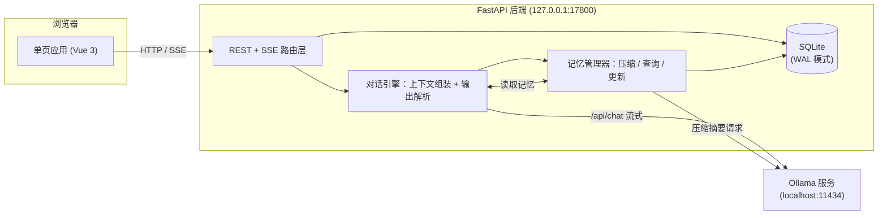
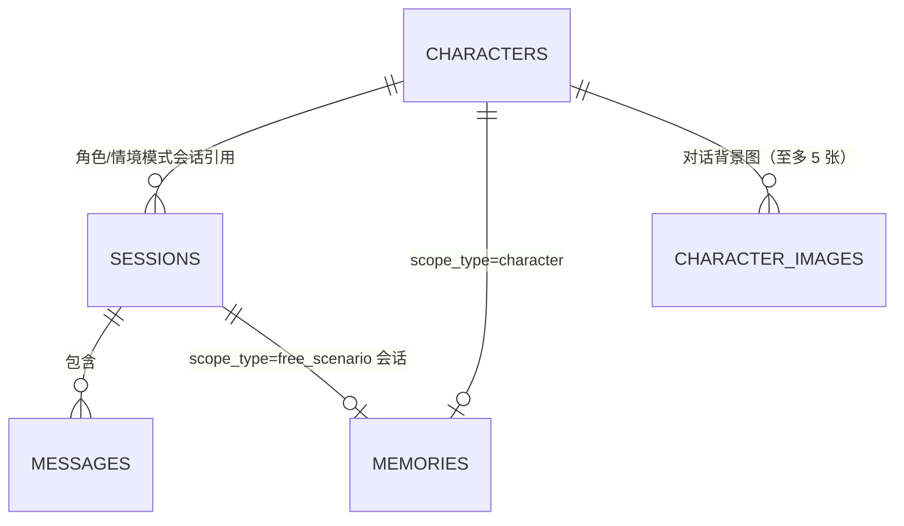

# 多模式对话机器人开发文档

基于本地 Ollama 模型的三模式对话应用：角色对话、角色情境、情境生成。本文档记录需求定义、数据模型、核心机制、API 与界面的完整设计，以及各项设计决策的取舍理由——开发与后续迭代以此为准；面向使用者的功能说明与上手步骤见 [README.md](./README.md)。

## 1. 项目概述

### 1.1 目标

做一个完全本地运行的多模式对话机器人：

- 对话生成全部走本机 Ollama 服务，不依赖任何云端 API
- 支持三种模式，覆盖"扮演一个角色聊天"、"角色+场景演绎"、"自由剧本生成"三类使用场景
- 记忆体系分两层：会话内的消息历史（短期），跨会话的长期记忆（按角色或按会话绑定），长期记忆随对话自动压缩
- 消息可编辑、可删除、可重新生成，用户对上下文有完全控制权

### 1.2 运行环境

| 项 | 值 |
|---|---|
| 操作系统 | Windows 11（不做跨系统适配承诺） |
| 模型服务 | 本机 Ollama（默认 `http://localhost:11434`） |
| 后端 | Python 3.13（uv 管理环境与依赖）/ FastAPI / SQLite（文件数据库，路径在配置中直接指定） |
| 前端 | Vue 3（CDN 引入，无构建流程）+ 原生 CSS |
| 使用场景 | 单用户本地使用，无鉴权、无多用户并发设计 |

对话模型不与启动配置绑定：首次启动取 `config.yaml` 的默认值，之后在界面随时切换，思考型与非思考型模型均兼容（见 5.2、6.6 与 10.6）。

### 1.3 技术选型理由

- **FastAPI**：原生支持 async 与 `StreamingResponse`，SSE 流式输出实现简单；自动生成 OpenAPI 文档方便调试。
- **SQLite + WAL 模式**：单文件、零部署，单用户场景下无并发瓶颈；数据全在本地，符合"本地记忆"的定位。
- **Vue 3 CDN 模式**：省去 node/npm 构建链，前端就是三个静态文件，由 FastAPI 直接托管；界面状态较多（三模式、角色/会话两级列表、右侧面板、流式生成与停止、行内编辑），纯原生 JS 会比模板语法更难维护。
- **SSE 而非 WebSocket**：通信是单向流（请求 → 生成流），SSE 足够且实现和调试都更简单。

## 2. 需求定义

### 2.1 三种对话模式

| 维度 | 角色对话模式 | 角色情境模式 | 情境生成模式 |
|---|---|---|---|
| 模式标识 | `character_chat` | `character_scenario` | `free_scenario` |
| 绑定角色 | 是（会话创建时选定） | 是（与角色对话模式共用同一套角色） | 否 |
| 生成内容 | 仅角色话语 | 角色话语 + 情境说明 | 自由生成的对话 + 情境 |
| 可配置项 | 角色设定 + 系统生成要求 | 系统生成要求 | 系统生成要求 |
| 生成要求示例 | 输出倾向（回复长度、主动性、发散程度） | 情境篇幅、推进速度、导演指令、发散程度 | 题材、文风、篇幅、情境台词配比、发散程度 |
| 长期记忆归属 | 按角色绑定，跨会话共享 | 与角色对话模式共用同一份角色记忆 | 按会话独立保存 |

三种模式的一致规则：

- 系统生成要求挂在**会话**上，随时可改，改动只影响后续生成，不改动历史消息
- 角色对话模式与角色情境模式对同一个角色共享角色设定和长期记忆，在任一模式下聊过的关键信息，另一个模式也能记起
- 角色对话模式与角色情境模式的**会话列表相互隔离**：各自只列出本模式创建的会话（`sessions.mode` 区分），另一个模式的会话不显示、打不开，也改不了生成要求、无法重新生成；切模式 Tab 会各自恢复到本模式上次打开的会话（见 5.6、10.13）。隔离只针对会话，角色设定与长期记忆仍按上一行共用
- 长期记忆相互隔离：角色 A 与角色 B 的记忆互不可见；情境生成模式各会话之间的记忆互不可见

### 2.2 角色设定

角色模式下的两个模式共用，字段如下：

| 字段 | 说明 | 必填 |
|---|---|---|
| `name` | 角色名 | 是 |
| `appearance` | 外观设定（年龄、身形、衣着、标志性特征） | 否 |
| `personality` | 性格设定 | 否 |
| `speech_style` | 语言风格（口癖、语气、用词习惯） | 否 |
| `backstory` | 背景故事 | 否 |
| `avatar` | 自定义头像，存 data URL（jpg/png/webp） | 否 |
| `locked` | 探索模式：1 = 隐藏后三项（对用户隐藏且不可改），解锁后永久置 0 | 否 |

角色设定编辑立即生效，下一次生成即按新设定组装提示词。`avatar` 不进提示词（模型不需要看到头像），只用于界面显示。

**`locked`（探索模式）**：`personality` / `speech_style` / `backstory` 这三项在 `locked=1` 时**接口就不下发**（角色列表、单查、会话详情里内嵌的角色摘要都不含它们），`PUT` 也**忽略**这三个字段。注意隐藏只针对用户可见性——它们照常注入 system prompt，否则角色就没有性格可言了。判定与取舍见 10.29。

**头像的存取方式**：选图后先在浏览器里**校验**（MIME 必须是 `image/*`、文件 ≤10MB、能解码、最短边 ≥256px、总像素 ≤4000 万），通过则弹出**裁剪弹窗**让用户拖动（并可用滑杆 1×～3× 缩放）选定正方形区域，确定时按取景框换算原图取样矩形、画进 **256×256** 画布并重编码为 **JPEG（质量 0.85）**，再以 data URL 提交；后端只存这一个字符串（见 10.21 的取舍理由）。上限 256KB 只是兜底。`avatar` 为空串表示不用自定义头像，界面回落到"姓名首字"占位。

最短边下限取 256、与输出边长相同，是为了**保证 1× 缩放下永不放大**：取样边长在 1× 时等于原图短边，只要它 ≥256，裁出来的就一定是原像素或下采样，不会因为放大而发糊。代价是小于 256 的图直接拒收。放大（>1×）仍可能让取样区域小于 256（例如 256 的图放到 2× 只剩 128），这种情况弹窗里会**只在此时**出现一行提示，告知实际取样像素数。

校验放在客户端而不是等后端报错，是因为这里要拦的两类问题（文件太大、分辨率不对）只有拿到原文件才判得准；服务端仍保留格式白名单与长度上限作为兜底。校验失败**不使用底部错误条**——那条只在打开会话时才渲染，从侧栏打开角色弹窗时用户根本看不到，所以改为在头像选择处就地显示。

### 2.2.1 我的设定（用户本人）

与角色无关的全局设定，单行表 `user_profile`：

| 字段 | 说明 | 是否进提示词 |
|---|---|---|
| `name` | 用户的名字，角色可以直接称呼 | 是（角色两模式） |
| `identity` | 身份，如"被卷入事件的见习侦探" | 是（角色两模式） |
| `appearance` | 外观（年龄、身形、衣着） | 是（角色两模式） |
| `avatar` | 头像，与角色头像同一套校验与裁剪流程 | 否（只用于界面显示） |

预设与当前设定**共用这张表**：`id=1` 是当前使用的那份，`id>1` 是保存下来的预设（见 10.39）。所以表上不能有 `CHECK(id=1)`——那条约束会把预设挡在门外。

注入方式是 system prompt 里的一段独立块（`# 与你对话的人`），紧跟角色设定之后；三项全空时整块不出现。**自由情境模式不注入、也不显示**用户头像与名字，面板里也不出现这个标签——那里没有"我是谁"这回事。取舍见 10.35。

### 2.2.2 世界设定

同样是全局设定（**一份**，单行表 `world`），但它是**所有模式共用**的：

| 字段 | 说明 | 是否进提示词 |
|---|---|---|
| `name` | 世界名称 | **否**（用户明确要求：只用于自己辨认） |
| `description` | 描述：这个世界的详细信息（地理、时代、势力、氛围…） | 是（三种模式） |
| `rules` | 规则：独属于这个世界的规则（力量体系、禁忌、铁律…） | 是（三种模式） |
| `terms` | 词库：专有名词及解释，JSON 数组，可增删、有顺序 | 是（三种模式） |

四项均可选、随时可改。注入位置在**角色设定之前**：世界是最外层的框架，"你身处这个世界、并且扮演这个角色"比反过来自然。除名称外三项全空时整块不出现（不给模型一段空标签，同 `_user_block`）；**自由情境模式也注入**——故事同样发生在某个世界里（这一点与"我的设定"相反，见 10.44）。上限与上下文预算见 2.3 与 10.44。

### 2.3 系统生成要求

按模式分组的结构化配置，前端渲染为表单，数据库存 JSON。每个字段都映射为提示词中的自然语言要求；其中导演指令渲染为独立段落（见 5.1）。**例外是 `temperature`（发散程度）**：它不是提示词内容，而是覆盖请求里的 `options.temperature`（见下）。

**角色对话模式（输出倾向）：**

| 字段 | 类型 | 取值 |
|---|---|---|
| `reply_length` | 单选 | 简短 / 适中 / 详细 |
| `proactive` | 单选 | 低 / 中 / 高（主动推进话题的程度） |
| `temperature` | 单选 | 严谨 / 稳定 / 标准 / 放飞（发散程度，仅覆盖采样温度） |
| `extra` | 自由文本 | 任意补充要求，原样注入 |

> 曾有 `tone_hint`（语气基调，自由文本），已移除：一个角色用什么语气说话，本来就是这个角色（角色设定里的"语言风格"）加上模型自己判断的结果，再让用户在会话里指定一遍既重复又容易和角色设定打架（见 10.24）。

**角色情境模式（生成要求）：**

| 字段 | 类型 | 取值 |
|---|---|---|
| `scenario_length` | 单选 | 简短（1 句）/ 适中（1-3 句）/ 详细（3 句以上） |
| `pace` | 单选 | 平缓 / 适中 / 快速（剧情推进速度） |
| `temperature` | 单选 | 严谨 / 稳定 / 标准 / 放飞（发散程度，仅覆盖采样温度） |
| `director_notes` | 自由文本 | 导演指令：影响情境走向，不进入对话 |
| `extra` | 自由文本 | 任意补充要求 |

> 早期版本还有一个 `scenario_types` 多选标签（情境选取倾向：日常/温馨/冲突…），实测收益不明显却占一整行表单，已移除；同类需求由导演指令承担。

**情境生成模式：**

| 字段 | 类型 | 取值 |
|---|---|---|
| `genre` | 自由文本 | 题材，如"都市奇幻"、"武侠" |
| `style` | 自由文本 | 文风，如"细腻文学风"、"轻喜剧" |
| `length` | 单选 | 短 / 中 / 长（单次生成篇幅） |
| `composition` | 单选 | 只有情境 / 情境为主 / 均衡 / 台词为主（情境与台词的配比，默认均衡） |
| `temperature` | 单选 | 严谨 / 稳定 / 标准 / 放飞（发散程度，仅覆盖采样温度） |
| `extra` | 自由文本 | 任意补充要求 |

> 这个模式曾有 `director_notes`，已移除：用户在这个模式下发的每条消息本身就是对下一步的指令，再单设一个字段属于重复，还会让"当前指令"分散在两处（见 10.24）。

**`temperature`（发散程度）与上面那些字段不是一类**：它是采样参数，不是给模型的文字要求，所以**不进入提示词**（渲染器逐键列举，天然不含它），而是由 `prompts.chat_options()` 覆盖请求里的 `options.temperature`。四个档位对应 `TEMPERATURE_LEVELS`：严谨 0.2 / 稳定 0.6 / 标准 0.9 / 放飞 1.3，界面上只显示标签、不显示数值。三种模式共用同一个字段定义（`TEMPERATURE_FIELD`），取值存会话的 `gen_settings.temperature`，默认 `standard`。

档位缺失或不是已知档位时（旧会话、或有人直接往 `gen_settings` 里塞了怪值）保持 `config.yaml` 的 `options.temperature` 不动，因此不需要数据迁移。记忆压缩与会话自动命名**不跟这个档位**——它们各自把 temperature 压到 0.3（`memory.py`、`naming.py`），摘要与标题要的是稳定，不该被会话的创作口味影响。也因此 `config.yaml` 里的 `temperature` 现在只是兜底值。

`composition` 决定情境与台词各占多少：`scenario_only` 明确要求不输出任何 `[DIALOG]`，`scenario_heavy` 允许情境铺陈多段、台词只作点缀。旧会话的 `gen_settings` 里没有这个键时由 `DEFAULT_SETTINGS` 兜底为 `balanced`，因此不需要数据迁移（见 5.1）。

`director_notes`（导演指令）与输出风格类字段不同：它保存对情境/剧情走向的持续性要求（如"让两人的关系逐渐缓和"），不作为消息进入对话历史，只注入 system prompt 指导生成，角色不会"说出"收到了指令。它与生成要求的其他字段一样挂在会话上、随时可改、只影响后续生成。**目前只有角色情境模式保留此字段**——角色对话模式无情境，同类需求由 `extra` 承担；情境生成模式的用户消息本身就是指令，故不设（见 10.24）。

### 2.4 共通能力

三种模式都必须实现：

1. **本地会话记忆**：会话内全部消息持久化在本地 SQLite，重开应用后完整恢复。
2. **编辑消息**：双击气泡或点"编辑"按钮修改任意一条消息（含用户消息与生成消息的话语、情境说明）；角色情境模式下情境框恒可编辑，两个输入框带"情境说明""话语内容"标签。
3. **删除消息**：删除单条，或级联删除某条及其之后的所有消息。
4. **重新生成**：对任意一条生成消息触发重新生成，以该消息之前的上下文为基准替换生成；**对用户消息同样可触发**，此时保留该消息本身、只重做它之后的回复。会话绑定的角色已被删除时该操作不可用（前端不提供按钮，接口也会拒绝，见 5.5）
5. **记忆自动压缩**：上下文超过阈值时自动把较早的消息归档为长期记忆摘要，过程不需要用户操作；压缩后的内容仍可通过右侧面板查看和手动编辑。
6. **停止生成**：生成过程中可随时中断；已经流出的部分照常入库，不丢内容（见 5.5）。
7. **会话标题自动命名**：创建时未填标题的会话，在用户说够内容后由模型异步总结标题，用户手动改名后不再自动覆盖（见 5.6）。

### 2.5 非功能需求

- 生成过程流式输出，首字延迟取决于本机模型速度，界面需有"生成中"状态反馈；思考型模型在正文流出前显示"思考中"占位，推理内容不进入界面与消息记录
- 记忆压缩在后台异步执行，不阻塞对话
- 所有本地数据（数据库文件）放在配置文件直接指定的路径下，不用环境变量派生
- 界面语言为中文

## 3. 总体架构

### 3.1 架构图



一次典型对话的完整链路：

1. 前端 POST 会话消息 → 路由层写入 user 消息
2. 对话引擎按会话模式组装 system prompt（角色设定 + 生成要求 + 长期记忆）与未归档历史
3. 调 Ollama `/api/chat` 流式接口，SSE 逐段推给前端
4. 生成完成：解析输出格式（情境/话语分段），落库 assistant 消息
5. 触发后台记忆检查，超阈值则异步压缩

### 3.2 Ollama 客户端封装

后端封装一个异步客户端，供对话与记忆压缩共用：

```python
import json
import httpx

async def chat_stream(messages: list[dict], model: str, options: dict | None = None):
    """流式调用 Ollama /api/chat，兼容有无思考模式的模型。
    yield (kind, value)：("status", "thinking"/"generating") 或 ("delta", 正文增量)。
    """
    payload = {
        "model": model,
        "messages": messages,
        "stream": True,
        "options": options or cfg["options"],  # num_ctx + 本会话的发散程度（见 2.3）；不传 think 参数，兼容策略见 5.2
    }
    tf = ThinkFilter()                          # 内联 <think> 过滤，见 5.2
    saw_thinking = saw_content = False
    # 读超时设为不限（生成可能要几十秒），但连接超时收紧到 10s：Ollama 没启动时要快速失败
    async with httpx.AsyncClient(timeout=httpx.Timeout(None, connect=10)) as client:
        async with client.stream("POST", f"{cfg['base_url']}/api/chat", json=payload) as resp:
            resp.raise_for_status()
            async for line in resp.aiter_lines():
                if not line:
                    continue
                chunk = json.loads(line)
                msg = chunk.get("message") or {}
                if msg.get("thinking") and not saw_thinking:
                    saw_thinking = True             # 新版 Ollama：推理在独立字段
                    yield ("status", "thinking")    # 只用来显示"思考中"，内容不转发
                text = msg.get("content", "")
                if text:
                    out, in_think = tf.feed(text)
                    if in_think and not saw_thinking:
                        saw_thinking = True
                        yield ("status", "thinking")
                    if out:
                        if not saw_content:
                            saw_content = True
                            yield ("status", "generating")
                        yield ("delta", out)
                if chunk.get("done"):
                    break
    tail = tf.flush()                           # 流结束，放出被缓冲的残尾
    if tail:
        if not saw_content:
            yield ("status", "generating")
        yield ("delta", tail)
```

另有非流式封装 `chat_once()`：记忆压缩、会话命名、角色生成共用，同样按调用传入 model，返回前剥掉 `<think>` 段；`fmt="json"` 时给请求带 Ollama 的 JSON 模式（只有角色生成用）。

启动自检在 `main.py` 的 lifespan 里：调 `list_models()`（即 Ollama `/api/tags`）取已安装模型集合，校验 `app_settings` 里的当前模型是否在其中，缺失则写启动日志、并在界面顶栏提示"所选模型未安装"；Ollama 整体不可达时只记一条警告，不阻断启动。前端除顶栏提示外，还会区分"连不上 Ollama"与"Ollama 中没有任何模型"两种情形。

每次调用的 `model` 参数取自 `app_settings` 表的运行时设置，而非模块级常量——这是"模型随时可换"在客户端层的落点：切换只改数据库一行，下一次请求即用新模型，无需重启。旧版 Ollama 把 `<think>` 内联进 content 的情况，由 `ThinkFilter` 兜底过滤（见 5.2）。

## 4. 数据模型

### 4.1 ER 关系



`memories` 是按 scope 唯一的单行滚动摘要：一个角色（或一个自由会话）至多一条记忆记录，压缩时原地更新。

`user_profile`（我的设定）与 `world`（世界设定）是两张**独立的全局单行表**，不与任何角色/会话建立外键：它们对所有会话生效，因此画不进上面这张关系图。

### 4.2 表结构

```sql
CREATE TABLE characters (
    id           INTEGER PRIMARY KEY AUTOINCREMENT,
    name         TEXT NOT NULL,
    appearance   TEXT NOT NULL DEFAULT '',
    personality  TEXT NOT NULL DEFAULT '',
    speech_style TEXT NOT NULL DEFAULT '',
    backstory    TEXT NOT NULL DEFAULT '',
    created_at   TEXT NOT NULL,
    updated_at   TEXT NOT NULL,
    avatar       TEXT NOT NULL DEFAULT '',  -- 自定义头像的 data URL；空串 = 用姓名首字占位
    locked       INTEGER NOT NULL DEFAULT 0 -- 1 = 探索模式：后三个字段对用户隐藏且不可改（见 10.29）
);

CREATE TABLE user_profile (          -- 我的设定：id=1 当前使用，id>1 是预设
    id         INTEGER PRIMARY KEY,   -- 不能加 CHECK(id=1)：预设也要占一行
    name       TEXT NOT NULL DEFAULT '',
    identity   TEXT NOT NULL DEFAULT '',
    appearance TEXT NOT NULL DEFAULT '',
    avatar     TEXT NOT NULL DEFAULT '',
    updated_at TEXT NOT NULL
);

CREATE TABLE world (                 -- 世界设定：全局一份，id=1（见 2.2.2 / 10.44）
    id          INTEGER PRIMARY KEY,  -- 同样不写 CHECK(id=1)：以后要做多世界切换时插 id>1 即可
    name        TEXT NOT NULL DEFAULT '',   -- 世界名称：只给自己辨认，不进提示词
    description TEXT NOT NULL DEFAULT '',   -- 描述
    rules       TEXT NOT NULL DEFAULT '',   -- 规则
    terms       TEXT NOT NULL DEFAULT '[]', -- 词库：[{"term": ..., "meaning": ...}]，有序
    updated_at  TEXT NOT NULL
);

CREATE TABLE sessions (
    id           INTEGER PRIMARY KEY AUTOINCREMENT,
    mode         TEXT NOT NULL CHECK(mode IN ('character_chat','character_scenario','free_scenario')),
    character_id INTEGER REFERENCES characters(id) ON DELETE SET NULL,
    title        TEXT NOT NULL DEFAULT '新会话',
    title_auto   INTEGER NOT NULL DEFAULT 1,  -- 1 = 标题可由模型自动总结，0 = 用户已手动命名
    gen_settings TEXT NOT NULL DEFAULT '{}',  -- JSON，结构按 2.3 节
    created_at   TEXT NOT NULL,
    updated_at   TEXT NOT NULL
);

CREATE TABLE messages (
    id         INTEGER PRIMARY KEY AUTOINCREMENT,
    session_id INTEGER NOT NULL REFERENCES sessions(id) ON DELETE CASCADE,
    role       TEXT NOT NULL CHECK(role IN ('user','assistant')),
    content    TEXT NOT NULL,             -- 话语正文
    scenario   TEXT,                      -- 情境说明；角色对话模式恒为 NULL
    archived   INTEGER NOT NULL DEFAULT 0,-- 1 = 已压缩进长期记忆，不再注入上下文
    edited     INTEGER NOT NULL DEFAULT 0,
    created_at TEXT NOT NULL
);
CREATE INDEX idx_messages_session ON messages(session_id, id);

CREATE TABLE memories (
    id            INTEGER PRIMARY KEY AUTOINCREMENT,
    scope_type    TEXT NOT NULL CHECK(scope_type IN ('character','session')),
    scope_id      INTEGER NOT NULL,        -- character_id 或 session_id
    content       TEXT NOT NULL DEFAULT '',-- 滚动摘要正文
    message_count INTEGER NOT NULL DEFAULT 0, -- 已归档消息累计数
    updated_at    TEXT NOT NULL,
    UNIQUE(scope_type, scope_id)
);

CREATE TABLE app_settings (
    id           INTEGER PRIMARY KEY CHECK(id = 1),  -- 单行表
    model        TEXT NOT NULL,                      -- 当前对话模型
    memory_model TEXT NOT NULL DEFAULT '',           -- 压缩用模型，空 = 同对话模型
    updated_at   TEXT NOT NULL
);

-- 角色的对话区背景图（5.8 节）。不放进 characters 表：那会让角色列表接口背上几 MB 图片
CREATE TABLE character_images (
    id           INTEGER PRIMARY KEY AUTOINCREMENT,
    character_id INTEGER NOT NULL REFERENCES characters(id) ON DELETE CASCADE,
    position     INTEGER NOT NULL DEFAULT 0,   -- 展示顺序
    data         TEXT NOT NULL,                -- 图片 data URL
    created_at   TEXT NOT NULL
);
CREATE INDEX idx_character_images ON character_images(character_id, position, id);
```

关键设计：

- **`messages.archived` 而非物理删除**：压缩后被归档的消息仍留在库里，前端默认折叠显示"已归档 N 条"，可展开查看原文。上下文组装时跳过 `archived=1`。
- **`scenario` 与 `content` 分列存储**：编辑、渲染、重新注入历史时两种内容各自独立处理，不靠运行时反复解析。
- **删除角色**：`character_id` 置 NULL，角色记忆删除，其会话保留（可看历史、不可继续生成，前端提示"角色已删除"）。不级联删会话，避免误删用户数据。
- **`app_settings` 单行表存运行时设置**：模型选择写进数据库，切换后重启仍生效；`config.yaml` 的模型仅作首次初始化默认值。压缩用的模型也在此表，可随时单独更换。
- **零散界面偏好另用 `app_prefs`（键值对）而不是给 `app_settings` 加列**：`CREATE TABLE IF NOT EXISTS` 对**已有库**也会把新表建出来，加列则不会——我们不做补列（见上一条），所以加列会逼着用户删库重建，加表不会。目前只存一个 `disable_thinking`。
- **`sessions.title_auto` 而非比对标题字符串**：会话是否还能被自动命名由独立字段记录，不用 `title == '新会话'` 这种魔法值判断——用户完全可能把会话真命名为"新会话"。创建会话时未填标题才置 1，用户重命名即置 0，因此每个会话至多被自动命名一次，且永不覆盖用户的手动命名。
- **`world.terms` 用一列 JSON，而不是另开一张词条表**：词库是"整体读写、有序、可增删"的列表，没有"按名词单独查询"的需求，一次 UPDATE 就能整体保存；读写的形状规则集中在一处（`_parse_terms` / `write_world`），空名词行也在那里统一丢弃。解析失败（手改过库）时退回空列表：词库只是锦上添花，不该让整次生成失败。
- **世界设定开新表而不是给 `app_settings` 加列**：理由同 `app_prefs` 那条——新表对已有库也会自动建出来，加列就要用户删库。
- **`avatar` 存在角色表里而不是当文件存**：图片跟着数据库走，备份/恢复才等于"全部数据"（见 10.20、10.21）。
- **不做旧库补列**：`CREATE TABLE IF NOT EXISTS` 只建新表、不会改已存在的表，所以表结构一改，旧库就会缺列。开发阶段不做迁移——直接删掉 `data/` 重建即可（`init_db()` 只负责建表）。改表结构时不再写 `ALTER TABLE` 之类的兼容代码，也就没有"存量数据如何处置"这类分支要维护。**两次例外**都发生在「表结构本身挡路」时，做法都是先备份、再用一次性维护脚本：给 `characters` 加 `locked` 列（10.29）；把 `user_profile` 的 `CHECK(id=1)` 去掉以便存预设（10.39）。应用本身仍然没有任何迁移代码。

### 4.3 长期记忆的 scope 规则

| 会话模式 | 记忆 scope | 效果 |
|---|---|---|
| `character_chat` | `(character, 会话的 character_id)` | 同角色所有会话共享 |
| `character_scenario` | `(character, 会话的 character_id)` | 与角色对话模式完全共用 |
| `free_scenario` | `(session, 会话 id)` | 每个会话独立 |

隔离性由查询条件保证：组装上下文时只读取当前会话对应 scope 的记忆记录，其他角色/会话的记忆不进入提示词。

## 5. 核心设计

### 5.1 上下文与提示词组装

每次生成的消息序列固定为三段：

```
[system]  模式指令 + 世界设定(如有，三种模式) + 角色设定(如有) + 我的设定(如有，仅角色两模式)
          + 生成要求 + 长期记忆 + 输出格式规则
[历史]    该会话所有 archived=0 的消息（按 id 升序，超出条数上限截断最早的部分）
[当前]    本轮 user 消息
```

三种模式的 system prompt 模板（`app/prompts.py` 中实现为 Python 函数，此处为模板主体）：

**角色对话模式：**

```text
你要完全扮演下面这个角色，与用户进行对话。

# 世界设定            ← 有世界设定时才有这一段（见 2.2.2）
描述：{world_description}
规则：{world_rules}
词库：
- {term}：{meaning}
以上是这个世界的既定设定：描述与规则必须遵守，词库里的专有名词按给定含义使用，
不要改写这些设定，也不要向用户复述这份设定。

# 角色设定
姓名：{name}
外观：{appearance}
性格：{personality}
语言风格：{speech_style}
背景：{backstory}

# 你对这个用户的记忆
{memory_content}

# 回复要求
{gen_settings_text}

# 输出规则
只输出{name}说出的话。不要输出旁白、动作描写、心理描写、括号注释或舞台说明。
不要在开头重复角色名。
```

**角色情境模式：**

```text
你要扮演下面这个角色，与用户在同一个故事情境中互动。

# 世界设定            ← 同上

# 角色设定
（同上五字段）

# 你对这个用户的记忆
{memory_content}

# 生成要求
{gen_settings_text}

# 导演指令
{director_notes 或 "（无）"}
导演指令只决定情境与剧情的走向，不属于对话内容，角色不得提及或回应"收到指令"。

# 输出规则
严格按下面两段的顺序输出，段首必须原样使用这两个英文标记：
[SCENARIO]场景、动作、氛围等情境说明
[DIALOG]你扮演的角色说出的话
标记只能用 [SCENARIO] 与 [DIALOG] 这两个词，不要写成 [SCENERY]、[SCENE] 或中文标记。
两段都必须有内容：不要输出空标记，也不要在标记之外写任何文字。
```

**情境生成模式：**

```text
你是创意写作引擎，根据用户的引导生成故事情境与角色对话。

# 世界设定            ← 同上

# 本会话此前的剧情
{memory_content}

# 生成要求
{gen_settings_text}

# 输出规则
每次生成都用下面的标记分段输出，每个段落以标记开头，段落数量与先后顺序不限：
[SCENARIO]场景、氛围、事件等情境说明
[DIALOG]角色名：该角色说出的话
[SCENARIO] 与 [DIALOG] 都可以只出现其中一种，也可以各自出现多次。
[DIALOG] 是可选的：只写情境时就不要输出任何 [DIALOG]。
情境与台词的比例由「情境与台词的配比」要求决定。
```

这里刻意**不给出"一段情境 + 两段台词"式的完整示例**：那种示例会被模型当成必须遵循的段落模板，导致每轮都产出等量的情境与台词，而用户往往只想要纯情境或情境远多于台词。改为只列标记说明 + 显式声明 `[DIALOG]` 可选，再由 `composition` 字段指出配比（对照 10.14）。

初版这里还多写了一句"不要默认让两者等量或交替出现"，后来去掉了：配比本来就由 `composition` 决定，而这句话会在配比选"均衡"时把等量/交替输出一并禁掉——那是"均衡"本该允许的写法。禁止某一种配比是 `composition` 的职责，不该由输出规则包办。

生成要求 `gen_settings_text` 由 JSON 字段拼接为自然语言（`prompts.py` 里每个模式一个 render 函数），例如角色对话模式：

```python
REPLY_LENGTH_DESC = {"short": "每次回复不超过2句话", "medium": "每次回复2到4句话", "long": "每次回复可以详细展开"}
PROACTIVE_DESC = {"low": "被动回应即可，不要主动抛出新话题", "medium": "适度主动，偶尔推进话题", "high": "主动抛出新话题，积极推进对话"}

def _join(parts: list[str]) -> str:
    return "；".join(p for p in parts if p) + "。"

def render_character_chat_settings(s: dict) -> str:
    parts = [
        f"回复长度：{REPLY_LENGTH_DESC.get(s.get('reply_length'), REPLY_LENGTH_DESC['medium'])}",
    ]
    parts.append(f"主动性：{PROACTIVE_DESC.get(s.get('proactive'), PROACTIVE_DESC['medium'])}")
    if s.get("extra"):
        parts.append(f"附加要求：{s['extra']}")
    return _join(parts)
```

取值一律用 `.get(..., 默认)` 兜底：会话里存的可能是旧版本留下的枚举值，直接下标取值会在升级后 KeyError。字段定义与默认值集中在 `prompts.py` 的 `FIELDS` / `DEFAULT_SETTINGS`，通过 `GET /api/gen-settings` 下发给前端渲染，前端不含任何硬编码字段。

`director_notes` 不并入 `gen_settings_text`，而是渲染为提示词中独立的"导演指令"段：它是剧情走向的持续要求，不是输出风格，独立成段让模型不会混淆两者，用户在面板里也能直观理解字段含义（目前仅角色情境模式有该字段，见 10.24）。

字段被移除后，旧会话 `gen_settings` 里若还留着同名键，既不渲染也不会被提交：`saveGenSettings()` 只按当前字段定义组装载荷，所以旧值会在下一次保存时自然消失。开发阶段不做数据迁移（见 4.2），`initGenForm()` 也不再为此做过滤。

历史消息注入时的格式还原：assistant 历史按原始标记格式回填（`[SCENARIO]xxx\n[DIALOG]yyy`），让模型持续看到自己此前的输出结构，格式遵循率更高。user 消息注入 `content`。

### 5.2 输出解析与思考模式兼容

解析前先剥掉思考段——思考型模型（qwen3、deepseek-r1 等）会在正文之外产生推理过程，直接进解析会污染 `[SCENARIO]`/`[DIALOG]` 结构。这里分两件事：

**（一）不让思考内容污染消息**——不依赖 Ollama 的 `think` 请求参数，而是两条应用层路径叠加：

- **首选（新版 Ollama）**：思考型模型把推理放在响应的独立 `thinking` 字段，`message.content` 只含正文。`chat_stream` 只转发 `content`；`thinking` 非空时向前端发"思考中"状态（`status` 事件，见 6.5）。
- **兜底（旧版本或个别模型模板）**：推理以内联 `<think>…</think>` 混在 `content` 里。非流式调用直接 `re.sub(r"<think>.*?</think>", "", text, flags=re.S)`；流式调用在 `chat_stream` 外套一层 `ThinkFilter` 状态机：

```python
class ThinkFilter:
    """流式 <think> 过滤器。feed() 返回 (正文增量, 是否处于思考态)。"""

    OPEN, CLOSE = "<think>", "</think>"

    def __init__(self):
        self.buf = ""          # 未决缓冲：可能含被 chunk 边界拆开的半个标签
        self.in_think = False

    def feed(self, chunk: str):
        self.buf += chunk
        out = []
        while True:
            tag = self.CLOSE if self.in_think else self.OPEN
            i = self.buf.find(tag)
            if i < 0:                       # 无完整标签：留出可能是标签前缀的尾巴
                keep = len(tag) - 1
                if len(self.buf) > keep:
                    head, self.buf = self.buf[:-keep], self.buf[-keep:]
                    if not self.in_think:
                        out.append(head)    # 思考态下的内容直接丢弃
                break
            if not self.in_think:
                out.append(self.buf[:i])
            self.in_think = not self.in_think
            self.buf = self.buf[i + len(tag):]
        return "".join(out), self.in_think

    def flush(self) -> str:
        """流结束：思考态未闭合说明全程无正文，返回空串；否则放出残尾。"""
        if self.in_think:
            return ""
        out, self.buf = self.buf, ""
        return out
```

两条路径叠加后，无论运行中把模型换成什么，进入格式解析的文本都不含思考内容——这是"模型随时可换"在解析层的落点。

用标记 `[SCENARIO]` / `[DIALOG]` 而非中文标签：英文标记在中英混合输出里的歧义最小，且避免全角方括号问题。前端渲染时再显示为中文"情境"标签。

**识别刻意宽容**（`app/parser.py`）。提示词里严格要求的仍是 `[SCENARIO]`/`[DIALOG]`，但解析时接受这些变体，因为它们都实际出现过：

- 同义/近似词：情境侧 `SCENERY`、`SCENE`、`NARRATION`、`SETTING`、`CONTEXT`；话语侧 `DIALOGUE`、`SPEECH`、`TALK`
- 大小写任意、全角括号 `【SCENARIO】` 也认
- **标记之外的裸文本按话语算**：模型常把台词写在第一个标记之前（顺序颠倒），丢掉它就等于把角色说的话吞了
- 多个情境段合并（只取第一段会静默丢内容）
- 内容为空的标记直接跳过，不产生空段落；全是空标记时视为"没有内容"，**绝不把裸标记当正文显示给用户**

宽容只影响"能不能认出标记"，不影响"要求模型输出什么"——不宽容的代价实测过：模型把 `[SCENARIO]` 写成 `[SCENERY]`、台词写在标记前、末尾多个空 `[DIALOG]`，旧实现只匹配到那个空标记，于是情境为空、整段被打成纯文本，用户看到的是带裸标记的消息。

```python
import re

SCENARIO_TAGS = ("SCENARIO", "SCENERY", "SCENE", "NARRATION", "SETTING", "CONTEXT")
DIALOG_TAGS = ("DIALOG", "DIALOGUE", "SPEECH", "TALK")
_TAG = r"[\[【]\s*(?:" + "|".join(SCENARIO_TAGS + DIALOG_TAGS) + r")\s*[\]】]"
SEGMENT = re.compile(
    r"[\[【]\s*(" + "|".join(SCENARIO_TAGS + DIALOG_TAGS) + r")\s*[\]】]\s*(.*?)(?=\n?" + _TAG + r"|$)",
    re.S | re.I,
)

def parse_output(mode: str, raw: str) -> tuple[str | None, str]:
    text = (raw or "").strip()
    if mode == "character_chat":
        return None, text
    found = SEGMENT.search(text)      # 有没有标记，与"切出了什么段落"是两件事
    pieces = _pieces(text)            # 标记之外的裸文本也会作为话语出现在这里
    if not pieces:
        return (None, "") if found else (None, text)   # 全是空标记 → 没内容
    if mode == "character_scenario":
        scenario = "\n".join(t for kind, t in pieces if kind == "scenario").strip()
        dialog = "\n".join(t for kind, t in pieces if kind == "dialog").strip()
        return (scenario or None), dialog              # 允许"只有情境、没有台词"
    return (MULTI if found else None), text
```

这里有个容易写错的地方：判断"是否降级"必须看**有没有出现标记**，而不是看切出来的段落是否为空——`_pieces()` 在完全无标记时也会把整段当成话语返回，用它判断会把纯文本误标成 `MULTI`（`free_scenario` 的降级路径就靠这个区分）。

容错原则：认不出标记时不丢弃内容，整体降级为话语文本；解析成功后落库的 `content`/`scenario` 是干净文本，`free_scenario` 例外（存原始全文，渲染时再分段）。**角色情境允许"只有情境、没有台词"**（`content` 为空串、`scenario` 有值）：那正是模型输出的内容，不该丢；`persist_message` 因此把"有情境"也算作有效内容。相应地，编辑这类消息时正文可以留空（见 5.5）。

分段渲染发生在前端：`free_scenario` 的 `content` 是带标记全文，`app.js` 用同一个正则（`SEGMENT_RE`，带 `g` 标志）在 `segmentsOf()` 里按原文顺序切成情境段与话语段渲染——段落数量与顺序完全由模型输出决定，前端不假设两者交替出现，只有 `[SCENARIO]` 时就是一个情境块。后端不在 SSE 响应里附带分段结果——同一份数据只在一处解析，避免两个来源不一致。`parser.py` 里另有一个等价实现 `split_segments()`，目前只被单测引用，作为这条正则的参考实现与回归用例。

**流式渲染与解析的关系**：思考内容在到达前端之前已被上述两层处理拦下——前端只会收到 `status` 事件的"思考中"占位与正文增量，正文增量直接显示在"生成中"的原始块里；收到 `done` 事件（携带解析后的 `content`/`scenario`）后用解析结果替换渲染。这样避免流中途解析产生的抖动，实现也最简单。

### 5.3 长期记忆的注入与更新时机

- **注入**：只读当前 scope 的 `memories.content`，插入 system prompt 的"记忆"段。无记忆记录时该段显示"（暂无，这是你们的初次交流）"。
- **更新**：唯一的更新入口是 5.4 的自动压缩，以及右侧面板记忆区的手动编辑（PUT 接口）。对话本身不实时写记忆，避免每轮多一次 LLM 调用拖慢响应。
- **可见性**：右侧面板的"角色记忆/会话记忆"区展示当前绑定 scope 的记忆全文，可直接编辑保存，下次生成即生效；同时显示已归档条数、更新时间与"上次压缩失败"标记（来自 `GET /api/memories/...` 返回的 `compress_failed`）。

### 5.4 记忆自动压缩

**触发时机**：每次生成的消息落库后（含用户点"停止"而保留的部分内容），后台任务统计该会话未归档消息的 `content` 字符总数；超过 `memory.compress_threshold_chars`（默认 20000，见 10.42）即触发。触发检查不阻塞 SSE 响应，同 scope 已有压缩在途时跳过，避免并发覆盖。

**压缩流程**：

1. 锁定本会话最早的 `archive_batch_size`（默认 20）条 `archived=0` 消息（记录 ID 集合，此后新消息不受影响）
2. 组装压缩提示词，调 `chat_once()`（压缩模型在运行设置中单独指定，默认同对话模型）：

```text
以下是关于角色「{name或"本次创作"}」的现有记忆：
{old_memory 或 "（无）"}

以下是新增的对话记录：
{按时间排列的批次消息，格式：user: ... / {name}: ...}

请把新对话中值得长期记住的信息合并进现有记忆，输出更新后的完整记忆。
只保留：重要事件、双方透露的个人信息、关系变化、约定与承诺、关键剧情走向。
丢弃寒暄和重复内容。用条目列表（- 开头）输出，总长度不超过 {max_memory_chars} 字。
只输出记忆内容本身。
```

3. 写回 `memories`（UPSERT），`message_count` 累加批次条数，批次消息置 `archived=1`
4. 失败处理：压缩请求失败则本次放弃，批次保持未归档，下次触发时重试；连续失败记日志，界面面板记忆区显示"上次压缩失败"

**压缩与编辑/删除的一致性**：已归档进记忆的内容不因后续删改消息而回滚（简化决策，见 10.3）。需要修正记忆时走面板记忆区手动编辑。

### 5.5 消息编辑、删除与重新生成

**编辑**（`PUT /api/messages/{id}`）：更新 `content` / `scenario`，置 `edited=1`。`scenario` 采用"显式传入才更新"的语义——不传则保持原值，显式传 `null` 表示清空情境。后端用 Pydantic 的 `model_fields_set` 区分这两种情况，而不是 `COALESCE(?, scenario)`：后者会让情境一旦写入就再也删不掉。前端编辑过的消息显示"已编辑"标记。归档消息同样可编辑（只改展示原文，不影响已生成的记忆）。

正文允许为空——"只有情境、没有台词"的消息就是这种形态（见 5.2），用户只改情境时不该被迫补一句台词。真正的约束在路由里：**正文与情境不能同时为空**，否则 400。

**删除**（`DELETE /api/messages/{id}?cascade=`）：
- `cascade=false`（默认）：只删这一条
- `cascade=true`：删这条及其之后所有消息，用于"从中间重来"

**重新生成**（`POST /api/messages/{id}/regenerate`，SSE）：assistant 与 user 消息都可触发，区别只在删除范围：

1. 取出目标消息（`role` 由表约束保证只可能是 `assistant` 或 `user`）
2. 校验会话可生成（`load_generation_context()`：会话存在、角色模式的绑定角色仍在）。**这一步必须排在删除之前**——否则角色已删除时就会先白删一截历史，再抛出"无法继续生成"（见 10.15）
3. 按 `role` 决定删除范围：assistant 走**替换式**，删 `id >= mid`（连它一起删）；user 则删 `id > mid`，**这条用户消息本身就是这一轮的输入，必须保留**
4. 以剩余上下文重新走 5.1 的组装与生成流程，SSE 返回
5. 新消息落库，得到新的 message id（由 `done` 事件携带；`meta` 事件只在 `/chat` 里出现，用于确认 user 消息已落库）

从用户消息重新生成是"停止生成"的必要补充：用户中途点停止时，若一个字都还没流出，服务端不入库（见本节末尾"停止生成"第 4 条），这一轮就只剩一条用户消息、没有任何 assistant 消息。若重新生成只认 assistant 消息，这条路就完全没有补救入口——这正是它被加上的原因。

`/chat` 同理：先 `load_generation_context()` 校验通过，才写入 user 消息，避免在角色已删除的会话里留下一条永远得不到回复的用户消息。

前端在这两个流程里都做了乐观更新（发消息时先渲染 user 气泡，重新生成时先把消息列表截断到目标位置），所以服务端拒绝时界面必须回滚。做法是让 `ssePost()` / `api()` 抛出的 Error 带上 `httpStatus`：调用方据此把"服务端明确拒绝"（直接显示服务端的原因）与"连接中断"（显示"连接中断：…"）分开提示，并在被拒后重新拉取消息列表把界面还原成服务端的真实状态。回滚必须放在 `endStream()` 之后——`refreshMessages()` 在 `streaming` 为真时会直接返回，提前调用等于没调。

替换式在 v1 是明确取舍：实现直接、上下文永远线性一致。多版本分支（保留旧生成、可切换）列为可选扩展，见 11 节。

**对上下文的影响**：三种操作都直接改变 messages 表，下次组装上下文时自然生效——引擎每次都从数据库现查，不在内存里维护对话副本。

**停止生成**：生成过程中输入框右侧的"发送"变为"停止"。点击后前端用 `AbortController` 中断 fetch，服务端据此收到断连、生成器被取消，在 `asyncio.CancelledError` 分支里把**已经流出的部分**照常解析落库，然后不再发送 `done` 事件。因此：

1. 停止后不会抛错，只相当于提前结束这一轮生成；
2. 部分内容与正常生成一样入库，可继续编辑、删除或重新生成；
3. 前端拿不到 `done`（没有 message id），改为在中断后短暂轮询 `/api/sessions/{id}/messages` 把服务端刚写入的部分内容同步回来；
4. 若中断时一个字都还没流出，则不入库，会话只留下那条用户消息。

取舍：保留部分内容而不是丢弃，已产出的算力不浪费，用户接着补充要求即可继续。代价是前端要多一次同步请求，且"停止"不是一个原子操作——服务端落库发生在客户端断开之后，存在极短的可见延迟（实测 < 300ms）。

### 5.6 会话与模式规则

- 会话创建时锁定 `mode`，不可更改；`character_*` 模式必须传 `character_id`
- **会话列表按模式隔离**：前端每次都以 `GET /api/sessions?mode=<当前模式>` 拉取，列表里只有本模式的会话，因此另一个模式的会话既看不到也点不开（`openSession()` 另有模式校验作兜底）。隔离靠前端收窄实现的理由见 10.13
- **各模式各自记住当前会话**：`activeByMode` 记录每个模式最后打开的会话 id，切模式 Tab 时若该会话仍存在就恢复，否则清空对话区（不残留另一模式的会话）；生成过程中不允许切模式
- 会话标题：默认"新会话"；创建时未填标题的会话（`title_auto=1`）在每轮生成完成后尝试由模型异步总结标题，成功后 `title_auto` 置 0；用户手动重命名同样置 0，之后永不再被自动覆盖。总结失败不置位，下一轮自动重试
- 删除会话：级联删除其消息；若为 `free_scenario` 模式，其会话级记忆一并删除；角色记忆不受影响
- 会话列表按 `updated_at` 倒序

**自动命名的两个约束：**

- **只把用户说过的话喂给命名提示词**：角色回复本身是带着长期记忆生成的，若连回复一起总结，旧记忆的内容会被混进标题，新会话容易被命名成上一个话题（这正是实际暴露过的问题）
- 用户累计发言不足 `naming.min_user_chars`（默认 8 字）时先不命名，等后续轮次积累够了再命名，避免"你好"这类开场被总结成没有信息量的标题

命名提示词（`naming.py`，temperature 降到 0.3）：

```text
请根据用户在下面这些发言，概括这次对话的主题并起一个标题。
要求：不超过 {max_chars} 个字，只写标题本身，不要标点、引号或"标题："之类的前缀。

用户说过的话：
{把该会话未归档消息里所有 user 内容用 " / " 连起来，截断到 300 字}
```

模型返回的标题还要过一遍 `_clean()`：取首行、去掉"标题："前缀与成对引号、剥掉可能残留的 `<think>` 段、超长截断、清掉首尾标点——小模型的输出经常带这些包装。

### 5.7 数据库备份

**为什么需要**：所有数据（角色、会话、消息、长期记忆）都在一个 SQLite 文件里，而它不在版本库中。长期记忆尤其不可再生——它是模型对历史对话的压缩产物，丢了只能重新聊出来，而且结果不会和原来一样。

**为什么不能直接拷文件**：库跑在 WAL 模式下，已提交但尚未 checkpoint 的写入只存在于 `chatbot.db-wal`。实测（见阶段 7 的验证）：先 checkpoint 让主文件拿到旧数据，再写入一条新记录，此时 `shutil.copy2(主文件)` 得到的副本读到的正好是**上一条**——丢的恰恰是最后那一段对话；若从未 checkpoint 过，副本连表结构都读不出来。所以必须走 `sqlite3.Connection.backup()`：它按连接读取当前已提交状态，WAL 内容一并包含，且在应用正常运行、连接打开时也能安全导出。

**流程**（`app/backup.py`）：

1. 库不存在则跳过（首次运行或刚重置过，没有可备份的内容）
2. `Connection.backup()` 把快照写进 `backups/chatbot-<YYYYmmdd-HHMMSS>.db.tmp`
3. 对副本跑 `PRAGMA quick_check`：不通过就删掉临时文件并记 error，**绝不留下一个没校验过的文件冒充好备份**
4. 把副本的 `journal_mode` 改回 `DELETE`：源库是 WAL，副本会继承这个属性并带出 `-wal`/`-shm` 边车文件，那样备份就不是"一个自包含的文件"了，恢复和清理都变麻烦
5. 改成正式文件名（先写临时名再改名，中途失败不会留下半截文件）
6. 轮转：只保留最近 `backup.days`（默认 14）个自然日的备份（含最新那份当天）；删文件时连它的边车文件一起删，避免轮转后留下孤立的 `-wal`/`-shm`。名字不合约定的文件不参与清理，免得误删

**触发**：`run.py` 在起服务之前调用 `startup_backup()`，**每次启动都备一份**——一天里启动几次就有几份，不做按天去重。它跑在端口检查之前：即便当前已有一个实例在跑，双击启动脚本也会先留一份。刻意放在 `uvicorn.run()` 之前而不是 `init_db()` 之后：留下的应该是上次运行结束时的库，而不是本次启动刚建过表的库。

**保留**：按**天数**而非份数——只保留最近 `backup.days`（默认 14）个自然日的备份，含最新那份当天，更早的连同边车文件一起清理。基准取"所有可解析日期中的最大值"而不是 `files[-1]`：CJK 字符排序在数字之后，一个名字不合约定的文件排在末尾就会让基准解析失败、把整轮清理悄悄跳过（写测试时被这个坑到过）。

**失败不阻断启动**：`make_backup()` 内部捕获 `sqlite3.Error` / `OSError`，失败只记日志并返回 `None`。备份是附加保障，不能反过来变成应用起不来的原因。

**目录选择**：默认 `./backups`，与 `data/` 平级。刻意**不放在 `data/` 里面**——重置的手势就是删库，万一哪次删掉整个 `data/` 目录，放在里面的备份会跟着一起没。`backup.dir` 支持绝对路径，可指向另一块盘或网盘同步目录。

### 5.8 对话区背景图

每个角色可存至多 `BACKGROUND_MAX_COUNT`（5）张图，在角色对话 / 角色情境模式下作为对话区背景。

**为什么单开一张表**：头像是单张，就已经让每次 `/api/characters` 都把它带上；背景图有 5 张、单张可达数百 KB，若也放进 `characters` 表，角色列表接口会变成**每次几 MB**。因此存进 `character_images`（角色外键 + `position` 排序），并且**不随角色列表或会话详情下发**，只在需要时按需拉取：

- `GET /api/characters/{id}/backgrounds` → `{images, max}`：打开会话时拉当前角色的，打开角色弹窗时拉被编辑角色的
- `PUT /api/characters/{id}/backgrounds` → 整体替换（≤5 张、逐张校验白名单前缀与大小上限）

整体替换而不是逐张增删：前端是把这组图当一个整体编辑的（增删都发生在表单里、保存时一次提交），逐张接口反而要维护更多中间状态；而且**新建角色时还没有 id**，逐张上传根本无从挂靠。

**为什么必须暂存在表单里**：`charModal.form.backgrounds` / `charForm.backgrounds` 承载这组图，随"保存"一起提交。除了上面说的"新建角色还没有 id"，还有一个必须这么做的原因——面板的角色设定是**整体提交**的，`charForm` 里若不带这个字段，在面板里一按保存就会把刚选的背景整组清空（与头像当初同一个坑）。同步 `charSaved` 时只改 `backgrounds` 一项，**不整体重拍快照**，否则会把面板里其它未保存的改动一并标记成"已保存"。

**渲染**：背景层是**滚动容器之外**的一个绝对定位层（`.chat-area > .chat-bg`，`.chat` 在其上滚动），这样滚消息时背景静止。`background-size: contain` + `center`，比例不合时四周留白（留白处就是页面底色），不裁切也不拉伸。自由情境、未选会话、角色已删除时该层不渲染，保持空白。

**切换与排序**：底部发送键上方浮一个小胶囊（`‹ n / 共几张 ›`），只有 ≥2 张时出现。缩略图可以**拖动排序**（HTML5 `draggable`，落在哪张上就插到哪张的位置），也可以点缩略图底部的 `‹`/`›` 逐格前移后移——两条路径共用同一个 `moveBackground(target, from, to)`，箭头在两端置灰。顺序就是 `position` 列的顺序，也就是对话里上一张/下一张的顺序，**第一张是打开会话时默认显示的那张**；换序后随保存一起提交。切过哪一张**不持久化**——刷新或重进会话都从第一张开始（省掉一列数据库字段）。

拖动时用 `bgDrag`（正在拖哪一处列表的第几张）与 `bgHover`（当前落在哪张上）两个状态驱动高亮。**这两个字段不能叫 `bgDragOver`**——`data` 与方法在 Vue 实例上共用一个命名空间，字段会盖住同名方法，模板里的 `@dragover` 处理器就变成了"调用一个对象"，一拖就报错。跨列表落下（把面板的缩略图丢到弹窗那份列表里）直接忽略，避免拿错索引。

**前端校验与处理**：MIME 必须是 `image/*`、文件 ≤10MB、长边 ≥640px；通过后等比缩到长边 ≤1920（**只缩不放**）并重编码为 JPEG（质量 0.85）。与头像一样在浏览器里压好再传：不需要 multipart 依赖，入库的永远是我们自己编码的位图。

## 6. API 设计

所有接口返回 JSON（除两个 SSE 端点）。时间戳统一 ISO 8601 字符串。

### 6.1 角色管理

| 方法 | 路径 | 说明 |
|---|---|---|
| GET | `/api/characters` | 角色列表（含每个角色的会话数）；锁定角色不含那三个隐藏字段 |
| POST | `/api/characters` | 创建角色：`{name, appearance, personality, speech_style, backstory, avatar, draft_id?}`；带 `draft_id` 时说明这份来自模型生成的草稿，**锁不锁定由草稿决定**（探索模式还会忽略请求体里那三个字段，以草稿为准） |
| POST | `/api/characters/generate` | 让模型生成角色：`{hint?, mode}`，`mode` 为 `open`/`explore`。返回 `{draft_id, mode, locked, ...}`——开放模式回全部五项，探索模式**只回姓名与外观**（另三项留在服务端草稿里，前端拿不到）。生成失败（连不上 Ollama / 模型没给出姓名）返回 502 |
| GET | `/api/characters/{id}` | 角色详情；锁定时不含那三个隐藏字段 |
| PUT | `/api/characters/{id}` | 更新角色设定；**锁定时忽略**那三个字段（只更新姓名/外观/头像），避免整体提交的表单把它们清空 |
| POST | `/api/characters/{id}/unlock` | 公开角色设定：永久取消锁定（单向，没有反向操作），返回完整角色 |
| DELETE | `/api/characters/{id}` | 删除角色（记忆删除，会话保留但失效，背景图级联删除） |
| GET | `/api/characters/{id}/backgrounds` | 该角色的对话背景图 `{images, max}`；不随角色列表下发 |
| PUT | `/api/characters/{id}/backgrounds` | 整体替换背景图 `{images: [...]}`，最多 5 张，逐张校验 |

### 6.2 会话管理

| 方法 | 路径 | 说明 |
|---|---|---|
| GET | `/api/sessions?mode=&character_id=` | 会话列表，可按模式/角色过滤；前端始终带 `mode=<当前模式>`，实现两角色模式的会话隔离（见 5.6） |
| POST | `/api/sessions` | 创建会话：`{mode, character_id?, title?, gen_settings?}`；`title` 留空则标记为可自动命名（见 5.6） |
| GET | `/api/sessions/{id}` | 会话详情（含 gen_settings、角色摘要） |
| PATCH | `/api/sessions/{id}` | 改标题 / 改 gen_settings；改标题会把 `title_auto` 置 0，即手动命名后不再被自动标题覆盖 |
| DELETE | `/api/sessions/{id}` | 删除会话 |

### 6.3 消息与对话

| 方法 | 路径 | 说明 |
|---|---|---|
| GET | `/api/sessions/{id}/messages` | 全部消息（含已归档，带 `archived` 标记） |
| POST | `/api/sessions/{id}/chat` | 发送消息并生成，SSE 流 |
| PUT | `/api/messages/{id}` | 编辑消息 `{content, scenario?}` |
| DELETE | `/api/messages/{id}?cascade=` | 删除消息 |
| POST | `/api/messages/{id}/regenerate` | 重新生成，SSE 流 |

### 6.4 记忆

| 方法 | 路径 | 说明 |
|---|---|---|
| GET | `/api/memories/character/{cid}` | 角色记忆 |
| PUT | `/api/memories/character/{cid}` | 手动编辑角色记忆 |
| GET | `/api/memories/session/{sid}` | 会话记忆（free_scenario） |
| PUT | `/api/memories/session/{sid}` | 手动编辑会话记忆 |

### 6.5 SSE 事件协议
`/chat` 与 `/regenerate` 共用同一事件协议：

```
event: meta      data: {"message_id": 123}            # 仅 chat：确认 user 消息已落库并回传其 id
event: status    data: {"phase": "thinking"}          # 思考型模型推理中，正文未开始
event: status    data: {"phase": "generating"}        # 正文开始流出
event: delta     data: {"text": "今晚的"}               # 生成增量，逐段推送
event: done      data: {"message_id": 124, "content": "...", "scenario": "..."}
event: error     data: {"message": "Ollama 连接失败"}   # 中断时发送并结束流
```

状态判定在服务端完成：`chat_stream` 首次遇到 `thinking` 字段或内联 `<think>` 就发 `thinking`，首个正文增量流出时发 `generating`，前端只负责切换占位。

错误恢复：生成中途异常（模型报错、Ollama 断开）时发 `error` 事件并结束流，已落库的 user 消息保留、assistant 不落库；前端显示该轮失败并提供"重试"，重试的实现是删掉那条 user 消息后原样重发（不产生重复消息）。用户主动点"停止"不算错误，走 5.5 的部分内容保留路径，不显示错误也不出现重试按钮。

### 6.6 运行设置与模型

| 方法 | 路径 | 说明 |
|---|---|---|
| GET | `/api/settings` | 当前运行时设置 `{model, memory_model, disable_thinking}` |
| PUT | `/api/settings` | 更新模型选择 / 思考模式开关；模型写 `app_settings`、开关写 `app_prefs`，下一次生成生效；只在真要改模型名时才去查已安装列表（未安装则 400，Ollama 连不上则 502），单单切开关不白跑这一圈 |
| GET | `/api/models` | 已安装模型列表（`/api/tags` 与逐个 `/api/show` 的能力**并集**得出 `thinking` 标记，供前端下拉框与思考开关判断） |
| GET | `/api/gen-settings` | 生成要求表单定义与默认值 `{fields, defaults}`，前端据此动态渲染面板表单；自由文本字段带 `max`（字数上限），前端据此设 `maxlength` 与右下角计数 |
| GET | `/api/profile` | 用户本人的设定 `{name, identity, appearance, avatar}` |
| PUT | `/api/profile` | 整体覆盖保存（表单就是整体提交的）；全部可选、空串表示不填；头像沿用角色的白名单校验 |
| GET | `/api/profile/presets` | 已保存的预设列表（新的在前），每项含头像 |
| POST | `/api/profile/presets` | 把当前表单存成一条预设；名字为空返回 400 |
| DELETE | `/api/profile/presets/{id}` | 删除一条预设（`id<=1` 是当前设定本身，返回 404） |
| GET | `/api/world` | 世界设定 `{name, description, rules, terms:[{term, meaning}]}`（全局一份，见 2.2.2） |
| PUT | `/api/world` | 整体覆盖保存；四项全可选；文本 strip 与"丢掉名词为空的行"在 `database.write_world` 里统一做，返回保存后的结果（前端据此刷新表单，空词条会自己消失） |
| GET | `/api/limits` | 各输入框的字数上限表（`app/limits.py` 的 `LIMITS`）。前端设 `maxlength` 与实时计数用，**数字只写在这一处**（见 10.32） |

## 7. 前端设计

### 7.1 布局

三栏分离（左栏 | 对话区 | 右侧面板），左右两栏均可收起，对话区与输入区居中留白：

```
┌──────────┬──────────────────────────────────────┬──────────────┐
│模式Tab   │ [☰] 标题 [模式] [模型] [思考] [面板] │              │
│(三模式)  ├──────────────────────────────────────┤  右侧面板    │
│──────────├──────────────────────────────────────┤  · 生成要求  │
│列表区    │          消息流（居中留白）          │  · 世界设定  │
│·角色列表 │         (话语气泡 + 情境块)          │  · 角色设定  │
│·或会话   │                                      │  · 记忆查看  │
│──────────├──────────────────────────────────────┤              │
│[新建]    │      [输入框        ] [发送][↓]      │              │
└──────────┴──────────────────────────────────────┴──────────────┘
   260px           自适应（内容上限 860px）            330px
```

- **三栏而非覆盖**：右侧面板是并排的第三列（`flex` 布局的固定宽度项），不再用 `position: fixed` 覆盖在对话区之上；左栏同理是普通列。两栏收起时宽度过渡到 0，中间列自然变宽。
- **居中留白**：对话区与输入区共用 `--chat-max: 860px` 上限并 `margin: 0 auto`，空余空间平均分到两侧；收起任一栏后中间列变宽，内容重新居中，左右留白始终对称。
- **顶栏**：最左为左栏收起/展开按钮；会话标题右侧依次是模式标签，然后是（按此顺序）会话内搜索框、模型下拉框、"面板"收起/展开按钮。下拉框选项来自 `/api/models`（每次请求实时读取 Ollama 已安装模型），思考型模型在名称后标注"（思考型）"。切换即调 `PUT /api/settings`，失败时在顶栏直接提示并回退到当前生效的模型（不依赖底部错误条，因为未打开会话时底栏不渲染）。**模型下拉框左边**是会话内搜索框（`.search-box`）：命中用 `<mark class="search-hit">` 标黄、当前那处加 `.current`。计数与 ↑/↓ **始终占位**、两个键显式 `opacity: 1`（见 10.38），清空走 Esc。顶栏控件总宽约 690px（模型下拉框本身就有 280px 上限），窄窗口下先压缩标题、再让工具栏换行，不溢出。这里刻意**不做手填模型名**：手填看上去更灵活，但用户得记住确切的模型标签、拼错只会换来一个报错，实际比下拉选择更麻烦。
- **左侧栏（260px）**：顶部是"模式选择"标题（`.side-label`）加三个模式 Tab；标题居中加粗（15px / 700）、底边一条分隔线把它与模式按钮分开（见 10.41）。角色模式为"角色列表 → 展开该角色会话"两级结构，自由情境模式直接是会话列表。底部按钮按当前模式提供"新建角色/新建会话"（角色编辑入口 ✎ 常显，避免只能靠悬停发现）。
- **输入区**：发送键右侧有一个 **↓** 键（`.jump-btn`，42×42 方形，与发送键同高同排），点它平滑滚回最新消息——往上翻过历史之后不用一路拖滚动条。它与 `scrollBottom()` 是两个方法：后者是流式输出时"每来一小段就贴底"，必须瞬时、不能有动画，否则会一直追着一段没走完的平滑滚动跑；前者才是带动画的用户操作。自由情境模式下，发送键那一列（`.send-col`）在发送/停止键上方多一个"继续"键，与发送键等宽。点它等同于自动发送一条 `CONTINUE_PROMPT`（"继续"），让模型顺着上一条回复往下写；还没有可续的回复、正在生成、角色已删除时置灰。它**不清空输入框**——里面可能是用户正在写的草稿，不能被这个键吞掉。判定与取舍见 10.19。
- **右侧面板（330px）是标签页**（`.panel-tabs` + `.panel-tab-pane`）：生成要求（按会话模式渲染 2.3 节表单，导演指令附"不进入对话，只影响情境走向"说明）、世界设定（**全局一份，三种模式都显示**：名称 + 描述 + 规则 + 词库，见 2.2.2）、角色设定编辑（仅角色模式，依次为头像选择、对话背景管理、姓名与外观；未锁定时还有性格、语言风格、背景故事三个字段）、我的设定（仅角色模式：预设行 + 头像 + 名字 + 身份 + 外观，见 2.2.1）、记忆查看与手动编辑（显示"已归档 N 条消息 · 更新时间"）。一次只显示一个标签的内容——**原先是"整行可点的折叠分区"，改成标签页后折叠没有意义，`panelFold` / `togglePanelFold` / `.panel-section` 一并删掉**（见 10.31）。**标签栏与保存区分别固定在面板顶部与底部**，都挂在滚动容器外面（见 10.33、10.34）。**五个标签共用一个保存键「保存当前配置」**（在 `.panel-footer` 里，按 `panelTab` 派发到 `saveGenSettings` / `saveWorld` / `saveCharacterDrawer` / `saveProfile` / `saveMemory`），「未保存 / 还原」也一并收在保存区上方——原先每个标签内容末尾各放一个按钮、文案还各不相同（"保存生成要求""保存""保存记忆"），既占内容高度，又要滚到底才能按。**标签栏允许换行**：角色模式下有 5 个标签，330px 扣掉内边距只剩 298px，等分下来每格 56px，而四个汉字在 13px/600 下要 56px 以上，会被截成"生成要…"（实测过），所以 `.panel-tab` 的 `flex-basis` 取 30%（≈89px），排成 3+2 两行、每格 97px，不裁字；自由情境模式只有 3 个标签，仍是一行（见 10.44）。**角色面板里不再有"删除角色"**：删除只在左侧边栏 ✎ 打开的编辑弹窗里（`removeCharacterFromModal`），面板版的 `removeCharacter` 已删除——改设定的地方不该顺手能删角色。哪个标签有未保存改动就在它右上角点一个小圆点（`.tab-dot`）。切换到没有该标签的会话时由 `fixPanelTab()` 兜回"生成要求"，否则面板会一片空白（世界设定哪个模式都有，不需要兜底）。注意 `.panel-body > *` 的 `flex: 0 0 auto`（防记忆框被挤扁）现在作用在标签内容面板上，所以 `.panel-tab-pane` 内部要自己再声明 `display: flex; flex-direction: column; gap: 12px` 才能保持原来的间距。生成要求里的自由文本栏在有内容时右上角出现清空键（✕），一键清空该栏而不用全选删除；单选项没有清空键（它总有取值）。这个 ✕ 带 `tabindex="-1"`，**不参与 Tab 键顺序**——它是随内容出现/消失的，若可聚焦，Tab 就会从输入框跳到这个 ✕ 上，连续填几栏时很别扭；`tabindex="-1"` 让它保持鼠标可点、键盘不再拦截焦点（清空本来就是可选操作，键盘用户全选删除即可）。面板体内子项不参与 flex 压缩（`flex: 0 0 auto`），记忆框按自身行数完整展开、由面板整体滚动，不会被挤扁或被下方按钮遮住。
- **每个输入框右下角的字数提示（`.counted` + `.char-count`）**：输入框外层包一层 `.counted`（`position: relative`），提示绝对定位在它的右下角；单行框加 `.inline` 变体改成垂直居中（贴底边在 30 多像素高的框里太挤），多行框就贴右下角、并让开 textarea 的缩放柄（`right: 16px`）。**输入框必须为此让出位置**：单行框 `padding-right: 64px`、多行框 `padding-bottom: 24px`——但 `.field` / `.modal.char-modal .field` / `.input-row` / `.edit-field` / `.gen-box` 各自的 padding 规则更具体，所以这些覆盖规则一律放在样式表最后、并按上下文逐个写（见 10.32）。上限与实时数字都由后端给：`maxlength` 绑 `f.max`（生成要求）或 `limits.xxx`（固定字段）。
- **新建角色弹窗里的"让模型生成"（`.gen-box`）**：只在新建时出现（编辑已有角色时再生成一次等于把角色换掉，不是"编辑"该做的事）。内容依次是提示词输入框（可留空）、**开放模式 / 探索模式**两个单选标签、随模式变化的说明文字、一行"用当前选中的模型、跟着顶栏思考开关走"的说明、生成按钮（已有草稿时文案变"换一个"）。生成中用 `charModal.gen.busy` 禁用按钮；改了模式会清掉已有草稿（见下），因为探索模式的草稿前端根本没拿到隐藏字段，两种模式的结果不能互相顶替。**保存失败在弹窗内就地提示**（`charModal.saveError`）：底部的错误条只在会话打开时渲染，而新建角色往往没有会话，靠它会一声不吭——草稿失效正需要用户重新生成，不能静默。`charModal` 由 `emptyCharModal()` 工厂函数生成，避免各处字面量漏键（同一类问题以前在 `charSaved` 上出过一次）。
- **探索模式的锁定占位（`.locked-box`）**：`charModal.locked` / `charLocked` 为真时，那三个字段**完全不渲染**，只留一块 `🔒 已锁定` 的说明和一个「公开角色设定」按钮；解锁走已有的 `ask()` 确认弹窗，文案写明**永久且不可恢复**。创建弹窗里若还是"未保存的草稿"，则只提示"保存后可在右侧面板解锁"，不给按钮——角色还不存在，没有可解锁的对象。解锁成功后把这三个字段同时写进表单与快照（`charForm`/`charSaved` 或 `charModal.form`），否则会立刻冒出一个假的"未保存"。见 10.29。
- **头像入口三处，文案必须一样**：面板、角色弹窗、我的设定都调 `pickAvatar()`（写回由 `avatarForm(target)` 统一决定），按钮文字也都是同一个表达式——**没有头像时"上传头像"，已有头像时"更换头像"**。曾经两处各写各的（一个"选择图片"、一个"选择头像"），同一个功能叫两个名字，用户一眼就看出不一致；现在由 `tests/test_app_js.py` 断言三处表达式相同且没有遗留旧文案。两种文案都是四个汉字，宽度相同，所以切换时按钮不会跳动。
- **角色新建/编辑弹窗（`.modal.char-modal`）**：与消息编辑弹窗同宽（780px，10.30）——它要同时放生成区、头像、背景缩略图和五个设定框，560px 下每个设定框只有两行高，写一段背景故事就得来回滚。弹窗内的 `input`/`textarea` 由 `.modal.char-modal .field ...` 单独给足高度（文本框 104px 起、背景故事 148px 起，`rows` 也相应提到 4/6）；**刻意只作用于弹窗**，右侧面板里同样的 `.field` 不跟着变——那里是 330px 的窄栏，框太高反而看不到全貌。
- **编辑弹窗（居中固定）**：点"编辑"或双击气泡弹出全屏遮罩、居中显示的对话框（`.modal.edit-modal`，宽 **780px**，窄窗口下被 `max-width: calc(100vw - 40px)` 收住），不再是在消息原处撑开的大方框——原方案的宽度跟着消息走（`min(80%, 680px)`），长短消息下大小完全不同，而且会把该条消息与上下文一起挤走。两个输入框最小高度 140px，打开与输入时按内容自动撑高（弹窗内上限 420px，超出后框内滚动）。点遮罩或按 Esc 取消，不额外弹确认框。注意编辑框的 `textarea` 必须显式声明样式——全局 `textarea` 规则已收窄到 `.input-row`，不写就会退化成浏览器默认的细边框小字号多行框。**两处排版陷阱见 10.28**：变体宽度必须写成 `.modal.edit-modal`（否则被文件后部的基础 `.modal` 覆盖），操作行的按键要 `flex: none`（否则窄宽度下中文会被挤成一个字一行）。**字段区包在 `.modal-body` 里**（弹窗里唯一可滚动的一层），`.edit-actions` 与 `.modal-actions` 留在它外面钉在弹窗底部（见 10.36）。
- **角色弹窗里的对话背景（`.bg-pick`）**：缩略图行（`.bg-thumb`，92×62，**可拖动排序**：左上角序号、右上角 ✕ 逐张删除、底部 `‹`/`›` 前移后移，两端置灰）+ 虚线"＋"格（`.bg-add`，尺寸与缩略图一致），满了就不显示添加格；计数用服务端返回的上限 `bgMax`。多选一次可加多张，超出余量的会被忽略并提示。一次处理多张大图时按钮变为"处理中…"并禁用，且每张之间让出主线程，界面不至于卡死。缩略图内的 `` 必须 `draggable="false"`，否则原生图片拖拽会接管指针、外部 div 的 `dragstart` 收不到事件。
- **头像裁剪弹窗（叠加层）**：选完图片通过校验后弹出，`z-index` 高于角色弹窗（`.crop-mask` 1200 > `.modal-mask` 1000），所以它叠在角色编辑之上而不是替换它。内含固定方形取景框（280px，`overflow: hidden`，框内所见即所得）+ 缩放滑杆 + 复位按钮；图片用 `transform: translate() scale()` 定位，`max-width: none` 必写（否则会被压回容器宽度、裁剪换算全错），并设 `touch-action: none` 让触屏拖动不被页面滚动抢走、`draggable="false"` 避免原生图片拖拽接管指针。Esc 优先关它而不是底下的角色弹窗。取景框边界用 **2px `outline`（强调蓝）** 画出——白底图片若没有这圈线，框边就与弹窗白底糊在一起、看不出裁到哪里；用 `outline` 而不是 `border` 是因为全局 `box-sizing: border-box` 会让 border 把可见区从 280px 压到 276px，而换算按 280px 算，框内所见与实际裁剪就会差几像素。仅当取样区域小于输出边长时，弹窗里才出现一行"会被放大、可能偏糊"的提示。
- **消息区**：滚动容器（`.chat`）之外有一层背景（`.chat-bg`，`contain` 居中），所以滚消息时背景不动；自由情境/未选会话/角色已删除时不渲染。**有 ≥1 张背景时**底部中央浮一个 `‹ n / 总 ›` 胶囊，右端还有「关闭背景」键（关掉后文案变「显示背景」，见 10.31）；单张时两个翻页键置灰，并给消息区补下边距让位。**角色两模式**下消息两侧各有头像列（`.msg-side` + `.avatar.lg`，64px 方形）：assistant 的列在气泡左侧、user 的列在气泡右侧（DOM 里后者排在 `bubble-wrap` 之后，靠 `.msg.user` 的 `justify-content: flex-end` 顶到右边）；用户那一列只在至少设了名字或头像时渲染（`showUserSide`），否则会留一个空白列。头像是自定义图片时用 `` 铺满并 `object-fit: cover` 裁切，没上传则回落到名字首字。**自由情境模式没有名字也没有头像列**（见 10.35）。气泡正上方是 `.msg-head` 一行：**说话人名字 + 发送时间**（`.msg-name` + `.msg-time`，user 侧整行靠右、与气泡右边缘对齐）；自由情境模式两边都没名字，那一行就只剩时间。两侧的顺序是**镜像**的：模型消息是「名字 + 时间」、用户消息是「时间 + 名字」（`flex-direction: row-reverse`）。气泡到头像的间距两侧统一 12px——用户那一列是后加的，曾经因为 gap 只写在 `.msg.assistant` 上而紧贴气泡。消息不再显示「已编辑」角标（见 10.36）。时间取 `created_at` 的时分秒（见 10.33），流式占位那条还没有 `created_at`，所以它不显示时间。头像放大到 64px 后，短消息那一行的高度会被头像撑到 64px，消息间距随之变大——这是放大头像的必然代价，不是排版错误。`scenario` 渲染为独立斜体块并带"情境"小标签。气泡宽度由外层 `bubble-wrap` 单独约束（`min(80%, 680px)`），内层 `.bubble` 只写 `max-width: 100%`——两层都写百分比会二次收缩，短消息会被强行折行。已归档消息折叠为"已归档 N 条（已存入记忆）"，点击展开。
- **消息操作**：hover 消息显示操作条——复制 / 编辑 / 删除（单条或"删除此处之后"）/ 重新生成（用户消息与 assistant 消息都有）；双击气泡同样进入编辑。删除选项用一个绝对定位的小菜单承载，**点其他任意位置或按 Esc 即关闭**（文档级 click/keydown 监听 + 按钮与菜单上的 `stopPropagation`）。角色已删除的会话只可查看，"重新生成"按钮不再渲染（输入框本就在 `orphanActive` 时禁用），避免点下去才发现不能生成。
- **面板里的"未保存"提示**：生成要求、角色设定、记忆三块各自与"最近一次保存（或载入）时的快照"比对，有改动就在**该标签右上角点一个小圆点**、并在**面板底部**显示"未保存"和一个**还原**键；面板收起时改由顶栏"面板"按钮上的小圆点提示，按钮 title 也会注明。只提示、不弹窗拦截（见 10.17、10.18）。

### 7.2 关键交互流

**发送消息**：输入框回车或点发送 → 立即渲染 user 气泡 → 建立 SSE →（收到 `thinking` 状态时显示"模型思考中…"占位）→ 逐段追加生成块 → `done` 后解析渲染、刷新归档折叠区。生成中"发送"变为"停止"：点击后前端用 `AbortController` 断开 SSE，后端在 `CancelledError` 分支把已流出的部分照常落库，前端再拉一次消息列表同步（详见 5.5）。

**重新生成**：点目标消息的"重新生成"→ 确认提示（assistant 为"删除该消息及其之后的所有消息"，用户消息为"其后的消息会被删除、本条保留"）→ 本地先按同一范围截断列表（用户消息要留在列表里）→ SSE 流同上。中途点"停止"同样保留已流出的部分；服务端拒绝时（如角色已删除）重新拉取消息列表把这次截断回滚（见 5.5）。

**编辑**：点"编辑"按钮或双击气泡弹出居中的编辑弹窗。角色情境模式下**无论该消息当前有没有情境**都会给出情境输入框，方便手动补上或清空；两个输入框分别带"情境说明""话语内容"标签，避免分不清。保存调 PUT，气泡刷新并带"已编辑"角标；点弹窗外的遮罩或按 Esc 取消。弹窗靠 `editingId` 定位目标消息，不依赖消息在列表中的位置。

**继续生成**（仅自由情境）：点发送键上方的"继续" → 走与发送完全相同的那条路径（`runSend()`），只是内容固定为 `CONTINUE_PROMPT`（"继续"）→ 历史里因此多出一条用户消息，模型顺着往下写。之所以共用一条路径而不是另写一份流式处理：停止、重试、归档折叠、失败回滚这些分支只该有一处实现，两边各写一遍必然走偏。它与手动发送的差别只有两点——入参不来自输入框，且不清空输入框。

**切换会话**：右侧面板保持展开状态，只把内容刷新为新会话的（生成要求、角色设定、记忆）。

**切换模式 Tab**：左侧列表与当前会话一起换——重新按新 `mode` 拉会话列表，并恢复该模式上次打开的会话（`activeByMode`），没有可恢复的就清空对话区，不让另一模式的会话残留在界面上。生成过程中禁止切换（与切换会话同一条约束）。切到角色模式且无任何角色时显示"创建第一个角色"引导。

### 7.3 前端技术约定

- Vue 3 全局构建（CDN `<script>`），单 `app.js` + `style.css`，无路由库（Tab 切换用组件状态即可）
- SSE 用原生 `EventSource` 不支持 POST，改用 `fetch` + `ReadableStream` 手动解析 `text/event-stream`（封装一个约 30 行的 `ssePost()` 工具函数）
- 状态结构：`{ mode, characters, sessions, activeSession, activeByMode, messages, streaming }`，全部收在一个 reactive store 对象里；`sessions` 只装当前模式的会话。另有三个面板快照 `genSaved` / `charSaved` / `memorySaved`，用于"未保存"判定（见 10.17）

## 8. 目录结构与配置

### 8.1 目录结构

```
ollama_agent/
├── DEVELOPMENT.md          # 开发文档（本文档）
├── README.md               # 项目说明：功能、技术、如何开始使用
├── .gitignore
├── config.yaml             # 运行配置
├── pyproject.toml          # uv 管理依赖：fastapi / uvicorn / httpx / pyyaml（附 uv.lock 锁定）
├── run.py                  # 启动入口：uv run run.py → 建库 → uvicorn.run；起服务后自动开浏览器
├── start.bat               # 双击启动的包装脚本（GBK 编码适配中文控制台）；桌面快捷方式指向它
├── app/
│   ├── main.py             # FastAPI 实例、静态文件托管、启动自检（lifespan）
│   ├── config.py           # 配置加载与默认值合并
│   ├── database.py         # SQLite 连接与建表（不做旧库迁移，见 4.2）
│   ├── schemas.py          # Pydantic 请求/响应模型
│   ├── ollama_client.py    # ThinkFilter / chat_stream / chat_once / list_models
│   ├── prompts.py          # 三模式 system prompt 组装、gen_settings 渲染、表单字段定义
│   ├── parser.py           # 输出解析（5.2 节）
│   ├── memory.py           # 记忆查询 / 压缩后台任务 / scope 规则
│   ├── naming.py           # 会话标题自动总结后台任务（5.6 节）
│   ├── character_gen.py    # 让模型生成角色、生成草稿、探索模式的锁定裁剪（10.29）
│   ├── backup.py           # 数据库在线备份：快照 / 校验 / 轮转（5.7 节）
│   ├── generation.py       # 生成主流程：组装 → SSE → 解析落库 / 停止时保留部分内容
│   ├── routes/
│   │   ├── characters.py   # 角色 CRUD + 生成 / 解锁 / 背景图
│   │   ├── sessions.py     # 会话 CRUD + 消息列表
│   │   ├── chat.py         # 发送消息并生成（SSE）
│   │   ├── messages.py     # 消息编辑 / 删除 / 重新生成
│   │   ├── memories.py     # 记忆读取与手动编辑
│   │   ├── profile.py      # 我的设定：当前设定 + 预设库（10.39）
│   │   ├── world.py        # 世界设定：全局一份，整体读写（10.44）
│   │   └── settings.py     # 模型设置、模型列表、生成要求表单定义
│   └── static/
│       ├── index.html      # 单页结构（三栏）
│       ├── app.js          # Vue 应用：状态、SSE 客户端、各交互方法
│       └── style.css
├── tests/
│   ├── test_thinkfilter.py    # ThinkFilter 状态机单测（uv run python tests/test_thinkfilter.py）
│   ├── test_parser.py         # 输出解析与分段单测（uv run python tests/test_parser.py）
│   ├── test_naming.py         # 标题清洗与建表单测（uv run python tests/test_naming.py）
│   ├── test_character_gen.py  # 角色生成草稿 + 探索模式锁定（临时库 + TestClient，不碰 data/）
│   ├── test_limits.py         # 各输入的字数上限：422 / 边界 / 接口与前端同一份
│   ├── test_profile.py        # 我的设定的预设（复用 user_profile）+ 未选模型时的行为
│   ├── test_context.py        # 记忆阈值与 num_ctx 的配套关系（改一个忘一个会静默截断）
│   ├── test_world.py          # 世界设定：名称不进提示词、其余三项进三种模式、空词条丢弃
│   ├── test_app_js.py         # 前端结构、模板方法引用、标签配对、data/computed/methods 重名检查
│   └── test_search.js         # 会话内搜索的标记/计数/跳转（Node 跑，用 Vue 桩加载 app.js）
└── data/
    └── chatbot.db          # SQLite 数据库（路径由 config.yaml 指定，不入版本库）
```

`backups/` 与 `data/` 一样是运行时目录、都在 `.gitignore` 里，见 5.7。

### 8.2 配置文件

```yaml
ollama:
  base_url: http://localhost:11434
  model: ""                     # 首次使用不预选模型；之后沿用上次选择（app_settings）
  options:
    temperature: 0.9
    num_ctx: 32768                # 上下文窗口（token）；与下面 compress_threshold_chars 配套，见 10.42

memory:
  model: ""                       # 压缩用模型默认值，空 = 同对话模型；运行时可改
  compress_threshold_chars: 20000 # 未归档上下文超过该字符数触发压缩（中文约 1.33 字/token）
  archive_batch_size: 20          # 每次归档的消息条数
  max_memory_chars: 600           # 记忆摘要长度上限（写入提示词约束）

character_gen:
  timeout: 600                    # 生成角色设定的等待上限（秒）；思考型模型开着思考时可能很久

chat:
  history_max_messages: 60        # 注入历史的最大条数（截断最早的）

naming:
  model: ""                       # 会话自动命名用模型，空 = 同对话模型
  max_chars: 12                   # 自动标题的字数上限
  min_user_chars: 8               # 用户累计发言少于该字数时先不命名，等后续轮次

server:
  host: 127.0.0.1
  port: 17800                     # 避开其他项目常用的 8000/8080

backup:
  dir: ./backups                  # 备份目录；相对路径按项目根目录解析（与 data_dir 同规则）
  days: 14                        # 保留最近多少个自然日的备份
  on_startup: true                # 每次启动应用时自动备份

data_dir: ./data                  # 数据库目录，直接指定
```

## 9. 开发阶段划分

二十二个阶段均已完成，每个阶段结束都有可运行、可验证的产物。下面保留各阶段当初的范围与验证标准，作为回归测试的清单。

**阶段 1：骨架连通**
FastAPI 启动、配置加载、建表（含 app_settings）、静态页托管、Ollama 自检；`/api/settings` 与 `/api/models`、顶栏模型下拉框；`ThinkFilter` 接入流式链路、`status` 事件透出思考状态。一个最简对话页（无模式区分、无记忆）能流式对话。
验证：浏览器对话往返正常，刷新后消息还在；切换模型后下一轮即用新模型；换用思考型模型（如 qwen3）时界面只显示"思考中"占位，落库消息无 `<think>` 残留。

**阶段 2：会话与角色对话模式**
角色 CRUD、会话 CRUD、`character_chat` 模式的完整提示词组装、消息历史接口。
验证：创建角色后对话体现角色设定；改角色设定后下一次回复随之变化。

**阶段 3：消息操作**
编辑、删除（单条/级联）、替换式重新生成。
验证：编辑用户消息后重新生成，新回复基于编辑后的内容。

**阶段 4：记忆系统**
memories 表读写、scope 规则、后台压缩任务、注入、面板记忆区的查看与手动编辑。
验证：把阈值临时调到 200 字符，聊几轮后归档折叠出现、面板记忆区有内容、压缩后新会话（同角色）能表现出记住的内容；角色 B 不知道角色 A 的事。

**阶段 5：情境两模式**
输出格式解析、`character_scenario` 与 `free_scenario` 的提示词与渲染、生成要求表单三套（含导演指令字段）。
验证：角色情境模式每条回复有"情境"块；同一角色切到角色情境模式仍记得此前对话；修改导演指令后下一轮情境走向随之变化，且对话历史中不出现指令内容。

**阶段 6：整体打磨**
停止生成、断流重试、归档折叠交互、错误提示、会话自动命名、启动自检提示。
已完成：停止生成（`AbortController` + 服务端断连保留部分内容，见 5.5）；会话自动命名（模型异步总结，见 5.6）；启动自检区分"Ollama 不可达"与"所选模型未安装"；归档折叠与错误提示沿用阶段 3/4 已实现的交互。
验证：完整走一遍三种模式的所有共通功能清单（2.4 节）。

**阶段 7：备份与防护**
数据库在线备份（WAL 安全）、完整性校验、每次启动备份与按天轮转、README 恢复步骤。
验证：在"应用运行中"的库上做备份，副本必须包含只存在于 `-wal` 里的最新一条记录，而同一次朴素复制主文件必须丢这条（两者对比即为回归用例）；备份目录里不得出现 `-wal`/`-shm` 边车文件；坏源文件返回 `None` 且不留残留；库不存在时跳过且不建目录；每次启动各产出一份（同一次会话里连开三次就是三份，同一秒内也不互相覆盖）；按天数清理——`days=14` 时 13 天前的保留、14 天前的清掉，`days` 可配置；名字不合约定的文件不被误删；并把一份真实业务数据的备份实际恢复回去、核对角色/会话/消息条数一致。

**阶段 8：自定义头像**
角色头像上传（浏览器内校验 + 拖动裁剪 + 缩放重编码、存 data URL）、方形展示、名字移到气泡上方、弹窗与面板两个入口。
验证：删库后全新启动能自动建出全部表；API 往返（创建/列表/单查/会话详情里的角色摘要）都带着头像；改其他字段时头像不被清空；拒绝 svg / 外链 / html / 超长（422）而空头像合法；备份恢复后头像完整；校验规则逐条覆盖（10MB 上限的边界值、**256px 最短边的边界值（255 被拒、256 通过）**、4000 万像素上限、非图片类型）；**最短边达标时 1× 缩放的取样边长必 ≥256（永不放大）**，放大后小于 256 时出现提示；**4000 组随机尺寸/缩放/拖动下取样矩形都不越出原图**，并有未夹取的负例作对照；缩放锚点使取景中心保持不变；取景框用 `outline` 画边界而**不是 `border`**（border 会改几何、让所见与所裁差几像素）；模板标签配平与样式结构检查。

**阶段 9：对话区背景图**
每角色至多 5 张背景图（独立表、按需拉取、整体替换）、对话区背景层（contain 居中、滚动时静止）、底部上一张/下一张切换、角色弹窗里的背景管理。
验证：删库后全新启动能自动建出全部表；接口往返与顺序；超过 5 张 / svg / 外链 / 单张超限都被拒（422）；空项被丢弃；给不存在的角色设置返回 404；**角色列表与会话详情都不含背景图数据**（拆表的目的）；删除角色时图片级联删除；备份恢复后背景图完整；长边 1920 只缩不放、640 长边下限的边界值；计算属性在角色两模式下显示背景、自由情境/未选会话/角色已删除时为空白、索引越界被夹取；切换循环（首张上一张→末张、末张下一张→首张、单张不动）；**排序**（往前/往后移、移到原位与越界都不生效、张数不变、跨列表落下不生效、拖动状态机进出清空）且新顺序经保存往返后保持；两条保存路径都把背景从角色载荷里摘出去并单独提交；面板 `charForm` 携带该字段且只同步基线的 backgrounds。

**阶段 10：能力检测与思考模式开关**
模型"是否思考型"由 `/api/tags` 与 `/api/show` 的并集判定（任一报 `thinking` 就算）；顶栏模型下拉框旁加"思考：开/关"开关，关掉时生成请求带 `think: false`，不支持思考的模型上该开关置灰并给出说明。
验证：对同一模型构造两端点不一致（tags 无 `thinking`、show 有）的假响应，并集必须判为思考型；`show` 查失败时退化成只用 tags；开关状态经 `/api/settings` 往返后保持，且**只更新这一项**（模型/生成要求等字段不被顺带改写）；`_payload` 在关时发 `think: false`、开时**完全不发 `think` 键**（实测非思考型模型对 `think: true` 返回 400，所以任何情况下都不发 `true`）；真机跑通两条路径——`qwen3.5:4b` 关掉后不再产出思考内容且明显变快、`qwen2.5:3b` 开/关都正常返回；页面在非思考型模型上开关为禁用态且标题说明"没有作用"，模型未知（列表未拉到）时不误禁；开关落库在 `app_prefs`，删表后 `init_db` 能在既有库上重建该表且只重置这一项偏好。

**阶段 11：发散程度可调 + 术语统一**
把生成温度做成四个标签（严谨 / 稳定 / 标准 / 放飞）放进生成要求表单，按会话保存；它不写进提示词，只覆盖请求的 `options.temperature`。同时把"角色卡"这个叫法全项目统一为"角色设定"（与提示词里的 `# 角色设定` 段落同名）。
验证：三种模式的表单定义里都有该字段且默认 `standard`；保存后经会话接口往返保持，切换会话各自独立；`chat_options()` 对四个档位分别给出 0.2/0.6/0.9/1.3，档位缺失或非法时保持 config 的兜底值不变；`/chat` 与「重新生成」两条路径都把 options 传到了 `chat_stream`（用假 Ollama 断言收到的 `options.temperature`）；**该字段不出现在任何模式的 system prompt 里**；`config.yaml` 之外的调用方（记忆压缩、自动命名）仍固定 0.3；界面上是四个标签、不出现数值；全项目已无"角色卡"字样。

**阶段 12：发送键旁的"回到最新"键 + 弹窗排版修复**
发送键右侧加 `↓` 键（`jumpToBottom()`，平滑滚动到最新消息，与流式的 `scrollBottom()` 分开）；修掉两处只在真实渲染里才暴露的排版问题——`.edit-modal` 的宽度被文件后部的基础 `.modal` 覆盖、编辑弹窗操作行的按键在窄宽度下被挤成一个字一行（见 10.28）。
验证：**用无头 Chrome 读真实渲染尺寸**（`getBoundingClientRect()` + 对文本节点取 `Range.getClientRects()` 数行数），而不是只核样式文本——这正是上一轮"加宽没生效"没被发现的原因。断言：编辑弹窗 780px、裁剪弹窗 380px（修复前实测 430/430）；把弹窗强行压到 400px 时 `取消`/`保存` 仍各占 1 行、操作行高 37（修复前 2 行、行高 56）；真实 index.html 标记下 `↓` 与发送键同高（42px）、位于发送键右侧、`send-row` 内只有这两个键、无横向溢出；点击 `↓` 会以 `{top: scrollHeight, behavior: "smooth"}` 调用滚动容器；`app.js` 语法通过且 data/computed/methods 三组键名无重名（Vue 三者共用命名空间，重名会静默失效）；两份文档的界面示意图宽度仍一致。

**阶段 13：让模型生成角色 + 探索模式锁定**
新建角色时可让模型生成整份设定（只生成文字，不含头像与背景）：**开放模式**全部直接展示；**探索模式**只公开姓名与外观，性格 / 语言风格 / 背景故事上锁，可在界面上点「公开角色设定」并确认后永久解锁。接口级隐藏（锁定时不下发那三个字段），生成结果先存服务端草稿、保存时才落库。
验证：`characters.locked` 建表即有；`public_character()` 对锁定行去掉三个字段并置 `locked=True`（不改动原 dict）；生成的开放模式回全部五项、探索模式**只回姓名与外观**（响应文本里搜不到那三项的值）、非法 mode 被拒（422）；用探索模式草稿建角色时，即使请求体把那三项提交成空串也**以草稿为准**落库并 `locked=1`，开放模式草稿则以请求体为准；草稿 id 失效返回 400；手工创建不受影响；**四条下发路径全部隐藏**——角色列表、单查、会话详情里内嵌的角色摘要（同一会话再查一次也一样）；锁定时 `PUT` 既不覆盖也不清空那三个字段（空串提交后库里原值仍在），姓名/外观正常更新；锁定字段**照常进入 system prompt**（不隐藏的前提）；解锁返回完整角色、`locked=0`、之后再改就生效、重复解锁幂等；容错解析覆盖纯 JSON / 代码块 / 夹带解释 / 思考残留 / 非 dict / 逐行中文标签退化 / 超长截断 / 缺姓名报错；草稿数量有上限且淘汰最早的；`chat_once` 只在使用时带 `format=json`，普通对话不带；**生成跟随当前模型**（切换 `app_settings.model` 后断言模型名透传到 `chat_once`）、带 JSON 模式、温度取标准档、超时取 config，**思考关时带 `think=False`、思考开时不带 `think` 字段**；超时与"没选模型"都返回 502 且消息可读（不是空的"生成失败："）；前端常量与后端 `HIDDEN_FIELDS` 一致、两处锁定占位与两个解锁按钮齐备、保存带 `draft_id`；无头浏览器实测生成区与锁定块在弹窗内不溢出、两个模式标签同行，角色弹窗宽 780px、文本框高 112px 起、背景故事 156px、一行可放约 7 张背景缩略图、无横向溢出。

**阶段 14：面板标签页 + 输入字数上限 + 关闭背景**
右侧面板三个分区改成**标签页**（未保存改动在标签上点圆点，内容顶部保留"未保存 / 还原"）；给所有自由文本输入加**字数上限**（后端校验 + 前端 `maxlength`）并在输入框右下角显示实时计数；背景条右端加**关闭背景**键（临时、不持久化）。
验证：面板只有标签栏与三个内容面板、旧折叠结构（`panelFold` / `panel-section`）全部清除、切到没有该标签的会话会兜回"生成要求"；18 处计数提示各有 `.counted` 定位父层、每个自由文本输入都带 `maxlength`、上限键都来自后端且前端兜底值与 `LIMITS` 一致；`/api/limits` 与 `LIMITS` 完全一致、`FIELDS` 的自由文本字段带上对应 `max`；12 类输入超限一律 422（`string_too_long`）、等于上限放行、编程错误不会被伪装成校验失败；模型生成的字段截断上限不高于输入上限（否则生成结果会被自己拦住）；关闭背景后背景条仍在（否则无法恢复）、关掉时 `chatBgUrl` 回落空白、切会话或角色时恢复显示、单张时翻页键置灰；无头浏览器实测：三个标签不溢出、18 处计数提示在**最宽形态（"1200/1200"）**下都不压住文字也不压住清空键、关闭背景键 65×28 单行且位于翻页键右侧、无横向溢出。

**阶段 15：标签栏置顶 + 消息发送时间**
把右面板的标签栏与「未保存 / 还原」行移到滚动容器之外，让它们永远贴在面板顶部；在每条消息的气泡旁显示发送时间（精确到秒）。
验证：标签栏与还原行的父层是 `.panel-inner`（不是 `.panel-body`）；把一个长面板滚到底前后，标签栏的 `top` 不变且仍在视口内，同时确认 `.panel-body` 确实滚动了；生成消息的时间落在气泡右侧、用户消息在左侧，两者都不与气泡重叠、底边对齐（实测偏差 0）、且都在 `.bubble-line` 范围内；流式占位没有时间戳；时间按 `created_at` 切片取 `HH:MM:SS`，悬停显示完整日期时间；无横向溢出。

**阶段 16：面板保存键常驻底部、删除角色收归侧栏**
三个标签共用面板底部的「保存当前配置」（滚动容器之外、常驻），「未保存 / 还原」一并收到保存区；面板里的「删除角色」移除，删除只在左侧边栏 ✎ 打开的编辑弹窗里。
验证：全页只有一个「保存当前配置」按钮、旧的三个保存文案已清除、`panel-body` 滚动区里没有任何 `primary-btn`；保存区与标签栏的父层都是 `.panel-inner`（不在滚动容器内）且 `flex: none`；把一个 1568px 高的面板滚到底前后，标签栏与保存区的 `top` 都不变（49→49 / 689→689）且保存键仍在视口内，同时确认内容区确实滚动了；保存键整宽（面板宽 − 32 内边距）；`saveCurrentTab()` 按 `panelTab` 派发到三个保存方法，姓名为空时 `saveDisabled` 置灰；面板里不再有 `danger-btn`、页面只剩弹窗里那一个「删除角色」，面板版 `removeCharacter()` 已删除而 `removeCharacterFromModal()` 保留。

**阶段 17：我的设定（用户资料）+ 生成要求改名 + 时间移到气泡上方**
右侧面板新增「我的设定」标签（头像 / 名字 / 身份 / 外观），身份与外观注入角色两模式的提示词，头像与名字显示在自己消息的气泡右侧；"输出倾向"统一改名为"生成要求"；消息的发送时间从气泡旁移到气泡上方那一行、与名字并排。
验证：新建 `user_profile` 单行表且 `init_db` 会补行；`GET`/`PUT /api/profile` 往返、去首尾空白、全空可保存、姓名/身份/外观超限 422、头像沿用同一份 data URL 白名单、边界等于上限放行；提示词只在**角色对话与角色情境**注入"与你对话的人"块，**自由情境不注入**，三项全空或未传 profile 时不出现空标签、只填身份也照常注入；消息上方那一行为"名字 + 时间"（`.msg-head` 排在气泡之前），自由情境模式因为两边都没名字、那一行只剩时间；用户头像列排在气泡之后（渲染到右侧）、只在角色两模式且至少设了名字或头像时渲染，头像 64×64 方形；user 侧那一行的右边缘与气泡右边缘对齐；`avatarForm()` 统一了三个头像入口的写回；面板标签在模板里是四个（自由情境下少"角色设定"与"我的设定"）；"输出倾向"的代码与文档措辞已全部改掉。

**阶段 18：弹窗操作行钉底 + 消息细节修正**
编辑消息与编辑角色的弹窗：字段区成为唯一滚动区（`.modal-body`），底部的取消 / 保存（以及"删除角色"与保存失败提示）移到滚动区之外、钉在弹窗底部；消息侧：去掉"已编辑"标记，两侧气泡到头像的间距统一为 12px，用户消息那一行的"时间"换到名字左边（与模型消息镜像）。
验证：两个弹窗各有且只有一个 `.modal-body`，其规则是 `flex: 1 1 auto; min-height: 0; overflow-y: auto`，外层 `.modal` 仍保留 `overflow-y: auto` 作为没有字段区弹窗（裁剪头像、新会话）的兜底；操作行与该提示都排在字段区之后；把编辑弹窗的两个输入框撑到 420px、角色弹窗保持原样，分别把字段区滚到底，操作行的 `top` 都不变（696→696 / 694→694）、仍完整可见且距弹窗底 20px，同时确认字段区确实滚动了；气泡到头像的可见间距两侧都是 12px；模型消息是"名字 + 时间"、用户消息是"时间 + 名字"（镜像）；页面里不再出现"已编辑"。

**阶段 19：会话内搜索定位 + 左侧栏"模式选择"标题**
顶栏加搜索框：输入关键词即时把命中处标黄，↑/↓（Enter / Shift+Enter）在命中之间环形跳转并滚到视野中间，Esc/✕ 清空；左侧栏模式按钮上方加"模式选择"标题。
验证：关键词按字面匹配（正则元字符转义，搜 `a.b` 不会命中 `axb`）、大小写不敏感、空白关键词视为未搜索；搜索与渲染共用同一套"消息分块"（`textParts`），命中序号是全消息连续的前缀和，情境块也参与；只搜当前显示中的消息，归档折叠时不参与、展开后一起搜；跳转环形（到尾再下一个回到开头）；命中数变少时序号夹回范围内；换关键词后回到第一处；命中片段仍是文本节点（不走 `v-html`），普通命中与当前命中配色不同、字号与正文一致、不换行；空关键词时不标黄且正文完整；顶栏在 1400px 下容纳搜索框后不横向溢出，空闲时搜索框只占输入框宽度（计数与跳转键有关键词才出现）；左侧栏标题在模式按钮上方（当时是左对齐的 12px 灰字，后来按用户要求改成居中加粗并在下方加分隔线，见 10.41）。

**阶段 20：搜索框尺寸与按键可见性修正；顶栏布局与"面板"小点**
搜索框：计数与 ↑/↓ 改成始终占位（不再按有无关键词显隐），输入框与计数都不参与伸缩，因此输入前后整框宽窄一致；三个键显式 `opacity: 1`（`.icon-btn` 默认是"悬停才显形"，照搬会让按钮可点却看不见）；去掉 ✕（清空走 Esc）并把搜索框移到模型下拉框左边；顶栏放不下时换行而不是把控件挤出可视区；"面板"按钮上的未保存小点改成绝对定位，不再改变按钮宽度。
验证：计数文案在 `0/0` / `3/12` / `12/123` 三种形态下整框与输入框宽度完全一致（实测均 222/110）；两个跳转键的 `opacity` 都是 1、有底色有边框、22×22，禁用态仍然可见；搜索框在 DOM 里排在模型下拉框之前且同一行；"面板"按钮加/不加小点宽度都是 65px，小点为 `position: absolute` 且落在按钮内；三种窗口宽度（1920/1600/1400）下文档都没有横向溢出。

**阶段 21：我的设定的预设；首次使用不预选模型**
"我的设定"加预设：填好后点"存为预设"，下拉列表选一条即载入表单（含头像），可删除；预设与当前设定**共用 `user_profile` 表**（id=1 是当前、id>1 是预设），为此去掉表上的 `CHECK(id=1)` 并对旧库做了一次表重建。同时删掉配置里的默认模型：新建库不再预选模型，没选模型时给明确提示，生成接口返回可读错误。
验证：配置与新库的模型都为空；没选模型时 `prepare_generation` 抛 400 且消息里含"选择模型"；预设增删列走通、新的排前面、当前设定不在预设列表里、存/删预设都不动 id=1；名字为空拒绝存预设（400）、预设仍受字数上限与头像白名单约束（422）；删除不存在的预设与 id<=1 都返回 404；预设全删完当前设定仍完好；旧库兼容——带 `CHECK(id=1)` 的表能被重建脚本升级（自测覆盖：重建后数据不丢、能插预设、重复执行安全），真实库迁移后"兰"这个名字与头像原样保留；前端断言：下拉按 `name · identity` 展示、载入预设只填表单不写库、启动拉列表、删除有二次确认、没选模型时提示并把思考开关置灰。

**阶段 22：世界设定**
右侧面板加第 5 个标签"世界设定"：世界名称（**只给自己辨认、不进提示词**）、描述、规则、词库（专有名词 + 解释，一条一行、可增删、最多 30 条），四项全可选、随时可改。**全局一份**（单行表 `world`，开新表所以旧库自动建出来），描述 / 规则 / 词库注入**三种模式**的提示词、位置在角色设定之前；名称不进提示词。标签栏为此改成可换行（角色模式下 5 个标签排成 3+2，不裁字）。
验证：新库默认全空且只有一行；PUT/GET 往返、词库保持顺序、解释可留空；全空合法、只填部分合法、文本两端空白被去掉；名词为空的行被丢弃；名称 / 描述 / 规则 / 名词 / 解释 / 条数六个上限各自 422、边界值放行；三种模式的 system prompt 都含描述 / 规则 / 词库，**都不含世界名称**，世界块排在 `# 角色设定` 之前；只填了名称时整块不出现（名字也不出现）；没有世界设定时不报错；`build_messages` 的 system 消息同样带着；库里词库 JSON 被写坏时退回空列表而不影响其它字段；前端断言：标签不判模式（自由情境也显示）、脏标记与还原、保存派发到 `saveWorld`、启动加载、词条增删方法、到上限后添加键置灰、名称注明"不发给模型"、标签栏 `flex-wrap` 与 30% 基准宽度；浏览器实测 5 标签排成 3+2 且无一被截断、3 标签仍是一行、词条卡片的删除键与计数都不压输入框。

## 10. 设计决策记录

### 10.1 系统生成要求挂在会话级而非角色级

同一角色可能需要"简短聊天"和"详细演绎"两种用法，会话级配置互不干扰，且满足"随时更改、立即生效"。代价是每个新会话要重新设置，后续可加"角色默认生成要求"（会话创建时继承）作为增强，v1 不做。

### 10.2 长期记忆是单行滚动摘要而非向量库

单用户、角色数量有限的场景下，一份 ≤600 字的结构化摘要直接注入 system prompt，效果确定、实现极简、完全可控可编辑。向量检索（embedding + 召回）带来异步依赖和不可解释性，收益不明确。如果未来角色历史极长导致摘要超限，再考虑"摘要 + 关键事实条目表"的两层结构。

### 10.3 已归档记忆不因消息删改回滚

编辑/删除只影响未来的上下文，记忆是"曾经发生过的事的沉淀"。提供面板记忆区手动编辑作为修正通道。重建记忆（按当前消息全量重算）列为可选扩展。

### 10.4 重新生成采用替换式而非分支树

分支树需要消息表改树结构（parent_id）、前端版本切换 UI，复杂度显著上升而核心价值有限。替换式删除后续消息保证了上下文永远线性，最容易推理和调试。

### 10.5 压缩用独立的后台任务而非请求内同步执行

压缩多一次 LLM 调用（小模型也要数秒），同步做会拖慢每轮响应。后台异步 + 失败重试的代价是"压缩完成"没有即时反馈，用面板记忆区的更新时间来体现。

### 10.6 模型选择存数据库，思考内容由应用层剥离

"随时换模型"意味着模型不能是启动时固定的常量：`app_settings` 单行表保存当前选择，每次请求现读，切换立即生效且重启不丢。**不让思考内容污染消息**这一点不依赖 Ollama 的 `think` 参数，而是两条应用层路径叠加：新版 Ollama 的独立 `thinking` 字段直接不转发（只用来显示思考状态），旧版内联的 `<think>` 标签由 `ThinkFilter` 过滤。同一条链路对思考型与非思考型模型行为一致。

**后来加了一个用户可关的思考模式开关**（见 10.26）：它在用户主动关闭时给请求带上 `think: false`。这与上面的剥离是两层不同的东西——剥离保证"无论如何都不污染消息"（正确性），`think: false` 只是让模型**别去推理**（省时间，实测把 8.4 秒降到 1.4 秒）。所以即使某个模型忽略这个参数，消息内容依然干净。

### 10.7 导演指令是系统生成要求的字段而非独立消息类型

导演指令（情境走向的持续性要求）与输出倾向同属会话级 gen_settings：同一存储、同一注入路径（system prompt 独立段落）、同一生效时机（下一次生成）、同一修改入口（设置面板，随时可改）。它不落成消息，对话历史保持纯净。若做成聊天输入框里的"导演模式"开关，需要新增一种消息类型、两套输入语义与对应的渲染分支，复杂度与收益不成比例。

### 10.8 停止生成时保留部分内容而非丢弃

用户点"停止"时已流出的文字是他已经读到的内容，丢掉会让界面上的文字凭空消失、也浪费已产出的算力。因此服务端在生成器被取消时把部分内容照常落库，用户可直接继续追问或用"重新生成"重做。代价是前端拿不到 `done` 事件里的 message id，必须额外拉一次消息列表来对齐——用一次轻量轮询换取"不丢内容"，比反过来（丢弃 + 上下文干净）更符合直觉。

### 10.9 自动命名由模型总结而非截取首条消息

截取首条用户消息做标题，成本为零但遇到"你好""帮我看看"这类开场会得到毫无信息量的标题，且长句硬截断观感很差。改用模型在首轮对话结束后异步总结（`naming.py`，不阻塞对话），标题更贴切，代价是多一次小模型调用；命名失败不影响对话，下一轮自动重试。用 `title_auto` 字段保证"至多命名一次、永不覆盖用户手动命名"。

首版把"用户首条消息 + 角色首条回复"一起喂给模型，实测发现问题：回复是带着长期记忆生成的，于是旧记忆的内容（上一次会话聊过的话题、用户的旧设定）会被总结进新会话的标题，新会话被命名成上一个话题。改为**只总结用户说过的话**，并在用户累计发言太少时先不命名、等后续轮次——标题永远来自用户自己的表述，不再受记忆污染。

### 10.10 两侧栏是并排的列而非浮层

右侧面板原先用 `position: fixed` 覆盖在对话区之上，好处是打开面板不影响对话区宽度、不会引起重排；坏处是遮住消息、且"面板打开时对话区实际可用宽度"与"看到的宽度"不一致，居中、留白、气泡最大宽度都会算错。

改成 `flex` 三栏布局后，宽度关系始终真实：中间列宽度 = 视口 − 左栏 − 右栏，对话内容按 `--chat-max` 居中，两侧留白对称。代价是打开面板会挤压对话区、需要重排，因此两侧栏都做成可收起，用户想要宽视野时收起即可。

### 10.11 情境模式下情境框恒可编辑

一个"角色情境"会话里，某条消息可能因为模型没按格式输出而没有情境（解析降级为纯话语）。若情境输入框只在已有情境时才出现，用户就失去了给这条消息补情境的入口——而这个入口恰恰是最需要的时候。因此角色情境模式下恒显示情境输入框（空则提示"留空则不显示情境块"），并给两个输入框分别加"情境说明""话语内容"标签：两个并排的 textarea 没有标签时，用户无法判断哪个对应哪部分。

同时补上"双击气泡进入编辑"——2.4 节早已把双击列为编辑入口之一，此前只实现了按钮，而按钮是 hover 才显示的，键盘与触屏用户都够不着。

### 10.12 模型选择回到纯下拉

一度把模型框改成"可输入的下拉"（`input` + `datalist`），理由是"Ollama 里没有的模型也能先填上"。实际用起来是个退步：手填要求用户记住确切的模型标签（`qwen2.5:3b` 与 `qwen2.5:3B`、带不带 tag 都不同），还要先知道要去哪里 `ollama pull`，填错只换来一句"模型未安装"。而 Ollama 的已安装列表本来就是准的、随时可查，下拉一选即中。于是回到纯 `<select>` 只列已安装模型，保留的改进是：失败时在顶栏直接提示并回退（原先错误只进底部错误条，没打开会话时根本看不到）。

### 10.13 角色两模式的会话列表相互隔离，且只在前端收窄

原先 `GET /api/sessions` 返回全部会话，`sessionsOf(cid)` 又不区分 `mode`，于是同一个角色下角色对话与角色情境创建的会话混在同一棵树里，两种用法互相干扰。

决策是**按模式隔离会话列表，但只在前端收窄**：前端每次都带 `mode=<当前模式>` 拉取，`openSession()` 再加一道模式校验兜底。

理由：这是组织方式而非安全边界。应用是单用户本地的、没有任何鉴权，接口本身也无从知道"调用方此刻在哪个模式"。若给会话详情、消息、生成、编辑等每个接口都加 `mode` 参数校验，前端所有调用点都要跟着改，后台任务（记忆压缩、自动命名）也要适配，成本远大于收益；前端收窄已经足够保证"看不到、点不到、改不了"。代价是直接用接口（curl）仍能访问另一模式的会话——若哪天要把它当安全边界，就得回头给接口加校验。

注意隔离范围**只限会话**：角色设定与长期记忆仍按角色共用（2.1），否则"在角色对话里说过的事，切到角色情境还记得"这个既有特性会一起失效。

### 10.14 自由情境不再强制情境与台词交替

原输出规则给了一个"一段 `[SCENARIO]` + 两段 `[DIALOG]`"的完整示例，模型很自然地把它当成段落模板，于是每轮都产出数量相当的情境与台词，用户没法只写情境。

改为：提示词不再给完整示例，只列标记说明并显式声明 `[DIALOG]` 可选、段落数量与顺序不限；同时新增 `composition` 字段（只有情境 / 情境为主 / 均衡 / 台词为主）作为明确的配比要求。

之所以要新增字段而不是只放宽提示词：既然需求是"可以只有情境、也可以情境远多于台词"，就得有一个可配置的配比要求，否则只能靠用户在附加要求里碰运气。解析与渲染层本来就不假设两者交替（`split_segments()` 与 `segmentsOf()` 都只按顺序切分），这层不需要改动——真正起约束作用的一直是提示词里的示例。旧会话的 `gen_settings` 没有该键，由 `DEFAULT_SETTINGS` 兜底为 `balanced`，无需数据迁移。

### 10.15 重新生成先校验后删除

`regenerate` 原先先删除目标消息及其之后的全部消息并 `commit`，再调 `prepare_generation()` 组装上下文——而"该会话绑定的角色已删除"的校验恰恰在 `prepare_generation()` 里。结果是：角色已删除时删除已经生效，随后才抛 400，用户看到"无法继续生成"，但那一截历史已经永久丢失（实际暴露过的问题）。

修法是把校验从 `prepare_generation()` 中抽成 `load_generation_context()`，在删除之前显式调用；`/chat` 同样先校验再写 user 消息，避免在失效会话里留下一条永远得不到回复的用户消息。前端配合做回滚：`ssePost()` / `api()` 抛出的 Error 带上 `httpStatus`，被拒时把"服务端明确拒绝"与"连接中断"分开提示，并重新拉取消息列表还原乐观更新。

可推广的原则：**只要一个操作"先改数据、后可能失败"，校验就必须排在改数据之前**。这里失败点（角色是否仍存在）与数据改动之间不存在依赖关系，顺序本该是自由的，之前只是实现时顺手写反了。

遗留：生成阶段本身失败（如 Ollama 断开）时，旧消息仍已按替换式语义删除且不会恢复。这属于替换式的既有取舍（10.4），修它需要把删除推迟到生成成功之后，代价是组装上下文时要显式排除"将被替换"的那部分消息。

### 10.16 编辑改为居中弹窗，删除菜单点外即关

编辑区原先渲染在消息原位（`.edit-box`，宽度 `min(80%, 680px)`）。两个问题：宽度跟着消息走，长短消息下编辑框大小完全不同；而且它占据消息流里的位置，会把该条消息连同上下文一起挤走，编辑长消息时反而看不到该看的东西。改为覆盖全屏遮罩的居中对话框（复用 `.modal-mask` / `.modal`，宽 620px）。定位也顺势改成靠 `editingId` 找回目标消息，不再依赖消息在列表中的位置；`saveEdit()` 因此去掉了入参，并对 `findIndex` 返回 -1 做了保护——原先直接 `splice(-1, 1, updated)` 会误把最后一条消息替换掉。

删除选项的小菜单原先只能再点一次"删除"按钮才能关掉，点别处没有任何反应。改为文档级 `click` / `keydown` 监听关闭，并对触发按钮与菜单本身加 `stopPropagation`——否则同一次点击会先把菜单打开、再冒泡到文档把它立刻关掉。

### 10.17 面板用"未保存"标识替代弹窗拦截

需求是"改过要提示，但不要强制弹窗"，所以不做"离开前确认"这类拦截，而是在分区标题旁显示"未保存"；面板收起时改用顶栏"面板"按钮上的小圆点，按钮 title 也一并注明，保证收起来也能看见。

判定方式是"与最近一次保存（或载入）时的快照比对"（`sameSnapshot()` 按值比较、与键顺序无关），而不是在控件上挂一堆 `@input` 置脏：前者把值改回原样会自动熄灭，后者会一直亮着。一个坑：快照的初值必须与各表单的初值一致，否则还没载入任何会话就会被判成"已修改"——这个在验证时确实踩到并修掉了。

顺带修掉一个既有副作用：展开面板时原先无条件 `loadMemory()`，会把用户正在编辑、尚未保存的记忆文本覆盖掉；现在有未保存改动时跳过这次刷新。

还原键按"两次点击"设计：第一次点击只把按钮变成"确认还原？"（武装），再点一次才真的回退；5 秒内没有第二次点击会自动解除武装，改动被撤销、标识消失时也立即解除。不采用一次点击直接回退，是因为面板里通常是一整块调好的配置，误触一次全丢，代价不对称；而用弹窗确认又恰恰是需求里明确不要的。把"待确认"状态放在按钮自身而不是弹窗里，既拦住了误触，又不打断操作。回退取的是快照的深拷贝，因此回退后继续编辑不会污染快照本身。

### 10.18 头像与名字移到消息左侧的窄列

原先头像与名字作为 `.bubble-head` 渲染在气泡内部，位置和宽度都跟着气泡走。改为在气泡左侧单开一列（`.msg-side`，固定 52px）竖排头像与名字，气泡整体在右。

动机是为后续的"自定义头像"预留一个稳定槽位：固定宽度的列让头像的尺寸与位置不随消息长短变化，将来只要把列里的 `.avatar` 换成 `` 即可，消息布局一行都不用改。顺带解决两个观感问题——气泡内部不再被头像占掉一行；长短消息的头像位置也终于一致了（原先头像在气泡内，短消息时紧贴文字、长消息时悬在第一行）。

流式生成中的那条消息同样渲染这一列，避免回复落库前后头像位置"跳一下"。自由情境模式没有角色，这一列不渲染，与该模式下不显示角色名的既有行为一致。

### 10.19 "继续"就是真发一条"继续"消息

需求是"让模型基于上次回复继续生成，相当于自动发了一个'继续'"。实现就直接照这句话做：点按钮 → 走与手动发送同一条路径，把内容为"继续"的用户消息真正发出去并落库。

好处是复用既有链路的全部行为——不需要新接口、不需要在提示词里加分支，而且这条"继续"和用户手打的内容完全同权：能在历史里看到、能编辑、能删除、参与记忆压缩、重新生成时按普通用户消息处理。行为对用户完全透明，出问题时看一眼历史就知道模型当时收到了什么。

代价是它占一点上下文（一条用户消息），以及历史里会留下"继续"这条记录。另一种做法是服务端把"继续"拼成临时的 user 消息、只发给模型而不落库，但那样"模型看到的上下文"与"用户看到的历史"就不一致了——重新生成、编辑、记忆压缩都会建立在一份用户看不见的输入上，调试和解释成本远高于省下的那一条消息。

两个配套细节：按钮只在自由情境出现（角色两模式本来就该由用户自己说话），并且**不清空输入框**——用户很可能正写着草稿顺手点一下继续，草稿被吞掉是不可接受的。

### 10.20 备份用在线备份接口，每次启动都备、按天保留

**用 SQLite 在线备份而不是复制文件**——这不是偏好问题而是正确性问题：WAL 模式下直接拷 `.db` 会漏掉尚未 checkpoint 的写入，实测会丢掉最后一段对话（甚至读不出表结构）。代价是备份必须由程序发起，不能只靠"记得复制那个文件"，所以把它做成自动的。

**每次启动都备一份，保留最近 14 个自然日**。最初做成"每天一份"（按文件名日期去重），理由是反复重启不刷屏。实际使用暴露了它的代价：**备份只发生在启动那一刻，所以当前这次会话的内容永远不在任何备份里**——上传头像这类操作做完之后如果不重启，当天就不再产生新备份，得等第二天启动才进备份；换成"每次启动都备"就没有这个空窗。代价是一天可能多份（重启几次就几份），所以保留策略相应地从"按份数"改成"按天数"：`days: 14` 保证窗口内的历史都在，而不是被同一天的多份挤掉。

**留一份没校验过的备份等于没有备份**——所以每份都要过 `quick_check` 才保留；并且恢复路径写进 README 并实际演练过。"能备份"和"能恢复"是两件事，只验证前者等于没验证。

### 10.21 自定义头像：存进数据库、在浏览器里压好、方形展示

**存进数据库而不是当文件存**。把图片放进 `data/avatars/`、库里只记路径，会直接破坏刚建立的备份设计：`backups/` 里的快照不再等于"全部数据"，恢复之后会话都在、头像全丢，"拷一个文件就能恢复"这条最重要的性质就没了。改成在 `characters.avatar` 里存 data URL 之后，头像自动跟着备份、跟着恢复、跟着整个库走。

**在浏览器里校验、裁剪、重编码，而不是上传原图**。流程是"选文件 → 校验 → 拖动裁剪 → 出 256×256 JPEG"，换来几点：① 不需要 `python-multipart`，也不需要有文件上传接口，`PUT /api/characters` 多一个字符串字段就够；② 入库的**永远是我们自己编码的位图**，用户原始字节一个都不落库，天然免疫 SVG（能带脚本）与伪装成图片的其他格式，内容校验从"猜类型"退化成"查前缀"；③ 体积可控（256×256 通常 10–30KB），不会把只有几十 KB 的库撑大。

**裁剪做成固定方形取景框，而不是让用户自己框选**。取景框本身就是裁剪范围（`overflow: hidden`，框内所见即所得），图片按"铺满"缩放后可拖动、可 1×～3× 缩放。正确性全在一个不变量上：**图片必须始终盖满取景框**，否则裁出来会带空白边。为此把偏移夹取（`clampOffset`）和取样换算（`cropSourceRect`）抽成纯函数，并用 4000 组随机尺寸/缩放/拖动位置验证"取样矩形永不越出原图"——顺带用一个未夹取的负例确认这个不变量真的在起作用（否则它可能只是因为没测到边界才通过）。缩放以取景框中心为锚点（`zoomAroundCenter`），否则放大时图片会往左上跑。

**方形（6px 小圆角，64px 的用 8px）而不是圆形**。圆形头像对非正方形原图要求更高的裁切质量，方形配 `object-fit: cover` 更稳；小圆角与界面其他圆角元素保持同一语言。尺寸分三档：左侧角色列表 38px、消息区与编辑预览 64px（后两者同尺寸，共用一条分组规则，省得两处数字各自漂移）。头像列宽度由头像自身决定，换图不影响气泡排版。放大到 64px 后短消息的行高被头像撑高，这是刻意的取舍：角色是本应用的主体，值得给它更大的视觉权重。

**名字回到气泡上方**。先做过"名字在头像下方"的一版（Discord 式），实际看下来还是"头像在左、名字贴在气泡正上方"（微信式）更顺眼，于是改回来，并把 `.msg-side` 收成只放头像的一列。

一个容易踩的坑：右侧面板的角色设定是**整体提交**的。`charForm` 里若不带 `avatar`，用户在面板里一按"保存"就会把刚上传的头像清空。所以面板既给换头像入口，也始终原样携带该字段——这是"面板能改头像"之外的另一个必须项，写成 `charForm` 的字段并有回归用例盯着。

### 10.22 背景图：单开一张表、整体替换、不记当前张

**单开一张表而不是塞进角色表**：头像是单张，就已经让每次 `/api/characters` 都把它带上；背景图有 5 张、单张可达数百 KB，若也放进 `characters`，角色列表会从几 KB 变成几 MB——而列表是切模式、改角色后都会调的高频接口。拆表之后列表保持轻量，图片只在真正需要时（打开会话、打开角色弹窗）按需拉取。代价是多一次请求，以及角色弹窗打开时缩略图会稍后到位。

**整体替换而不是逐张增删**：新建角色时尚无 id，逐张上传无从挂靠；前端本来也是把这组图当一个整体编辑的。代价是每次保存都重传整组图（本地服务，可接受），换来接口与前端状态都只剩一个动作。

**不记当前是哪一张**：按会话记住需要给 sessions 加一列并在切会话时读写，而背景多半是随手换换看的东西——明确选择不记，于是刷新或重进会话都从第一张开始，省掉一列字段和一条持久化路径。

**`contain` 留白而不是 `cover` 铺满**：`cover` 会裁掉图片内容，`contain` 只留白。需求是"居中填充、有缝隙可以留出空白"，即宁可留白也不要裁切或拉伸，所以用 `contain`，留白处就是页面底色。

### 10.23 弹窗圆角被滚动条破坏

角色编辑弹窗内容变多（加了头像裁剪与 5 张背景管理）后出现了一个症状：**右侧看起来没有圆角、左右不对称**。原因是内容超过 `max-height` 后弹窗内部出现滚动条，而**原生滚动条的矩形轨道会盖住右上/右下圆角**。

修法是把滚动条做成本身不破坏圆角的样子：轨道透明、滑块内缩并带圆角（`::-webkit-scrollbar-track: transparent`，`thumb` 用 `border-radius` + `background-clip: content-box`），Firefox 侧用 `scrollbar-color: #c6cad2 transparent`；再加 `scrollbar-gutter: stable`，让内容变长时布局不跳。同时显式 `overflow-x: hidden`——只要有一轴不是 `visible`，另一轴的 `visible` 就会计算成 `auto`，横向一旦溢出同样会出现滚动条并盖掉下方圆角。

顺带把角色弹窗单独放宽（`.char-modal` 560px）并删掉两段上传说明文字：这个弹窗要放头像、5 张背景缩略图和 5 个字段，430px 下换行太多、纵向也更容易溢出。

### 10.24 移除两个重复的生成要求字段

**角色对话模式去掉 `tone_hint`（语气基调）**：一个角色用什么语气说话，本该由角色设定里的"语言风格"加上模型对当前语境的判断决定。再让用户在会话里手填一遍，既与角色设定重复，又会在两者不一致时互相打架（角色设定写"冷淡简短"，会话里写"轻松幽默"，模型只能猜听谁的）。要固定语气就写进角色设定，那才是角色的固有属性。

**情境生成模式去掉 `director_notes`（导演指令）**：这个模式下用户发的每条消息本身就是"下一步写什么"的指令，再单设一个字段属于重复，还会把"当前指令"分散在两处——一处是随时能改的表单，一处是对话流里的消息，模型该以谁为准、用户该改哪里都变得含糊。角色情境模式保留该字段：那个模式里用户说的是"角色对话"，剧情走向确实需要一个不进入对话的独立通道。

两处移除都只动 `FIELDS` / `DEFAULT_SETTINGS` 与对应的提示词片段，不动数据库：旧会话 `gen_settings` 里遗留的键既不渲染也不提交（`saveGenSettings()` 只按当前字段定义组装载荷），会在下一次保存时自然消失。开发阶段不做数据迁移（见 4.2），所以这里没有任何兼容代码。

### 10.25 标记识别要宽容，判定降级要看"有没有标记"

实际遇到的一条输出（角色情境模式，用户只说"你好"）：

```text
你好啊，最近过得怎么样？[SCENERY]庆明坐在教室的最后一排，窗外阳光透过树叶洒下斑驳的光影。[DIALOG]
```

三个偏差叠在一起：标记写成了 `[SCENERY]`、台词写在第一个标记**之前**、末尾还多一个**空的** `[DIALOG]`。旧实现只认 `[SCENARIO]`/`[DIALOG]`，于是只匹配到末尾那个空标记：情境取不到（空）、话语也是空，触发"整体降级"，把带标记的原文当正文落库——用户看到的就是一条含裸标记、情境为空的消息。

修法分两层：

**提示词收紧**（让偏差更少发生）：明确写出"只用 `[SCENARIO]` 与 `[DIALOG]`，不要写成 `[SCENERY]`/`[SCENE]` 或中文标记""情境在前、话语在后""两段都必须有内容，不要输出空标记，也不要在标记之外写文字"。

**解析宽容**（让残余偏差不致命）：接受同义近似词、大小写、全角括号；**标记之外的裸文本按话语算**（模型顺序颠倒时台词就在标记之前，丢掉它等于把角色说的话吞了）；多段情境合并；空标记跳过；全是空标记时视为没有内容，绝不把裸标记当正文显示。

一个容易写错的地方：判断"是否降级"要看**有没有出现标记**，而不是看切出来的段落是否为空。因为标记之外的裸文本也会被切成一段话语，用后者判断会把纯文本误标成 `MULTI`（`free_scenario` 的降级路径正是靠这个区分）——这个错我在改的时候真犯了，被既有的 `free-fallback` 用例拦下来。

顺带把"只有情境、没有台词"变成合法形态：那正是模型输出的内容，`persist_message` 把"有情境"也算作有效内容，编辑时正文允许留空（正文与情境不能同时为空）。

### 10.26 能力检测取并集；思考模式开关只发 `think: false`

**能力检测取 `/api/tags` 与 `/api/show` 的并集**。起因是一个实测异常：本机装上 `sorc/qwen3.5-instruct-uncensored:4b` 后，`/api/tags` 报 `['completion','tools']`、`/api/show` 报 `['tools','thinking','completion']`——**同一个模型两个端点不一致**，而"（思考型）"标记原先只读 tags，于是这个支持思考的模型不会被标出来。验证过它可复现、且与该模型是否已被加载无关。两个端点内部为何算法不同，没能从外部确定，所以不去猜、直接取并集：任一报 `thinking` 就算。`show` 是按模型逐个查，故并发发出；查失败就退化成只用 tags。

**思考模式开关**（顶栏，模型下拉框旁）。用户关掉它时，`chat_stream`/`chat_once` 给请求带上 `think: false`。关键约束来自实测：

| 模型 | 不传 `think` | `think: false` | `think: true` |
|---|---|---|---|
| `qwen2.5:3b`（非思考型） | 200 | **200（照收不误）** | **400 `does not support thinking`** |
| `qwen3.5:4b`（思考型） | 200，有 thinking | **200，无 thinking（8.4s → 1.4s）** | 200，有 thinking |

所以**只可能发 `false`，永远不发 `true`**：非思考型模型收 `false` 不报错，收 `true` 直接 400。要"开"就不传这个参数，让模型自己决定。开关在模型不支持思考时置灰并给出说明（"这个开关对它没有作用"）——这也是"不起作用"该有的表现：不假装能控制。

偏好存在 `app_prefs`（不是给 `app_settings` 加列，理由见 4.2）。读取集中在 `database.thinking_disabled()`，所以聊天、重新生成、记忆压缩、会话命名四条生成路径自动都遵守同一个开关。

**顺带删掉 `ollama_client.check_model()`**：全项目只有定义、没有调用，属于死代码；而且它内部走 `list_models()`，在改成逐模型查能力之后白跑一圈的代价更高了。

### 10.27 发散程度用四个标签，且不冒充提示词

生成温度原本只能改 `config.yaml` 里的 `options.temperature`，改一次要重启，而且所有会话共用一个值。改成会话级、四个标签（严谨 0.2 / 稳定 0.6 / 标准 0.9 / 放飞 1.3）。

**为什么不给数值输入框**：温度是个没有直观量纲的数，让用户填 0.7 还是 0.8 只能靠猜，也很难回头判断"上次那条回复为什么怪"。四个有语义的标签既好选、又能一眼看懂当前是什么状态——想要更细的控制本来也不该由这个界面承担。数值只留在 `TEMPERATURE_LEVELS` 里，界面上完全不出现。

**为什么它必须与提示词字段分开处理**：生成要求里的其它字段都会被渲染成自然语言要求注入 system prompt，温度不是——它是采样参数。若走同一条路，就会变成一句"发散程度：标准"混在提示词里，既没用还占 token、干扰模型。所以它只由 `chat_options()` 读出来覆盖请求的 `options.temperature`；渲染器逐键列举，天然不会渲染它（这也是"新增字段不会被误注入提示词"的保证）。

**为什么放会话级而不是全局**：同一个角色，闲聊时想稳定、演剧情时想放飞，这个差异按会话区分最自然；而且它就长在"生成要求"表单里，跟着「保存生成要求」一起提交，用户不需要理解"这是另一个作用域的设置"。

档位非法或缺失时**保持 config 的兜底值不动**（不猜、不报错），所以旧会话不需要数据迁移。记忆压缩与会话自动命名**不跟这个档位**：它们要的是稳定的摘要和标题，本来就把 temperature 压到 0.3，让会话的创作口味去影响它们只会让摘要变得不准——因此 `config.yaml` 里的 `temperature` 现在只是兜底值，改它不影响这两个后台任务。

### 10.28 弹窗变体的宽度必须压得住基类；按键不能被 flex 挤成一个字一行

两个都是"改的时候看着对、跑起来不对"的排版问题，共同点是**静态读代码看不出来**，必须看真实渲染。

**一、`.edit-modal` 的宽度被基类覆盖**。为了让长消息好编辑，编辑弹窗的宽度写成 `.edit-modal { width: 780px }`，但它放在文件前部，而基础规则 `.modal { width: 430px }` 在文件后部。两者都是单类选择器、**优先级完全相同，此时按出现顺序决胜**——后出现的基础规则赢，弹窗实际一直是 430px。同一处的 `.crop-modal { width: 380px }` 也被压成 430px，只是差别小、没人注意。修法是把变体写成 `.modal.edit-modal`：多一个类前缀，优先级就高于基类，从此不再依赖两条规则在文件里的先后位置。取舍是选择器略长，但比"把变体规则搬到文件末尾、以后谁再加一条基础规则又踩一次"可靠。

实测对照（1280×900 无头 Chrome，同一份样式只改这两个选择器）：修复前弹窗 **430px**、裁剪弹窗 430px；修复后 **780px** / 380px。

**二、操作行的按键被挤成竖排**。`.edit-actions` 是"一行提示文字 + 右侧两个按键"的 flex 行，默认 `flex-shrink: 1`、且中文可以在任意两字之间换行，所以行内空间一紧，三个项按基准宽度等比例收缩，按键被压到只剩一个字的宽度就变成竖排（"取消"两字上下叠）。这里尤其脆弱：`取消` 按钮自然宽 57px，而文字本身占 27px、左右内边距占 28px，**余量只有 2px**，稍微一缩就开始折行。修法两层——`.edit-btns { flex: none }` 让按键一步不让，`.edit-actions .hint { flex: 1 1 auto; min-width: 0 }` 让提示文字先换行（`min-width: 0` 是必须的：flex 项默认 `min-width: auto`，不写这一条提示也无法缩到内容宽以下，只能由按键去承担压缩）。另外给按键补 `white-space: nowrap` 兜底，杜绝"字被拆开"这种排版。

实测对照（把弹窗强行压到 400px 宽）：修复前 `取消` 键 50.4×56、文本 **2 行**（即竖排），操作行高 56；修复后 57×37、文本 1 行，操作行高 37。

**顺带加了一个"回到最新"键**（发送键右侧的 `↓`）：消息长了以后往上翻，再滚回底部很烦。它走独立的 `jumpToBottom()` 而不是复用 `scrollBottom()`——后者是流式输出的贴底动作，每来一小段就调用一次，必须瞬时完成；若给它加平滑动画，新内容会一直追着一段没走完的滚动跑，表现为"永远贴不到底"。

### 10.29 探索模式：锁定做成接口级隐藏，解锁单向，生成只放新建

**为什么锁定的三个字段要在接口层就不下发**。只在前端不渲染，等于把设定放在响应里等用户打开开发者工具——尤其"会话详情"里也内嵌了一份角色对象，任何一处忘了过滤都会漏。所以 `public_character()` 是**唯一**的裁剪入口，角色列表、单查、会话详情三处共用；`PUT` 在锁定时也直接忽略这三个字段。这不只是"少写点代码"：面板是整体提交的，前端在锁定时手上就是空串，若后端照单全收，用户点一次"保存"就把隐藏设定清空了。

**但锁定不是"连模型都看不到"**：这三个字段照常注入 system prompt——角色必须有性格，否则就没有扮演可言，用户也就无从在对话里"了解"它。锁的是**用户的可见性与编辑权**，不是角色本身的完整性。这一点在界面文案里写明了，免得误解成"锁上以后角色就没有性格了"。

**解锁为什么是单向的**。"再锁回去"意味着用户已经看过的内容还能被收回去，既没有意义又容易让人以为设定被改了。所以 `POST /unlock` 只有置 0、没有反向接口，确认弹窗也把"永久且无法恢复"写清楚。

**为什么生成结果先放服务端草稿、保存时才建角色**（草稿只在内存里）。探索模式的关键是"前端拿不到那三项"，如果按开放模式那样把生成结果填进表单，隐藏字段就必须先发给浏览器，锁定立刻破功。草稿让"生成"与"落库"解耦：生成 → 服务端拿着字段、只回姓名与外观 → 用户满意了点保存才真正 INSERT。代价是刷新页面草稿就没了，但对一份"还没决定要不要的角色"来说，重新生成一次即可，不值得为它建表。**锁不锁定由草稿决定，不由请求体传**：否则调用方可以在生成后自称"开放模式"，把本该隐藏的字段要回去。

**生成只放在新建角色**。编辑已有角色时再点"生成"等于把角色换掉——那是"重新创建一个角色"，不是"编辑"。要做也该是另一个明确的入口，而不是混在编辑表单里。

**为什么给 characters 加列而不是新开一张表**。只有一行数据（一个布尔标记）开一张表，只为绕开"加列要重建旧库"这个约束，得不偿失；而这一列直接跟着角色行走，读角色时不用多查一次。代价是**旧库不会自动补列**（4.2 的约定），所以这次用了一次性的维护脚本给线上库 `ALTER TABLE` 补上，并先做了一份 SQLite 在线备份（`backups/chatbot-before-locked-*.db`）。这是**手工维护**，不是应用里的迁移代码：应用仍然只有 `CREATE TABLE IF NOT EXISTS`，新库天然带这一列。

### 10.30 生成跟随当前模型与思考开关；超时要给能看懂的话

**先说结论：生成一直就是跟随的**，但界面上没交代过，所以专门确认并写进文案与回归用例——用的是 `app_settings.model`（当前选中的对话模型），并且和聊天走**同一条** `chat_once → _payload`：用户关掉思考模式时带 `think=False`，开着时不传这个字段。温度固定为标准档 0.9，不跟随会话的「发散程度」——生成角色不属于任何会话，没有可跟随的对象。

**一次实测暴露的问题**：同一提示词、同一模型（qwen3.5:4b），关掉思考 32 秒成功；开着思考时**偶发** 442 秒才返回，撞上 `chat_once` 写死的 300 秒读超时，于是接口 502。更糟的是 `httpx.ReadTimeout` 的 `str()` 是**空的**，前端只看到"生成失败："五个字，完全不知道发生了什么。

三处调整：
1. **超时可配置**（`character_gen.timeout`，默认 600 秒）并只给生成放宽：记忆压缩与会话命名输出很短，300 秒本来就够，没必要一起等更久。
2. **超时单独给一句人话**：`except httpx.TimeoutException` 明确写"生成超时：等待超过 N 秒"并提示"思考型模型开着思考会明显更慢，可以先关掉思考模式再生成"——把用户能采取的动作直接给出来，比让他猜有用。其余 HTTP 错误也在 `str()` 为空时回落到异常类名，杜绝空消息。
3. **界面上交代清楚**：生成区写明"用当前选中的模型""跟着顶栏的思考开关走，开着思考会明显更慢"。

**为什么不让生成强制关掉思考**：那确实更快也更可预测，但等于把开关架空——用户在顶栏关掉思考就是为了快，开着就是愿意等。保持联动、把等待上限与提示做实在，比偷偷替他决定更可控。真嫌慢的话，他关一下开关就行，而且这句话现在写在界面上了。

### 10.31 面板改标签页；关闭背景做成临时开关

**面板从"可折叠分区"改成标签页**。原先三块依次排开、每块标题可点折叠，问题是三块内容都不短：折叠只是把内容藏起来，想看另一块还得先折起这一块，滚动条也始终在三块的总高度上算。标签页是"一次只显示一块"，面板不用来回滚。代价是折叠这个交互没了——但标签页本身已经解决了它想解决的问题，两套机制并存反而让人不知道该用哪个。未保存提示必须跟着搬：**圆点放在标签上**（不切过去也能看见哪块没保存），**还原键留在内容区顶部**（它在标签栏里会把标签挤窄，而且"还原"是针对内容而不是标签的操作）。

**"关闭背景"做成临时开关、并把它放进背景条**。三个考虑：一是**必须能恢复**——如果关掉后整条背景栏也消失，就只能靠切会话或刷新找回来，所以背景栏的显示条件从"有 ≥2 张图"改成"有图就显示"（`showBgBar` 只认 `bgImages.length > 0`，**不能**认 `chatBgUrl`，否则一关就连恢复入口都没了），单张时把翻页键置灰。二是不持久化：这与"当前看第几张不持久化"是同一套取值——都是"这一眼想怎么看"，不是角色的属性，也就不必为它加一列。三是放在翻页键右侧而不是另起一行：两者是同一件事（这个背景怎么显示）的两个操作，分开反而要找。

顺带一个 CSS 教训：`.bg-close` 想覆盖 `.bg-switch button { width: 28px }` 必须写成 `.bg-switch button.bg-close`——单写类名的优先级低于那个后代选择器，四个汉字会被塞进 28px 的按钮里溢出（与 10.28 的弹窗宽度是同一类问题）。

### 10.32 字数上限只写在后端一处，前端取同一份

**上限定义集中在 `app/limits.py` 的 `LIMITS`**：`schemas.py` 的 `max_length` 用它做后端校验，`GET /api/limits` 把它下发给前端做 `maxlength` 与实时计数。若前端另写一套数字，迟早会出现"打得进、存不下"——用户打完一屏幕字，保存时才被 422 拒绝，还得自己找出是哪一栏超了。前端仍保留一份**兜底默认值**（接口拿不到时也不至于没有限制），并由 `tests/test_app_js.py` 断言它与 `LIMITS` 逐项一致。

**取硬限制而不是只提示**：到上限就打不进更多字（粘贴超长会被截），后端同样拒绝。既然界面上已经有"已用/上限"的实时数字，再允许超限就只是把问题推迟到保存那一刻；而且后端本来就必须校验（接口可以直接调），前端不拦反而制造"两种行为"。接近上限（九成）时数字转橙色，给的是收尾信号而不是错误。

**上限值怎么定的**：消息 2000、情境 2000——单条再长会把上下文挤爆（窗口见 10.42），2000 个汉字已经够写一大段剧情。角色四项里**前三项取 600，与 `character_gen.MAX_FIELD_CHARS` 对齐**：模型生成的结果本来就截断到 600，若手动的上限比它小，生成一次就会被自己的限制拦住存不下去。背景故事通常更长，取 1200。记忆 2000（配置里那句 `max_memory_chars: 600` 是给模型的摘要长度约束，不是硬上限；手动编辑留出富余）。标题 40、题材文风 60、附加要求与导演指令 500、生成提示词 200（沿用原值）。

**位置与实现**：提示放在输入框**右下角**（用户要的位置）。多行框贴右下角、并让开 textarea 的缩放柄；单行框改成垂直居中——30 多像素高的框里贴底边太挤。输入框要为它让出内边距，而 `.field` / `.modal.char-modal .field` / `.input-row` / `.edit-field` / `.gen-box` 各自都有更具体的 padding 规则，所以这些覆盖规则统一放在样式表**最后**、按上下文逐个写清楚，而不是到处 `!important`。这类"更具体的选择器压掉新规则"的坑在这个项目里已经踩到第三次（弹窗宽度、背景键宽度、这里的内边距），凡是新增覆盖规则都先想一遍优先级。

### 10.33 标签栏移出滚动容器；时间戳直接切 created_at

**标签栏用"移出滚动容器"而不是 `position: sticky`**。sticky 也能实现"滚不走的标题"，但它有两个额外的坑：滚动时内容会从标签**背后**穿过，必须给不透明背景加 `z-index` 才不穿帮；而且它仍然在滚动容器里，`scrollHeight` 里算着它的高度，滚动到底时最后一块内容会被它压住一截。直接把它挂到 `.panel-inner` 这个 flex 列上（`flex: none`）就什么都不用管：它根本不参与滚动，滚动条只管内容区。代价是滚动条不再横跨整个面板高度——这反而更符合"标签是外壳、内容才是可滚动的"这个结构。同一行的「未保存 / 还原」也一起移出去：改过之后那个键一直够得着，不必滚回顶部。

**时间戳直接切 `created_at` 字符串，不用 `new Date()`**。`database.now()` 存的就是本地时间的 `isoformat(timespec="seconds")`，形如 `2026-09-21T12:34:45`，取 `slice(11, 19)` 就是时分秒。绕一圈 `new Date()` 再格式化没有任何收益，反而引入风险：ISO 串没有时区后缀时，各浏览器对它的解释（本地时间还是 UTC）历史上并不一致，一旦被当成 UTC，显示的就会整体偏移几个小时——而这种错在小范围内很难被发现。悬停的完整时间也只是把 `T` 换成空格。显示精度按用户要求到秒。

**位置用 `row-reverse` 分左右而不是写两套模板**。时间在生成消息的右侧、在用户消息的左侧，这是聊天界面的惯例（时间贴在气泡外侧、靠近屏幕边缘的那一边）。做法是把气泡与时间包进同一个 `.bubble-line`，用户消息那侧加一条 `flex-direction: row-reverse`——DOM 结构与顺序两边完全一致，视觉上的左右只在 CSS 里决定。流式占位没有 `created_at`，`timeOf()` 返回空串，`v-if` 自然不渲染，不需要额外的状态判断。

### 10.34 面板三块共用一个常驻保存键；删除角色只留在侧栏

**保存键收到面板底部、三个标签共用一个**。原先是每个标签内容末尾各放一个按钮，文案还各不相同（"保存生成要求" / "保存" / "保存记忆"）。这有三个问题：内容一长就得滚到底才能按；三个几乎同义的按钮各起一个名字，用户还得记"这一块叫什么"；而且它们的位置随内容高度浮动，切标签时按钮会跳。收到 `.panel-footer` 里（滚动容器之外、`flex: none`）之后，位置固定、文案统一为「保存当前配置」，保存谁由当前标签决定（`saveCurrentTab()` 只做转发）。**「未保存 / 还原」也一起收进这个保存区**：它本来就和保存是同一件事的两面（有改动才提示、提示了才好还原），上下分开反而要多看两处。

代价是"保存"这个动作不再贴着它保存的内容，所以底部留了一行说明（"保存后立即生效，只影响后续生成"）——三个标签的生效时机本来就一样，这句统一文案比原来三句近似的话更准确。姓名为空时按钮置灰（`saveDisabled`），这是三个标签里唯一的额外禁用条件。

**删除角色从面板移除**。右侧面板是"改这个角色的设定"的地方，删除是不可逆的重操作，两者挨在一起很容易在调整设定时点错；左侧边栏的 ✎ 打开编辑弹窗、弹窗里的「删除角色」是唯一的删除入口，那里离"改设定"远一些，也带着确认弹窗。面板版的 `removeCharacter()` 随之删除——没有入口的方法留着只会让人以为还能用。

### 10.35 用户资料单开一张表；只在角色两模式生效

**"我的设定"是用户这个主体的属性，单开 `user_profile` 表**（单行，和 `app_settings` 一样），既不给 `characters` 加列、也不塞进 `app_prefs`。理由有两条：一是它和角色/会话都没有从属关系，挂在谁身上都别扭；二是**新表对已有库也会建出来**（`CREATE TABLE IF NOT EXISTS`，见 4.2），不需要用户删库——这也是用户自己提的方案，比加列省事。名字/身份/外观的长度上限加进 `limits.LIMITS`，头像复用角色头像那套 data URL 白名单校验（抽成 `_check_avatar` 共用，避免两处各写一份）。

**只在角色对话与角色情境注入与显示**。自由情境模式是"你是写故事的人"，故事里并没有"你"这个角色；把"我是见习侦探"塞进创意写作的提示词，既没有用处，还可能让模型把用户当成剧中人来写。所以那个模式下：不注入提示词、不显示用户头像与名字、面板里也不出现「我的设定」标签——三处一致，不给"设了却没效果"留空间。同样地，用户名字只在消息上方那一行显示，不参与任何解析。

**提示词块整块可缺省**。三项都空就不出现 `# 与你对话的人` 这一块（空标签只会白占 token 并让模型困惑）；只填了身份就只写身份那一行，缺的项不写"（未设定）"这类占位。块里明确写了"这是用户本人的设定，**不是你要扮演的角色**"，否则模型很容易把这段当成第二个角色设定、甚至去演用户。

**发送时间从气泡旁移到名字那一行**。时间贴着气泡时，气泡与屏幕边缘之间要额外留出约 50px，长消息的可读宽度被压缩；而且它和气泡底边对齐，多行气泡下要找到那一行才知道时间属于谁。移到气泡上方的"名字 + 时间"一行后，两者一起回答了"谁、什么时候说的"，也不再挤占气泡宽度。自由情境模式两边都没有名字，那一行就只剩时间——用户要的正是这个行为。

### 10.36 弹窗操作行移出滚动区；消息两侧镜像

**弹窗的取消 / 保存钉底，用的是"把滚动交给中间一层"**（`.modal-body`），而不是 `position: sticky`。理由与 10.33 的面板标签栏一样：sticky 的元素仍在滚动容器里，内容会从它背后穿过（要额外加不透明背景与层级），而且滚到底时最后一段内容会被它压住。改成中间一层滚动之后，操作行根本不在滚动流里。外层 `.modal` 的 `overflow-y: auto` 刻意**保留**：裁剪头像、新会话这些没有 `.modal-body` 的小弹窗只有这一层可滚，删掉它们在小窗口下就会被裁掉且无法滚动。

**"已编辑"标记去掉了**。它标的是"这条消息被改过"，但改过的消息读起来并没有不同，用户改完自己也记得；而这个角标会盖住气泡右下角的内容，长消息下尤其碍眼。`messages.edited` 字段仍然在写（历史与将来可能用到），只是不再显示——去掉显示不需要动数据。

**两侧气泡到头像的间距统一为 12px**。用户头像那一列是后加的，`.msg.user` 上没有 `gap`（原来的 `gap: 10px` 只写在 `.msg.assistant` 上），于是头像紧贴气泡；现在两条规则合并成一条，谁也不会再漏。

**用户消息的时间换到名字左边**。模型消息是"名字 + 时间"（左边先读到的说话人），用户消息镜像过来就是"时间 + 名字"——名字贴着气泡右端、时间在它外侧，两侧的排版在视觉上对称。实现还是 `flex-direction: row-reverse`，DOM 顺序两边一致，只在 CSS 里换向。

### 10.37 搜索标黄用"分块渲染"而不是改 DOM 或 v-html

**三种做法里选了最土但最稳的一种**。消息正文本来就要按情境/话语分段渲染，现在把"分段"这一步抽成 `textParts(m)`，搜索时在每段里再切成"命中/非命中"的片段，模板用 `<mark>` 渲染命中片段。对比另外两条路：改 DOM（自己往气泡里插 `<mark>`）会被 Vue 的重渲染冲掉，要额外同步状态；`v-html` 拼高亮 HTML 则要把模型输出当 HTML 解释，必须自己转义——这个应用从第一天起就坚持"模型输出永远只是文本"，为高亮破例不值得。分块渲染两条都不占：**命中片段仍然是文本节点**，Vue 完全掌控 DOM。

**搜索与渲染共用同一个切法**（`textParts`）。这一点是必须的：如果搜索按 `m.content` 数命中、渲染却按分段显示，两边对不上——`MULTI` 消息的 `content` 里含 `[SCENARIO]` 这类标记，搜 "SCENARIO" 会数出命中却看不见（标记不渲染），序号也就全乱了。

**命中序号用全局前缀和**。每条消息在渲染前先算出"它之前一共有多少处命中"（`searchPlan` 一次算完），模板里比较 `piece.index === searchIndex` 就能决定哪一处是"当前"。反过来让模板边渲染边计数是不行的：Vue 的重渲染顺序与次数都不保证，计数器会飘。

**用正则而不是 `toLowerCase()` + `indexOf`**。后者在少数 Unicode 上会让大小写转换改变长度（如 `İ`），下标就对不上原串、切片切歪；正则的 `exec` 直接给出原串里的下标。元字符必须先转义，否则用户搜 `a.b` 会变成通配。

**只搜显示中的消息**，与用户看到的一致：归档折叠着的时候不参与搜索，展开后再算——否则会出现"显示 3/12、屏幕上却只有 1 处高亮"的怪现象。

### 10.38 控件不能"按状态出现/消失"；顶栏宁可换行也不溢出

**搜索框的计数与跳转键改成常驻**。上一版为了省顶栏宽度，让它们在有关键词时才出现——结果是输入的一瞬间整个框变宽，看起来像换了个控件（用户直接指出来了）。**一个控件的外框尺寸不该随它的内容状态变化**：要么常驻、要么预留等宽占位。改成常驻后，输入框与计数都设成不伸缩（`flex: none`，计数 `min-width: 42px` 配等宽数字），所以 `0/0` 与 `12/123` 下整框宽度实测完全一致（222/110）。

**清空键去掉了**：它只在有内容时才有意义，留着又会带来同样的"按状态变化"问题；Esc 本来就能清空，输入框的 title 里写明了。

**`.icon-btn` 的 `opacity: 0` 是个陷阱**。这个基础样式是给侧栏用的（悬停才显形的编辑/删除键），搜索框的 ↑/↓ 直接套用就成了"能点但看不见"——用户反馈的第二个问题。凡是要常显的地方，必须显式 `opacity: 1`。

**顶栏宁可换行也不溢出**。加上搜索框后，顶栏的控件总宽约 690px（模型下拉框自带 280px 上限），而 1400px 窗口下中间栏只有 731px：先按比例压缩标题（它有省略号），再放不下就让工具栏换到第二行。溢出（把"面板"按钮挤到可视区外）比顶栏高一点更糟。

**"面板"按钮上的小点改成绝对定位**。它原来是流内的 `inline-block` + `margin-left: 6px`，于是"有未保存改动"时按钮会突然变宽、整排控件左右挪一下。挪到按钮右上角的绝对定位后，按钮宽度加不加小点都一样（实测都是 65px）。

### 10.39 预设与当前设定共用 user_profile；为它去掉 CHECK(id=1)

**用户指定"直接利用现在的 user_profile 表"**，于是约定：**id=1 是当前使用的那份设定，id>1 是保存下来的预设**。一份设定就是一行数据（名字 / 身份 / 外观 / 头像），两类东西形状完全一样，共用一张表比另开一张少一次往返、也少一处重复字段；而且旧库本来就有 id=1 那一行，天然就是"当前设定"，兼容性最好。

**代价是必须去掉表上的 `CHECK(id=1)`**。原来那条约束是为了把表锁成单行（"只有一个用户设定"），现在它会把预设挡在门外——插入第二条直接 `IntegrityError: CHECK constraint failed: id=1`。这是**改已存在的表**，按 4.2 的约定旧库不会自动跟着变，所以又做了一次一次性维护：先备份，再把表重建（建新表 → 复制 → 删旧 → 改名）。脚本自带自测（造一张带 CHECK 的旧表，验证重建后数据不丢、能插预设、重复执行安全），跑完即删——应用里依旧没有任何迁移代码。这是继 `characters.locked` 之后的第二次，也只有在这种"表结构本身挡路"的情况下才做。

**载入预设只填表单、不直接落库**。点下拉里的某一条，只是把四项填进表单，仍然要按底部的"保存当前配置"才生效——这样载入后会正常出现"未保存"提示，选错了点"还原"就回去了；若选中即覆盖，用户没有任何后悔的余地。删除预设同理，只删预设行，正在使用的那份设定不受影响（`id<=1` 一律拒删）。

### 10.40 首次使用不预选模型：空着比猜一个更诚实

配置里的 `ollama.model` 默认值去掉了（改成空串）。原来它给新库塞一个 `qwen2.5:3b`，看着方便，实际有两个问题：**一是用户机器上不一定装了这个模型**（启动就报"所选模型未安装"，第一印象就是坏的）；**二是它会让"当前模型"这个状态显得是应用选的，而其实是用户该做的决定**。现在空着，由用户在顶栏选，之后每次启动沿用上次的选择（存在库里的 `app_settings`，与这次改动无关）。**已有库不受影响**：里面已经存着用户选的模型，启动仍是那一个。

配套三件事：**没选模型时说人话**——顶栏提示"还没有选择模型，生成前请先在左边选一个"，思考开关置灰（它没有作用对象）；真要生成时 `prepare_generation` 直接抛 400「还没有选择模型，请先在顶栏选择一个已安装的模型」，而不是把空模型名发给 Ollama 换回一句看不懂的报错；**后台的两个附带功能安静跳过**——记忆压缩与会话自动命名在没选模型时记一条 info 日志就返回，它们是附带功能，不该因为没选模型而报错打断对话（角色生成同样有"还没选模型"的明确提示）。

### 10.41 "模式选择"标题居中加粗，用下边框当分隔线

用户要求：标题**居中、加粗、字号调大**，并且**在它和模式按钮之间加一条分隔线**。改动就是把它从"12px 常规灰字的小说明"提成一块正经标题：`font-size: 15px`（比模式按钮的 13px 大一档）、`font-weight: 700`、`color` 从弱化的 `--text-soft` 换成正文色 `--text`、`text-align: center`，分隔线直接画在它的下边框上（`border-bottom: 1px solid var(--border)`）。

**分隔线用下边框而不是另插一个装饰节点**：`<hr>` 或空 `div` 都要在侧栏结构里多一个只为装饰存在的元素，而边框跟着标题走——以后标题改样式、挪位置，"线还在不在标题下面"不需要再对着另一处同步。上下留白分别是标题的 `padding-bottom: 10px` 与 `.mode-tabs` 自己的 `padding: 10px`。

**实测**（真实 `index.html` 结构 + 真实 `style.css`，headless Chrome 1400×900）：标题 15px/700/居中，文字块中心与标签框中心、与 260px 侧栏中心**偏移都是 0**，分隔线在 y=45、按钮上沿 y=55（线到按钮 10px，不贴脸），三个模式按钮文案仍单行不折行。

`tests/test_app_js.py` 钉了四条断言（居中、700、字号大于模式按钮、有下边框）：这类"字号变小、颜色变浅"的回归肉眼很难第一时间发现，而它会让标题重新退化成一句看不懂的灰字说明。

### 10.42 记忆阈值与上下文窗口必须一起调（窗口 32768 / 阈值 20000）

用户问"记忆阈值多大、上下文容量多大、能不能再加高"。答案不是单纯把阈值调大：**真正的天花板是 `ollama.options.num_ctx`**（原来 8192 token，Ollama 自己的默认更是只有 4096，不显式传就退回 4096——不过这台机器上托盘版 Ollama 自己把 `OLLAMA_CONTEXT_LENGTH` 设成了 131072，见 10.43，所以"默认值"只对不传 `num_ctx` 的客户端有意义，本项目始终显式传）。超窗时 Ollama **从最前面静默截断**，而系统提示词（角色设定 + 记忆 + "我的设定"）正好排在最前面——被丢掉的会是"角色是谁"，而且**不报错**，事后极难查。所以顺序只能是"先加窗口，再加阈值"。用户选定**方案 B**：`num_ctx: 8192 → 32768`、`compress_threshold_chars: 6000 → 20000`；`history_max_messages` 保持 60（它只是上限，真正的约束来自窗口与阈值）。

**实测换算比例**（qwen3.5:4b，`prompt_eval_count`）：短样本 1080 字 → 812 token（**1.33 字/token**）；6800 字长文 → 4412 token（**1.54 字/token**）。取 1.4 当典型值。于是 20000 字 ≈ 13000 token，加系统提示词（按角色各项上限估约 4000 字 ≈ 2600 token）≈ 15600 token，**占 32768 的不到一半**，剩下的留给模型自己写正文。

**加窗口的代价只有内存**（这台机器是 CPU 推理，`/api/ps` 显示 `size_vram=0`），实测占用：

| num_ctx | 模型占用 |
| --- | --- |
| 4096 | 3060 MiB |
| 8192（原值） | 3269 MiB |
| 16384 | 3541 MiB |
| **32768（新值）** | **4085 MiB** |
| 65536 | 5439 MiB |
| 131072 | 7743 MiB |

即约 **25–35 MiB / 1k 上下文**。这模型是混合注意力（32 层里只有 8 层做全注意力），所以比同规模的普通 transformer 便宜得多——131072 也能塞进 8 GB 以内。**这张表是在 KV cache 为 f16 时测的**；后来把 KV 量化成 q8_0（见 10.43），同样窗口的总占用少约 480 MiB（32768 那档从 4085 MiB 降到 3606 MiB）。

**速度**：预填充时间只看**实际 token 数**，与窗口大小无关，所以加 `num_ctx` 本身不会让短对话变慢。实测 CPU 上约 **60 token/秒** 的提示词评估速度，也就是说 13000 token 的冷启动提示词要几分钟——但同一会话连续对话时 Ollama 会复用已算过的前缀，只算新增部分；真正会撞上的是**冷启动、换模型、缓存被挤出后**的第一轮。

**残留风险（未消除，只记录）**：单条消息上限 2000 字，而每轮压缩只归档 `archive_batch_size`（20）条。连续多条满上限长消息堆在一起时，未归档量会短暂冲高过阈值，极端情况下仍可能溢出窗口且不报错。把阈值调高会让这个"冲高区间"更靠近窗口上限。真遇到了再调 `archive_batch_size`（一次多归档一些）或把阈值回调。

**验证**：新增 `tests/test_context.py`——钉住生效值（32768 / 20000 / 60）、钉住 `config.yaml` 与 `DEFAULTS` 不能各写一套，并把"阈值 + 系统提示词换算成 token 后仍低于窗口的 90%"做成断言（保守按 1.2 字/token 估算）。这样以后谁只改了其中一个数字，测试会直接拦下来。`config.yaml` 在启动时读取，**改完要重启应用生效**。

### 10.43 Ollama 的 KV cache 量化设成 q8_0（环境变量，不在项目代码里）

先把现状查清：用户问"KV cache 量化有没有开"。查证结论是**没开**，证据两条——`ollama serve --help` 里 `OLLAMA_KV_CACHE_TYPE  Quantization type for the K/V cache (default: f16)`，而用户/系统环境变量里这个键是空的；`%LOCALAPPDATA%\Ollama\server.log` 里真实的加载命令是 `llama-server ... --no-mmap --flash-attn auto -b 1024 -ub 1024`（**没有 `--cache-type-k/-v`**），紧随其后的日志写着 `llama_kv_cache: size = 1024.00 MiB (32768 cells, 8 layers), K (f16): 512.00 MiB, V (f16): 512.00 MiB`。**Flash Attention 倒是已经开着**（`--flash-attn auto` → "Flash Attention was auto, set to enabled"），而它是 KV 量化的前提，所以只差一个变量。

**实测三种类型**（同一模型、`num_ctx=32768`、CPU 推理；另起一个临时 `ollama serve` 只改 `OLLAMA_KV_CACHE_TYPE`，读数取自 llama.cpp 自己的日志与 `/api/ps`）：

| KV 类型 | llama.cpp 报的 KV cache | 进程总占用 |
| --- | --- | --- |
| f16（原状） | 1024 MiB（K/V 各 512） | 4085 MiB |
| **q8_0（现用）** | **544 MiB（各 272）** | **3606 MiB** |
| q4_0 | 288 MiB（各 144） | 3350 MiB |

（每 token 32 KiB 对得上：8 层全注意力 × `head_count_kv=4` × head_dim 256 × 2（K/V）× 2 字节 = 32 KiB，32768 cells 正好 1024 MiB。）

用户选择 **q8_0**。落地方式是**用户环境变量**：`[Environment]::SetEnvironmentVariable("OLLAMA_KV_CACHE_TYPE","q8_0","User")`。三点值得记住：

- **它是 Ollama 服务端的全局设置，不是每个请求的参数**，所以本项目**一行代码都不用改**（`ollama_client.py` 只发 `messages`/`options`，KV 类型本来也不该由应用控制）。影响范围是这台机器上所有连 Ollama 的程序，换模型也照样生效。
- **变量必须落在"启动 Ollama 的那个进程"的环境里**：托盘版 `ollama app.exe` 会把自己继承到的环境传给 `ollama serve`（实测：从设过变量的 shell 里启动，服务端 env map 就变成 `OLLAMA_KV_CACHE_TYPE:q8_0`）。所以设完用户变量后要**从托盘退出再从开始菜单重启**（官方 Windows 文档也是这个说法）；只重启应用、不退出托盘是没用的。
- **别顺手去设 `OLLAMA_FLASH_ATTENTION`**：0.31.1 默认就是 `--flash-attn auto` 且实际已启用，强制设 `=1` 反而丢掉了"模型不支持时自动关"的余地。

**顺带查清的两件既有事实**（不是这次改的，09-10 起的日志里就是这样）：这台机器的托盘应用自己会给服务端设 `OLLAMA_CONTEXT_LENGTH` 与 `OLLAMA_HOST`——排查时读到的是 `131072` 与 `http://0.0.0.0:11434`（当天晚些时候再读已变成 `16384` 与 `http://127.0.0.1:11434`，**这两个值来自托盘应用自己的设置、会随用户在设置界面里的改动而变**，不是本项目的配置）。前者意味着**别的客户端**不传 `num_ctx` 时拿到的是这个默认窗口（131072 时 CPU 上约 7.7 GB），本项目始终显式传 `num_ctx` 因而不受影响；后者意味着 Ollama 会监听所有网卡而不只是本机。

**验证**（重启后实测）：服务端 env map `OLLAMA_KV_CACHE_TYPE:q8_0`；加载命令带 `--cache-type-k q8_0 --cache-type-v q8_0`；日志 `K (q8_0): 272.00 MiB, V (q8_0): 272.00 MiB`；`/api/ps` 总占用 3605.5 MiB；本项目 `GET /api/models` 仍正常返回 4 个模型。

### 10.44 世界设定：全局一份，名称不发给模型，五项之外一项都不多传

用户要求加"世界设定"（世界名称 / 描述 / 规则 / 词库），放右侧面板做成标签页，**以上内容均可选、可随时更改**，并且明确指定**名称不用传给模型**。两个需要拍板的地方都问过用户：

- **归属**：确认**全局一份**（不是每个角色一份、也不是每个会话一份）。世界比角色大，一个应用里通常就是"一个世界 + 若干角色"；要换世界直接改内容即可。表上刻意**不写 `CHECK(id=1)`**（与 `user_profile` 同一教训）：以后若要做"多世界切换"，往这张表插 `id>1` 的行就能扩展，不用再改表结构。
- **词库形态**：确认**结构化**（一条一行：名词 + 解释，可增删），而不是"一整块纯文本每行写名词：解释"。结构化之后每条都有独立的字数上限与右下角计数，注入提示词时也能稳定排成 `- 名词：解释`；代价是存储用 JSON（见下）。

**存储**：新开一张 `world` 表（单行），词库存 `terms` 一列 JSON。开新表而不是给 `app_settings` 加列，是为了让**已有的库在启动时自动建出来**（`CREATE TABLE IF NOT EXISTS`），不需要用户删库、也不需要一次性迁移脚本——这是第 4.2 节那条"不做旧库补列"的正常用法，不是例外。JSON 的理由是词库只整体读写、且有序，没有按名词单独查询的需求；读（`_parse_terms`）与写（`write_world`）的形状规则放在一起：strip、**丢弃名词为空的行**（界面上刚点出来还没填的空行不该让整次保存失败，返回结果一刷新那行就自己消失了）。解析失败时退回空列表——手改过库也不该让整次生成失败。

**注入**：三种模式**都注入**，位置在**角色设定之前**（世界是最外层框架）。这里与"我的设定"的处理**刻意不同**（10.35）：那里自由情境模式不注入，因为"我是谁"在写故事时没有意义；但故事总是发生在某个世界里，所以世界设定对自由情境同样适用。名称不进提示词——它只是给用户自己辨认这一份设定用的。除名称外三项都空时整块不出现（不给模型一段空标签，同 `_user_block`）。

**上限与上下文预算**：名称 40 / 描述 2000 / 规则 2000 / 名词 30 / 解释 150 / 最多 30 条。最坏情况 2000 + 2000 + 30 ×（30 + 150）≈ 9400 字 ≈ 6700 token，约占 32768 窗口的 20%（预算算法见 10.42），其余留给系统提示词、记忆与历史。条数与单条上限都比"能写多少"更保守，因为它是**每次生成都注入**的固定成本——与记忆摘要必须压到 600 字是同一个道理。

**标签栏换行（顺手修掉的布局问题）**：加了这个标签后角色模式下有 5 个标签，330px 面板扣掉内边距只剩 298px，`.panel-tab` 原来是 `flex: 1` 等分，每格 56px，而四个汉字在 13px/600 下需要 56px 以上——headless Chrome 实测四个标签被截成"生成要…"。改法是把基准宽度取 30%（≈89px）并允许换行：一行放三个、第 4 个换行，5 个标签排成 3+2、每格 97px，**实测无一被截断**；自由情境模式只有 3 个标签，仍是一行（97px 三格，与改动前视觉一致）。取 33% 会变成 2+2+1、取 56px 会挤成一行，这两个值都试过量过。标签栏高度从 50px 增到 85px，面板内容区少 35px，由它自己滚动承担。

## 11. 开放问题

开发过程中需要确认或后续迭代的点：

1. **重新生成的多版本分支**：见 10.4，若有强需求再升级。
2. **记忆重建**：按当前未归档 + 已归档消息全量重算记忆的维护功能，视使用频率决定。
3. **会话导出**：Markdown / JSON 导出，未在本期范围。
4. **重新生成在生成阶段失败时原消息不可恢复**：见 10.15 末尾。要修需把删除推迟到生成成功之后，并让上下文组装显式排除将被替换的消息；是否值得做取决于实际遇到的频率。
5. **探索模式的草稿存在内存里**（见 10.29）：刷新页面或重启应用后，没保存的生成结果就没了，得重新生成。若以后觉得碍事，可以把它落成一张草稿表或写进 localStorage；当前判断是不值得。
6. **锁定字段没有"部分公开"**：要么全锁、要么全公开，不能单独公开背景故事而保留性格。真需要的话得把 `locked` 从布尔改成按字段记录。
7. **多世界切换**：世界设定现在只有一份（见 10.44）。若以后要在一个应用里同时养几个互不相干的世界，`world` 表已经留好了 `id>1` 的位置，需要补的只是"当前世界"这个选择界面与一条偏好记录（可放 `app_prefs`）。
8. **词库不能拖拽调序**：目前只能增删，顺序即添加顺序。真需要排序时，可以照角色对话背景图那套拖拽（10.22 一带）加一遍——存储已经是数组，不必改表。
