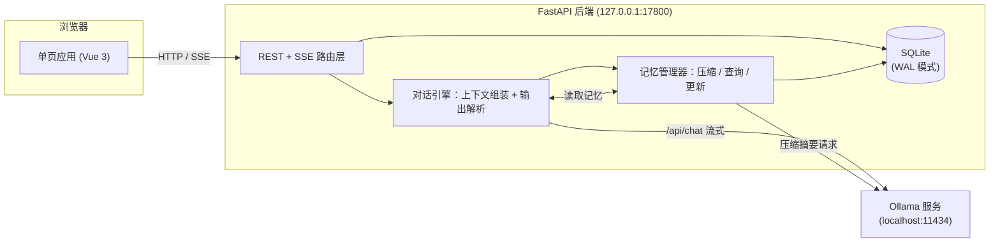
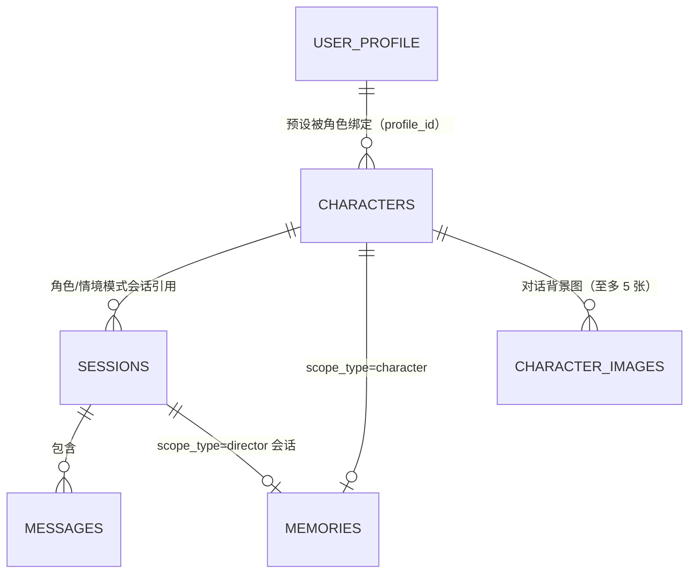

# 多模式对话机器人开发文档

基于本地 Ollama 模型的三模式对话应用：聊天模式、沉浸模式、导演模式。本文档记录需求定义、数据模型、核心机制、API 与界面的完整设计，以及各项设计取舍的理由——开发与后续迭代以此为准；**本文档只描述当前状态，不记录变更历史**；面向使用者的功能说明与上手步骤见 [README.md](./README.md)。

## 1. 项目概述

### 1.1 目标

做一个完全本地运行的多模式对话机器人：

- 对话生成全部走本机 Ollama 服务，不依赖任何云端 API
- 支持三种模式：**聊天模式**（扮演一个角色对话）、**沉浸模式**（角色 + 情境演绎）、**导演模式**（自由剧本生成）
- 记忆体系分两层：会话内的消息历史（短期），跨会话的长期记忆（按角色或按会话绑定），长期记忆随对话自动压缩
- 消息可编辑、可删除、可重新生成，用户对上下文有完全控制权

### 1.2 运行环境

| 项 | 值 |
|---|---|
| 操作系统 | Windows 11（不做跨系统适配承诺） |
| 模型服务 | 本机 Ollama（默认 `http://localhost:11434`） |
| 后端 | Python 3.13（uv 管理环境与依赖）/ FastAPI / SQLite（文件数据库，路径在配置中直接指定） |
| 前端 | Vue 3 + Vite 构建（`frontend/` 是源码，`app/static/` 是产物）/ 原生 CSS |
| 使用场景 | 单用户本地使用，无鉴权、无多用户并发设计 |

对话模型不与启动配置绑定：首次启动取 `config.yaml` 的默认值，之后在界面随时切换，思考型与非思考型模型均兼容（见 5.2、6.6）。

### 1.3 技术选型理由

- **FastAPI**：原生支持 async 与 `StreamingResponse`，SSE 流式输出实现简单；自动生成 OpenAPI 文档方便调试。
- **SQLite + WAL 模式**：单文件、零部署，单用户场景下无并发瓶颈；数据全在本地，符合"本地记忆"的定位。
- **Vue 3 + Vite 构建**：前端源码在 `frontend/`（`index.html` + `src/`），构建产物落到 `app/static/` 由 FastAPI 直接托管。这样依赖版本锁在 `node_modules` 里、不依赖外网 CDN（离线也能用），并且可以用模块化的方式组织代码。**代价**：多一个 Node 工具链、改前端要多一步构建（产物提交进仓库，所以**没装 Node 也能直接跑**；`start.bat` 在检测到 Node 时会顺手重建）。
- **SSE 而非 WebSocket**：通信是单向流（请求 → 生成流），SSE 足够且实现和调试都更简单。

### 1.4 术语表

文档、代码、界面三处统一用下列叫法。同名不同义最容易出事，所以同形异义词单独标注。

| 名词 | 含义 | 代码里对应 |
|---|---|---|
| **聊天模式 / 沉浸模式 / 导演模式** | 三种对话模式 | `sessions.mode` = `chat` / `immersive` / `director`；前端 `MODES` 的 key |
| 角色 | 被扮演的对象；一个角色可以开多个会话 | `characters` 表 |
| 会话 | 一段独立对话，创建时锁定所属模式 | `sessions` 表 |
| 情境 / 话语 | 一条消息的两个部分：旁白式情境说明、角色说的话。沉浸模式下用户也能写情境（输入区左栏） | `messages.scenario` / `messages.content` |
| 生成要求 | 挂在会话上的生成参数（含导演指令、发散程度） | `sessions.gen_settings` JSON |
| 导演指令 | 只属于沉浸模式的字段，写剧情走向的持续性要求 | `director_notes` |
| 发散程度 | 四个标签（严谨 / 稳定 / 标准 / 放飞）映射采样温度 | `TEMPERATURE_LEVELS` |
| 我的设定 | **用户本人**的名字 / 身份 / 外观 / 头像 | `user_profile` 表（`id=1` 当前、`id>1` 预设） |
| 世界设定 | 全局一份的世界观（名称 / 描述 / 规则 / 词库），名称不发给模型 | `world` 表 |
| 角色级记忆 / 会话级记忆 | 前者的 scope 是角色（聊天与沉浸模式跨会话共享），后者只在导演模式内按会话独立 | `memories` 表（`character_id` / `session_id`） |
| 归档 | 已被压缩进记忆、默认折叠不显示的消息 | `messages.archived` |
| 角色生成方式：开放 / 探索 | **与三种对话模式无关**：新建角色时"让模型生成设定"的两种方式，探索方式会锁住性格 / 语言风格 / 背景故事 | 生成请求的 `mode` = `open` / `explore`；`characters.locked` |
| 标签栏 / 标签页 | 右侧面板顶部的按钮行 / 每一块内容 | `.panel-tabs` / `.panel-tab-pane` |
| 「配置」键 | 顶栏最右侧进出右侧面板的按钮（文案只在 `‹` / `›` 之间切换） | `panelCollapsed` |
| 左栏 / 右侧面板 | 左侧的模式与会话列表 / 右侧的五块设定 | `.sidebar` / `.panel` |

两个容易混的地方：**"探索"只用于角色生成方式**，它不是第四种对话模式；**"情境"是消息内容的一部分**，与模式名"沉浸模式"不同义。

## 2. 需求定义

### 2.1 三种对话模式

| 维度 | 聊天模式 | 沉浸模式 | 导演模式 |
|---|---|---|---|
| 模式标识 | `chat` | `immersive` | `director` |
| 绑定角色 | 是（会话创建时选定） | 是（与聊天模式共用同一套角色） | 否 |
| 生成内容 | 仅角色话语 | 角色话语 + 情境说明 | 自由生成的对话 + 情境 |
| 可配置项 | 角色设定 + 系统生成要求 | 系统生成要求 | 系统生成要求 |
| 生成要求字段 | 回复长度、主动性、发散程度 | 情境篇幅、推进速度、导演指令、发散程度 | 题材、文风、篇幅、情境台词配比、发散程度 |
| 长期记忆归属 | 按角色绑定，跨会话共享 | 与聊天模式共用同一份角色记忆 | 按会话独立保存 |

三种模式的一致规则：

- 系统生成要求挂在**会话**上，随时可改，改动只影响后续生成，不改动历史消息
- **发消息的方式**：沉浸模式的输入区是两栏——「情境说明」（场景 / 动作 / 心理，可选）与「话语」（必填），两栏都会进上下文；另外两种模式只有一个输入框（聊天模式的角色只说话，导演模式的情境由模型按配比生成）
- 聊天模式与沉浸模式对同一个角色共享角色设定和长期记忆，在任一模式下聊过的关键信息，另一个模式也能记起
- 聊天模式与沉浸模式的**会话列表相互隔离**：各自只列出本模式创建的会话（`sessions.mode` 区分），另一个模式的会话不显示、打不开，也改不了生成要求、无法重新生成；切模式 Tab 会各自恢复到本模式上次打开的会话（见 5.6）。隔离只针对会话，角色设定与长期记忆仍按上一行共用
- 长期记忆相互隔离：角色 A 与角色 B 的记忆互不可见；导演模式各会话之间的记忆互不可见

### 2.2 角色设定

聊天与沉浸两种模式共用，字段如下：

| 字段 | 说明 | 必填 |
|---|---|---|
| `name` | 角色名 | 是 |
| `appearance` | 外观设定（年龄、身形、衣着、标志性特征） | 否 |
| `personality` | 性格设定 | 否 |
| `speech_style` | 语言风格（口癖、语气、用词习惯） | 否 |
| `backstory` | 背景故事 | 否 |
| `avatar` | 自定义头像，存 data URL（jpg/png/webp） | 否 |
| `locked` | 探索模式：1 = 隐藏后三项（对用户隐藏且不可改），解锁后永久置 0 | 否 |

角色设定编辑立即生效，下一次生成即按新设定组装提示词。`avatar` 不进提示词（模型不需要看到头像），只用于界面显示。

**`locked`（探索模式）**：`personality` / `speech_style` / `backstory` 这三项在 `locked=1` 时**接口就不下发**（角色列表、单查、会话详情里内嵌的角色摘要都不含它们），`PUT` 也**忽略**这三个字段。注意隐藏只针对用户可见性——它们照常注入 system prompt，否则角色就没有性格可言了；裁剪入口只有 `public_character()` 一处，角色列表、单查、会话详情共用。

**头像的存取方式**：选图后先在浏览器里**校验**（MIME 必须是 `image/*`、文件 ≤10MB、能解码、最短边 ≥256px、总像素 ≤4000 万），通过则弹出**裁剪弹窗**让用户拖动（并可用滑杆 1×～3× 缩放）选定正方形区域，确定时按取景框换算原图取样矩形、画进 **256×256** 画布并重编码为 **JPEG（质量 0.85）**，再以 data URL 提交；后端只存这一个字符串。上限 256KB 只是兜底。`avatar` 为空串表示不用自定义头像，界面回落到"姓名首字"占位。

最短边下限取 256、与输出边长相同，是为了**保证 1× 缩放下永不放大**：取样边长在 1× 时等于原图短边，只要它 ≥256，裁出来的就一定是原像素或下采样，不会因为放大而发糊。代价是小于 256 的图直接拒收。放大（>1×）仍可能让取样区域小于 256（例如 256 的图放到 2× 只剩 128），这种情况弹窗里会**只在此时**出现一行提示，告知实际取样像素数。

校验放在客户端而不是等后端报错，是因为这里要拦的两类问题（文件太大、分辨率不对）只有拿到原文件才判得准；服务端仍保留格式白名单与长度上限作为兜底。校验失败**不使用底部错误条**——那条只在打开会话时才渲染，从侧栏打开角色弹窗时用户根本看不到，所以在头像选择处就地显示。

### 2.3 我的设定（用户本人）

与角色无关的全局设定，单行表 `user_profile`：

| 字段 | 说明 | 是否进提示词 |
|---|---|---|
| `name` | 用户的名字，角色可以直接称呼 | 是（聊天与沉浸两种模式） |
| `identity` | 身份，如"被卷入事件的见习侦探" | 是（聊天与沉浸两种模式） |
| `appearance` | 外观（年龄、身形、衣着） | 是（聊天与沉浸两种模式） |
| `avatar` | 头像，与角色头像同一套校验与裁剪流程 | 否（只用于界面显示） |

预设与当前设定**共用这张表**：`id=1` 是当前使用的那份，`id>1` 是保存下来的预设。所以表上不能有 `CHECK(id=1)`——那条约束会把预设挡在门外。

**面板里的表单永远等于"当前使用的设定"（`id=1`）**，预设是"另存的一份"，两边各走各的入口，谁也不会误改谁。面板上只显示一行"当前预设：X"（没载入过就是"未选择预设"；载入之后又手改过表单则显示"X（已修改）"），加三个入口键：

| 想做 | 怎么做 | 写谁 |
|---|---|---|
| 改当前设定 | 直接在表单里改 → 点底部「保存当前配置」 | `id=1` |
| 把当前这份存成预设 | 点「存为预设」 | 新建一条（`POST`） |
| 用某条预设 | 点「载入预设…」→ 弹窗里挑一条（左边列表、右边详情）→ 「载入这条」 | **立即写 `id=1`** |
| 改 / 删某条预设 | 点「编辑预设…」→ 弹窗里先选哪条，再改字段；删除键也在这个弹窗里 | 只动 `id>1` 的那一行 |

面板上的三个入口键按 **载入预设… / 编辑预设… / 存为预设** 排列（把当前配置另存为新预设放在最右，它跟前面两个"读预设"的动作不是一类），三者**常驻、不适用时置灰**（`控件不按状态出现/消失`）。「载入预设」与「编辑预设」两个弹窗**共用同一套两栏骨架与同一条样式**（左列表 40% + 右内容，两边都是 620px 宽）：左边每项带头像与身份摘要，右边分别是只读详情与可编辑字段——名字很可能重复，不看这两处根本分不清。几处设计上的选择：

- **挑选与看详情放在弹窗里，不在面板上下拉**：预设名字很可能重复（同一份设定的"聊天用/写作用"两版就叫一样的名字），下拉里一行字根本分不清是谁。弹窗里左边列表每项带身份摘要，右边把选中那条的头像、名字、身份、外观全摆出来。
- **"载入"是立即生效**（写 `id=1`），不是"只填表单、还要再点保存"。这样面板那行"当前预设：X"永远等于"真正在生效的那份来自 X"，不会再出现"以为载入了其实没生效"。代价是它会覆盖当前配置，所以载入前若表单里有没保存的改动，先弹一次确认。
- **删除收进编辑弹窗**：面板上不放不可逆的操作；删除时照旧有一次确认。
- **面板那行只认"来源"**：编辑预设时改的是预设本身。若改的正好是当前这份设定的来源那条预设，当前配置会跟着一起更新（否则那行会挂着"XX（已修改）"，看起来像用户自己把设定改坏了）；改的是别的预设则当前配置不受影响。

**预设绑定角色：身份跟着角色走。** 绑定关系记在**角色那一侧**（`characters.profile_id` → `user_profile.id`，`NULL` = 不绑定），所以一份预设可以被多个角色共用，而改绑的入口就在「编辑角色」弹窗底部那一项下拉（`我的身份预设`，含"不绑定（不用预设）"）——绑定是"某个角色用哪份身份"，属于角色的属性，不该塞进预设的编辑界面；两个预设弹窗只**显示**这件事：左列表每项一行"角色：X、Y / 未绑定"，右详情多一行"绑定角色"。打开某个角色的会话时，按这个角色校准"当前使用的设定"：

| 角色的绑定 | 校准结果 |
|---|---|
| 绑了预设 P，当前不是 P | 用 P 的内容覆盖 `id=1`，当前预设记为 P |
| 绑了预设 P，当前已经是 P | 什么都不做（面板上临时手改过的内容在同角色内保留，不被反复冲掉） |
| 没绑预设，当前正用着某条预设 | 清空 `id=1`（没绑就是不用预设），当前预设记为"未选择" |
| 没绑预设，本来就没用预设 | 什么都不做（用户自己手填的身份留着） |
| 找不到那条预设（还没加载出来 / 刚被删） | 什么都不做——宁可少切一次，也不能把身份清错 |

于是同一个角色的所有会话共享同一份身份，切换角色就换成那个角色绑定的那份。校准只在**打开会话**与**改完角色设定**（含改绑定、删角色后刷新）两处发生；手动「载入预设」是临时覆盖，下次打开会话会按角色校正回来。锁定（探索模式）不影响这一项：锁的是角色的隐藏设定，而"我用哪份身份"是用户自己的东西。删除预设时引用它的角色自动解绑（`delete_preset()` 顺手把这一列清成 `NULL`，这一列没有 `ON DELETE` 级联）。

注入方式是 system prompt 里的一段独立块（`# 与你对话的人`），紧跟角色设定之后；三项全空时整块不出现（打开一个"没绑预设"的角色的会话就是这种情况——那一轮生成里没有"我是谁"）。**导演模式不注入、也不显示**用户头像与名字，面板里也不出现这个标签——那里没有"我是谁"这回事。

### 2.4 世界设定

同样是全局设定（**一份**，单行表 `world`），但它是**所有模式共用**的：

| 字段 | 说明 | 是否进提示词 |
|---|---|---|
| `name` | 世界名称 | **否**（用户明确要求：只用于自己辨认） |
| `description` | 描述：这个世界的详细信息（地理、时代、势力、氛围…） | 是（三种模式） |
| `rules` | 规则：独属于这个世界的规则（力量体系、禁忌、铁律…） | 是（三种模式） |
| `terms` | 词库：专有名词及解释，JSON 数组，可增删、有顺序 | 是（三种模式） |

四项均可选、随时可改。注入位置在**角色设定之前**：世界是最外层的框架，"你身处这个世界、并且扮演这个角色"比反过来自然。除名称外三项全空时整块不出现（不给模型一段空标签，同 `_user_block`）；**导演模式也注入**——故事同样发生在某个世界里（这一点与"我的设定"相反）。上限与上下文预算见 2.5。

### 2.5 系统生成要求

按模式分组的结构化配置，前端渲染为表单，数据库存 JSON。每个字段都映射为提示词中的自然语言要求；其中导演指令渲染为独立段落（见 5.1）。**例外是 `temperature`（发散程度）**：它不是提示词内容，而是覆盖请求里的 `options.temperature`（见下）。

**聊天模式（生成要求）：**

| 字段 | 类型 | 取值 |
|---|---|---|
| `reply_length` | 单选 | 简短 / 适中 / 详细 |
| `proactive` | 单选 | 低 / 中 / 高（主动推进话题的程度） |
| `temperature` | 单选 | 严谨 / 稳定 / 标准 / 放飞（发散程度，仅覆盖采样温度） |
| `extra` | 自由文本 | 任意补充要求，原样注入 |


**沉浸模式（生成要求）：**

| 字段 | 类型 | 取值 |
|---|---|---|
| `scenario_length` | 单选 | 简短（1 句）/ 适中（1-3 句）/ 详细（3 句以上） |
| `pace` | 单选 | 平缓 / 适中 / 快速（剧情推进速度） |
| `temperature` | 单选 | 严谨 / 稳定 / 标准 / 放飞（发散程度，仅覆盖采样温度） |
| `director_notes` | 自由文本 | 导演指令：影响情境走向，不进入对话 |
| `extra` | 自由文本 | 任意补充要求 |


**导演模式：**

| 字段 | 类型 | 取值 |
|---|---|---|
| `genre` | 自由文本 | 题材，如"都市奇幻"、"武侠" |
| `style` | 自由文本 | 文风，如"细腻文学风"、"轻喜剧" |
| `length` | 单选 | 短 / 中 / 长（单次生成篇幅） |
| `composition` | 单选 | 只有情境 / 情境为主 / 均衡 / 台词为主（情境与台词的配比，默认均衡） |
| `temperature` | 单选 | 严谨 / 稳定 / 标准 / 放飞（发散程度，仅覆盖采样温度） |
| `extra` | 自由文本 | 任意补充要求 |


**`temperature`（发散程度）与上面那些字段不是一类**：它是采样参数，不是给模型的文字要求，所以**不进入提示词**（渲染器逐键列举，天然不含它），而是由 `prompts.chat_options()` 覆盖请求里的 `options.temperature`。四个档位对应 `TEMPERATURE_LEVELS`：严谨 0.2 / 稳定 0.6 / 标准 0.9 / 放飞 1.3，界面上只显示标签、不显示数值。三种模式共用同一个字段定义（`TEMPERATURE_FIELD`），取值存会话的 `gen_settings.temperature`，默认 `standard`。

档位缺失或不是已知档位时（旧会话、或有人直接往 `gen_settings` 里塞了怪值）保持 `config.yaml` 的 `options.temperature` 不动，因此不需要数据迁移。记忆压缩与会话自动命名**不跟这个档位**——它们各自把 temperature 压到 0.3（`memory.py`、`naming.py`），摘要与标题要的是稳定，不该被会话的创作口味影响。也因此 `config.yaml` 里的 `temperature` 现在只是兜底值。

`composition` 决定情境与台词各占多少：`scenario_only` 明确要求不输出任何 `[DIALOG]`，`scenario_heavy` 允许情境铺陈多段、台词只作点缀。旧会话的 `gen_settings` 里没有这个键时由 `DEFAULT_SETTINGS` 兜底为 `balanced`，因此不需要数据迁移（见 5.1）。

`director_notes`（导演指令）与输出风格类字段不同：它保存对情境/剧情走向的持续性要求（如"让两人的关系逐渐缓和"），不作为消息进入对话历史，只注入 system prompt 指导生成，角色不会"说出"收到了指令。它与生成要求的其他字段一样挂在会话上、随时可改、只影响后续生成。**目前只有沉浸模式保留此字段**——聊天模式无情境，同类需求由 `extra` 承担；导演模式的用户消息本身就是指令，故不设。

### 2.6 共通能力

三种模式都必须实现：

1. **本地会话记忆**：会话内全部消息持久化在本地 SQLite，重开应用后完整恢复。
2. **编辑消息**：点"编辑"按钮修改任意一条消息（含用户消息与生成消息的话语、情境说明）；沉浸模式下情境框恒可编辑，两个输入框带"情境说明""话语内容"标签。
3. **删除消息**：删除单条，或级联删除某条及其之后的所有消息。
4. **重新生成**：对任意一条生成消息触发重新生成，以该消息之前的上下文为基准替换生成；**对用户消息同样可触发**，此时保留该消息本身、只重做它之后的回复。会话绑定的角色已被删除时该操作不可用（前端不提供按钮，接口也会拒绝，见 5.5）
5. **记忆自动压缩**：上下文超过阈值时自动把较早的消息归档为长期记忆摘要，过程不需要用户操作；压缩后的内容仍可通过右侧面板查看和手动编辑。
6. **停止生成**：生成过程中可随时中断；已经流出的部分照常入库，不丢内容（见 5.5）。
7. **会话标题自动命名**：创建时未填标题的会话，在用户说够内容后由模型异步总结标题，用户手动改名后不再自动覆盖（见 5.6）。

### 2.7 非功能需求

- 生成过程流式输出，首字延迟取决于本机模型速度，界面需有"生成中"状态反馈；思考型模型在正文流出前显示"思考中"占位，推理内容不进入界面与消息记录
- 记忆压缩在后台异步执行，不阻塞对话
- 所有本地数据（数据库文件）放在配置文件直接指定的路径下，不用环境变量派生
- 界面语言为中文

## 3. 总体架构

### 3.1 架构图



一次典型对话的完整链路：

1. 前端 POST 会话消息 → 路由层写入 user 消息
2. 对话引擎按会话模式组装 system prompt（角色设定 + 生成要求 + 长期记忆）与未归档历史
3. 调 Ollama `/api/chat` 流式接口，SSE 逐段推给前端
4. 生成完成：解析输出格式（情境/话语分段），落库 assistant 消息
5. 触发后台记忆检查，超阈值则异步压缩

### 3.2 Ollama 客户端封装

后端封装一个异步客户端，供对话与记忆压缩共用：

```python
import json
import httpx

async def chat_stream(messages: list[dict], model: str, options: dict | None = None):
    """流式调用 Ollama /api/chat，兼容有无思考模式的模型。
    yield (kind, value)：("status", "thinking"/"generating") 或 ("delta", 正文增量)。
    """
    payload = {
        "model": model,
        "messages": messages,
        "stream": True,
        "options": options or cfg["options"],  # num_ctx + 本会话的发散程度（见 2.5）；不传 think 参数，兼容策略见 5.2
    }
    tf = ThinkFilter()                          # 内联 <think> 过滤，见 5.2
    saw_thinking = saw_content = False
    # 读超时设为不限（生成可能要几十秒），但连接超时收紧到 10s：Ollama 没启动时要快速失败
    async with httpx.AsyncClient(timeout=httpx.Timeout(None, connect=10)) as client:
        async with client.stream("POST", f"{cfg['base_url']}/api/chat", json=payload) as resp:
            resp.raise_for_status()
            async for line in resp.aiter_lines():
                if not line:
                    continue
                chunk = json.loads(line)
                msg = chunk.get("message") or {}
                if msg.get("thinking") and not saw_thinking:
                    saw_thinking = True             # 新版 Ollama：推理在独立字段
                    yield ("status", "thinking")    # 只用来显示"思考中"，内容不转发
                text = msg.get("content", "")
                if text:
                    out, in_think = tf.feed(text)
                    if in_think and not saw_thinking:
                        saw_thinking = True
                        yield ("status", "thinking")
                    if out:
                        if not saw_content:
                            saw_content = True
                            yield ("status", "generating")
                        yield ("delta", out)
                if chunk.get("done"):
                    break
    tail = tf.flush()                           # 流结束，放出被缓冲的残尾
    if tail:
        if not saw_content:
            yield ("status", "generating")
        yield ("delta", tail)
```

另有非流式封装 `chat_once()`：记忆压缩、会话命名、角色生成共用，同样按调用传入 model，返回前剥掉 `<think>` 段；`fmt="json"` 时给请求带 Ollama 的 JSON 模式（只有角色生成用）。

启动自检在 `main.py` 的 lifespan 里：调 `list_models()`（即 Ollama `/api/tags`）取已安装模型集合，校验 `app_settings` 里的当前模型是否在其中，缺失则写启动日志、并在界面顶栏提示"所选模型未安装"；Ollama 整体不可达时只记一条警告，不阻断启动。前端除顶栏提示外，还会区分"连不上 Ollama"与"Ollama 中没有任何模型"两种情形。

每次调用的 `model` 参数取自 `app_settings` 表的运行时设置，而非模块级常量——这是"模型随时可换"在客户端层的落点：切换只改数据库一行，下一次请求即用新模型，无需重启。旧版 Ollama 把 `<think>` 内联进 content 的情况，由 `ThinkFilter` 兜底过滤（见 5.2）。

## 4. 数据模型

### 4.1 ER 关系



`memories` 是按 scope 唯一的单行滚动摘要：一个角色（或一个自由会话）至多一条记忆记录，压缩时原地更新。

`user_profile`（我的设定）与 `world`（世界设定）是两张**独立的全局单行表**，不与任何角色/会话建立外键：它们对所有会话生效。唯一的例外是 `characters.profile_id` 指向 `user_profile` 里的某条**预设**（`id>1`）——那是"这个角色用哪份身份"，一份预设可以被多个角色同时引用（见 2.3）。

### 4.2 表结构

```sql
CREATE TABLE characters (
    id           INTEGER PRIMARY KEY AUTOINCREMENT,
    name         TEXT NOT NULL,
    appearance   TEXT NOT NULL DEFAULT '',
    personality  TEXT NOT NULL DEFAULT '',
    speech_style TEXT NOT NULL DEFAULT '',
    backstory    TEXT NOT NULL DEFAULT '',
    created_at   TEXT NOT NULL,
    updated_at   TEXT NOT NULL,
    avatar       TEXT NOT NULL DEFAULT '',  -- 自定义头像的 data URL；空串 = 用姓名首字占位
    locked       INTEGER NOT NULL DEFAULT 0, -- 1 = 探索模式：后三个字段对用户隐藏且不可改
    profile_id   INTEGER REFERENCES user_profile(id) -- 绑定的"我的设定"预设（NULL = 不绑定），见 2.3
);

CREATE TABLE user_profile (          -- 我的设定：id=1 当前使用，id>1 是预设
    id         INTEGER PRIMARY KEY,   -- 不能加 CHECK(id=1)：预设也要占一行
    name       TEXT NOT NULL DEFAULT '',
    identity   TEXT NOT NULL DEFAULT '',
    appearance TEXT NOT NULL DEFAULT '',
    avatar     TEXT NOT NULL DEFAULT '',
    updated_at TEXT NOT NULL
);

CREATE TABLE world (                 -- 世界设定：全局一份，id=1（见 2.4）
    id          INTEGER PRIMARY KEY,  -- 同样不写 CHECK(id=1)：以后要做多世界切换时插 id>1 即可
    name        TEXT NOT NULL DEFAULT '',   -- 世界名称：只给自己辨认，不进提示词
    description TEXT NOT NULL DEFAULT '',   -- 描述
    rules       TEXT NOT NULL DEFAULT '',   -- 规则
    terms       TEXT NOT NULL DEFAULT '[]', -- 词库：[{"term": ..., "meaning": ...}]，有序
    updated_at  TEXT NOT NULL
);

CREATE TABLE sessions (
    id           INTEGER PRIMARY KEY AUTOINCREMENT,
    mode         TEXT NOT NULL CHECK(mode IN ('chat','immersive','director')),
    character_id INTEGER REFERENCES characters(id) ON DELETE SET NULL,
    title        TEXT NOT NULL DEFAULT '新会话',
    title_auto   INTEGER NOT NULL DEFAULT 1,  -- 1 = 标题可由模型自动总结，0 = 用户已手动命名
    gen_settings TEXT NOT NULL DEFAULT '{}',  -- JSON，结构按 2.5 节
    created_at   TEXT NOT NULL,
    updated_at   TEXT NOT NULL
);

CREATE TABLE messages (
    id         INTEGER PRIMARY KEY AUTOINCREMENT,
    session_id INTEGER NOT NULL REFERENCES sessions(id) ON DELETE CASCADE,
    role       TEXT NOT NULL CHECK(role IN ('user','assistant')),
    content    TEXT NOT NULL,             -- 话语正文
    scenario   TEXT,                      -- 情境说明；两边都可能有（沉浸模式下用户消息也带）
    archived   INTEGER NOT NULL DEFAULT 0,-- 1 = 已压缩进长期记忆，不再注入上下文
    edited     INTEGER NOT NULL DEFAULT 0,
    created_at TEXT NOT NULL
);
CREATE INDEX idx_messages_session ON messages(session_id, id);

CREATE TABLE memories (
    id            INTEGER PRIMARY KEY AUTOINCREMENT,
    scope_type    TEXT NOT NULL CHECK(scope_type IN ('character','session')),
    scope_id      INTEGER NOT NULL,        -- character_id 或 session_id
    content       TEXT NOT NULL DEFAULT '',-- 滚动摘要正文
    message_count INTEGER NOT NULL DEFAULT 0, -- 已归档消息累计数
    updated_at    TEXT NOT NULL,
    UNIQUE(scope_type, scope_id)
);

CREATE TABLE app_settings (
    id               INTEGER PRIMARY KEY CHECK(id = 1),  -- 单行表
    model            TEXT NOT NULL,                      -- 当前对话模型
    memory_model     TEXT NOT NULL DEFAULT '',           -- 压缩用模型，空 = 同对话模型
    disable_thinking INTEGER NOT NULL DEFAULT 0,         -- 界面偏好：关掉思考模式
    updated_at       TEXT NOT NULL
);

-- 角色的对话区背景图（5.8 节）。不放进 characters 表：那会让角色列表接口背上几 MB 图片
CREATE TABLE character_images (
    id           INTEGER PRIMARY KEY AUTOINCREMENT,
    character_id INTEGER NOT NULL REFERENCES characters(id) ON DELETE CASCADE,
    position     INTEGER NOT NULL DEFAULT 0,   -- 展示顺序
    data         TEXT NOT NULL,                -- 图片 data URL
    created_at   TEXT NOT NULL
);
CREATE INDEX idx_character_images ON character_images(character_id, position, id);
```

关键设计：

- **`messages.archived` 而非物理删除**：压缩后被归档的消息仍留在库里，前端默认折叠显示"已归档 N 条"，可展开查看原文。上下文组装时跳过 `archived=1`。
- **`scenario` 与 `content` 分列存储**：编辑、渲染、重新注入历史时两种内容各自独立处理，不靠运行时反复解析。
- **删除角色**：`character_id` 置 NULL，角色记忆删除，其会话保留（可看历史、不可继续生成，前端提示"角色已删除"）。不级联删会话，避免误删用户数据。
- **`app_settings` 单行表存运行时设置 + 界面偏好**：模型选择写进数据库，切换后重启仍生效；`config.yaml` 的模型仅作首次初始化默认值。压缩用的模型也在此表，可随时单独更换。**界面偏好（`disable_thinking`）与模型选择同表**：好处是"读设置"只查一行、不必再查第二张表；代价是以后每加一个偏好都要加列，届时要按下面那条例外流程做一次性维护。
- **`sessions.title_auto` 而非比对标题字符串**：会话是否还能被自动命名由独立字段记录，不用 `title == '新会话'` 这种魔法值判断——用户完全可能把会话真命名为"新会话"。创建会话时未填标题才置 1，用户重命名即置 0，因此每个会话至多被自动命名一次，且永不覆盖用户的手动命名。
- **`world.terms` 用一列 JSON，而不是另开一张词条表**：词库是"整体读写、有序、可增删"的列表，没有"按名词单独查询"的需求，一次 UPDATE 就能整体保存；读写的形状规则集中在一处（`_parse_terms` / `write_world`），空名词行也在那里统一丢弃。解析失败（手改过库）时退回空列表：词库只是锦上添花，不该让整次生成失败。
- **新功能优先开新表，而不是给已有表加列**：`CREATE TABLE IF NOT EXISTS` 对**已有库**也会把新表建出来，加列则要额外登记一次迁移（见下一条），所以能开新表就开新表。世界设定就是照这条做的。
- **`avatar` 存在角色表里而不是当文件存**：图片跟着数据库走，备份/恢复才等于"全部数据"。
- **加列必须登记，旧库靠 `_COLUMN_MIGRATIONS` 幂等补上**：`CREATE TABLE IF NOT EXISTS` 只建新表、不会改已存在的表，所以给已有表加的列，新库由 `SCHEMA` 直接建出来、旧库要在 `database._COLUMN_MIGRATIONS` 里登记一行（`_create_schema()` 启动时先 `PRAGMA table_info` 查缺哪列，缺了才 `ALTER TABLE … ADD COLUMN`）。**漏登记的后果是"老库上那一列永远不存在"**，于是删库重建还是唯一的补救办法。只登记加列——改类型 / 删列 / 改约束 SQLite 不支持，仍按 9.3 的重建流程走。目前登记的是 `characters.profile_id`（预设绑定，见 2.3）。

### 4.3 长期记忆的 scope 规则

| 会话模式 | 记忆 scope | 效果 |
|---|---|---|
| `chat` | `(character, 会话的 character_id)` | 同角色所有会话共享 |
| `immersive` | `(character, 会话的 character_id)` | 与聊天模式完全共用 |
| `director` | `(session, 会话 id)` | 每个会话独立 |

隔离性由查询条件保证：组装上下文时只读取当前会话对应 scope 的记忆记录，其他角色/会话的记忆不进入提示词。

## 5. 核心设计

### 5.1 上下文与提示词组装

每次生成的消息序列固定为三段：

```
[system]  模式指令 + 世界设定(如有，三种模式) + 角色设定(如有) + 我的设定(如有，仅聊天与沉浸两种模式)
          + 生成要求 + 长期记忆 + 输出格式规则
[历史]    该会话所有 archived=0 的消息（按 id 升序，超出条数上限截断最早的部分）
[当前]    本轮 user 消息
```

三种模式的 system prompt 模板（`app/prompts.py` 中实现为 Python 函数，此处为模板主体）：

**聊天模式：**

```text
你要完全扮演下面这个角色，与用户进行对话。

# 世界设定            ← 有世界设定时才有这一段（见 2.4）
描述：{world_description}
规则：{world_rules}
词库：
- {term}：{meaning}
以上是这个世界的既定设定：描述与规则必须遵守，词库里的专有名词按给定含义使用，
不要改写这些设定，也不要向用户复述这份设定。

# 角色设定
姓名：{name}
外观：{appearance}
性格：{personality}
语言风格：{speech_style}
背景：{backstory}

# 你对这个用户的记忆
{memory_content}

# 回复要求
{gen_settings_text}

# 输出规则
这个模式像手机发短信：每一轮只输出{name}**说出口的话**，读起来就是聊天记录本身。
不要写动作、表情、语气提示或心理活动，也不要写旁白、场景描写与舞台说明。**尤其不要把动作放进括号里**
```

**沉浸模式：**

```text
你要扮演下面这个角色，与用户在同一个故事情境中互动。

# 世界设定            ← 同上

# 角色设定
（同上五字段）

# 你对这个用户的记忆
{memory_content}

# 生成要求
{gen_settings_text}

# 导演指令
{director_notes 或 "（无）"}
导演指令只决定情境与剧情的走向，不属于对话内容，角色不得提及或回应"收到指令"。

# 输出规则
严格按下面两段的顺序输出，段首必须原样使用这两个英文标记：
[SCENARIO]场景、动作、氛围等情境说明
[DIALOG]你扮演的角色说出的话
标记只能用 [SCENARIO] 与 [DIALOG] 这两个词，不要写成 [SCENERY]、[SCENE] 或中文标记。
两段都必须有内容：不要输出空标记，也不要在标记之外写任何文字。
```

**导演模式：**

```text
你是创意写作引擎，根据用户的引导生成故事情境与角色对话。

# 世界设定            ← 同上

# 本会话此前的剧情
{memory_content}

# 生成要求
{gen_settings_text}

# 输出规则
每次生成都用下面的标记分段输出，每个段落以标记开头，段落数量与先后顺序不限：
[SCENARIO]场景、氛围、事件等情境说明
[DIALOG]角色名：该角色说出的话
[SCENARIO] 与 [DIALOG] 都可以只出现其中一种，也可以各自出现多次。
[DIALOG] 是可选的：只写情境时就不要输出任何 [DIALOG]。
情境与台词的比例由「情境与台词的配比」要求决定。
```

这里刻意**不给出"一段情境 + 两段台词"式的完整示例**：那种示例会被模型当成必须遵循的段落模板，导致每轮都产出等量的情境与台词，而用户往往只想要纯情境或情境远多于台词。提示词只列标记说明 + 显式声明 `[DIALOG]` 可选，再由 `composition` 字段指出配比。

初版这里还多写了一句"不要默认让两者等量或交替出现"，后来去掉了：配比本来就由 `composition` 决定，而这句话会在配比选"均衡"时把等量/交替输出一并禁掉——那是"均衡"本该允许的写法。禁止某一种配比是 `composition` 的职责，不该由输出规则包办。

生成要求 `gen_settings_text` 由 JSON 字段拼接为自然语言（`prompts.py` 里每个模式一个 render 函数），例如聊天模式：

```python
REPLY_LENGTH_DESC = {"short": "每次回复不超过2句话", "medium": "每次回复2到4句话", "long": "每次回复可以详细展开"}
PROACTIVE_DESC = {"low": "被动回应即可，不要主动抛出新话题", "medium": "适度主动，偶尔推进话题", "high": "主动抛出新话题，积极推进对话"}

def _join(parts: list[str]) -> str:
    return "；".join(p for p in parts if p) + "。"

def render_chat_settings(s: dict) -> str:
    parts = [
        f"回复长度：{REPLY_LENGTH_DESC.get(s.get('reply_length'), REPLY_LENGTH_DESC['medium'])}",
    ]
    parts.append(f"主动性：{PROACTIVE_DESC.get(s.get('proactive'), PROACTIVE_DESC['medium'])}")
    if s.get("extra"):
        parts.append(f"附加要求：{s['extra']}")
    return _join(parts)
```

取值一律用 `.get(..., 默认)` 兜底：会话里存的可能是旧版本留下的枚举值，直接下标取值会在升级后 KeyError。字段定义与默认值集中在 `prompts.py` 的 `FIELDS` / `DEFAULT_SETTINGS`，通过 `GET /api/gen-settings` 下发给前端渲染，前端不含任何硬编码字段。

`director_notes` 不并入 `gen_settings_text`，而是渲染为提示词中独立的"导演指令"段：它是剧情走向的持续要求，不是输出风格，独立成段让模型不会混淆两者，用户在面板里也能直观理解字段含义（目前仅沉浸模式有该字段）。

字段被移除后，旧会话 `gen_settings` 里若还留着同名键，既不渲染也不会被提交：`saveGenSettings()` 只按当前字段定义组装载荷，所以旧值会在下一次保存时自然消失。开发阶段不做数据迁移（见 4.2）。

历史消息注入时的格式还原：沉浸模式下**两侧**都按原始标记格式回填（`[SCENARIO]xxx\n[DIALOG]yyy`）——助手那一侧让模型持续看到自己此前的输出结构，用户那一侧让它看到用户给的场景（用户在输入区左栏写的情境）；只有情境没有话语时不补空的 `[DIALOG]`。聊天模式的用户消息注入 `content`，导演模式也注入 `content`。

### 5.2 输出解析与思考模式兼容

解析前先剥掉思考段——思考型模型（qwen3、deepseek-r1 等）会在正文之外产生推理过程，直接进解析会污染 `[SCENARIO]`/`[DIALOG]` 结构。这里分两件事：

**（一）不让思考内容污染消息**——不依赖 Ollama 的 `think` 请求参数，而是两条应用层路径叠加：

- **首选（新版 Ollama）**：思考型模型把推理放在响应的独立 `thinking` 字段，`message.content` 只含正文。`chat_stream` 只转发 `content`；`thinking` 非空时向前端发"思考中"状态（`status` 事件，见 6.5）。
- **兜底（旧版本或个别模型模板）**：推理以内联 `<think>…</think>` 混在 `content` 里。非流式调用直接 `re.sub(r"<think>.*?</think>", "", text, flags=re.S)`；流式调用在 `chat_stream` 外套一层 `ThinkFilter` 状态机：

```python
class ThinkFilter:
    """流式 <think> 过滤器。feed() 返回 (正文增量, 是否处于思考态)。"""

    OPEN, CLOSE = "<think>", "</think>"

    def __init__(self):
        self.buf = ""          # 未决缓冲：可能含被 chunk 边界拆开的半个标签
        self.in_think = False

    def feed(self, chunk: str):
        self.buf += chunk
        out = []
        while True:
            tag = self.CLOSE if self.in_think else self.OPEN
            i = self.buf.find(tag)
            if i < 0:                       # 无完整标签：留出可能是标签前缀的尾巴
                keep = len(tag) - 1
                if len(self.buf) > keep:
                    head, self.buf = self.buf[:-keep], self.buf[-keep:]
                    if not self.in_think:
                        out.append(head)    # 思考态下的内容直接丢弃
                break
            if not self.in_think:
                out.append(self.buf[:i])
            self.in_think = not self.in_think
            self.buf = self.buf[i + len(tag):]
        return "".join(out), self.in_think

    def flush(self) -> str:
        """流结束：思考态未闭合说明全程无正文，返回空串；否则放出残尾。"""
        if self.in_think:
            return ""
        out, self.buf = self.buf, ""
        return out
```

两条路径叠加后，无论运行中把模型换成什么，进入格式解析的文本都不含思考内容——这是"模型随时可换"在解析层的落点。

用标记 `[SCENARIO]` / `[DIALOG]` 而非中文标签：英文标记在中英混合输出里的歧义最小，且避免全角方括号问题。前端渲染时再显示为中文"情境"标签。

**识别刻意宽容**（`app/parser.py`）。提示词里严格要求的仍是 `[SCENARIO]`/`[DIALOG]`，但解析时接受这些变体，因为它们都实际出现过：

- 同义/近似词：情境侧 `SCENERY`、`SCENE`、`NARRATION`、`SETTING`、`CONTEXT`；话语侧 `DIALOGUE`、`SPEECH`、`TALK`
- 大小写任意、全角括号 `【SCENARIO】` 也认
- **标记之外的裸文本按话语算**：模型常把台词写在第一个标记之前（顺序颠倒），丢掉它就等于把角色说的话吞了
- 多个情境段合并（只取第一段会静默丢内容）
- 内容为空的标记直接跳过，不产生空段落；全是空标记时视为"没有内容"，**绝不把裸标记当正文显示给用户**

宽容只影响"能不能认出标记"，不影响"要求模型输出什么"——不宽容的代价很实际：模型把 `[SCENARIO]` 写成 `[SCENERY]`、台词写在标记前、末尾多个空 `[DIALOG]`，只认标准标记的话就只会匹配到那个空标记，于是情境为空、整段被打成纯文本，用户看到的是带裸标记的消息。

```python
import re

SCENARIO_TAGS = ("SCENARIO", "SCENERY", "SCENE", "NARRATION", "SETTING", "CONTEXT")
DIALOG_TAGS = ("DIALOG", "DIALOGUE", "SPEECH", "TALK")
_TAG = r"[\[【]\s*(?:" + "|".join(SCENARIO_TAGS + DIALOG_TAGS) + r")\s*[\]】]"
SEGMENT = re.compile(
    r"[\[【]\s*(" + "|".join(SCENARIO_TAGS + DIALOG_TAGS) + r")\s*[\]】]\s*(.*?)(?=\n?" + _TAG + r"|$)",
    re.S | re.I,
)

def parse_output(mode: str, raw: str) -> tuple[str | None, str]:
    text = (raw or "").strip()
    if mode == "chat":
        return None, text
    found = SEGMENT.search(text)      # 有没有标记，与"切出了什么段落"是两件事
    pieces = _pieces(text)            # 标记之外的裸文本也会作为话语出现在这里
    if not pieces:
        return (None, "") if found else (None, text)   # 全是空标记 → 没内容
    if mode == "immersive":
        scenario = "\n".join(t for kind, t in pieces if kind == "scenario").strip()
        dialog = "\n".join(t for kind, t in pieces if kind == "dialog").strip()
        return (scenario or None), dialog              # 允许"只有情境、没有台词"
    return (MULTI if found else None), text
```

这里有个容易写错的地方：判断"是否降级"必须看**有没有出现标记**，而不是看切出来的段落是否为空——`_pieces()` 在完全无标记时也会把整段当成话语返回，用它判断会把纯文本误标成 `MULTI`（`director` 的降级路径就靠这个区分）。

容错原则：认不出标记时不丢弃内容，整体降级为话语文本；解析成功后落库的 `content`/`scenario` 是干净文本，`director` 例外（存原始全文，渲染时再分段）。**沉浸模式允许"只有情境、没有台词"**（`content` 为空串、`scenario` 有值）：那正是模型输出的内容，不该丢；`persist_message` 因此把"有情境"也算作有效内容。相应地，编辑这类消息时正文可以留空（见 5.5）。

分段渲染发生在前端：`director` 的 `content` 是带标记全文，前端（`frontend/src/app.js`）用同一个正则（`SEGMENT_RE`，带 `g` 标志）在 `segmentsOf()` 里按原文顺序切成情境段与话语段渲染——段落数量与顺序完全由模型输出决定，前端不假设两者交替出现，只有 `[SCENARIO]` 时就是一个情境块。后端不在 SSE 响应里附带分段结果——同一份数据只在一处解析，避免两个来源不一致。`parser.py` 里另有一个等价实现 `split_segments()`，目前只被单测引用，作为这条正则的参考实现与回归用例。

**流式渲染与解析的关系**：思考内容在到达前端之前已被上述两层处理拦下——前端只会收到 `status` 事件的"思考中"占位与正文增量，正文增量直接显示在"生成中"的原始块里；收到 `done` 事件（携带解析后的 `content`/`scenario`）后用解析结果替换渲染。这样避免流中途解析产生的抖动，实现也最简单。

### 5.3 长期记忆的注入与更新时机

- **注入**：只读当前 scope 的 `memories.content`，插入 system prompt 的"记忆"段。无记忆记录时该段显示"（暂无，这是你们的初次交流）"。
- **更新**：唯一的更新入口是 5.4 的自动压缩，以及右侧面板记忆区的手动编辑（PUT 接口）。对话本身不实时写记忆，避免每轮多一次 LLM 调用拖慢响应。
- **可见性**：右侧面板的"角色记忆/会话记忆"区展示当前绑定 scope 的记忆全文，可直接编辑保存，下次生成即生效；同时显示已归档条数、更新时间与"上次压缩失败"标记（来自 `GET /api/memories/...` 返回的 `compress_failed`）。

### 5.4 记忆自动压缩

**触发时机**：每次生成的消息落库后（含用户点"停止"而保留的部分内容），后台任务统计该会话未归档消息的 `content` 字符总数；超过 `memory.compress_threshold_chars`（默认 20000）即触发。触发检查不阻塞 SSE 响应，同 scope 已有压缩在途时跳过，避免并发覆盖。

**压缩流程**：

1. 锁定本会话最早的 `archive_batch_size`（默认 20）条 `archived=0` 消息（记录 ID 集合，此后新消息不受影响）
2. 组装压缩提示词，调 `chat_once()`（压缩模型在运行设置中单独指定，默认同对话模型）：

```text
以下是关于角色「{name或"本次创作"}」的现有记忆：
{old_memory 或 "（无）"}

以下是新增的对话记录：
{按时间排列的批次消息，格式：user: ... / {name}: ...}

请把新对话中值得长期记住的信息合并进现有记忆，输出更新后的完整记忆。
只保留：重要事件、双方透露的个人信息、关系变化、约定与承诺、关键剧情走向。
丢弃寒暄和重复内容。用条目列表（- 开头）输出，总长度不超过 {max_memory_chars} 字。
只输出记忆内容本身。
```

3. 写回 `memories`（UPSERT），`message_count` 累加批次条数，批次消息置 `archived=1`
4. 失败处理：压缩请求失败则本次放弃，批次保持未归档，下次触发时重试；连续失败记日志，界面面板记忆区显示"上次压缩失败"

**压缩与编辑/删除的一致性**：已归档进记忆的内容不因后续删改消息而回滚。需要修正记忆时走面板记忆区手动编辑。

### 5.5 消息编辑、删除与重新生成

**编辑**（`PUT /api/messages/{id}`）：更新 `content` / `scenario`，置 `edited=1`。`scenario` 采用"显式传入才更新"的语义——不传则保持原值，显式传 `null` 表示清空情境。后端用 Pydantic 的 `model_fields_set` 区分这两种情况，而不是 `COALESCE(?, scenario)`：后者会让情境一旦写入就再也删不掉。前端编辑过的消息显示"已编辑"标记。归档消息同样可编辑（只改展示原文，不影响已生成的记忆）。

正文允许为空——"只有情境、没有台词"的消息就是这种形态（见 5.2），用户只改情境时不该被迫补一句台词。真正的约束在路由里：**正文与情境不能同时为空**，否则 400。

**删除**（`DELETE /api/messages/{id}?cascade=`）：
- `cascade=false`（默认）：只删这一条
- `cascade=true`：删这条及其之后所有消息，用于"从中间重来"

**重新生成**（`POST /api/messages/{id}/regenerate`，SSE）：assistant 与 user 消息都可触发，区别只在删除范围：

1. 取出目标消息（`role` 由表约束保证只可能是 `assistant` 或 `user`）
2. 校验会话可生成（`load_generation_context()`：会话存在、聊天与沉浸两种模式的绑定角色仍在）。**这一步必须排在删除之前**——否则角色已删除时就会先白删一截历史，再抛出"无法继续生成"
3. 按 `role` 决定删除范围：assistant 走**替换式**，删 `id >= mid`（连它一起删）；user 则删 `id > mid`，**这条用户消息本身就是这一轮的输入，必须保留**
4. 以剩余上下文重新走 5.1 的组装与生成流程，SSE 返回
5. 新消息落库，得到新的 message id（由 `done` 事件携带；`meta` 事件只在 `/chat` 里出现，用于确认 user 消息已落库）

从用户消息重新生成是"停止生成"的必要补充：用户中途点停止时，若一个字都还没流出，服务端不入库（见本节末尾"停止生成"第 4 条），这一轮就只剩一条用户消息、没有任何 assistant 消息。若重新生成只认 assistant 消息，这条路就完全没有补救入口——这正是它被加上的原因。

`/chat` 同理：先 `load_generation_context()` 校验通过，才写入 user 消息，避免在角色已删除的会话里留下一条永远得不到回复的用户消息。

前端在这两个流程里都做了乐观更新（发消息时先渲染 user 气泡，重新生成时先把消息列表截断到目标位置），所以服务端拒绝时界面必须回滚。做法是让 `ssePost()` / `api()` 抛出的 Error 带上 `httpStatus`：调用方据此把"服务端明确拒绝"（直接显示服务端的原因）与"连接中断"（显示"连接中断：…"）分开提示，并在被拒后重新拉取消息列表把界面还原成服务端的真实状态。回滚必须放在 `endStream()` 之后——`refreshMessages()` 在 `streaming` 为真时会直接返回，提前调用等于没调。

替换式在 v1 是明确取舍：实现直接、上下文永远线性一致。多版本分支（保留旧生成、可切换）列为可选扩展（见第 10 节）。

**对上下文的影响**：三种操作都直接改变 messages 表，下次组装上下文时自然生效——引擎每次都从数据库现查，不在内存里维护对话副本。

**停止生成**：生成过程中输入框右侧的"发送"变为"停止"。点击后前端用 `AbortController` 中断 fetch，服务端据此收到断连、生成器被取消，在 `asyncio.CancelledError` 分支里把**已经流出的部分**照常解析落库，然后不再发送 `done` 事件。因此：

1. 停止后不会抛错，只相当于提前结束这一轮生成；
2. 部分内容与正常生成一样入库，可继续编辑、删除或重新生成；
3. 前端拿不到 `done`（没有 message id），在中断后短暂轮询 `/api/sessions/{id}/messages` 把服务端刚写入的部分内容同步回来；
4. 若中断时一个字都还没流出，则不入库，会话只留下那条用户消息。

取舍：保留部分内容而不是丢弃，已产出的算力不浪费，用户接着补充要求即可继续。代价是前端要多一次同步请求，且"停止"不是一个原子操作——服务端落库发生在客户端断开之后，存在极短的可见延迟（通常 < 300ms）。

### 5.6 会话与模式规则

- 会话创建时锁定 `mode`，不可更改；`character_*` 模式必须传 `character_id`
- **会话列表按模式隔离**：前端每次都以 `GET /api/sessions?mode=<当前模式>` 拉取，列表里只有本模式的会话，因此另一个模式的会话既看不到也点不开（`openSession()` 另有模式校验作兜底）。隔离靠前端收窄实现的理由见 5.6
- **各模式各自记住当前会话**：`activeByMode` 记录每个模式最后打开的会话 id，切模式 Tab 时若该会话仍存在就恢复，否则清空对话区（不残留另一模式的会话）；生成过程中不允许切模式
- 会话标题：默认"新会话"；创建时未填标题的会话（`title_auto=1`）在每轮生成完成后尝试由模型异步总结标题，成功后 `title_auto` 置 0；用户手动重命名同样置 0，之后永不再被自动覆盖。总结失败不置位，下一轮自动重试
- 删除会话：级联删除其消息；若为 `director` 模式，其会话级记忆一并删除；角色记忆不受影响
- 会话列表按 `updated_at` 倒序

**自动命名的两个约束：**

- **只把用户说过的话喂给命名提示词**：角色回复本身是带着长期记忆生成的，若连回复一起总结，旧记忆的内容会被混进标题，新会话容易被命名成上一个话题（这正是实际暴露过的问题）
- 用户累计发言不足 `naming.min_user_chars`（默认 8 字）时先不命名，等后续轮次积累够了再命名，避免"你好"这类开场被总结成没有信息量的标题

命名提示词（`naming.py`，temperature 降到 0.3）：

```text
请根据用户在下面这些发言，概括这次对话的主题并起一个标题。
要求：不超过 {max_chars} 个字，只写标题本身，不要标点、引号或"标题："之类的前缀。

用户说过的话：
{把该会话未归档消息里所有 user 内容用 " / " 连起来，截断到 300 字}
```

模型返回的标题还要过一遍 `_clean()`：取首行、去掉"标题："前缀与成对引号、剥掉可能残留的 `<think>` 段、超长截断、清掉首尾标点——小模型的输出经常带这些包装。

### 5.7 数据库备份

**为什么需要**：所有数据（角色、会话、消息、长期记忆）都在一个 SQLite 文件里，而它不在版本库中。长期记忆尤其不可再生——它是模型对历史对话的压缩产物，丢了只能重新聊出来，而且结果不会和原来一样。

**为什么不能直接拷文件**：库跑在 WAL 模式下，已提交但尚未 checkpoint 的写入只存在于 `chatbot.db-wal`。举例：先 checkpoint 让主文件拿到旧数据，再写入一条新记录，此时 `shutil.copy2(主文件)` 得到的副本读到的正好是**上一条**——丢的恰恰是最后那一段对话；若从未 checkpoint 过，副本连表结构都读不出来。所以必须走 `sqlite3.Connection.backup()`：它按连接读取当前已提交状态，WAL 内容一并包含，且在应用正常运行、连接打开时也能安全导出。

**流程**（`app/backup.py`）：

1. 库不存在则跳过（首次运行或刚重置过，没有可备份的内容）
2. `Connection.backup()` 把快照写进 `backups/chatbot-<YYYYmmdd-HHMMSS>.db.tmp`
3. 对副本跑 `PRAGMA quick_check`：不通过就删掉临时文件并记 error，**绝不留下一个没校验过的文件冒充好备份**
4. 把副本的 `journal_mode` 改回 `DELETE`：源库是 WAL，副本会继承这个属性并带出 `-wal`/`-shm` 边车文件，那样备份就不是"一个自包含的文件"了，恢复和清理都变麻烦
5. 改成正式文件名（先写临时名再改名，中途失败不会留下半截文件）
6. 轮转：只保留最近 `backup.days`（默认 14）个自然日的备份（含最新那份当天）；删文件时连它的边车文件一起删，避免轮转后留下孤立的 `-wal`/`-shm`。名字不合约定的文件不参与清理，免得误删

**触发**：`run.py` 在起服务之前调用 `startup_backup()`，**每次启动都备一份**——一天里启动几次就有几份，不做按天去重。它跑在端口检查之前：即便当前已有一个实例在跑，双击启动脚本也会先留一份。刻意放在 `uvicorn.run()` 之前而不是 `init_db()` 之后：留下的应该是上次运行结束时的库，而不是本次启动刚建过表的库。

**保留**：按**天数**而非份数——只保留最近 `backup.days`（默认 14）个自然日的备份，含最新那份当天，更早的连同边车文件一起清理。基准取"所有可解析日期中的最大值"而不是 `files[-1]`：CJK 字符排序在数字之后，一个名字不合约定的文件排在末尾就会让基准解析失败、把整轮清理悄悄跳过（写测试时被这个坑到过）。

**失败不阻断启动**：`make_backup()` 内部捕获 `sqlite3.Error` / `OSError`，失败只记日志并返回 `None`。备份是附加保障，不能反过来变成应用起不来的原因。

**目录选择**：默认 `./backups`，与 `data/` 平级。刻意**不放在 `data/` 里面**——重置的手势就是删库，万一哪次删掉整个 `data/` 目录，放在里面的备份会跟着一起没。`backup.dir` 支持绝对路径，可指向另一块盘或网盘同步目录。

### 5.8 对话区背景图

每个角色可存至多 `BACKGROUND_MAX_COUNT`（5）张图，在聊天模式 / 沉浸模式下作为对话区背景。

**为什么单开一张表**：头像是单张，就已经让每次 `/api/characters` 都把它带上；背景图有 5 张、单张可达数百 KB，若也放进 `characters` 表，角色列表接口会变成**每次几 MB**。因此存进 `character_images`（角色外键 + `position` 排序），并且**不随角色列表或会话详情下发**，只在需要时按需拉取：

- `GET /api/characters/{id}/backgrounds` → `{images, max}`：打开会话时拉当前角色的，打开角色弹窗时拉被编辑角色的
- `PUT /api/characters/{id}/backgrounds` → 整体替换（≤5 张、逐张校验白名单前缀与大小上限）

整体替换而不是逐张增删：前端是把这组图当一个整体编辑的（增删都发生在表单里、保存时一次提交），逐张接口反而要维护更多中间状态；而且**新建角色时还没有 id**，逐张上传根本无从挂靠。

**为什么必须暂存在表单里**：`charModal.form.backgrounds` / `charForm.backgrounds` 承载这组图，随"保存"一起提交。除了上面说的"新建角色还没有 id"，还有一个必须这么做的原因——面板的角色设定是**整体提交**的，`charForm` 里若不带这个字段，在面板里一按保存就会把刚选的背景整组清空（与头像当初同一个坑）。同步 `charSaved` 时只改 `backgrounds` 一项，**不整体重拍快照**，否则会把面板里其它未保存的改动一并标记成"已保存"。

**渲染**：背景层是**滚动容器之外**的一个绝对定位层（`.chat-area > .chat-bg`，`.chat` 在其上滚动），这样滚消息时背景静止。`background-size: contain` + `center`，比例不合时四周留白（留白处就是页面底色），不裁切也不拉伸。导演模式、未选会话、角色已删除时该层不渲染，保持空白。

**切换与排序**：底部发送键上方浮一个小胶囊（`‹ n / 共几张 ›`），只有 ≥2 张时出现。缩略图可以**拖动排序**（HTML5 `draggable`，落在哪张上就插到哪张的位置），也可以点缩略图底部的 `‹`/`›` 逐格前移后移——两条路径共用同一个 `moveBackground(target, from, to)`，箭头在两端置灰。顺序就是 `position` 列的顺序，也就是对话里上一张/下一张的顺序，**第一张是打开会话时默认显示的那张**；换序后随保存一起提交。切过哪一张**不持久化**——刷新或重进会话都从第一张开始（省掉一列数据库字段）。

拖动时用 `bgDrag`（正在拖哪一处列表的第几张）与 `bgHover`（当前落在哪张上）两个状态驱动高亮。**这两个字段不能叫 `bgDragOver`**——`data` 与方法在 Vue 实例上共用一个命名空间，字段会盖住同名方法，模板里的 `@dragover` 处理器就变成了"调用一个对象"，一拖就报错。跨列表落下（把面板的缩略图丢到弹窗那份列表里）直接忽略，避免拿错索引。

**前端校验与处理**：MIME 必须是 `image/*`、文件 ≤10MB、长边 ≥640px；通过后等比缩到长边 ≤1920（**只缩不放**）并重编码为 JPEG（质量 0.85）。与头像一样在浏览器里压好再传：不需要 multipart 依赖，入库的永远是我们自己编码的位图。

## 6. API 设计

所有接口返回 JSON（除两个 SSE 端点）。时间戳统一 ISO 8601 字符串。

### 6.1 角色管理

| 方法 | 路径 | 说明 |
|---|---|---|
| GET | `/api/characters` | 角色列表（含每个角色的会话数）；锁定角色不含那三个隐藏字段 |
| POST | `/api/characters` | 创建角色：`{name, appearance, personality, speech_style, backstory, avatar, profile_id?, draft_id?}`；带 `draft_id` 时说明这份来自模型生成的草稿，**锁不锁定由草稿决定**（探索模式还会忽略请求体里那三个字段，以草稿为准）。`profile_id` 是绑定的"我的设定"预设（见 2.3），不传就是不绑定 |
| POST | `/api/characters/generate` | 让模型生成角色：`{hint?, mode}`，`mode` 为 `open`/`explore`。返回 `{draft_id, mode, locked, ...}`——开放模式回全部五项，探索模式**只回姓名与外观**（另三项留在服务端草稿里，前端拿不到）。生成失败（连不上 Ollama / 模型没给出姓名）返回 502 |
| GET | `/api/characters/{id}` | 角色详情；锁定时不含那三个隐藏字段 |
| PUT | `/api/characters/{id}` | 更新角色设定；**锁定时忽略**那三个字段（只更新姓名/外观/头像），避免整体提交的表单把它们清空。`profile_id` 用 `model_fields_set` 区分三种意图：**没带这一项 = 不改绑定**（右侧面板保存角色设定时提交的表单里就没有它，不能被当成解绑）、显式 `null` = 解绑、`id>1` = 绑定该预设；不是已存在的预设返回 400。绑定**不跟着锁定走**（锁的是角色的隐藏设定，"我用哪份身份"是用户自己的） |
| POST | `/api/characters/{id}/unlock` | 公开角色设定：永久取消锁定（单向，没有反向操作），返回完整角色 |
| DELETE | `/api/characters/{id}` | 删除角色（记忆删除，会话保留但失效，背景图级联删除） |
| GET | `/api/characters/{id}/backgrounds` | 该角色的对话背景图 `{images, max}`；不随角色列表下发 |
| PUT | `/api/characters/{id}/backgrounds` | 整体替换背景图 `{images: [...]}`，最多 5 张，逐张校验 |

### 6.2 会话管理

| 方法 | 路径 | 说明 |
|---|---|---|
| GET | `/api/sessions?mode=&character_id=` | 会话列表，可按模式/角色过滤；前端始终带 `mode=<当前模式>`，实现聊天模式与沉浸模式的会话隔离（见 5.6） |
| POST | `/api/sessions` | 创建会话：`{mode, character_id?, title?, gen_settings?}`；`title` 留空则标记为可自动命名（见 5.6） |
| GET | `/api/sessions/{id}` | 会话详情（含 gen_settings、角色摘要） |
| PATCH | `/api/sessions/{id}` | 改标题 / 改 gen_settings；改标题会把 `title_auto` 置 0，即手动命名后不再被自动标题覆盖 |
| DELETE | `/api/sessions/{id}` | 删除会话 |

### 6.3 消息与对话

| 方法 | 路径 | 说明 |
|---|---|---|
| GET | `/api/sessions/{id}/messages` | 全部消息（含已归档，带 `archived` 标记） |
| POST | `/api/sessions/{id}/chat` | 发送消息并生成，SSE 流。请求体 `{message, scenario?}`：`message` 是必填的话语，`scenario` 是沉浸模式输入区左栏写的情境（可选，去空白后为空则存 NULL） |
| PUT | `/api/messages/{id}` | 编辑消息 `{content, scenario?}` |
| DELETE | `/api/messages/{id}?cascade=` | 删除消息 |
| POST | `/api/messages/{id}/regenerate` | 重新生成，SSE 流 |

### 6.4 记忆

| 方法 | 路径 | 说明 |
|---|---|---|
| GET | `/api/memories/character/{cid}` | 角色记忆 |
| PUT | `/api/memories/character/{cid}` | 手动编辑角色记忆 |
| GET | `/api/memories/session/{sid}` | 会话记忆（director） |
| PUT | `/api/memories/session/{sid}` | 手动编辑会话记忆 |

### 6.5 SSE 事件协议
`/chat` 与 `/regenerate` 共用同一事件协议：

```
event: meta      data: {"message_id": 123}            # 仅 chat：确认 user 消息已落库并回传其 id
event: status    data: {"phase": "thinking"}          # 思考型模型推理中，正文未开始
event: status    data: {"phase": "generating"}        # 正文开始流出
event: delta     data: {"text": "今晚的"}               # 生成增量，逐段推送
event: done      data: {"message_id": 124, "content": "...", "scenario": "..."}
event: error     data: {"message": "Ollama 连接失败"}   # 中断时发送并结束流
```

状态判定在服务端完成：`chat_stream` 首次遇到 `thinking` 字段或内联 `<think>` 就发 `thinking`，首个正文增量流出时发 `generating`，前端只负责切换占位。

错误恢复：生成中途异常（模型报错、Ollama 断开）时发 `error` 事件并结束流，已落库的 user 消息保留、assistant 不落库；前端显示该轮失败并提供"重试"，重试的实现是删掉那条 user 消息后原样重发（不产生重复消息）。用户主动点"停止"不算错误，走 5.5 的部分内容保留路径，不显示错误也不出现重试按钮。

### 6.6 运行设置与模型

| 方法 | 路径 | 说明 |
|---|---|---|
| GET | `/api/settings` | 当前运行时设置 `{model, memory_model, disable_thinking}` |
| PUT | `/api/settings` | 更新模型选择 / 思考模式开关；两者都写 `app_settings` 同一行，下一次生成生效；只在真要改模型名时才去查已安装列表（未安装则 400，Ollama 连不上则 502），单单切开关不白跑这一圈 |
| GET | `/api/models` | 已安装模型列表（`/api/tags` 与逐个 `/api/show` 的能力**并集**得出 `thinking` 标记，供前端下拉框与思考开关判断） |
| GET | `/api/gen-settings` | 生成要求表单定义与默认值 `{fields, defaults}`，前端据此动态渲染面板表单；自由文本字段带 `max`（字数上限），前端据此设 `maxlength` 与右下角计数 |
| GET | `/api/profile` | 用户本人的设定 `{name, identity, appearance, avatar}` |
| PUT | `/api/profile` | 整体覆盖保存（表单就是整体提交的）；全部可选、空串表示不填；头像沿用角色的白名单校验 |
| GET | `/api/profile/presets` | 已保存的预设列表（新的在前），每项含头像 + `characters`（绑定了这条预设的角色 `[{id, name}]`，见 2.3；只用于显示"这条预设给了哪些角色"，改绑在角色那侧） |
| POST | `/api/profile/presets` | 把当前表单存成一条**新**预设；名字为空返回 400。新预设默认不绑定任何角色 |
| PUT | `/api/profile/presets/{id}` | 用弹窗里的表单**覆盖**已有预设（「编辑预设…」）；`id<=1` 或不存在返回 404。不影响绑定关系 |
| DELETE | `/api/profile/presets/{id}` | 删除一条预设（`id<=1` 是当前设定本身，返回 404）；引用它的角色一并解绑 |
| GET | `/api/world` | 世界设定 `{name, description, rules, terms:[{term, meaning}]}`（全局一份，见 2.4） |
| PUT | `/api/world` | 整体覆盖保存；四项全可选；文本 strip 与"丢掉名词为空的行"在 `database.write_world` 里统一做，返回保存后的结果（前端据此刷新表单，空词条会自己消失） |
| GET | `/api/limits` | 各输入框的字数上限表（`app/limits.py` 的 `LIMITS`）。前端设 `maxlength` 与实时计数用，**数字只写在这一处** |

## 7. 前端设计

### 7.1 布局

三栏分离（左栏 | 对话区 | 右侧面板），左右两栏均可收起，对话区与输入区居中留白：

```
┌──────────┬─────────────────────────────────────────────────────┐
│模式Tab   │ [☰] 标题 [模式]     [搜索] [模型] [思考] [配置]     │
│(三模式)  ├──────────────────────────────────────┬──────────────┤
│──────────│                                      │  右侧面板    │
│列表区    │          消息流（居中留白）          │  · 生成要求  │
│·角色列表 │         (话语气泡 + 情境块)          │  · 世界设定  │
│·或会话   │                                      │  · 角色设定  │
│──────────├──────────────────────────────────────┤  · 记忆查看  │
│[新建]    │      [输入框        ] [发送][↓]      │              │
└──────────┴──────────────────────────────────────┴──────────────┘
   260px           自适应（内容上限 860px）            330px
```

顶栏横跨"对话区 + 右侧面板"（图中第 1、2 行），面板从它下面那一行才开始——这样顶栏的宽度不随面板开合变化。

- **三栏而非覆盖**：右侧面板是并排的第三列（`flex` 布局的固定宽度项），不是覆盖在对话区之上的浮层；左栏同理是普通列。两栏收起时宽度过渡到 0，中间列自然变宽。
- **顶栏横跨"对话区 + 面板"**：`.main` 里先是 `.topbar`，再是 `.work`（一行）——`.work` 左边是 `.work-main`（对话区 + 输入区两行），右边是 `.panel`。这样顶栏的宽度只由左栏决定，**面板开合不会让它变窄**，"配置"键因此能钉在窗口右上角不动（面板若与顶栏并排，面板一开顶栏就窄 330px，按钮会跳到面板的标签上）。**代价（用户已确认接受）**：工具栏整体贴在顶栏右端，所以面板展开时搜索 / 模型 / 思考三个控件位于**面板上方**，而不是贴着对话区右边缘——在 330px 面板宽度下"控件不动"与"控件贴着对话区右边缘"无法兼得，这里选前者。
- **居中留白**：对话区与输入区共用 `--chat-max: 860px` 上限并 `margin: 0 auto`，空余空间平均分到两侧；收起任一栏后中间列变宽，内容重新居中，左右留白始终对称。
- **顶栏**：最左为左栏收起/展开按钮；会话标题右侧依次是模式标签，然后是（按此顺序）会话内搜索框、模型下拉框、**"配置"开关**。下拉框选项来自 `/api/models`（每次请求实时读取 Ollama 已安装模型），思考型模型在名称后标注"（思考型）"。切换即调 `PUT /api/settings`，失败时在顶栏直接提示并回退到当前生效的模型（不依赖底部错误条，因为未打开会话时底栏不渲染）。**模型下拉框左边**是会话内搜索框（`.search-box`）：命中用 `<mark class="search-hit">` 标黄、当前那处加 `.current`。计数、清空键（×）与 ↑/↓ **始终占位**（不随输入出现/消失，所以框的宽窄不变；没有关键词或没有命中时只是置灰）、三个键都显式 `opacity: 1`，清空走 Esc 或点输入框后面那个 ×。顶栏控件总宽约 690px（模型下拉框本身就有 280px 上限），窄窗口下先压缩标题、再让工具栏换行，不溢出。这里刻意**不做手填模型名**：手填看上去更灵活，但用户得记住确切的模型标签、拼错只会换来一个报错，实际比下拉选择更麻烦。**"配置"开关常驻在顶栏最右、位置不随面板开合变化**：没有会话时也在原位、只是禁用（灰底 + `not-allowed`）；文案只在 `配置 ›` / `配置 ‹` 之间换箭头，**字数与宽度不变**，所以"点开 → 看一眼 → 点关"全程不需要挪鼠标。
- **左侧栏（260px）**：顶部是"模式选择"标题（`.side-label`）加三个模式 Tab；标题居中加粗（15px / 700）、底边一条分隔线把它与模式按钮分开。**这两条分隔线（标题下、模式按钮下）与右侧面板标签栏下沿用的是同一条**：`:root` 里的 `--divider`（`2px solid #d7dae1`）——左右两栏的"分区 ↔ 内容"分界必须长得一样，否则同一个界面里会出现两种粗细的线。**鼠标移入（或键盘聚焦）某个模式按钮时，按钮行下方浮出一句该模式的介绍**（`.mode-tip`，文字写在 `MODES[key].hint` 里，与标签同源）：绝对定位 + `pointer-events: none`，所以既不占布局、也不会因为鼠标移向它而把自己晃掉。聊天与沉浸两种模式为"角色列表 → 展开该角色会话"两级结构，导演模式直接是会话列表。底部按钮按当前模式提供"新建角色/新建会话"（角色编辑入口 ✎ 常显，避免只能靠悬停发现）。
- **输入区**：**沉浸模式下分成两栏并排**——左边「情境说明（可选）」（`.input-field.scenario-field`，占 36%）、右边「话语」（必填，占满剩余宽度），各带一个小标签与右下角字数提示（情境用 `limits.scenario`、话语用 `limits.message`）；其它模式仍是单个输入框，且不渲染标签，所以那些模式的输入区与之前完全一样。两栏都支持 Enter 发送、Shift+Enter 换行；**话语为空时发送键禁用**，只填情境发不出去——"必填"这件事就靠发送键仍绑 `input` 来保证。发送键右侧有一个 **↓** 键（`.jump-btn`，42×42 方形，与发送键同高同排），点它平滑滚回最新消息——往上翻过历史之后不用一路拖滚动条。它与 `scrollBottom()` 是两个方法：后者是流式输出时"每来一小段就贴底"，必须瞬时、不能有动画，否则会一直追着一段没走完的平滑滚动跑；前者才是带动画的用户操作。导演模式下，发送键那一列（`.send-col`）在发送/停止键上方多一个"继续"键，与发送键等宽。点它等同于自动发送一条 `CONTINUE_PROMPT`（"继续"），让模型顺着上一条回复往下写；还没有可续的回复、正在生成、角色已删除时置灰。它**不清空输入框**——里面可能是用户正在写的草稿，不能被这个键吞掉。
- **右侧面板（330px）是标签页**（`.panel-tabs` + `.panel-tab-pane`）：生成要求（按会话模式渲染 2.5 节表单，导演指令附"不进入对话，只影响情境走向"说明）、世界设定（**全局一份，三种模式都显示**：名称 + 描述 + 规则 + 词库，见 2.4）、角色设定编辑（仅聊天与沉浸两种模式，依次为头像选择、对话背景管理、姓名与外观；未锁定时还有性格、语言风格、背景故事三个字段）、我的设定（仅聊天与沉浸两种模式：一行"当前预设：X" + 存为预设 / 载入预设… / 编辑预设… 三个入口，下面才是头像 + 名字 + 身份 + 外观，见 2.3）、记忆查看与手动编辑（显示"已归档 N 条消息 · 更新时间"）。**面板从顶栏之下开始**（`.work` 那一行的右列），里面没有标题行与关闭键：唯一的开关就是顶栏最右那个"配置"键，它**不随面板开合移动**，所以标签栏就是面板最上面的一行。它下方那条 **2px 分隔线**（`--divider`）同时是"标签区 / 内容区"的分界；每个标签**边框常驻**，未选中是浅底 + 常规边框色、选中是白底 + `--accent` 边框。一次只显示一个标签的内容。**标签栏与保存区分别固定在面板顶部与底部**，都挂在滚动容器外面。**五个标签共用一个保存键「保存当前配置」**（在 `.panel-footer` 里，按 `panelTab` 派发到 `saveGenSettings` / `saveWorld` / `saveCharacterDrawer` / `saveProfile` / `saveMemory`），「未保存 / 还原」也一并收在保存区上方——保存键贴着内容末尾放时，内容一长就得滚到底才能按。**标签栏允许换行**：聊天与沉浸两种模式下有 5 个标签，330px 扣掉内边距只剩 298px，等分下来每格 56px，而四个汉字在 13px/600 下要 56px 以上，会被截成"生成要…"，所以 `.panel-tab` 的 `flex-basis` 取 30%（≈89px），排成 3+2 两行、每格 97px，不裁字；导演模式只有 3 个标签，仍是一行。**删除角色只在左侧边栏 ✎ 打开的编辑弹窗里**（`removeCharacterFromModal`）——改设定的地方不该顺手能删角色。哪个标签有未保存改动就在它右上角点一个小圆点（`.tab-dot`）。切换到没有该标签的会话时由 `fixPanelTab()` 兜回"生成要求"，否则面板会一片空白（世界设定哪个模式都有，不需要兜底）。注意 `.panel-body > *` 的 `flex: 0 0 auto`（防记忆框被挤扁）现在作用在标签内容面板上，所以 `.panel-tab-pane` 内部要自己再声明 `display: flex; flex-direction: column; gap: 12px` 才能保持原来的间距。生成要求里的自由文本栏在有内容时右上角出现清空键（✕），一键清空该栏而不用全选删除；单选项没有清空键（它总有取值）。这个 ✕ 带 `tabindex="-1"`，**不参与 Tab 键顺序**——它是随内容出现/消失的，若可聚焦，Tab 就会从输入框跳到这个 ✕ 上，连续填几栏时很别扭；`tabindex="-1"` 让它保持鼠标可点、键盘不再拦截焦点（清空本来就是可选操作，键盘用户全选删除即可）。面板体内子项不参与 flex 压缩（`flex: 0 0 auto`），记忆框按自身行数完整展开、由面板整体滚动，不会被挤扁或被下方按钮遮住。
- **每个输入框右下角的字数提示（`.counted` + `.char-count`）**：输入框外层包一层 `.counted`（`position: relative`），提示绝对定位在它的右下角；单行框加 `.inline` 变体做垂直居中（贴底边在 30 多像素高的框里太挤），多行框就贴右下角、并让开 textarea 的缩放柄（`right: 16px`）。**输入框必须为此让出位置**：单行框 `padding-right: 64px`、多行框 `padding-bottom: 24px`——但 `.field` / `.modal.char-modal .field` / `.input-row` / `.edit-field` / `.gen-box` 各自的 padding 规则更具体，所以这些覆盖规则一律放在样式表最后、并按上下文逐个写。上限与实时数字都由后端给：`maxlength` 绑 `f.max`（生成要求）或 `limits.xxx`（固定字段）。
- **新建角色弹窗里的"让模型生成"（`.gen-box`）**：只在新建时出现（编辑已有角色时再生成一次等于把角色换掉，不是"编辑"该做的事）。内容依次是提示词输入框（可留空）、**开放模式 / 探索模式**两个单选标签、随模式变化的说明文字、一行"用当前选中的模型、跟着顶栏思考开关走"的说明、生成按钮（已有草稿时文案变"换一个"）。生成中用 `charModal.gen.busy` 禁用按钮；改了模式会清掉已有草稿（见下），因为探索模式的草稿前端根本没拿到隐藏字段，两种模式的结果不能互相顶替。**保存失败在弹窗内就地提示**（`charModal.saveError`）：底部的错误条只在会话打开时渲染，而新建角色往往没有会话，靠它会一声不吭——草稿失效正需要用户重新生成，不能静默。`charModal` 由 `emptyCharModal()` 工厂函数生成，避免各处字面量漏键（同一类问题以前在 `charSaved` 上出过一次）。
- **探索模式的锁定占位（`.locked-box`）**：`charModal.locked` / `charLocked` 为真时，那三个字段**完全不渲染**，只留一块 `🔒 已锁定` 的说明和一个「公开角色设定」按钮；解锁走已有的 `ask()` 确认弹窗，文案写明**永久且不可恢复**。创建弹窗里若还是"未保存的草稿"，则只提示"保存后可在右侧面板解锁"，不给按钮——角色还不存在，没有可解锁的对象。解锁成功后把这三个字段同时写进表单与快照（`charForm`/`charSaved` 或 `charModal.form`），否则会立刻冒出一个假的"未保存"。
- **头像入口三处，文案必须一样**：面板、角色弹窗、我的设定都调 `pickAvatar()`（写回由 `avatarForm(target)` 统一决定），按钮文字也都是同一个表达式——**没有头像时"上传头像"，已有头像时"更换头像"**。`tests/test_app_js.py` 断言三处表达式相同，也断言没有别的叫法。两种文案都是四个汉字，宽度相同，所以切换时按钮不会跳动。
- **角色新建/编辑弹窗（`.modal.char-modal`）**：与消息编辑弹窗同宽（780px）——它要同时放生成区、头像、背景缩略图和五个设定框，560px 下每个设定框只有两行高，写一段背景故事就得来回滚。弹窗内的 `input`/`textarea` 由 `.modal.char-modal .field ...` 单独给足高度（文本框 104px 起、背景故事 148px 起，`rows` 也相应提到 4/6）；**刻意只作用于弹窗**，右侧面板里同样的 `.field` 不跟着变——那里是 330px 的窄栏，框太高反而看不到全貌。
- **编辑弹窗（居中固定）**：点"编辑"按钮弹出全屏遮罩、居中显示的对话框（`.modal.edit-modal`，宽 **780px**，窄窗口下被 `max-width: calc(100vw - 40px)` 收住），宽度固定，不跟着消息长短变化，也不会把该条消息与上下文一起挤走。两个输入框最小高度 140px，打开与输入时按内容自动撑高（弹窗内上限 420px，超出后框内滚动）。点遮罩或按 Esc 取消，不额外弹确认框。注意编辑框的 `textarea` 必须显式声明样式——全局 `textarea` 规则已收窄到 `.input-row`，不写就会退化成浏览器默认的细边框小字号多行框。**两处排版陷阱**：变体宽度必须写成 `.modal.edit-modal`（否则被文件后部的基础 `.modal` 覆盖），操作行的按键要 `flex: none`（否则窄宽度下中文会被挤成一个字一行）。**字段区包在 `.modal-body` 里**（弹窗里唯一可滚动的一层），`.edit-actions` 与 `.modal-actions` 留在它外面钉在弹窗底部。
- **角色弹窗里的对话背景（`.bg-pick`）**：缩略图行（`.bg-thumb`，92×62，**可拖动排序**：左上角序号、右上角 ✕ 逐张删除、底部 `‹`/`›` 前移后移，两端置灰）+ 虚线"＋"格（`.bg-add`，尺寸与缩略图一致），满了就不显示添加格；计数用服务端返回的上限 `bgMax`。多选一次可加多张，超出余量的会被忽略并提示。一次处理多张大图时按钮变为"处理中…"并禁用，且每张之间让出主线程，界面不至于卡死。缩略图内的 `` 必须 `draggable="false"`，否则原生图片拖拽会接管指针、外部 div 的 `dragstart` 收不到事件。
- **预设绑定角色的界面分两处**（规则见 2.3）：**改绑**只在「编辑角色」弹窗底部那一项 `.field-bind` 下拉里（`我的身份预设`，选项是"不绑定（不用预设）" + 各预设名）；它与上面的姓名/外观/性格/背景用一条虚线隔开——那不是角色设定本身，而是"我用哪份身份"。**显示**在两个预设弹窗里：左列表每项第三行 `.preset-item-bind`（"角色：X、Y"或"角色：未绑定"）、右详情多一行"绑定角色"（编辑预设弹窗里那行还写明"在「编辑角色」里选"）。打开会话与保存角色设定后由 `syncCharacterProfile()` 校准"当前使用的设定"，它走的就是 `PUT /api/profile`——与「载入预设」共用 `applyPreset()` 那条"立即生效"的路径。**`profile_id` 只加在 `charModal.form` 里，不加进 `emptyCharForm()`**：右侧面板的 `charForm` 用的是同一个工厂函数，多带一个 `null` 就等于"一保存角色设定就把绑定解绑"。
- **头像裁剪弹窗（叠加层）**：选完图片通过校验后弹出，`z-index` 高于角色弹窗（`.crop-mask` 1200 > `.modal-mask` 1000），所以它叠在角色编辑之上而不是替换它。内含固定方形取景框（280px，`overflow: hidden`，框内所见即所得）+ 缩放滑杆 + 复位按钮；图片用 `transform: translate() scale()` 定位，`max-width: none` 必写（否则会被压回容器宽度、裁剪换算全错），并设 `touch-action: none` 让触屏拖动不被页面滚动抢走、`draggable="false"` 避免原生图片拖拽接管指针。Esc 优先关它而不是底下的角色弹窗。取景框边界用 **2px `outline`（强调蓝）** 画出——白底图片若没有这圈线，框边就与弹窗白底糊在一起、看不出裁到哪里；用 `outline` 而不是 `border` 是因为全局 `box-sizing: border-box` 会让 border 把可见区从 280px 压到 276px，而换算按 280px 算，框内所见与实际裁剪就会差几像素。仅当取样区域小于输出边长时，弹窗里才出现一行"会被放大、可能偏糊"的提示。
- **消息区**：滚动容器（`.chat`）之外有一层背景（`.chat-bg`，`contain` 居中），所以滚消息时背景不动；导演模式/未选会话/角色已删除时不渲染。**有 ≥1 张背景时**底部中央浮一个 `‹ n / 总 ›` 胶囊，右端还有「关闭背景」键（关掉后文案变「显示背景」）；单张时两个翻页键置灰，并给消息区补下边距让位。**聊天与沉浸两种模式**下消息两侧各有头像列（`.msg-side` + `.avatar.lg`，64px 方形）：assistant 的列在气泡左侧、user 的列在气泡右侧（DOM 里后者排在 `bubble-wrap` 之后，靠 `.msg.user` 的 `justify-content: flex-end` 顶到右边）；用户那一列只在至少设了名字或头像时渲染（`showUserSide`），否则会留一个空白列。头像是自定义图片时用 `` 铺满并 `object-fit: cover` 裁切，没上传则回落到名字首字。**导演模式没有名字也没有头像列**。气泡正上方是 `.msg-head` 一行：**说话人名字 + 发送时间**（`.msg-name` + `.msg-time`，user 侧整行靠右、与气泡右边缘对齐）；导演模式两边都没名字，那一行就只剩时间。两侧的顺序是**镜像**的：模型消息是「名字 + 时间」、用户消息是「时间 + 名字」（`flex-direction: row-reverse`）。气泡到头像的间距两侧统一 12px（两条规则写在一起，不会漏掉某一侧）。消息不显示「已编辑」角标（`messages.edited` 字段照常写，只是不渲染）。时间取 `created_at` 的时分秒，流式占位那条还没有 `created_at`，所以它不显示时间。头像放大到 64px 后，短消息那一行的高度会被头像撑到 64px，消息间距随之变大——这是放大头像的必然代价，不是排版错误。`scenario` 渲染为独立斜体块并带"情境"小标签。气泡宽度由外层 `bubble-wrap` 单独约束（`min(80%, 680px)`），内层 `.bubble` 只写 `max-width: 100%`——两层都写百分比会二次收缩，短消息会被强行折行。**两侧气泡是同一种白底 + 同一条边框**：用户消息原来用强调色实底，长段文字读起来比白底累，也和助手那一侧不像同一个界面；现在只靠"靠左还是靠右"与下方缺角的方向（`border-bottom-left/right-radius: 4px`）区分是谁说的。已归档消息折叠为"已归档 N 条（已存入记忆）"，点击展开。
- **消息操作**：hover 消息显示操作条——复制 / 编辑 / 删除（单条或"删除此处之后"）/ 重新生成（用户消息与 assistant 消息都有）。这四个键**自带文字，不再加悬停提示**（重复且噪音）；气泡本身也不再绑双击进编辑（"看不见的入口"与旁边的「编辑」按钮重复）。删除选项用一个绝对定位的小菜单承载，**点其他任意位置或按 Esc 即关闭**（文档级 click/keydown 监听 + 按钮与菜单上的 `stopPropagation`）。角色已删除的会话只可查看，"重新生成"按钮不再渲染（输入框本就在 `orphanActive` 时禁用），避免点下去才发现不能生成。
- **面板里的"未保存"提示**：生成要求、角色设定、记忆三块各自与"最近一次保存（或载入）时的快照"比对，有改动就在**该标签右上角点一个小圆点**、并在**面板底部**显示"未保存"和一个**还原**键；面板收起时改由顶栏"面板"按钮上的小圆点提示，按钮 title 也会注明。只提示、不弹窗拦截。

### 7.2 关键交互流

**发送消息**：输入框回车或点发送 → 立即渲染 user 气泡 → 建立 SSE →（收到 `thinking` 状态时显示"模型思考中…"占位）→ 逐段追加生成块 → `done` 后解析渲染、刷新归档折叠区。生成中"发送"变为"停止"：点击后前端用 `AbortController` 断开 SSE，后端在 `CancelledError` 分支把已流出的部分照常落库，前端再拉一次消息列表同步（详见 5.5）。

**重新生成**：点目标消息的"重新生成"→ 确认提示（assistant 为"删除该消息及其之后的所有消息"，用户消息为"其后的消息会被删除、本条保留"）→ 本地先按同一范围截断列表（用户消息要留在列表里）→ SSE 流同上。中途点"停止"同样保留已流出的部分；服务端拒绝时（如角色已删除）重新拉取消息列表把这次截断回滚（见 5.5）。

**编辑**：点"编辑"按钮弹出居中的编辑弹窗。沉浸模式下**无论该消息当前有没有情境**都会给出情境输入框，方便手动补上或清空；两个输入框分别带"情境说明""话语内容"标签，避免分不清。保存调 PUT，气泡刷新并带"已编辑"角标；点弹窗外的遮罩或按 Esc 取消。弹窗靠 `editingId` 定位目标消息，不依赖消息在列表中的位置。

**关弹窗**（七个弹窗一致）：点遮罩关闭的判据是**按下（mousedown）时鼠标就在遮罩上**，不是"click 落在遮罩上"。后者会在"在弹窗里按住鼠标选文字、拖到遮罩上或窗口外再松开"时误判成点了窗口外（click 的目标是 mousedown 与 mouseup 的共同祖先），把用户正在编辑的窗口关掉。共用逻辑在 `frontend/src/composables/maskClose.js`，七个弹窗都挂 `@mousedown` / `@mouseup` / `@click` 三件套。

**继续生成**（仅导演模式）：点发送键上方的"继续" → 走与发送完全相同的那条路径（`runSend()`），只是内容固定为 `CONTINUE_PROMPT`（"继续"）→ 历史里因此多出一条用户消息，模型顺着往下写。之所以共用一条路径而不是另写一份流式处理：停止、重试、归档折叠、失败回滚这些分支只该有一处实现，两边各写一遍必然走偏。它与手动发送的差别只有两点——入参不来自输入框，且不清空输入框。

**切换会话**：右侧面板保持展开状态，只把内容刷新为新会话的（生成要求、角色设定、记忆）。

**切换模式 Tab**：左侧列表与当前会话一起换——重新按新 `mode` 拉会话列表，并恢复该模式上次打开的会话（`activeByMode`），没有可恢复的就清空对话区，不让另一模式的会话残留在界面上。生成过程中禁止切换（与切换会话同一条约束）。切到聊天与沉浸两种模式且无任何角色时显示"创建第一个角色"引导。

### 7.3 前端技术约定

- **Vue 3 + Vite 构建**：源码在 `frontend/`（`index.html` 是入口、`src/` 放脚本与样式），`npm run build` 产物落到 `app/static/`（`index.html` + `assets/` 带哈希文件名），由 FastAPI 直接托管。**产物提交进仓库**，所以运行应用不需要 Node；`start.bat` 检测到 `frontend/node_modules` 与 Node 时会先顺手重建一次。
- **拆成单文件组件后的文件布局**：`src/store.js` 只是 **barrel**（19 行：import 各领域模块并 re-export，组件里的 `import { store } from "../store.js"` 不用改）；逻辑按领域分在 `src/store/` 下：`state.js`（唯一的 reactive 状态 + `setChatBox`）、`helpers.js`（纯常量与纯函数）、`api.js`（请求封装 / SSE / 初始化 / 模型与思考开关 / 侦听器与生命周期）、`session.js`、`chat.js`、`search.js`、`panel.js`、`character.js`、`profile.js`、`ui.js`；`src/composables/` 放与具体界面无关的复用逻辑（弹窗关闭判定的 `maskClose.js`、悬停提示指令的 `hint.js`）。`src/App.vue` 只留布局骨架（`.main` / `.work` / `.work-main` 三层容器）与生命周期；`src/components/` 按界面区域分：`SideBar` / `TopBar` / `ChatArea` / `MessageItem` / `InputBar` / `Panel`（标签栏 + 5 个 `.panel-tab-pane` 外壳 + 底部保存区，85 行）/ `panes/` 下的 5 个标签页内容 / `modals/` 下的 7 个弹窗（角色 / 新建会话 / 确认 / 编辑消息 / 裁剪 / 编辑预设 / 载入预设）。**"一次只显示一个标签"的 v-if/v-show 留在 Panel.vue**，pane 组件只负责内容——这样切换逻辑与 `panel-tab-pane` 结构都在一处，测试断言与样式都不受影响。
- **store 的依赖是星形的**：每个领域模块只 `import { store } from "./state.js"`（外加自己用到的 helpers 与 vue 的具名导出），**彼此不互相 import**，所以结构上不可能出现循环依赖；跨领域调用一律走 `store.xxx`（运行时才解析）。状态集中在 `state.js`（"有哪些状态"只看一个文件），行为按功能分文件（"做什么"按领域找）。**`let` 声明的可变私有状态留在唯一使用它的那个模块里**（如 `cropImage` 在 `character.js`）——它不能被 import：ESM 不允许给导入的绑定赋值（打包器会报 `ASSIGN_TO_IMPORT`）。
- **组件怎么拿状态**：每个组件 `<script setup>` 里 `import { store } from "../store.js"`，用 `const { … } = toRefs(store)` 把**自己模板用到**的成员暴露成 setup 绑定，方法再用 `const { … } = store` 解构（函数不是响应式的）。这样**模板里的表达式与原文件逐字一致**——不需要给几百个引用加 `store.` 前缀，拆分因此可以逐行对照；同时依赖仍是显式的：看组件开头就知道它用了哪些状态。漏声明的后果是模板拿到 `undefined`（列表为空、按钮点了没反应），所以 `tests/test_app_js.py` 有一条守卫逐个组件比对"模板引用到的 store 成员 ⊆ 该文件声明过的绑定"。
- **不使用 Pinia**：单一 store 对象 + 组合式 API 足够这个体量，省一个依赖。
- **对话滚动容器**：`ChatArea.vue` 挂载时调 `setChatBox(el)` 把它交给 store（`scrollBottom` / `jumpToBottom` 用它）。
- **样式仍是全局一份**（`frontend/src/style.css`，在 `main.js` 里 import）：这个项目的 CSS 依赖源码顺序与跨上下文优先级，拆成 `<style scoped>` 会改变匹配范围、把那些修好的坑重新踩一遍。
- **悬停提示走 `v-hint` 指令**（`src/composables/hint.js`）：全项目不再用原生 `title`；指令只加事件监听、不改 DOM 结构（包一层组件会多一层元素、动到 flex/grid 布局），浮层是 `App.vue` 里的单例。
- **Vite 侧要记住的配置**（`frontend/vite.config.js`）：`build.outDir` 指到 `../app/static` 并显式 `emptyOutDir`；`plugins: [vue()]`；显式 define `__VUE_OPTIONS_API__` 等特性开关。**不需要**再 alias 到带编译器的 `vue.esm-bundler`——模板都在 `.vue` 里、构建期就编译好了（只有 DOM 内模板才需要那条 alias）。
- 无路由库（Tab 切换用组件状态即可）
- SSE 用原生 `EventSource` 不支持 POST，改用 `fetch` + `ReadableStream` 手动解析 `text/event-stream`（封装一个约 30 行的 `ssePost()` 工具函数）
- 状态结构：`{ mode, characters, sessions, activeSession, activeByMode, messages, streaming }`，全部收在同一个 store 里；`sessions` 只装当前模式的会话。另有三个面板快照 `genSaved` / `charSaved` / `memorySaved`，用于"未保存"判定

## 8. 目录结构与配置

### 8.1 目录结构

```
ollama_agent/
├── DEVELOPMENT.md          # 开发文档（本文档）
├── README.md               # 项目说明：功能、技术、如何开始使用
├── .gitignore
├── config.yaml             # 运行配置
├── pyproject.toml          # uv 管理依赖：fastapi / uvicorn / httpx / pyyaml（附 uv.lock 锁定）
├── run.py                  # 启动入口：uv run run.py → 建库 → uvicorn.run；起服务后自动开浏览器
├── start.bat               # 双击启动的包装脚本（GBK 编码适配中文控制台）；桌面快捷方式指向它
├── app/
│   ├── main.py             # FastAPI 实例、静态文件托管、启动自检（lifespan）
│   ├── config.py           # 配置加载与默认值合并
│   ├── database.py         # SQLite 连接与建表（不做旧库迁移，见 4.2）
│   ├── schemas.py          # Pydantic 请求/响应模型
│   ├── ollama_client.py    # ThinkFilter / chat_stream / chat_once / list_models
│   ├── prompts.py          # 三模式 system prompt 组装、gen_settings 渲染、表单字段定义
│   ├── parser.py           # 输出解析（5.2 节）
│   ├── memory.py           # 记忆查询 / 压缩后台任务 / scope 规则
│   ├── naming.py           # 会话标题自动总结后台任务（5.6 节）
│   ├── character_gen.py    # 让模型生成角色、生成草稿、探索模式的锁定裁剪（）
│   ├── backup.py           # 数据库在线备份：快照 / 校验 / 轮转（5.7 节）
│   ├── generation.py       # 生成主流程：组装 → SSE → 解析落库 / 停止时保留部分内容
│   ├── routes/
│   │   ├── characters.py   # 角色 CRUD + 生成 / 解锁 / 背景图
│   │   ├── sessions.py     # 会话 CRUD + 消息列表
│   │   ├── chat.py         # 发送消息并生成（SSE）
│   │   ├── messages.py     # 消息编辑 / 删除 / 重新生成
│   │   ├── memories.py     # 记忆读取与手动编辑
│   │   ├── profile.py      # 我的设定：当前设定 + 预设库（）
│   │   ├── world.py        # 世界设定：全局一份，整体读写（）
│   │   └── settings.py     # 模型设置、模型列表、生成要求表单定义
│   └── static/             # **构建产物**（Vite 输出到这里，提交进仓库；不要手改这里）
│       ├── index.html      #   单页结构（三栏）
│       └── assets/         #   打包后的 js / css，文件名带哈希
├── frontend/               # 前端源码（Vue 3 + Vite）
│   ├── index.html          #   Vite 入口：只剩一个挂载点 + 模块入口引用
│   ├── package.json        #   vue 依赖 / vite + @vitejs/plugin-vue 开发依赖 / dev·build 脚本
│   ├── vite.config.js      #   产物落到 ../app/static；dev 时 /api 代理到 17800
│   └── src/
│       ├── main.js         #   入口：createApp(App).mount("#app")，并 import 全局样式
│       ├── store.js        #   barrel：组起 store/ 各模块并 re-export（组件 import 路径不变）
│       ├── store/          #   状态与逻辑，按领域分：state / helpers / api / session / chat
│       │                   #   / search / panel / character / profile / ui（星形依赖，见 7.3）
│       ├── style.css       #   全局样式（不拆 scoped，理由见 7.3）
│       ├── composables/    #   与具体界面无关的复用逻辑：maskClose.js（弹窗"点窗口外"判定）、hint.js（v-hint 悬停提示）
│       ├── App.vue         #   布局骨架（.main / .work / .work-main）+ 生命周期
│       └── components/
│           ├── SideBar.vue     TopBar.vue      ChatArea.vue
│           ├── MessageItem.vue InputBar.vue    Panel.vue
│           ├── panes/          GenPane · WorldPane · CharPane · ProfilePane · MemoryPane
│           └── modals/         CharacterModal · NewSessionModal · ConfirmModal
│                               EditMessageModal · CropModal · PresetModal · LoadPresetModal
├── tests/
│   ├── test_thinkfilter.py    # ThinkFilter 状态机单测（uv run python tests/test_thinkfilter.py）
│   ├── test_parser.py         # 输出解析与分段单测（uv run python tests/test_parser.py）
│   ├── test_naming.py         # 标题清洗与建表单测（uv run python tests/test_naming.py）
│   ├── test_character_gen.py  # 角色生成草稿 + 探索模式锁定（临时库 + TestClient，不碰 data/）
│   ├── test_limits.py         # 各输入的字数上限：422 / 边界 / 接口与前端同一份
│   ├── test_profile.py        # 我的设定的预设（复用 user_profile）+ 未选模型时的行为
│   ├── test_context.py        # 记忆阈值与 num_ctx 的配套关系（改一个忘一个会静默截断）
│   ├── test_world.py          # 世界设定：名称不进提示词、其余三项进三种模式、空词条丢弃
│   ├── test_prompts.py        # 提示词内容：聊天模式"只写说出口的话"、段落顺序、空块不出现
│   ├── test_app_js.py         # 前端结构、绑定守卫、标签配对、重名检查、导入来源、弹窗关闭判定
│   ├── test_search.mjs        # 会话内搜索的标记/计数/跳转（Node 跑，直接 import store）
│   ├── test_init.mjs          # 初始化容错：某个接口 500 时其余步骤照样完成（Node 跑）
│   └── test_mask_close.mjs    # 弹窗"点窗口外"判定：选文字拖出去不该关（Node 跑）
└── data/
    └── chatbot.db          # SQLite 数据库（路径由 config.yaml 指定，不入版本库）
```

`frontend/node_modules/` 与 npm 缓存不入库；`app/static/` 下的**产物要提交**（没装 Node 也能直接跑），源码改了忘记构建时 `tests/test_app_js.py` 会拦下来。

`backups/` 与 `data/` 一样是运行时目录、都在 `.gitignore` 里，见 5.7。

### 8.2 配置文件

```yaml
ollama:
  base_url: http://localhost:11434
  model: ""                     # 首次使用不预选模型；之后沿用上次选择（app_settings）
  options:
    temperature: 0.9
    num_ctx: 32768                # 上下文窗口（token）；与下面 compress_threshold_chars 配套

memory:
  model: ""                       # 压缩用模型默认值，空 = 同对话模型；运行时可改
  compress_threshold_chars: 20000 # 未归档上下文超过该字符数触发压缩（中文约 1.33 字/token）
  archive_batch_size: 20          # 每次归档的消息条数
  max_memory_chars: 600           # 记忆摘要长度上限（写入提示词约束）

character_gen:
  timeout: 600                    # 生成角色设定的等待上限（秒）；思考型模型开着思考时可能很久

chat:
  history_max_messages: 60        # 注入历史的最大条数（截断最早的）

naming:
  model: ""                       # 会话自动命名用模型，空 = 同对话模型
  max_chars: 12                   # 自动标题的字数上限
  min_user_chars: 8               # 用户累计发言少于该字数时先不命名，等后续轮次

server:
  host: 127.0.0.1
  port: 17800                     # 避开其他项目常用的 8000/8080

backup:
  dir: ./backups                  # 备份目录；相对路径按项目根目录解析（与 data_dir 同规则）
  days: 14                        # 保留最近多少个自然日的备份
  on_startup: true                # 每次启动应用时自动备份

data_dir: ./data                  # 数据库目录，直接指定
```


## 9. 开发约定与强调

这一节放**跨功能、且违反代价明显**的约定。功能自身的取舍写在对应章节里；这里只写"无论做什么改动都必须遵守"的规则。

### 9.1 文档与命名

- **本文档只描述当前状态**：改动直接改正文，**不追加变更历史、阶段划分或决策编号**。要查"为什么变成这样"用 git 历史。
- **名词以 1.4 术语表为准**，代码、界面文案、文档三处保持一致。新造名词先在术语表登记再使用。
- **改名要成套改**：模式名 / 字段名 / 表名一变，就要连带 key、数据库约束、函数名（前后端）、界面文案、测试断言与文档。改完必须 grep 旧名确认零残留，并**逐个确认同形异义词没被误伤**（例："角色对话"既是模式名，也是提示词里"角色说的话"）。
- **不留兼容代码**：开发阶段不做数据迁移分支。结构变了就写一次性脚本改库（跑完即删），或者直接删掉 `data/` 重建。

### 9.2 单一数据源

- **字数上限只在 `app/limits.py` 的 `LIMITS`**：后端校验用它、`GET /api/limits` 下发前端做 `maxlength` 与计数，前端不另写一套数字（否则会出现"打得进、存不下"）。
- **生成要求的字段只在 `app/prompts.py` 的 `FIELDS` / `DEFAULT_SETTINGS` 定义**，表单、提示词渲染、会话级 JSON 都从这里来；会话里遗留的旧键既不渲染也不提交，下次保存自然消失。
- **模式定义只在前端 `store/helpers.js` 的 `MODES`**（标签与"是否需要角色"），后端只认 key 字符串。
- 提示词里的段落名（`# 世界设定`、`# 与你对话的人`…）与文档、代码保持一致，便于对照排查。
- **"不传 = 不改"的可选字段靠 `model_fields_set` 区分"没带这一项"与"显式传 null"**：右侧面板保存角色设定时提交的是面板表单，里面**没有** `profile_id`，若把"没带"当成 `None`，一保存角色就会把身份预设解绑（见 6.1）。凡"整体提交的表单 + 个别只在别处维护的字段"都照这个来。

### 9.3 数据与兼容

- **加表可以，加列要登记**：`CREATE TABLE IF NOT EXISTS` 对已有库也会建表，所以优先"新功能开新表"；给已有表加列时，在 `database._COLUMN_MIGRATIONS` 里登记一行（启动时幂等补上，见 4.2），只支持加列。改类型 / 删列 / 改约束才需要重建表或删库重建。
- **改约束要重建表**（如 `CHECK`）：走"建新表 → `INSERT … SELECT` 映射旧值 → `DROP` → `RENAME`"，并在 `PRAGMA foreign_keys=OFF` 下的**单事务**里完成，避免外键级联删掉子表数据；完事跑一遍 `PRAGMA foreign_key_check`。
- **库文件不见了要能自愈**：`database.ensure_db()` 在每次 `connect()` 前检查，文件缺失或 0 字节就重建（含三张单行表的初始行）——运行中删掉 `data/` 不该让整个界面变成"连不上后端"。
- **偏好与设置同表**：`app_settings` 单行表装模型选择与界面偏好；`config.yaml` 的值只是首次初始化的默认值，运行时以数据库为准。
- **备份**：每次启动用 SQLite 在线备份接口备一份，过 `quick_check` 才算数，只保留最近 `backup.days`（默认 14）个自然日；恢复步骤写在 README 里。

### 9.4 容错与错误提示

- **初始化分步容错**：`init()` 每一步各自 `try/catch`，失败的那几步攒起来一次性显示（顶栏常驻提示 + 底部错误条带后端原话），任何一步失败都不带走其余步骤。
- **错误就地显示**：弹窗内或侧栏发起的操作，不要依赖底部错误条——它只在打开会话时才渲染，用户根本看不到。
- **先校验、后改数据**：只要一个操作"先改数据、之后还可能失败"，校验就必须排在改数据之前（重新生成先校验会话可生成，再删旧消息）。
- **失败要说人话**：超时要给出等待上限与可采取的动作（"先关掉思考再试"），异常消息为空时回落到异常类名，绝不给用户一句空的"失败："。
- **停止生成保留已产出内容**，不丢弃；代价是要多拉一次消息列表对齐，这个取舍明确接受。

### 9.5 提示词与解析

- **提示词分块拼装，空块整块不出现**：不给模型空标签或"（未设定）"这类占位。
- **输出解析要宽容**（同义标记、大小写、全角括号、标记外的裸文本按话语算、空标记跳过）；**是否降级只看"有没有出现标记"**，不看切出来的段落是否为空——后者会把纯文本误判成带情境的消息。
- **思考内容在应用层剥离**，不靠模型配合；思考开关只允许发 `think: false`（非思考型模型收 `false` 无害、收 `true` 直接 400），要"开"就不传这个参数。
- **模型输出永远不当 HTML**（不用 `v-html`），搜索标黄走"分块渲染"。
- **图片一律在浏览器里校验并按固定流程重编码**（白名单 MIME、尺寸与像素上限、256×256 JPEG），入库的永远是自己编码的位图；服务端保留白名单与长度上限兜底。
- **记忆阈值与 `num_ctx` 必须配套改**（当前窗口 32768 / 阈值 20000）：只改一个会让上下文被静默截断。发散程度只影响对话生成，压缩与命名固定用低温度。

### 9.6 界面约定

- **控件的外框尺寸不随状态变化**：要么常驻，要么预留等宽占位（搜索计数、跳转键、"面板"上的未保存小点都按这条做）。
- **关键键的位置固定**：顶栏「配置」键在整页的坐标不随面板开合、有无会话而变（它常驻、只在两个箭头间换文案）。
- **"滚不走"的部分移出滚动容器**，不用 `position: sticky`（sticky 会让内容从背后穿过、且仍占 `scrollHeight`）。
- **点遮罩关闭以"按下"的位置为准**：只有 mousedown 就落在遮罩上才算点了窗口外。用 `@click.self` 会把"在弹窗里选文字、拖到遮罩或窗口外松开"误判成关闭（click 的目标是 mousedown 与 mouseup 的共同祖先），七个弹窗统一走 `frontend/src/composables/maskClose.js`。
- **浮层层级表**（`style.css` 里也写了一份）：普通弹窗遮罩 1000 < 裁剪遮罩 1200 < 确认框 1400 < 悬停提示 1500。**确认框必须最高** —— 它可能从任何弹窗里弹出来（删除预设、载入预设覆盖当前配置、删除角色…），级别不够就会被上层弹窗盖住，于是用户"点确认"实际点到的是那个弹窗的遮罩，反而把它关掉（`ConfirmModal` 与 `PresetModal` / `LoadPresetModal` 都曾经是 1000，而确认框在 `App.vue` 里排在前面，同级按 DOM 顺序决胜；现在层级最高、同时也在根组件里排在最后，双保险）。
- **悬停提示统一走 `v-hint`**，不用原生 `title`（它延迟约一秒、样式跟浏览器走、不能换行）。指令在 `main.js` 里全局注册，浮层是 `App.vue` 里唯一的一个 `.hint-tip`；提示文案写在指令值里（静态写 `v-hint="'文案'"`，动态直接写表达式），纯图标按钮（✎ / ✕ / ‹ / › / ↑ / ↓）另加 `aria-label` 保无障碍。定位与宽度的两个坑：浮层最终坐标**不用 `transform`**（动画一旦碰 transform 就会把坐标带偏），且必须给 `width: max-content`——fixed 元素只给了 `left` 时宽度按"视口宽 − left"收缩，目标靠右边缘时提示会被挤成一列一个字。
- **浮层不占布局、不吃鼠标**：提示类浮层（模式介绍 `.mode-tip` 与 `v-hint` 的 `.hint-tip` 共用一套样式）都是"绝对/固定定位 + `pointer-events: none`"，既不改变任何控件的位置，也不会因为鼠标移向浮层而触发原控件的 mouseleave、把自己晃掉。
- **弹窗的操作行钉底**（中间一层 `.modal-body` 滚动）；弹窗变体的**宽度与布局都必须压得住基类**——单类选择器优先级相同时**按源码顺序决胜**，写在基础规则之前会被覆盖。这条踩过三次：`.edit-modal` 的宽度被基础 `.modal` 盖掉、`.preset-modal` 的宽度被 `.modal.edit-modal` 盖掉、预设弹窗的两栏还差点被基础 `.modal-body`（列布局）盖成上下堆叠——所以这三处都写成复合选择器（`.modal.edit-modal` / `.modal.preset-modal` / `.modal-body.preset-split`）。
- **未保存用标识提示**（标签上的小点 + 面板底部"未保存/还原"），不用弹窗拦截；还原键两次点击确认。
- 文案与布局的改动要过真实渲染验证：字号、宽度、按钮是否被挤成竖排这类问题**读代码看不出来**。

### 9.7 前端工程约定

- **样式是全局一份**（`frontend/src/style.css`），不拆 `<style scoped>`：这份 CSS 依赖源码顺序与跨上下文优先级，拆开等于把修好的坑重新踩一遍。
- **单一 store + 组合式 API**（不引 Pinia）：`store.js` 只是 barrel，逻辑按领域分在 `store/` 下。
- **领域模块依赖是星形的**：每个模块只 `import { store } from "./state.js"`（外加自己用到的 helpers 与 vue 具名导出），彼此不互相 import；跨领域调用走 `store.xxx`。
- **组件用 `toRefs(store)` 暴露自己模板用到的成员**，模板里保持裸名字（`store.` 前缀只出现在脚本里）；模板引用到的成员必须在该组件声明过，否则生产构建下就是"看起来正常、点了没反应"。
- **一个组件只做一件事**：收单条数据的组件不要再遍历整份列表（父子都遍历会变成 n² 条）。
- **源码在 `frontend/`，产物提交在 `app/static/`**：改完源码必须 `npm run build`（`start.bat` 检测到 Node 时会顺手重建），产物不要手改。

### 9.8 测试与验证

- **测试清单**：10 个纯 Python 测试 + 3 个 Node 测试（`tests/test_search.mjs`、`test_init.mjs`、`test_mask_close.mjs`，这三个需要先装前端依赖）。纯前端逻辑用 Node 直连 store 或直接跑那个模块断言，不开浏览器。
- **`tests/test_app_js.py` 是结构守卫**：组件绑定、模块级名字的来源（漏 import 只在运行时炸）、消息列表归属、弹窗关闭判定、模式介绍浮层、字数上限与后端一致、构建产物存在且被引用。新增结构约定时顺手补一条断言。
- **守卫要做反向验证**：故意删掉被保护的东西，确认它真的报红——"碰巧通过"和"抓得住"必须分清。
- **界面改动要有真实渲染证据**：dev 模式（Vue 警告开着）与生产产物都跑一遍，控制台要求零 warning / 零 error。涉及函数名、导入、绑定的改动，**只跑构建会漏**。
- **探针写法**：用 `MutationObserver` 等挂载（`--virtual-time-budget` 下定时器会抢在模块加载前跑完）；每步先等状态稳定再操作（否则会看到"数据还没回来"的假象）；收尾只执行一次（否则页面永不空闲、浏览器不退出）；查"倍数不对"这类问题时把**接口条数与 DOM 元素数相减**，比盯着屏幕看可靠。
- **环境注意**：Windows 控制台是 GBK，别打印 `✕` `‹` `›` 之类字符（会把测试自己搞崩）；沙箱里 Vite 构建、`npm install`（缓存要放工作区内）、headless Chrome 都需要放宽权限才能跑。
- **验证用的浏览器只能杀自己启动的那一个**：探针的开法固定为 `Start-Process -PassThru` 拿到 PID，`-Wait` 等它自然退出；万一要强制清理，也只 `taskkill /PID <pid> /T`，**绝不按进程名或启动时间筛 `chrome`**（`Get-Process chrome | Where StartTime -gt … | Stop-Process` 这种写法会连用户自己浏览器的渲染进程一起杀——用户新开窗口时子进程的启动时间就在刚刚，结果是"浏览器被关掉了"）。本机 `wmic` / `Get-CimInstance` 读不到命令行，也没有别的手段把探针实例和用户的浏览器区分开，所以这条只能靠"只碰自己拿到的 PID"。
- **改后端代码要重启应用**才生效（没有开 `--reload`）；改前端只需重新构建 + 刷新页面。

## 10. 开放问题

开发过程中需要确认或后续迭代的点：

1. **重新生成的多版本分支**：当前是替换式（连同后续消息一起替换），保留旧生成、可切换的多版本需要消息表改成树结构再加一套版本切换界面；有强需求再做。
2. **记忆重建**：按当前未归档 + 已归档消息全量重算记忆的维护功能，视使用频率决定。
3. **会话导出**：Markdown / JSON 导出，未在本期范围。
4. **重新生成在生成阶段失败时原消息不可恢复**：要修需把删除推迟到生成成功之后，并让上下文组装显式排除将被替换的消息；是否值得做取决于实际遇到的频率。
5. **角色生成（探索方式）的草稿存在内存里**：刷新页面或重启应用后，没保存的生成结果就没了，得重新生成。若以后觉得碍事，可以把它落成一张草稿表或写进 localStorage；当前判断是不值得。
6. **锁定字段没有"部分公开"**：要么全锁、要么全公开，不能单独公开背景故事而保留性格。真需要的话得把 `locked` 从布尔改成按字段记录。
7. **多世界切换**：世界设定现在只有一份。若以后要在一个应用里同时养几个互不相干的世界，`world` 表已经留好了 `id>1` 的位置，需要补的只是"当前世界"这个选择界面，以及"当前是哪个世界"这一条状态（放 `app_settings` 加一列，或再开一张表）。
8. **词库不能拖拽调序**：目前只能增删，顺序即添加顺序。真需要排序时，可以照聊天模式背景图那套拖拽加一遍——存储已经是数组，不必改表。
