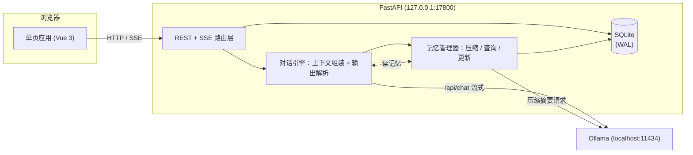
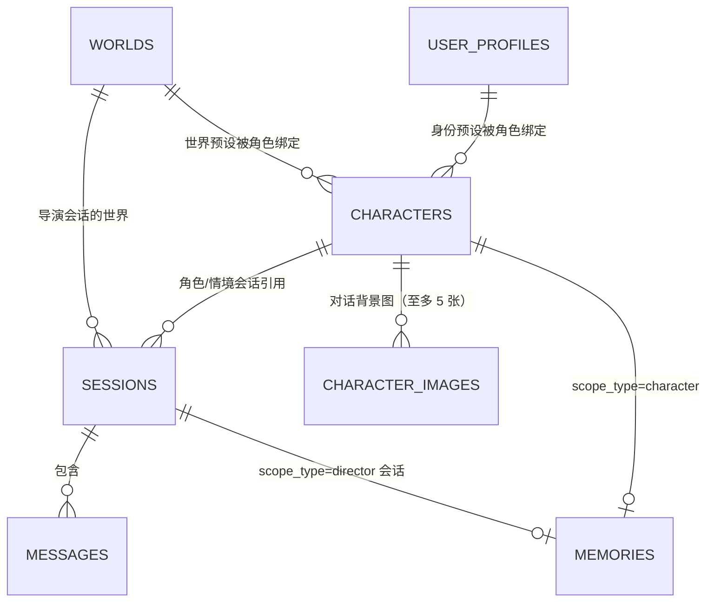

# 多模式对话机器人开发文档

基于本地 Ollama 的三模式对话应用：聊天 / 沉浸 / 导演。记录需求、数据模型、核心机制、API 与界面设计。**本文档只描述当前状态，不记录变更历史**；面向使用者的说明见 [README.md](./README.md)。

## 1. 项目概述

### 1.1 目标
- 对话生成全部走本机 Ollama，不依赖云端 API
- 三模式：**聊天**（扮演角色对话）、**沉浸**（角色 + 情境演绎）、**导演**（自由剧本生成）
- 记忆分两层：会话内消息历史（短期）+ 跨会话长期记忆（按角色或按会话绑定，自动压缩）
- 消息可编辑、删除、重新生成，用户完全掌控上下文
- 交付形态：本机运行（`start.bat` / `run.py`），**手机可走局域网用同一份网页端**（见 8.3）；同一份网页也有**电脑端外壳**（Electron，双击 `start_desktop.bat`，见 3.3）

### 1.2 运行环境

| 项 | 值 |
|---|---|
| 操作系统 | Windows 11（不做跨系统适配承诺） |
| 模型服务 | 本机 Ollama（默认 `http://localhost:11434`） |
| 后端 | Python 3.13（uv 管理）/ FastAPI / SQLite（WAL） |
| 前端 | Vue 3 + Vite（`frontend/` 源码 → `app/static/` 产物）/ 原生 CSS |
| 场景 | 单用户本地，无鉴权、无多用户并发 |

对话模型不与启动配置绑定：首次取 `config.yaml` 默认值，之后界面随时切换；思考型与非思考型模型均兼容（见 5.2、6.6）。

### 1.3 技术选型理由
- **FastAPI**：原生 async + StreamingResponse，SSE 简单；自动 OpenAPI 文档
- **SQLite + WAL**：单文件零部署，单用户无并发瓶颈，数据全本地
- **Vue 3 + Vite**：产物提交进仓库，离线可用、可模块化组织。代价是多一个 Node 工具链、改前端要多一步构建（`start.bat` / `start_desktop.bat` 检测到 Node 时顺手重建）
- **SSE 而非 WebSocket**：单向流（请求→生成流），SSE 足够且更简单

### 1.4 术语表
文档、代码、界面三处统一叫法。同形异义词单独标注。

| 名词 | 含义 | 代码对应 |
|---|---|---|
| 聊天 / 沉浸 / 导演模式 | 三种对话模式 | `sessions.mode` = `chat`/`immersive`/`director` |
| 角色 | 被扮演对象，可开多个会话 | `characters` |
| 会话 | 一段独立对话，创建时锁定模式 | `sessions` |
| 情境 / 话语 | 消息两部分：旁白情境、角色说的话；沉浸模式用户也能写情境 | `messages.scenario`/`content` |
| 生成要求 | 会话上的生成参数（含导演指令、发散程度） | `sessions.gen_settings` |
| 导演指令 | 仅沉浸模式，写剧情走向的持续要求 | `director_notes` |
| 发散程度 | 严谨/稳定/标准/放飞 → 采样温度 | `TEMPERATURE_LEVELS` |
| 我的设定 | 用户本人的名字/身份/外观/头像 | `user_profiles`（`id=1` 当前，`id>1` 预设） |
| 附加属性 | 角色动态状态（好感/心情…），随消息落库 | `characters.attr_defs` + `messages.attrs` |
| 世界设定 | 世界观（名称不进提示词） | `worlds`（`id=1` 当前，`id>1` 预设） |
| 角色/会话级记忆 | 前者按角色跨会话共享，后者仅导演内按会话独立 | `memories`（`character_id`/`session_id`） |
| 归档 | 已压缩进记忆、默认折叠的消息 | `messages.archived` |
| 角色生成：开放/探索 | 与三种模式无关：生成角色设定的方式，探索锁住三字段 | 生成请求 `mode`；`characters.locked` |
| 竖排图标栏 / 内容面板 | 右侧最右竖条图标（收起也常驻）/ 点图标滑出的五块内容 | `.panel-rail` / `.panel-box` |
| 右侧面板 | 图标栏 + 内容面板，点图标滑出/收起 | `.panel` |
| 左栏 / 右侧面板 | 左侧模式与会话列表 / 右侧五块设定 | `.sidebar` / `.panel` |

易混：**"探索"只用于角色生成方式**，非第四种模式；**"情境"是消息内容的一部分**，与"沉浸模式"不同义。

## 2. 需求定义

### 2.1 三种对话模式
| 维度 | 聊天 | 沉浸 | 导演 |
|---|---|---|---|
| 模式标识 | `chat` | `immersive` | `director` |
| 绑定角色 | 是 | 是（共用同一套角色） | 否 |
| 生成内容 | 仅角色话语 | 话语 + 情境 | 自由对话 + 情境 |
| 可配置项 | 角色设定 + 生成要求 | 生成要求 | 生成要求 |
| 生成要求字段 | 回复长度、主动性、发散程度 | 情境篇幅、推进速度、导演指令、发散程度 | 题材、文风、篇幅、情境台词配比、发散程度 |
| 长期记忆 | 按角色跨会话共享 | 与聊天共用 | 按会话独立 |

一致规则：
- 生成要求挂在**会话**上，改动只影响后续生成
- 沉浸输入区两栏：「情境说明」（可选）+「话语」（必填），两栏都进上下文；其余模式单输入框
- 聊天与沉浸对同角色共享设定与长期记忆
- 聊天与沉浸的**会话列表相互隔离**（`sessions.mode`），各自恢复到上次打开的会话（见 5.6）；角色设定与长期记忆仍共用
- 记忆隔离：角色 A/B 互不可见，导演各会话互不可见

### 2.2 角色设定
聊天与沉浸共用：

| 字段 | 说明 | 必填 |
|---|---|---|
| `name` | 角色名 | 是 |
| `appearance` / `personality` / `speech_style` / `backstory` | 外观 / 性格 / 语言风格 / 背景故事 | 否 |
| `avatar` | 自定义头像 data URL（jpg/png/webp） | 否 |
| `locked` | 探索模式：隐藏后三项；解锁后永久置 0 | 否 |

角色设定编辑立即生效。`avatar` 不进提示词，仅界面显示。

**`locked`（探索模式）**：`personality`/`speech_style`/`backstory` 在 `locked=1` 时**接口不下发**、`PUT` 忽略，但照常注入 system prompt。裁剪入口只有 `public_character()` 一处。

**头像存取**：选图浏览器内校验（MIME `image/*`、≤10MB、可解码、最短边 ≥256px、总像素 ≤4000 万）→ 裁剪弹窗取正方形 → 重编码 256×256 JPEG(0.85) → data URL，后端只存此串（上限 256KB 兜底）。校验放客户端而非靠后端报错，因为大小/分辨率只有拿到原文件才判得准；服务端保留白名单与长度兜底。校验失败就地显示（不依赖只会在会话打开时渲染的底部错误条）。

### 2.3 我的设定（用户本人）
表 `user_profiles`（`id=1` 当前、`id>1` 预设），表上**不能有 `CHECK(id=1)`**（预设要占 id>1）。

| 字段 | 说明 | 进提示词 |
|---|---|---|
| `name` / `identity` / `appearance` | 名字 / 身份 / 外观 | 是（聊天与沉浸） |
| `avatar` | 头像，同角色一套校验裁剪 | 否 |

面板表单永远等于当前设定（`id=1`）；预设是另存的一份。入口键常驻、不适用时置灰：**载入预设… / 编辑预设… / 存为预设**。
- 载入 = 立即写 `id=1`（非"只填表单还点保存"）；覆盖前若表单有改动先确认
- 删除收进编辑弹窗（面板不放开确认不可逆操作）
- 「载入」「编辑」两弹窗共用一套两栏骨架（左列表 40% + 右内容，620px）
- 删除预设时引用它的角色自动解绑（`delete_preset()` 把该列清 NULL，无级联）

**预设绑定角色，跟着角色走**：绑定记在 `characters.profile_id` → `user_profiles.id`（`NULL`=不绑定），一份预设可被多角色共用；改绑入口在「编辑角色」弹窗底部两项下拉。打开会话时按角色校准"当前使用的设定"：

| 角色绑定 | 校准结果 |
|---|---|
| 绑 P，当前非 P | 用 P 覆盖 `id=1`，当前预设记为 P |
| 绑 P，当前已 P | 不动（面板手改内容在同角色内保留） |
| 没绑，正用某预设 | 清空 `id=1`，"未选择" |
| 没绑，本来没用 | 不动 |
| 预设找不到 | 一律不动（宁可不切，不误清） |

校准只在**打开会话**与**改完角色设定**两处；**面板有未保存改动时一律不校准**（身份与世界同守卫）。锁定不影响绑定（锁的是隐藏设定）。导演模式不注入"我的设定"。

注入：system prompt 独立块 `# 与你对话的人`，紧跟角色设定后；三项全空整块不出现。

### 2.4 世界设定
与"我的设定"同模型：`worlds` `id=1` 当前、`id>1` 预设。注入位置在**角色设定之前**（世界是最外层框架）；导演模式也注入（世界与"我的设定"相反）。

| 字段 | 说明 | 进提示词 |
|---|---|---|
| `name` | 世界名称 | **否**（只做自己辨认） |
| `description` / `rules` | 描述 / 规则 | 是（三模式） |
| `terms` | 词库 JSON 数组（有序可增删） | 是（三模式） |

除名称外三项全空时整块不出现。**用哪份世界由绑定决定**：聊天/沉浸走 `characters.world_id`，导演走 `sessions.world_id`（新建会话时选，含"不用世界"）。打开会话校准规则同 2.3 那张表。后端只读 `worlds.id=1`（`read_world()`），"生效哪份"由前端开会话时搬进 `id=1`。删除世界预设时引用它的角色与导演会话一并解绑。

面板入口与"我的设定"对齐：一行"当前世界预设" + 三键；世界预设名称必填（列表靠它辨认），当前世界可留空。

### 2.5 系统生成要求
按模式分组的结构化 JSON，前端渲染表单，每字段映射为提示词自然语言。**例外 `temperature`（发散程度）**：非提示词内容，而是覆盖请求 `options.temperature`（`TEMPERATURE_LEVELS`：0.2/0.6/0.9/1.3，界面只显标签）。档位缺失或非法时保持 `config.yaml` 不动（无需迁移）。记忆压缩与会话命名固定压到 0.3（不要创作口味影响摘要）。`composition` 控制情境/台词配比，缺省 `balanced`。

**聊天**：`reply_length`（简短/适中/详细）、`proactive`（低/中/高）、`temperature`、`extra`。
**沉浸**：`scenario_length`（简短/适中/详细）、`pace`（平缓/适中/快速）、`temperature`、`director_notes`（导演指令，仅此模式保留，不进对话、只指导生成）、`extra`。
**导演**：`genre`、`style`、`length`（短/中/长）、`composition`、`temperature`、`extra`。

### 2.6 附加属性
角色动态状态（好感/心情…），用户自定义最多 8 条：

| 字段 | 说明 |
|---|---|
| `name` | 名称（必填） |
| `type` | （必选）`text` / `percent`（0–100） |
| `hint` | 取值参考（可选） |

定义存 `characters.attr_defs`（JSON，整体读写、有序）；值挂每条消息 `messages.attrs`（含 name/type，改定义删属性后历史仍能渲染）。界面上名称必填、类型必选：名称空行保存时丢弃，有名字没类型则挡下就地提示。模型每轮正文后输出 `[ATTR]` 块；**必须先整块摘掉再走 `[SCENARIO]`/`[DIALOG]` 解析**（否则"好感：42"被当台词）。只认定义里有的名字，百分比抠第一个数字夹到 0–100，认不出标记原样返回（宁可属性拿不到不吞正文）。

注入：紧跟记忆后、回复要求前的"角色当前状态"段；只注上一条消息的值（当前会话没有则退回该角色所有会话最近一条），定义每轮注入。展示：对话页顶部可收纳 sticky 浮层（`max-width: min(400px, 100%)`、字号 14px），标题"附加属性"居中、收起后是一颗向下 ∨ 图标；显示最近一条带属性的消息那份，百分比渲染进度条。属性值不进气泡（幕后状态，编辑时改）。

### 2.7 共通能力
1. 本地会话记忆：全部消息持久化，重开完整恢复
2. 编辑消息（含话语与情境；沉浸情境框恒可编辑，两框带标签）
3. 删除单条或级联删除某条及之后
4. 重新生成：assistant 替换式删 `id>=mid`；user 保留本条、只重做之后；角色已删除时不可用
5. 记忆自动压缩：超阈值归档早期消息为摘要，压缩后仍可查看/编辑
6. 停止生成：中断后已流出部分照常入库（见 5.5）
7. 会话标题自动命名（用户改名后不再覆盖，见 5.6）

### 2.8 非功能需求
- 流式输出；思考型模型正文流出前显示"思考中"占位，推理不进界面与记录
- 记忆压缩后台异步，不阻塞对话
- 所有本地数据路径直接指定，不用环境变量派生
- 界面中文

## 3. 总体架构

### 3.1 架构图


链路：POST 写 user → 组装 system prompt（角色设定+生成要求+长期记忆）+ 未归档历史 → 调 Ollama `/api/chat` 流式 SSE → 解析落库 assistant → 后台记忆检查/压缩。

### 3.2 Ollama 客户端封装
异步客户端（`app/ollama_client.py`）供对话与记忆压缩共用。`chat_stream()`：流式调用，兼容有无思考模式，`yield (kind, value)`（`("status","thinking"/"generating")` 或 `("delta",正文)`）；读超时不限、连接超时 10s（Ollama 未启动快速失败）。`chat_once()`：非流式，记忆压缩/命名/角色生成共用，返回前剥 ` thinking` 段；`fmt="json"` 时带 JSON 模式（角色生成用）。`ThinkFilter`：流式内联 ` thinking` 的 status filter。

启动自检在 lifespan：`list_models()` 校验当前模型是否安装，缺失则提示"所选模型未安装"；Ollama 不可达仅记警告不阻断。`model` 取自 `app_settings` 运行时设置（非模块常量）——切换只改一行数据库，下个请求即生效，无需重启。

### 3.3 桌面端外壳（Electron）

电脑端是**一个壳**，不是第二份应用：壳起后端、开窗口加载同一份网页，业务一行都没重写（`desktop/`，见 8.1）。

| 壳的职责 | 做法 |
|---|---|
| 起后端 | `spawn(.venv/Scripts/python.exe run.py --no-browser)`，`cwd` = 项目根；stdout/stderr 转进 `userData/desktop.log`；等 `GET /api/limits` 返回 200 再开窗口（端口已被别的实例占用也算就绪——和 `run.py` 同一套判断） |
| 开窗口 | `loadURL("http://127.0.0.1:17800/")`：**与浏览器里那份完全同一个页面**；外链走系统浏览器；菜单只留"视图 / 窗口"两项（刷新、手机视图、缩放、开发者工具） |
| 手机视图 | 把窗口缩到 **390×844**（`setContentSize`，顺便锁住拖动），页面按已有的 `≤640px` 断点自己变成手机单栏；进/出都通过 `desktop:phone-view` 事件告诉页面，页面据此**隐藏桌面专属键**；退出时恢复原窗口尺寸（记在 `userData/desktop.json`） |
| 单实例与退出 | `requestSingleInstanceLock()`：第二次双击只把已有窗口叫到前面；`before-quit` 杀掉后端子进程（后端是 `run.py` 自己开 uvicorn，一个进程，`kill()` 即可） |
| 局域网地址 | `os.networkInterfaces()` 挑一个真实 IPv4（优先 `192.168.`/`10.`/`172.16-31.`）拼成 `http://<IP>:17800` 给页面复制；**拿不到就显示"没取到局域网地址"**，不猜 |

**页面侧只有两样东西是"壳专属"**：顶栏的「配置」与「手机视图」两个键，靠 preload 注入的 `window.dshDesktop` 判定（`isDesktop`）——网页端与手机浏览器没有这个对象，于是它们根本不渲染（见 7.1）。
**"推送局域网"不走壳**：它是后端 `app_settings.lan_enabled`（默认关），页面上的开关就是 `PUT /api/settings`，立即生效、不重启后端（见 8.3）。壳只提供"地址"和"手机视图"这两件后端做不到的事。

**壳的日志与偏好**都在 `app.getPath("userData")`（Windows：`%APPDATA%\ollama-agent-desktop\`，目录名取自 `desktop/package.json` 的 `name`）：
- `desktop.log`：壳自己做的事以 `[desktop] 本地时间 …` 开头，**后端的 stdout/stderr 也一并混进来**（前缀 `后端:` / `后端(err):`）——所以窗口没开出来、或打开后一片空白时，原因（Python traceback、端口占用、Ollama 没起来）都在这一个文件里。窗口这一步单独留一行：加载成功记 `窗口已打开：<url>`，失败记 `页面加载失败：<错误码> <描述> <url>`——有它才能一眼分清"壳没起来"和"壳起了、页面没出来"。只追加、不轮转（一次启动几 KB，可忽略）。
- `desktop.json`：窗口尺寸与上次是不是手机视图。**自检（`--selftest`）刻意不写它**，否则"量一下尺寸"会把用户下次启动真的带进手机视图。

自检：`electron . --selftest` 起后端 + 开一个**隐藏窗口**跑关键路径（preload 桥接、手机视图是否真的把 `innerWidth` 缩进 640px），全程不弹窗，用于改完壳之后确认没坏。开发期复用项目 `.venv` 里的 Python；**打包分发**（PyInstaller 收后端 + 安装包）留到 v2，见 10.9。

**入口脚本 `start_desktop.bat`**（8.1）：先按与 `start.bat` 完全相同的判断重建一次前端（装了 Node 且 `frontend/node_modules` 在），再拉起 `electron.exe desktop`。窗口与它起的后端都挂在那个 cmd 窗口下，**关掉 cmd 窗口等于关掉应用**——所以它双击后"只有一行提示、看着像卡住"是正常的，界面窗口由 Electron 单独弹出。

### 3.4 启动流程与 Ollama 自启

`run.py` 的顺序：**留备份 → 探端口（已在监听就只开浏览器、不起第二个）→ 确保 Ollama 可用 → 开浏览器 → 起 uvicorn**。先确保 Ollama 再开浏览器是有意的：界面一加载就要拉模型列表，不等它就绪的话首屏会闪一句"无法连接 Ollama"。

确保 Ollama（`app/ollama_boot.py`）的规则——**只做"没在跑就顺手拉起来"**，已经跑着的（用户可能还在别的客户端用它）一律不动：

| 情形 | 结果 | 说明 |
|---|---|---|
| `/api/tags` 已能返回 200 | `running` | 什么都不做 |
| 没在跑、是本机地址、允许自启 | 起 `ollama serve` 并轮询到就绪 | 最多等 30s；起的进程 **DETACHED**，关掉应用不影响它 |
| 起了但 30s 没就绪 | `started-timeout` | 界面里仍会提示连不上，让人手动看一眼，而不是假装成功 |
| `ollama` 命令不存在 | `skipped-missing` | **不让启动失败**，提示装 Ollama（界面里也有同样的提示） |
| `base_url` 不在本机 | `skipped-remote` | 远端 Ollama 不是我们能启动的 |
| `ollama.auto_start: false` | `skipped-disabled` | 配置里关掉 |

**为什么放在 `run.py` 而不是各个 .bat 里**：桌面端外壳也是 spawn `run.py`，于是 bat / 命令行 / 桌面端三条入口共用同一份实现，行为不会走偏（日志在 bat 窗口与 `desktop.log` 里都能看到那一句）。

## 4. 数据模型

### 4.1 ER 关系


`memories` 按 scope 唯一单行滚动摘要。`user_profiles`/`worlds` 装"当前+预设"（表名复数）；外键入口是 `characters.profile_id`/`world_id`/`sessions.world_id`，一份预设可被多处引用。

### 4.2 表结构
```sql
characters(id, name, appearance, personality, speech_style, backstory, created_at, updated_at,
    avatar,              -- 头像 data URL；空串=姓名首字占位
    locked,              -- 1=探索模式，后三字段隐藏且不可改
    profile_id REFERENCES user_profiles(id),  -- 绑定的"我的设定"预设（NULL=不绑定）
    world_id REFERENCES worlds(id),           -- 绑定的世界预设（NULL=不绑定）
    attr_defs)           -- 附加属性定义 [{"name","type","hint"}]

user_profiles(id, name, identity, appearance, avatar, updated_at)  -- id=1 当前，id>1 预设

worlds(id, name, description, rules, terms, updated_at)  -- terms=[{"term","meaning"}] 有序

sessions(id, mode CHECK('chat','immersive','director'), character_id REFERENCES NULL,
    world_id,            -- 导演会话的世界预设
    title, title_auto,   -- title_auto=1 可自动命名，0=已手动命名
    gen_settings,        -- JSON，见 2.5
    created_at, updated_at)

messages(id, session_id FK CASCADE, role CHECK('user','assistant'), content,
    scenario,            -- 情境；两边都可能带
    attrs,               -- [{"name","type","value"}]
    archived,            -- 1=已压缩，不注入上下文
    edited, created_at)
CREATE INDEX idx_messages_session ON messages(session_id, id);

memories(id, scope_type CHECK('character','session'), scope_id, content,
    message_count, updated_at, UNIQUE(scope_type, scope_id))

app_settings(id CHECK(id=1), model, memory_model,       -- 单行表：运行时设置+界面偏好
    disable_thinking, updated_at)

character_images(id, character_id FK CASCADE, position, data, created_at)  -- 对话背景图
CREATE INDEX idx_character_images ON character_images(character_id, position, id);
```

关键设计：
- **`archived` 而非物理删除**：压缩后仍留库，前端折叠显示"已归档 N 条"，上下文跳过 `archived=1`
- **`scenario`/`content` 分列**：编辑、渲染、注入独立处理，不靠运行时解析
- **删角色**：`character_id` 置 NULL、记忆删除，会话保留（可看不可续，提示"角色已删除"）；不级联删会话
- **`app_settings` 单行表**存模型 + 界面偏好（`disable_thinking`）；`config.yaml` 仅初始化默认
- **`title_auto` 字段**而非比对标题字符串（用户可能真命名"新会话"）
- **词库用一列 JSON 而非单独词条表**：整体读写、有序、可增删，一次 UPDATE；解析失败退回空列表（不拖垮生成）
- **新功能优先开新表**：`CREATE TABLE IF NOT EXISTS` 对已有库也建表；**加列必须登记** `_COLUMN_MIGRATIONS`（幂等补上，漏登记=老库该列永远不存在），且只支持加列（改类型/删列/改约束要重建）
- **改表名登记** `_TABLE_RENAMES`，在建表脚本前跑（`user_profile→user_profiles`、`world→worlds`）；SQLite 会连带改写外键，`test_naming.py` 验证
- **`avatar` 存库而非文件**：备份/恢复=全部数据

### 4.3 长期记忆 scope 规则
| 会话模式 | 记忆 scope | 效果 |
|---|---|---|
| `chat` | `(character, character_id)` | 同角色所有会话共享 |
| `immersive` | `(character, character_id)` | 与聊天完全共用 |
| `director` | `(session, 会话 id)` | 每会话独立 |

隔离靠查询条件：只读当前 scope，其他记忆不进提示词。

## 5. 核心设计

### 5.1 上下文与提示词组装
消息序列固定三段：`[system]`（指令+世界+角色+我的设定+生成要求+长期记忆+角色状态+输出规则）→ `[历史]`（archived=0 按 id 升序，超上限截断最早）→ `[当前] user`。

附加属性状态块放记忆之后、回复要求之前（越靠后遵循越好）。三套 system prompt 模板（`app/prompts.py`）：
- 聊天：`# 世界设定` + `# 角色设定` + `# 你对这个用户的记忆` + `# 回复要求` + `# 输出规则`（只输出"说出口的话"，不写动作/心理/旁白，尤其不要括号）
- 沉浸：同上 + `# 导演指令`；输出严格 `[SCENARIO]…`、`[DIALOG]…` 两段，段首必须用这两个英文标记、不能写 `[SCENERY]`/中文标记，两段都要有内容
- 导演：`# 世界设定` + `# 本会话此前的剧情` + `# 生成要求` + `# 输出规则`（`[SCENARIO]`/`[DIALOG]` 每段以标记开头，段落数量/顺序不限，`[DIALOG]` 可选，配比由 `composition` 决定；刻意不给完整示例，避免被当段落模板）

`gen_settings_text` 由 JSON 拼接自然语言（每模式一个 render 函数）；取值一律 `.get(...,默认)` 兜底（旧值 KeyError）。字段定义集中在 `FIELDS`/`DEFAULT_SETTINGS`，经 `GET /api/gen-settings` 下发前端渲染，前端不硬编码。

历史注入：沉浸两侧都按原始标记回填（`[SCENARIO]…\n[DIALOG]…`），只有情境不补空 `[DIALOG]`；聊天/导演注入 `content`。

### 5.2 输出解析与思考模式兼容
解析前剥思考段（qwen3/deepseek-r1 等会在正文外生推理，污染标记结构）。两条路径叠加、不依赖 `think` 请求参数：
- **首选**：新版 Ollama 推理在独立 `thinking` 字段，`content` 只含正文，`chat_stream` 只转发 content，`thinking` 非空发"思考中"状态
- **兜底**：内联 ` thinking…response` 混在 content。非流式直接 `re.sub(r" thinking.*? response","",…)`；流式经 `ThinkFilter` 状态机（处理 chunk 边界拆碎的标签，`flush()` 只在非思考态放残尾）

标记用英文 `[SCENARIO]`/`[DIALOG]`（中英混合歧义最小），前端渲染时显示中文"情境"。**识别刻意宽容**（`app/parser.py`）：接受同义词（`SCENERY`/`SCENE`/`NARRATION`/`SETTING`/`CONTEXT`，`DIALOGUE`/`SPEECH`/`TALK`）、大小写任意、全角括号、标记外裸文本按话语算（模型常把台词写在标记前）、多情境段合并、空标记跳过。**是否降级只看"有没有出现标记"，不看切出的段落是否为空**（否则纯文本被误标 `MULTI`）。

容错：认不出标记不丢内容，整体降级为话语文本；落库 content/scenario 是干净文本（`director` 例外存原始全文，前端分段渲染）。沉浸允许"只有情境、没有台词"（`scenario` 非空即有效）。分段渲染在前端 `segmentsOf()`（同一正则 `SEGMENT_RE`），后端不在 SSE 附分段结果（同一份数据只在一处解析）。

流式渲染：思考内容在前端之前已被两层处理拦下，前端只收 `status` 的"思考中"与正文增量；`done` 后用解析结果替换渲染，避免流中解析抖动。

### 5.3 长期记忆注入与更新
- 注入：只读当前 scope 的 `memories.content` 进"记忆"段；无记录显示"（暂无，这是你们的初次交流）"
- 更新：唯一入口是 5.4 自动压缩与面板记忆区手动编辑；对话本身不实时写（避免每轮多一次 LLM 调用）
- 可见性：面板记忆区显示全文可编辑，下次生成即生效；标注已归档条数、更新时间、`compress_failed`

### 5.4 记忆自动压缩
**触发**：每次消息落库后（含停止保留的部分）统计未归档 `content` 总字符数，超 `compress_threshold_chars`（默认 20000）即触发；不阻塞 SSE，同 scope 有压缩在途跳过。
**流程**：锁最早 `archive_batch_size`（20）条未归档消息 → 组装压缩提示词调 `chat_once()`（压缩模型单独指定，默认同对话）→ UPSERT 写回 `memories`、`message_count` 累加、批次置 `archived=1`。失败则本次放弃、批次保持未归档下次重试，连续失败记日志并显示"上次压缩失败"。
**一致性**：已归档内容不因后续删改消息回滚；修正记忆走面板手动编辑。温度固定 0.3。

### 5.5 消息编辑、删除与重新生成
- **编辑**（`PUT /api/messages/{id}`）：更新 content/scenario，置 `edited=1`；`scenario` 用 `model_fields_set` 区分"不传=不改"与"显式 null=清空"（`COALESCE` 会让情境删不掉）。正文允许为空（"只有情境"形态）；但**正文与情境不能同时为空**否则 400
- **删除**（`DELETE ?cascade=`）：`false` 只删一条，`true` 删该条及之后
- **重新生成**（`POST .../regenerate`，SSE）：assistant/user 都可触发。**先 `load_generation_context()` 校验（角色未删、可生成），再删范围**——否则角色已删会先白删历史。assistant 删 `id>=mid`（替换式），user 删 `id>mid`（本条是上轮输入必须保留）；以剩余上下文重新生成，新 id 由 `done` 携带
- 前端两流程都乐观更新，被拒时回滚（`ssePost`/`api` 抛错带 `httpStatus`），回滚必须在 `endStream()` 后
- **停止生成**：输入框"发送"变"停止"，`AbortController` 中断 → 服务端在 `CancelledError` 分支把已流出部分照常落库，不发 `done`；前端短暂轮询同步。一个字符都没流出则不入库（只剩那条 user 消息，用户消息重新生成正是补救入口）

### 5.6 会话与模式规则
- 创建锁定 `mode`；`chat`/`immersive` 必须传 `character_id`
- 会话列表按模式隔离（`GET ?mode=`），兜底 `openSession()` 校验
- 各模式记住当前会话（`activeByMode`）；生成中禁止切模式
- 标题默认"新会话"；`title_auto=1` 时每轮生成后异步总结，成功后置 0；手动重命名也置 0，之后永不被覆盖。总结失败不置位，下轮重试
- 自动命名只喂**用户说过的话**（否则角色回复带长期记忆，会把旧记忆混进标题）；累计不足 `min_user_chars`（8）字先不命名；温度 0.3；返回过 `_clean()`（取首行、去前缀/引号/思考段/超长/首尾标点）

### 5.7 数据库备份
**为什么不能直接拷文件**：WAL 下未 checkpoint 的写入只在 `-wal`，拷主文件会丢最后一段、甚至读不出表结构。必须走 `Connection.backup()`（读当前已提交状态，应用运行中也能安全导出）。
**流程**（`app/backup.py`）：库不存在跳过 → backup() 写 `backups/xxx.tmp` → `PRAGMA quick_check`（不通过就删并记 error，绝不拿没校验过的冒充备份）→ journal_mode 改回 DELETE（去掉 `-wal`/`-shm` 边车）→ 改名 → 只留最近 `backup.days`（14）个自然日（含当天，删边车；名字不合约定的不参与清理）。触发在 `run.py` 起服务前、端口检查前（即便已有一实例也先备）。按**天数**非份数，基准取可解析日期最大值（CJK 排序坑）。失败仅记日志不阻断启动。目录默认 `./backups`，**刻意不放 `data/` 内**（删库手势会连备份一起删）。

### 5.8 对话区背景图
每角色至多 5 张，聊天/沉浸作对话区背景。单开 `character_images` 表：5 张、单张数百 KB，放角色表会让列表接口变每次几 MB，且不随列表/会话详情下发，按需拉取：
- `GET /api/characters/{id}/backgrounds` → `{images, max}`；`PUT` 整体替换（≤5 张，逐张校验）
- 整体替换而非逐张增删：前端按整体编辑、一次性提交；**新建角色时还没有 id**
- **必须暂存在表单里**（`charForm.backgrounds`）：面板角色设定整体提交，不带此字段一保存就清空（与头像同坑）；同步 `charSaved` 只改此项，不整体重拍快照

渲染：背景层在滚动容器外（滚消息时背景静止），`background-size: contain`+center，比例不合留白。底部发送键上方浮 `‹ n/总 ›` 胶囊（≥2 张出现），缩略图可拖动排序（HTML5 draggable，与 `‹/›` 共用 `moveBackground`）；第一张是默认显示；切哪张**不持久化**。拖拽状态字段不能用 `bgDragOver`（会盖住同名方法）。校验：MIME `image/*`、≤10MB、长边 ≥640px，等比缩到 ≤1920（只缩不放），重编码 JPEG(0.85)。

## 6. API 设计
除两个 SSE 端点外全返回 JSON；时间戳 ISO 8601 字符串。

### 6.1 角色管理
| 方法 | 路径 | 说明 |
|---|---|---|
| GET | `/api/characters` | 角色列表（含会话数）；锁定角色不含三隐藏字段 |
| POST | `/api/characters` | 创建 `{..., profile_id?, world_id?, draft_id?}`；带 draft 时锁不锁定由草稿决定 |
| POST | `/api/characters/generate` | 模型生成角色 `{hint?, mode=open/explore}`；探索只回姓名与外观。失败返回 502 |
| GET | `/api/characters/{id}` | 角色详情；锁定时不含隐藏字段 |
| PUT | `/api/characters/{id}` | 更新；**锁定时忽略**三字段；`profile_id`/`world_id`/`attr_defs` 用 `model_fields_set` 区分"没带=不改"与"显式 null/[]=清掉"；非法 id 400、非法类型 422 |
| POST | `/api/characters/{id}/unlock` | 永久取消锁定（单向），返回完整角色 |
| DELETE | `/api/characters/{id}` | 删角色（记忆删、会话保留失效、背景图标联删） |
| GET/PUT | `/api/characters/{id}/backgrounds` | 背景图读取 / 整体替换 |

### 6.2 会话管理
| 方法 | 路径 | 说明 |
|---|---|---|
| GET | `/api/sessions?mode=&character_id=` | 列表可过滤；前端必带 `mode`（会话隔离） |
| POST | `/api/sessions` | 创建 `{mode, character_id?, world_id?, title?, gen_settings?}`；title 空则标记可自动命名；world_id 仅导演有意义 |
| GET | `/api/sessions/{id}` | 详情（含 gen_settings、world_id、角色摘要） |
| PATCH | `/api/sessions/{id}` | 改标题/gen_settings/world_id；改标题置 `title_auto=0`；world_id 没带=不改、显式 null=不用世界 |
| DELETE | `/api/sessions/{id}` | 删除会话 |

### 6.3 消息与对话
| 方法 | 路径 | 说明 |
|---|---|---|
| GET | `/api/sessions/{id}/messages` | 全部消息（含归档，带 `archived`） |
| POST | `/api/sessions/{id}/chat` | 发送并生成，SSE。`{message, scenario?}`（scenario 沉浸可选，去空白为空存 NULL） |
| PUT | `/api/messages/{id}` | 编辑 `{content, scenario?, attrs?}`；attrs 没带=不改 |
| DELETE | `/api/messages/{id}?cascade=` | 删除 |
| POST | `/api/messages/{id}/regenerate` | 重新生成，SSE |

### 6.4 记忆
| 方法 | 路径 |
|---|---|
| GET/PUT | `/api/memories/character/{cid}`（角色记忆，手动编辑） |
| GET/PUT | `/api/memories/session/{sid}`（会话记忆 director） |

### 6.5 SSE 事件协议
`/chat` 与 `/regenerate` 共用：
```
event: meta   {"message_id"}                    # 仅 chat：user 已落库
event: status {"phase":"thinking"}              # 思考型推理中
event: status {"phase":"generating"}            # 正文开始流出
event: delta  {"text"}                          # 生成增量
event: done   {"message_id","content","scenario"}
event: error  {"message"}                       # 中断发送并结束流
```
状态判定在服务端（`chat_stream` 遇 thinking 发 `thinking`，首个增量发 `generating`）。错误恢复：生成中途异常发 `error` 并结束，user 消息保留、assistant 不落库；前端显示失败并提供重试（删掉那条 user 原样重发）。用户主动停止不算错误。

### 6.6 运行设置与模型
| 方法 | 路径 | 说明 |
|---|---|---|
| GET/PUT | `/api/settings` | 运行时设置 `{model, memory_model, disable_thinking}`；只在真要改模型名才查已安装列表（未装 400、连不上 502） |
| GET | `/api/models` | `/api/tags`×`/api/show` 并集得 `thinking` 标记 |
| GET | `/api/gen-settings` | 生成要求表单定义 `{fields, defaults}`，前端据此动态渲染 |
| GET/PUT | `/api/profile` | 我的设定（当前 id=1），整体覆盖保存 |
| GET/POST/PUT/DELETE | `/api/profile/presets[/{id}]` | 预设库；名字空 400；`id<=1` 404；删除解绑角色 |
| GET/PUT | `/api/world` | 当前世界（id=1），整体覆盖 |
| GET/POST/PUT/DELETE | `/api/world/presets[/{id}]` | 世界预设库；名字空 400；删除解绑角色与会话 |
| GET | `/api/limits` | 字数上限表（`LIMITS`），数字只写这一处 |

## 7. 前端设计

### 7.1 布局
三栏分离（左栏 | 对话区 | 右侧面板），两栏都可收起，对话与输入居中留白。
```
┌──────────┬──────────────────────────────────────┬──────────────┐
│模式Tab    │ [☰] 标题 [模式]  [搜索][模型][思考]   │  右侧面板    │
│(三模式)   ├──────────────────────────────────────┤  ·生成要求   │
│列表区     │        消息流居中留白                │  ·世界设定   │
│·角色/会话 │      (气泡 + 情境块)                 │  ·角色设定   │
│[新建]     │      [ 输入框 ] [发送][↓]            │  ·记忆查看   │
└──────────┴──────────────────────────────────────┴──────────────┘
   260px            上限 860px                    330px
```
- **三栏并排**（flex 固定宽项，非覆盖浮层），收起宽度过渡到 0
- **顶栏横跨"对话区+面板"**：`.main` 里 `.topbar` 再 `.work`（左 `.work-main`、右 `.panel`）。面板开合不影响顶栏宽度。代价（已接受）：面板展开时搜索/模型/思考在面板上方而非贴对话区右缘
- **居中留白**：对话与输入共用 `--chat-max:860px`、`margin:0 auto`，两侧留白对称
- **顶栏**：最左左栏收起钮；标题+模式标签；然后会话内搜索框、模型下拉、**思考开关**、**主题按钮**（☾/☀/◐ 循环，见 9.6）。搜索命中用 `<mark class="search-hit">` 标黄、当前处加 `.current`；计数/清空/↑↓ 始终占位（框宽不随输入变，无内容置灰）。**不做手填模型名**（拼错只得报错）。**无面板开关**——进出统一由右侧竖排图标栏负责。**桌面端（Electron 壳）里另有两个键**（`.desktop-btn`）：「配置」弹出 `.desktop-config` 小面板（推送局域网开关 + 局域网地址 + 复制 + 防火墙提示）、「手机视图」交给壳缩窗口；两者只在 `isDesktop && !desktopPhoneView` 时渲染，见 3.3
- **左栏（260px）**："模式选择"标题 + 三模式 Tab；hover/聚焦模式按钮浮出介绍（`.mode-tip`，**朝按钮行上方弹**——下方是会话列表，向下会遮住会话）。聊天/沉浸为"角色列表→会话"两级，导演直接会话列表。底按钮按模式新建
- **输入区**：沉浸分两栏——「情境说明（可选）」36% +「话语」（必填）；其余单输入框。Enter 发送、Shift+Enter 换行；话语空则发送禁用。&#8595; 键平滑滚回最新（scrolling）。导演模式发送列上方多"继续"键（自动发 `CONTINUE_PROMPT`="继续"、不清空输入框、发'有可续回复且未生成时置灰）
- **右侧面板 = 竖排图标栏 + 点击滑出的内容**：最右一竖条 `.panel-rail`（44px）**常驻**（收起也可见），五个图标（24px 线性 SVG，`v-hint` 页名 + `aria-label`）；点图标在该栏左侧滑出 `.panel-box`（330px）内容，再点当前图标收起（宽度过渡）。无标题行、无顶栏开关。哪页有未保存改动在图标右上角点小圆点（`.tab-dot`）。五个页：生成要求 / 世界设定（三模式都显示）/ 角色设定（仅聊天沉浸）/ 我的设定（仅聊天沉浸）/ 记忆查看编辑。底部统一「保存当前配置」+「未保存/还原」。切到无某页的会话由 `fixPanelTab()` 兜回"生成要求"。```.panel-body>*` 的 `flex:0 0 auto` 防记忆框被挤扁，`.panel-tab-pane` 内部自声明 flex column + gap:12px
- **字数提示**：输入框外层 `.counted`（relative），计数绝对定位右下角；单行 `.inline` 垂直居中，多行 `right:16px` 让开缩放柄。输入框让位：单行 `padding-right:64px`、多行 `padding-bottom:24px`（覆盖规则放样式表最后）。上限来自 `f.max`/`limits.xxx`
- **角色 "让模型生成"（`.gen-box`）**：仅新建时出现（编辑时再生成=换角色）。提示词输入 + 开放/探索单选 + 生成按钮（有草稿变"换一个"）；生成中禁用；改模式清草稿（探索草稿前端拿不到隐藏字段，不能互相顶替）。保存失败弹窗内就地提示（新建常无会话，底部错误条不可靠）
- **探索模式锁定占位（`.locked-box`）**：`locked` 时三字段完全不渲染，留"已锁定"说明 +「公开角色设定」按钮；解锁走 `ask()`，文案写明永久不可恢复。解锁成功同时写表单与快照
- **头像入口三处文案必须一样**："上传头像"/"更换头像"（`tests` 断言三处表达式相同，四汉字宽度不变不跳动）
- **角色新建/编辑弹窗**（`.modal.char-modal`，780px）：与消息编辑弹窗同宽，容纳生成区+头像+背景+五设定框；弹窗内 `.field` 单独给足高度（文本框 104px、背景 148px），仅作用于弹窗（面板窄栏不变）
- **编辑弹窗**（`.modal.edit-modal`，780px，`max-width: calc(100vw-40px)`）：遮罩+居中，两框最小 140px 自动撑高（上限 420 滚动）；Esc/遮罩取消。变体宽度写复合选择器（`.modal.edit-modal`），操作行按键 `flex:none`；`.modal-body` 内滚动、`.edit-actions` 钉底
- **角色弹窗背景（`.bg-pick`）**：缩略图行（92×62，拖动排序、左上序号、右上 ✕、底部 ‹/›）+ 虚线添加格（满则不显）；多选一次加多张，超出忽略并提示；批量时按钮"处理中…"并给主线程让位；缩略图 `` 必须 `draggable="false"`（否则原生拖拽接管指针）
- **预设绑定界面分两处**：改绑只在编辑角色弹窗底部两项 `.field-bind` 下拉；显示在两个预设弹窗（左列表第三行"角色：X、Y/未绑定"、右详情"绑定角色"）。两绑定字段只加 `charModal.form`，**不加进 `emptyCharForm()`**（面板 `charForm` 用同工厂，多 null=一保存就解绑）
- **两个预设弹窗是一套实现 + `kind` 派发**（`LoadPresetModal`/`PresetModal` + `PRESET_KINDS`）：列表/两栏/流程全共用，右侧按 kind 分支。词库编辑器抽成 `TermEditor.vue`
- **附加属性三处**：定义编辑在面板角色设定页（`AttrEditor.vue`，新加行不给默认类型）；顶部浮层 `AttrPanel.vue`（`position:sticky; top:0; z-index:300`，收起仅图标）；编辑消息弹窗内一节（百分比数字框、文字输入框，留空=没设置）。属性值不进气泡
- **头像裁剪弹窗**（`.crop-mask` 1200 > 遮罩 1000）：固定方形取景框（280px，`overflow:hidden`）+ 缩放滑杆 + 复位；`transform:translate()scale()`、`max-width:none` 必写、`touch-action:none`、`draggable=false`；取景框边界用 **2px outline**（`border-box` 会让 border 压尺寸，换算按 280px 算）；Esc 优先关它；仅取样小于输出边长时提示"可能偏糊"
- **消息区**：滚动容器外有背景层（`contain` 居中，滚消息背景不动）；有 ≥1 背景时底部中央浮胶囊 +「关闭背景」；聊天/沉浸两侧各有头像列（`.msg-side`+`.avatar.lg` 64px 方形），用户列只在设了名字或头像时渲染；气泡上方 `.msg-head`（说话人+时间，两侧镜像顺序）；气泡宽度由 `bubble-wrap` 单独约束（`min(80%,680px)`），内层只写 `max-width:100%`（两层都写会二次收缩）；**两侧同白底同边框**，只靠左右与下方缺角（`border-bottom-left/right-radius:4px`）区分；已归档折叠"已归档 N 条（已存入记忆）"
- **消息操作**：hover 显示操作条——复制/编辑/删除（单条或"此处之后"）/重新生成（都自带文字，不再加悬停提示）。删除选项用小菜单，点别处/Esc 关闭。角色已删除的会话只可查看（"重新生成"不渲染，输入框禁用）
- **面板"未保存"提示**：比对快照，有改动在图标右上点小圆点 + 面板底部"未保存"与「还原」键；只提示不弹窗拦截
- **移动端适配**（已实施，断点与触屏约定见 9.6）：三断点 `>900px` 桌面三栏 / `641–900px` 紧凑桌面（保留三栏，收紧顶栏）/ `≤640px` 手机单栏。手机断点全部规则收在一条 `@media (max-width: 640px)`：左侧栏 fixed 抽屉（汉堡滑出、遮罩关闭，进会话自动收回）、右侧面板变底部弹层（图标栏横排当标签，`onRailClick` 只切页；**打开入口是顶栏四宫格直达按钮** `toggleMobilePanel`，遮罩关闭；**无会话时点它不开遮罩**——面板 `v-if="activeSession"`，没会话点了只有空遮罩，直接 `flashHint` 提示；更多菜单不再放"面板"行）、顶栏仅留 汉堡/标题/放大镜(折叠搜索条)/面板/更多⋮(收纳模型/思考/主题)、沉浸输入上下堆叠、发送键 44px、**底部辅助内容（背景切换/继续/跳底/情境）统一收进「⋯」键**（`auxOpen` 状态 + `inputbar.aux-open` 类，桌面不收纳；收纳态输入区只留话语框＋发送键；情境无独立折叠）、**消息头像保留但缩到 40px**、**附加属性浮层展开态收拢**（字号/间距/条高收紧）、弹窗全屏、`.modal-body.preset-split` 上下堆叠。全局基础：`viewport-fit=cover` + `--sat/--sab` 安全区、`-webkit-text-size-adjust:100%` 禁聚焦放大、`overscroll-behavior:none`、`v-hint` 在 `pointer:coarse` 降级为点击显示。四个开合状态 `mobileSideOpen/mobilePanelOpen/mobileMoreOpen/mobileSearchOpen` 合成 `mobileMask`，`closeMobileLayers()` 一把全关；**遮罩必须 `position: fixed; inset: 0`**——否则它是文档流里 0 高的元素，真机点不到、抽屉与弹层关不掉

### 7.2 关键交互流
- **发送**：回车/点发送 → 立即渲染 user 气泡 → 建 SSE →（`thinking` 时"模型思考中…"占位）→ 逐段追加 → `done` 解析渲染、刷新归档折叠区（done 连带附加属性）。生成中变"停止"（`AbortController`，见 5.5）
- **重新生成**：点重新生成 → 确认提示（范围随 role）→ 本地先截断（user 留在列表）→ SSE 同上；被拒时重拉回滚
- **编辑**：点编辑 → 居中弹窗；沉浸**无论当前有无情境都给情境框**（补/清空）；两框带标签；聊天/沉浸还有附加属性节；保存 PUT，气泡带"已编辑"角标；遮罩/Esc 取消。`editingId` 定位
- **关弹窗**（七弹窗一致）：判据是 **mousedown 时鼠标就在遮罩上**（避免拖选误关）。共用 `composables/maskClose.js` 三件套
- **继续生成**（仅导演）：走与发送完全相同路径（`runSend()`），内容固定 `CONTINUE_PROMPT`；共用一条路径（停止/重试/回滚只一处实现）；不入参自输入框、不清空
- **新建会话**：聊天/沉浸弹「新会话」（选角色+可选标题）；**导演同样弹**（改选世界预设+可选标题）——建时就定世界，默认选中在用那条；建好后立刻打开（校准身份/世界）
- **切换会话**：面板保持展开，内容刷新为新会话，并按绑定校准
- **切换模式 Tab**：列表与当前会话一起换，恢复 `activeByMode`，无则清空对话区；生成中禁止切换；聊天/沉浸无角色时显示"创建第一个角色"引导

### 7.3 前端技术约定
- **Vue 3 + Vite**：源码 `frontend/`，`npm run build` 产物落 `app/static/`（提交进仓库，运行无需 Node；`start.bat` / `start_desktop.bat` 检测到 Node 顺手重建）
- **文件布局**：`src/store.js` 只是 barrel；逻辑按领域分 `store/` 下（`state`/`helpers`/`api`/`session`/`chat`/`search`/`panel`/`character`/`presets`/`attrs`/`ui`）；`composables/` 放无关具体界面的复用（`maskClose`/`hint`）；`App.vue` 只留布局骨架；`components/` 按区域分（含 `panes/`、`modals/`）
- **store 依赖星形**：各领域模块只 `import { store } from "./state.js"`，彼此不互相 import（结构上无循环依赖）；跨领域走 `store.xxx`。`let` 声明可变私有状态留在唯一使用它的模块
- **组件拿状态**：`import { store }`，`toRefs(store)` 暴露模板用到的成员（方法解构用 `const {...} = store`），模板保持裸名字，与单文件原文件逐字一致；漏声明=模板拿 undefined。`tests/test_app_js.py` 守卫"模板引用的 store 成员 ⊆ 声明过的绑定"
- **不用 Pinia**：单一 store + 组合式 API 够用
- **对话滚动**：`ChatArea.vue` 挂载时 `setChatBox(el)` 交给 store
- **样式全局一份**（`frontend/src/style.css`）：依赖源码顺序与跨上下文优先级，不拆 scoped
- **悬停提示走 `v-hint`**（`composables/hint.js`），全项目不用原生 `title`；指令只加监听不改 DOM 结构，浮层是 App.vue 单例
- **Vite 配置**：`build.outDir` 到 `../app/static` + `emptyOutDir`；`plugins:[vue()]`；显式 define 特性开关；**不需要** alias 到带编译器 vue（模板构建期编译）
- 无路由库；SSE 用 `fetch`+`ReadableStream` 手动解析 `text/event-stream`（`ssePost()`，原生 EventSource 不支持 POST）
- 状态 `{ mode, characters, sessions, activeSession, activeByMode, messages, streaming }`；三面板快照 `genSaved`/`charSaved`/`memorySaved` 判"未保存"

## 8. 目录结构与配置

### 8.1 目录结构
```
ollama_agent/
├── DEVELOPMENT.md / README.md / .gitignore / config.yaml
├── pyproject.toml / uv.lock        # uv 管理：fastapi/uvicorn/httpx/pyyaml
├── run.py                          # uv run run.py → 建库 → 确保 Ollama → uvicorn.run；起后开浏览器
│                                   #   --no-browser 给桌面端用；--lan/--no-lan 切"推送局域网"（8.3）
├── start.bat                       # 双击启动网页版（GBK 适配中文控制台；顺手重建前端）
├── start_desktop.bat               # 双击启动电脑端（Electron 外壳，3.3；同上重建前端）
├── app/
│   ├── main.py        # FastAPI 实例、静态托管、lifespan 自检
│   ├── config.py      # 配置加载合并
│   ├── database.py    # SQLite 连接、建表、老库改造（改名/补列）
│   ├── schemas.py     # Pydantic 模型
│   ├── ollama_client.py  # ThinkFilter/chat_stream/chat_once/list_models
│   ├── ollama_boot.py    # 启动时确保 Ollama 可用（没跑就拉起来，3.4）
│   ├── prompts.py     # 三模式 prompt 组装、gen_settings 渲染、字段定义
│   ├── parser.py      # 输出解析（5.2）
│   ├── memory.py      # 记忆查询/压缩/scope（5.4）
│   ├── naming.py      # 会话标题自动总结（5.6）
│   ├── character_gen.py  # 生成角色、草稿、探索锁定裁剪
│   ├── backup.py      # 在线备份（5.7）
│   ├── generation.py  # 生成主流程：组装→SSE→解析落库/停止保留
│   ├── net.py         # 来源地址判定（is_loopback）：局域网闸门与"只有本机能改开关"共用
│   ├── routes/        # characters/sessions/chat/messages/memories/profile/world/settings
│   └── static/        # **构建产物**（提交进仓库，不要手改）
├── desktop/            # 电脑端外壳（Electron，3.3）：main.js / preload.js / package.json
├── frontend/           # Vue 3 + Vite 源码
│   ├── index.html / package.json / vite.config.js
│   └── src/
│       ├── main.js / store.js / style.css
│       ├── store/（state/helpers/api/session/chat/search/panel/character/presets/attrs/ui）
│       ├── composables/（maskClose/hint）
│       ├── App.vue
│       └── components/（SideBar/TopBar/ChatArea/MessageItem/InputBar/Panel/
│                        TermEditor/AttrEditor/AttrPanel + panes/ + modals/）
├── tests/              # 见 9.8
└── data/chatbot.db     # SQLite（路径由 config.yaml 指定，不入版本库）
```
`frontend/node_modules`/`desktop/node_modules`/npm 缓存不入库；`app/static/` 产物要提交（没 Node 也能跑），源码改忘构建时 `tests/test_app_js.py` 拦截。`backups/` 同 `data/` 是运行时目录。

### 8.2 配置文件
```yaml
ollama:
  base_url: http://localhost:11434
  model: ""                       # 首次不预选；之后沿用上次选择
  auto_start: true                # 本机 Ollama 没在跑就顺手拉起来（3.4）；远端地址或 false 则不自启
  options: { temperature: 0.9, num_ctx: 32768 }  # 与 compress_threshold 配套
memory:
  model: ""                       # 压缩用模型，空=同对话模型
  compress_threshold_chars: 20000 # 未归档超该字符数触发压缩（中文约 1.33 字/token）
  archive_batch_size: 20
  max_memory_chars: 600
character_gen: { timeout: 600 }   # 生化角色设定等待上限
chat: { history_max_messages: 60 }# 注入历史最大条数
naming: { model: "", max_chars: 12, min_user_chars: 8 }
server: { host: 0.0.0.0, port: 17800, lan: false }
                                  # host=监听地址（0.0.0.0 对外开放；127.0.0.1 只本机）
                                  # lan=首次建库时"推送局域网"的默认值（默认关，之后以库为准，见 8.3）
backup: { dir: ./backups, days: 14, on_startup: true }
data_dir: ./data                  # 直接指定
```

### 8.3 局域网访问（手机用）

两件事要分开看：**端口是否对外开放**由 `server.host` 决定（重启生效），**是否放行局域网来源**由运行时开关 `app_settings.lan_enabled` 决定（立即生效，见 4.2 的补列登记）。

| 项 | 说明 |
|---|---|
| 监听 | `server.host` 默认 `0.0.0.0`（所有网卡都听）；想彻底不对外就改 `127.0.0.1`，**改完重启** |
| 推送开关 | `lan_enabled`，**默认关**（新库、老库补列都关）：关着时非本机来源一律 **403**，本机永远放行 |
| 闸门位置 | `app/main.py` 的 `lan_gate` 中间件按 `app/net.py is_loopback()` 判来源。**放应用层而不是改监听地址重启**：桌面端的按钮要能立即开关，重启后端会打断正在进行的生成 |
| 403 的样子 | `/api/*` 回 JSON（前端好提示），页面请求回一段人话——手机浏览器直接打开时看到"电脑端当前没有开启局域网访问"比一串 JSON 明白 |
| 怎么开关 | ① 桌面端顶栏「配置」（见 3.3）；② `run.py --lan` / `--no-lan`（命令行用户的路径）；③ `PUT /api/settings {"lan_enabled": …}`——**只有本机来源能改**（手机端改不了这道闸门） |
| 首次默认 | `config.yaml` 的 `server.lan`（默认 `false`）只在**首次建库**时写进库；之后以库为准（与模型选择同一条约定） |
| 防火墙 | Windows 需放行入站 TCP 17800：`netsh advfirewall firewall add rule name="OllamaAgent 局域网访问 17800" dir=in action=allow protocol=TCP localport=17800`（收回：`… delete rule name="…"`）。**这条规则不在代码里**，换机器/重装系统要重加；桌面端的「配置」面板会提示它 |
| 手机访问 | 同一 WiFi → 手机浏览器打开 `http://<电脑局域网IP>:17800`（IP 用 `ipconfig` 查；桌面端「配置」面板直接给出并可复制）。后端是同一份：会话、角色、设置在手机与电脑上是同一套数据，页面也就是同一份（手机按 ≤640px 断点走单栏，见 7.1） |
| 安全 | **应用没有账号体系**：开关打开时，能连到这个端口的人都能读写你的会话。只在可信的家庭/办公网络开启，公共 WiFi 建议关掉（一键，不用重启） |

## 9. 开发约定与强调
跨功能、且违反代价明显的约定；功能自身取舍写在对应章节。

### 9.1 文档与命名
- 本文档**只描述当前状态**，不追加变更历史/阶段划分/决策编号（查"为什么"用 git）
- 名词以术语表为准，代码/界面/文档三处一致；新名词先登记再使用
- **改名要成套改**（key/约束/函数/界面/测试/文档），改完 grep 确认零残留，逐案确认同形异义词没误伤
- **不留兼容代码**：开发阶段不做数据迁移分支；结构变了写一次性脚本改库（跑完即删）或删 `data/` 重建

### 9.2 单一数据源
- 字数上限只在 `app/limits.py` 的 `LIMITS`（后端校验 + `/api/limits` 下发，前端不另写）
- 生成要求字段只在 `prompts.py` 的 `FIELDS`/`DEFAULT_SETTINGS`
- 模式定义只在前端 `store/helpers.js` 的 `MODES`（后端只认 key）
- 提示词段落名与文档、代码一致
- **"不传=不改"靠 `model_fields_set`** 区分"没带"与"显式 null"：整体提交表单（如面板角色设定无 `profile_id`/`world_id`）若把"没带"当 None，一保存就解绑（见 6.1、6.2）

### 9.3 数据与兼容
- **加表可以、加列要登记** `_COLUMN_MIGRATIONS`（只支持加列；改类型/删列/改约束重建）
- **改表名登记** `_TABLE_RENAMES`（在建表脚本前跑）；SQLite 连带改写外键，**必须有用例盯着**（指向不存在表时不报错、写入时才炸）
- **改约束重建表**："建新表→INSERT…SELECT→DROP→RENAME"，在 `PRAGMA foreign_keys=OFF` 单事务完成，完后 `foreign_key_check`
- **库文件丢失自愈**：`ensure_db()` 每次 connect 前检查，缺失或 0 字节重建（含单行表初始行）
- 偏好与设置同表 `app_settings`；`config.yaml` 仅是初始默认，运行以数据库为准
- 备份见 5.7（启动备一份、quick_check 通过才算、留 `backup.days` 天、恢复步骤在 README）

### 9.4 容错与错误提示
- 初始化分步容错：每步 `try/catch`，失败攒起来一次性显示，任何一步失败不带走其余
- 错误就地显示：弹窗内/侧栏操作不依赖底部错误条（只在会话打开时渲染）
- **先校验、后改数据**（重新生成先校验再删旧消息）
- 失败说人话：超时给等待上限与可采动作，异常消息空则回落异常类名
- 停止生成保留已产内容，不丢弃（代价是多一次同步，已接受）

### 9.5 提示词与解析
- 提示词分块拼装，**空块整块不出现**（不给空标签或"（未设定）"占位）
- 输出解析要宽容；**是否降级只看"有没有出现标记"**（非段落是否为空）
- `[ATTR]` 块必须在正文解析**之前**整块摘掉（否则"好感：42"当台词）；只认定义里的名字
- 思考内容在应用层剥离，不靠模型配合；思考开关只发 `think:false`（非思考型收 false 无害、收 true 400），要"开"就不传
- 模型输出**永不当 HTML**（不用 `v-html`），搜索标黄走分块渲染
- 图片一律浏览器校验+固定重编码，入库永远是自己编码的位图；服务端白名单+长度兜底
- **记忆阈值与 `num_ctx` 必须配套改**（32768/20000），只改一个会静默截断；压缩与命名固定低温度

### 9.6 界面约定
- **主题色板集中 `:root`**，浅色默认、深色 `html[data-theme="dark"]` 覆盖；新增颜色只动两处变量块，禁止散落写死。**主题可自助切换**：顶栏一个按钮在「跟随系统→浅色→深色」循环（`store/ui.js` `setTheme`），选择存 localStorage；`initTheme()` 入口 mount 前按本地/系统定 `data-theme`（首屏无闪烁）；`auto` 下系统偏好变化即时跟随。`.rail-btn` 选中态在深色改由 `--field` 底+`--accent` 边框
- **控件外框尺寸不随状态变化**：常驻或预留等宽占位（搜索计数、跳转键、图标栏未保存小点）
- **关键键位置固定**：`.panel-rail` 坐标不随面板开合/有无会话变（顶层一竖条常驻）
- **"滚不走"的部分移出滚动容器**，不用 sticky（会从背后穿过、仍占 scrollHeight）
- **点遮罩关闭以"按下"位置为准**（`@mousedown`，防拖选误关），七弹窗统一走 maskClose.js
- **浮层层级**：弹窗遮罩 1000 < 裁剪遮罩 1200 < 确认框 1400 < 提示 1500；**桌面端「配置」小面板 600**（高于消息与属性浮层 300、低于弹窗）。**确认框必须最高**（可从任何弹窗弹出）；同时根组件里排在最后（同级按 DOM 顺序决胜，双保险）
- **悬停提示统一 `v-hint`** 不用原生 title（延迟/样式/换行差）；纯图标按钮另加 `aria-label`。浮层坐标不用 transform、必给 `width:max-content`（否则靠右时挤成竖排）
- **浮层不占布局、不吃鼠标**（`absolute/fixed`+`pointer-events:none`）
- **弹窗操作行钉底**（`.modal-body` 滚动）；变体宽度/布局**兼容性按源码顺序决胜**——写复合选择器（`.modal.edit-modal` / `.modal.preset-modal` / `.modal-body.preset-split`，踩过三次）
- **未保存用标识提示**（图标小点+底部"未保存/还原"），不弹窗拦截；还原两次点击确认
- **响应式只走 `@media` + CSS 变量，断点固定三档**（`>900` 桌面 / `641–900` 紧凑桌面 / `≤640` 手机）：**桌面样式一行不改**，手机规则全部收在一条 `@media (max-width: 640px)` 里便于维护；手机布局不新建组件，只在现有 `SideBar/Panel/TopBar/InputBar` 上加 class 与盖层（见 7.1）
- **触屏优先**：可点元素热区 ≥44px；**hover 类提示在 `pointer: coarse` 下降级为点击显示**（`v-hint` 与 `.mode-tip`）——手机上没有 hover，不改就等于没有提示；`viewport-fit=cover` + `env(safe-area-inset-*)` 避开刘海与底部横条，`-webkit-text-size-adjust:100%` 禁聚焦放大
- **移动端盖层必须 `position: fixed; inset: 0`**：文档流里的遮罩是 0 高元素，真机点不到、抽屉与底部弹层关不掉（踩过）
- 文案与布局改动要过真实渲染验证（字号/宽度/按钮挤压读代码看不出来）

### 9.7 前端工程约定
- 样式全局一份，不拆 scoped（依赖顺序与优先级）
- 单一 store + 组合式 API（不引 Pinia）；domain modules 星形依赖
- 组件 `toRefs` 暴露模板用到的成员，模板裸名字；引用必须声明过（否则"点着没反应"）
- 一个组件做一件事：收单条数据的组件不再遍历整份列表（防 n²）
- 源码 `frontend/`、产物提交 `app/static/`：改源码必须 `npm run build`，产物别手改

### 9.8 测试与验证
- **清单**：12 个纯 Python + 3 个 Node（`test_search.mjs`/`test_init.mjs`/`test_mask_close.mjs`，需先装前端依赖）；纯前端逻辑用 Node 直连 store 断言，不开浏览器
- **结构性事实用静态守卫**（`test_app_js.py`）：组件绑定、模块级名字来源、消息归属、弹窗关闭判定、模式介绍浮层、字数上限一致、产物存在被引用、移动端断点与触屏约定、桌面壳专属键的出现条件；新结构约定顺手补断言
- **后端"闸门/边界"用 TestClient 扮演不同来源**（`test_lan_gate.py`）：`TestClient(app)` 默认来源不是回环，天然就是"局域网来客"，`client=("127.0.0.1", …)` 才是本机——网络来源相关的规则都照这个套路测
- **壳（Electron）用自带的自检**：`electron . --selftest` 起后端 + 开隐藏窗口，验证 preload 桥接与"手机视图真的把页面缩进 640px"，全程不弹窗
- **守卫反向验证**：故意删被保护的东西确认报红（"碰巧通过"≠"抓得住"）
- 界面改动要真渲染证据：dev（Vue 警告开）+ 生产产物各跑一遍，控制台零 warning/error；涉及函数名/导入/绑定**只跑构建会漏**
- 探针：`MutationObserver` 挂载（`--virtual-time-budget` 下定时器抢跑）；每步等状态稳定；收尾只执行一次（否则不空闲、浏览器不退）；查倍数用"接口条数−DOM 数"
- 环境：Windows 控制台 GBK，别打印 `✕` `‹` `›`；沙箱 Vite 构建/npm install（缓存放工作区）/headless Chrome 需放宽权限
- **只杀自己启动的浏览器**：探针 `Start-Process -PassThru` 拿 PID、`-Wait` 等退出，清理只 `taskkill /PID /T`；**绝不按进程名/启动时间筛 chrome**（会连用户浏览器渲染进程一起杀）
- 改后端要重启应用（无 `--reload`）；改前端重新构建 + 刷新

## 10. 开放问题
1. **重新生成多版本分支**：当前替换式；保留旧生成可切换需消息表改树结构 + 版本切换界面，有强需求再做
2. **记忆重建**：按未归档+已归档全量重算记忆的维护功能，视使用频率
3. **会话导出**：Markdown/JSON，未在范围
4. **重新生成在生成阶段失败时原消息不可恢复**：需把删除推迟到成功之后，视实际频率
5. **探索草稿存内存**：刷新/重启即丢，需重生成；可落草稿表或 localStorage，当前不值得
6. **锁定字段无"部分公开"**：要么全锁要么全公开；需要则把 `locked` 改按字段记录
7. **词库不能拖拽调序**：目前只能增删（顺序即添加序）；可照背景图拖拽加一遍，存储已是数组
8. **一次会话只能绑一份世界**：导演会话各自一份，聊天/沉浸同角色仅一份（跟角色走）；若要角色在不同会话处于不同世界，需把绑定从角色挪到会话（`sessions.world_id` 列与接口已备，缺的是聊天/沉浸带上它）
9. **电脑端打包**：Electron 外壳 v1 已能用（复用项目 `.venv` 的 Python，见 3.3 / 10.9 与 8.1），**待做的是打包分发**：PyInstaller 把后端收成 exe（带 `app/`、`app/static/`），electron-builder 出安装包 + 免安装版，首启把 `config.yaml` 写到 `userData`——这样别人的机器上不必装 Python 与 uv。同时值得顺手做的还有：桌面端「配置」里**一键添加防火墙规则**（要管理员，做成"复制命令"或提权二选一）、Ollama 未安装时的引导、以及最小化到托盘
10. **应用名不统一**：网页标签页（`frontend/index.html` 的 `<title>`）是「多模式对话助手」，而 README / DEVELOPMENT 的标题与 `desktop/main.js` 里的窗口标题写的是「多模式对话机器人」。窗口标题实际跟随网页（Electron 默认让 `document.title` 覆盖 `BrowserWindow` 的 `title`），所以 `main.js` 那行目前是失效的。**名字定下来后一起改**（含两份文档的标题），暂不动