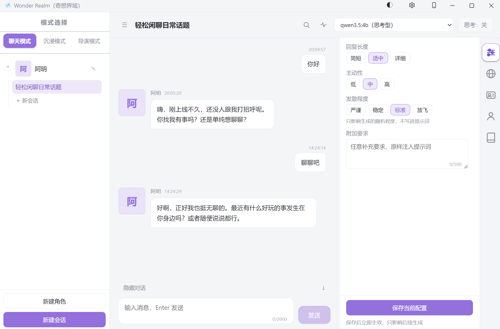
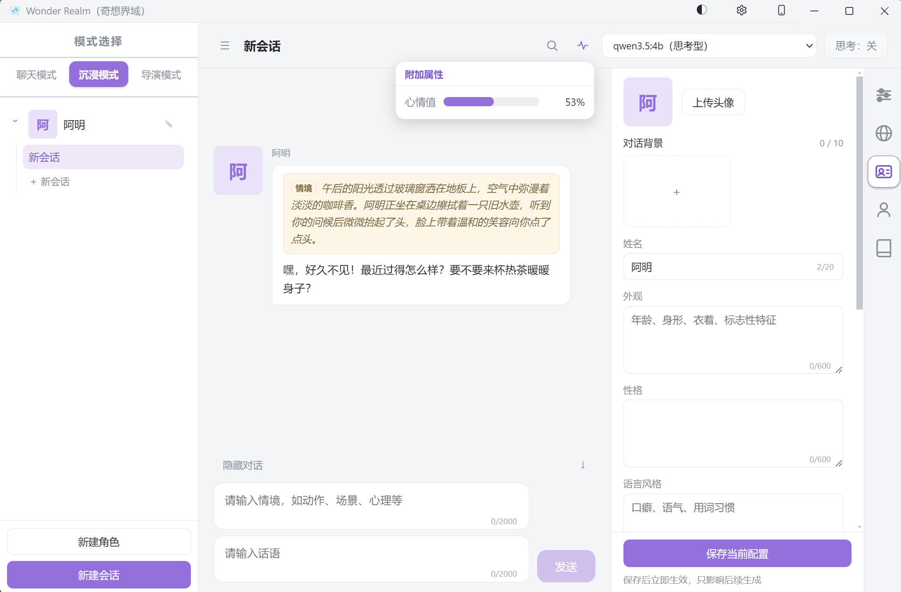
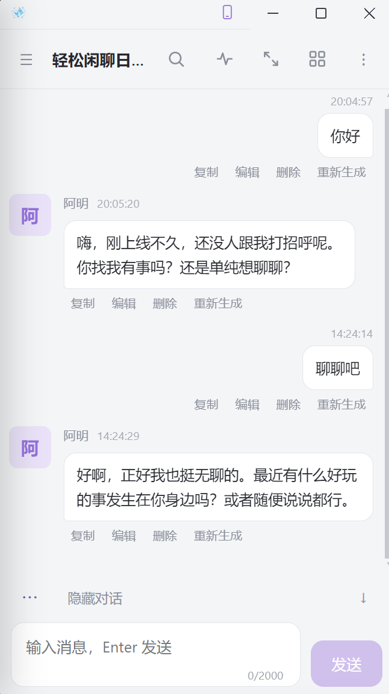

<div align="center">
  
  <h1>Wonder Realm（奇想界域）</h1>
  <p><b>跑在你自己电脑上的 AI 角色扮演与互动小说应用</b><br>
  模型走本机 Ollama，数据存在本地数据库 —— 不联网、不上传、断网照常用。</p>
  <p>
    
    
    
    
  </p>
</div>

---

## 这是什么

一个本地运行的角色扮演 / 互动小说应用。你定义角色与世界，用三种方式跟它们对话，它会记住发生过的故事。

- **完全本地**：模型由本机 [Ollama](https://ollama.com/download) 提供，会话、记忆、头像、背景图全部存在本地数据库里，不经过任何服务器。
- **三种模式**：聊天（只说话）、沉浸（情境 + 话语）、导演（自由写剧情）。
- **三层设定**：角色、世界、以及"你是谁"。世界与"我的设定"可以存成预设，一份预设绑给多个角色共用。
- **长期记忆**：对话变长后自动把早期内容压成摘要，跨会话记得住；摘要可以自己查看和修改。
- **电脑 + 手机**：电脑端是完整窗口应用；手机连同一个 WiFi 就能用同一份数据（内置二维码与访问码）。

## 界面

<p align="center">
  
  
</p>
<p align="center"><sub>左：聊天模式与「生成要求」面板　·　右：沉浸模式（情境 + 台词）与「角色设定」，顶栏小窗是附加属性</sub></p>

<p align="center">
  
</p>
<p align="center"><sub>手机浏览器打开同一个地址就是同一份数据，布局自动变成单栏</sub></p>

## 下载与安装

到本仓库的 **Releases** 页面下载任意一个（都不需要装 Python 或 Node）：

| 文件 | 适合谁 | 怎么用 |
|---|---|---|
| `Wonder-Realm-Setup-1.0.0.exe` | 长期使用（推荐） | 双击安装，可自选安装目录；装完从开始菜单或桌面快捷方式启动；在"应用和功能"里可正常卸载 |
| `Wonder-Realm-1.0.0-x64.zip` | 便携 / 放 U 盘 / 不想写注册表 | 解压到任意目录，双击里面的 `Wonder Realm.exe` |

### 1. 先装 Ollama 并准备一个模型

从 [ollama.com/download](https://ollama.com/download) 安装 Ollama，然后拉一个模型先跑通：

```powershell
ollama pull qwen2.5:3b
```

小模型响应快，适合先熟悉界面；想要更好的文笔和人物刻画，换成更大的角色扮演类模型即可（应用里列出的就是你本机 `ollama list` 装过的那些）。**不用特意先把 Ollama 打开**——启动应用时它会自动检测，没在运行就帮你拉起来。

### 2. 启动

双击桌面（或开始菜单）里的 **Wonder Realm**。首次运行 Windows 会提示"未知发布者"（本应用没有购买代码签名证书），选择**仍要运行**即可。

### 3. 第一次使用

1. 顶栏下拉框里选一个模型（只会列出你本机已有的）。
2. 聊天或沉浸模式里点「新建角色」，自己填，或写一句描述让模型生成。
3. 点「新建会话」开始对话；想自己写剧本就切到导演模式。

> 顶栏那个「思考」开关：思考型模型（如 qwen3、deepseek-r1 系列）回答质量更好但更慢，关掉能明显加快。

## 三种模式

| 模式 | 谁会说话 | 适合什么 |
|---|---|---|
| **聊天模式** | 只有角色说出的话，像发短信，没有动作与旁白 | 轻松日常的对话 |
| **沉浸模式** | 角色的情境（场景、动作、心理）+ 话语；情境你也能写，两框**至少填一个**就能发出 | 有画面感的互动 |
| **导演模式** | 自由生成的对话与情境，不绑定角色 | 你自己写剧本 |

聊天与沉浸**共用角色**：同一个角色的性格、说话方式与长期记忆两边一致，在哪边聊过的事另一边都记得；但两边的**会话列表各自独立**，切回模式时会回到你上次在看的那条。导演模式没有角色，故事与记忆按会话单独保存。

## 角色、世界与我的设定

**角色设定**：头像、外观、性格、语言风格、背景故事，随时可改，下一次生成就生效。也可以让模型替你写，不满意点「换一个」重来：

- **开放模式**：五项设定直接展示，随便改。
- **探索模式**：只公开姓名与外观，性格、语言风格、背景故事上锁 —— 它们照常生效、会体现在对话里，但你得聊着慢慢了解。想直接看就点「公开角色设定」，确认后**永久**解锁。

**世界设定**：名称（只给自己辨认）、描述、规则、词库。用哪份世界由绑定决定：聊天与沉浸跟着角色走，**导演模式每个会话各带一份**（新建会话时选，默认"不用世界"）。

**我的设定（你是谁）**：**名字**只给自己看（面板与列表里靠它辨认），**称呼**是模型怎么称呼你；加上身份、外观与头像。称呼、身份、外观会写进聊天与沉浸模式的提示词，让角色知道在跟谁说话。导演模式不使用它 —— 那里你是写故事的人，不是故事里的角色。

**预设与绑定**：右侧面板的「世界设定」「我的设定」两页是**只读**的，显示的就是当前绑定的那条预设：

- 改内容 →「编辑预设」；新建 → 同一个窗口里点「＋ 添加预设」（**必须填名字**才能保存）；删除也在这里。
- 启用或换一份 →「选择预设」/「更换预设」；不想用了 →「解除绑定」（解除后不再写进提示词）。
- **新角色默认不启用**，绑定之后才生效；一份预设可以同时给多个角色用，改绑不影响别的角色。
- 面板与两个编辑弹窗底部都有「未保存 / 还原」，改动不会悄悄丢掉。

## 记忆与附加属性

**长期记忆**：对话累积到一定长度后，应用在后台把较早的消息压成一份结构化摘要，不打断对话、也不需要你操作。摘要会交给后续生成，可以在右侧「记忆」里查看和手改；较早的消息折叠成"已归档 N 条"，点开仍能看原文。

**附加属性**：给角色定义几条会随剧情变化的状态，比如好感、心情、健康状况。每条要有名称和类型 —— 文字型记一句话（"有点紧张"），百分比型记 0–100 的数，还能写一句解释告诉模型它是什么意思。定义好之后模型每轮都会更新这些值，点顶栏那颗心跳线图标就能看到：文字直接显示，百分比显示成进度条。它跟着消息保存，想改就编辑那条消息。

## 手机与局域网

手机上用的是同一个界面、同一份数据，电脑只是提供服务。

1. 电脑与手机连**同一个 WiFi**。
2. 电脑端点标题栏的 **⚙ 配置** → 打开「推送局域网」（**每次启动都是关闭状态**，这是安全默认值）。
3. 打开后配置面板里会出现**二维码与访问码**：手机扫码即可；扫不了就打开 `http://<电脑IP>:17800`，输入那 8 位访问码。**进去一次之后这台手机会被记住**，不用反复输。

不想让手机访问就把开关关掉，立即生效（访问码一并作废）。面板里的「重新生成」会换一个新访问码，先前连上的设备要重新扫。

**安全须知**：开着时只有带对访问码的设备能读写你的会话；访问码等于钥匙，不要发给别人。传输是明文 HTTP，同一 WiFi 下抓包仍可能拿到访问码 —— **只在可信的家庭或办公网络开启，公共 WiFi 请关掉**（关掉后连到这台电脑的局域网设备一律被拒，本机不受影响）。

连不上时先看防火墙。用**管理员** PowerShell 执行一次，放行入站 TCP 17800：

```powershell
netsh advfirewall firewall add rule name="Wonder Realm 局域网访问 17800" dir=in action=allow protocol=TCP localport=17800
```

## 数据、备份与迁移

所有内容都在一个数据库文件里（角色、会话、消息、记忆、头像与背景图）。装的版本不同，位置不同：

| 版本 | 数据位置 |
|---|---|
| 安装版 / 免安装版 | `%APPDATA%\wonder-realm-desktop\`（`config.yaml` 配置、`data\chatbot.db` 数据库、`backups\` 备份） |
| 从源码运行 | 项目目录下的 `data\` |

- **自动备份**：每次启动都会备份一份到 `backups\`（`chatbot-<时间戳>.db`），**保留最近 7 天**。
- **手动备份**：点电脑端 ⚙ 配置里的「手动备份」（手机端在顶栏 ⋮ 菜单里），写出的 `manual-<时间戳>.db` **不会被自动清理**，不要了自己在 `backups\` 里删。
- **换机器 / 迁移**：**先关掉应用**，把 `chatbot.db` 复制到新机器的同名目录即可。不要在应用运行时手工复制数据库文件。
- **彻底清除**：关掉应用，删掉 `%APPDATA%\wonder-realm-desktop\`；安装版再从"应用和功能"里卸载。

## 常用操作

- **会话内搜索**：点顶栏放大镜，输入即把所有命中处标黄，↑/↓ 在命中之间跳转，Esc 清空。
- **消息**：复制、编辑、删除（单条或"此处之后"）、重新生成（可以只重做角色那一句）；生成中途可**停止**，已经生成的部分会保留。
- **停止所有生成**：电脑端在 ⚙ 配置里，手机端在顶栏 ⋮ 菜单里 —— 多开窗口或手机电脑同时用时一次全停。
- **对话背景**：每个角色最多 10 张背景图，在对话区底部切换，也能一键暂时关闭。
- **自动命名**：新建会话时标题可以留空，角色回复过之后自动总结一个；手动改过名的不会再被覆盖。
- **主题**：跟随系统 / 浅色 / 深色，点标题栏（浏览器里是顶栏）的圆形按钮循环切换。
- **手机视图（电脑端）**：标题栏那颗手机图标把窗口收成 375×667 的手机比例，用来预览窄屏效果；期间窗口置顶，退出后回到桌面尺寸。
- **全屏**：手机浏览器用顶栏的全屏键，沉浸阅读时更清爽。
- **字数上限**：每个输入框右下角实时显示"已用 / 上限"，到上限就打不进更多字（消息与情境为 2000 字）。

## 常见问题

**界面提示"Ollama 中还没有可用模型"，但我明明装了模型**
多半是模型目录不对：Ollama 装在别的盘时，模型在它旁边的 `models\` 里，而默认的 `%USERPROFILE%\.ollama\models` 是空的。用 `ollama list` 看当前服务能列出几个模型；手动起服务时先设 `OLLAMA_MODELS` 指向真正的目录。

**提示"无法连接 Ollama"**
先等几秒再点提示旁边的「重试」（它会再确保一次 Ollama）。仍不行就执行 `ollama list` 看命令行是否可用；如果报"端口被占着却连不上"，从托盘退出 Ollama 再重新打开。

**17800 端口被占用，或改了端口后打不开**
端口写在数据目录的 `config.yaml`（`server.port`，默认 17800），改完重启应用；换了端口就用新地址访问，旧书签会连不上。

**手机上一直让输访问码 / 提示访问码不对**
访问码在电脑端 ⚙ 配置里（8 位；没有 0、O、1、I、L 这几个容易认错的字符，大小写和连字符随便写）。连错会被拦一分钟再试；点过「重新生成」的话，先前连上的设备要重新扫二维码。

**回复很慢**
关掉顶栏的「思考」开关能明显加快；换更小的模型更快；另外首次生成会把模型加载进内存，第一次总是慢一些。

**想看当前版本号**
电脑端 ⚙ 配置面板最底下一行就是。

## 系统要求

| 项 | 要求 |
|---|---|
| 操作系统 | Windows 11（x64） |
| 运行环境 | [Ollama](https://ollama.com/download)（需自行安装，用于提供模型） |
| 磁盘 | 应用本体安装后约 300MB（安装包约 90MB）；Ollama 与模型另计 |
| 网络 | 只有安装 Ollama、拉取模型时需要；日常使用完全离线 |
| 内存 | 取决于所用模型，建议 8GB 以上 |

## 许可

本项目以 [MIT 许可](LICENSE) 发布：可以自由使用、修改、再分发（含商用），只需保留版权与许可声明；软件按"现状"提供，不附带任何担保。

随安装包分发的第三方组件均为宽松许可，没有 GPL/AGPL 传染：Electron 与 Chromium（MIT / BSD-3，安装目录里附有它们的许可文件）、Vue 3 与 qrcode（MIT）、FastAPI 与 pydantic（MIT）、Uvicorn 与 httpx（BSD-3）、PyYAML 与 h11（MIT）、certifi（MPL-2.0，未修改）。界面里的应用图标是本项目自带素材。

## 开发

想改代码、自己构建安装包，或者了解设计细节，请看 [docs/DEVELOPMENT.md](./docs/DEVELOPMENT.md)：需求与设计、目录结构、数据模型、API、测试与打包流程都在那里。

从源码运行（需要 Python 3.13 与 Node）：

```powershell
uv sync
npm install --prefix frontend
npm install --prefix desktop
.\start_desktop.bat
```
