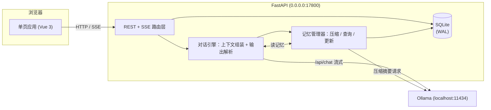
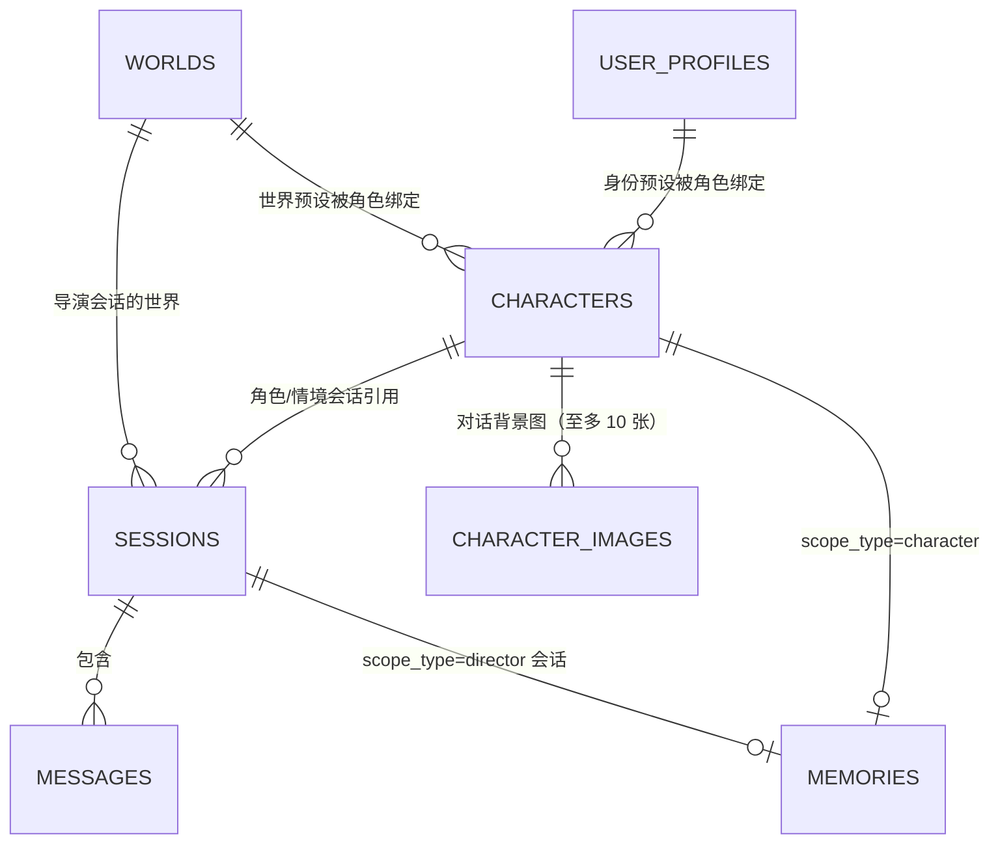

# Wonder Realm（奇想界域）开发文档

基于本地 Ollama 的三模式对话应用：聊天 / 沉浸 / 导演。本文档记录需求、数据模型、核心机制、API 与界面设计，**只描述当前状态**（不记变更历史）；面向使用者的说明见 [README](../README.md)。

章节编号被代码注释与测试大量引用（`见 DEVELOPMENT §x.y`），调整时保持编号稳定。

## 1. 项目概述

### 1.1 目标
- 生成全部走本机 Ollama，不依赖云端 API
- 三模式：**聊天**（扮演角色对话）、**沉浸**（角色 + 情境演绎）、**导演**（自由剧本生成）
- 记忆分两层：会话内消息历史（短期）+ 跨会话长期记忆（按角色或按会话，自动压缩）
- 消息可编辑、删除、重新生成，用户完全掌控上下文
- 交付形态：电脑端 Electron 外壳（双击 `start_desktop.bat`，见 3.3），也可 `uv run run.py` 用浏览器；手机走局域网用同一份网页（见 8.3）

### 1.2 运行环境
| 项 | 值 |
|---|---|
| 操作系统 | Windows 11（不做跨系统适配承诺） |
| 模型服务 | 本机 Ollama（默认 `http://localhost:11434`） |
| 后端 | Python 3.13（uv 管理）/ FastAPI / SQLite（WAL） |
| 前端 | Vue 3 + Vite（`frontend/` 源码 → `app/static/` 产物）/ 原生 CSS |
| 场景 | 单用户本地；局域网开放时用访问码把关（见 8.3），不做多用户并发 |

对话模型不绑定启动配置：首次取 `config.yaml` 默认值，之后界面随时切换；思考型与非思考型均兼容（见 5.2、6.6）。

### 1.3 技术选型理由
- **FastAPI**：原生 async + StreamingResponse，SSE 简单；自带 OpenAPI 文档
- **SQLite + WAL**：单文件零部署，单用户无并发瓶颈，数据全本地
- **Vue 3 + Vite**：产物提交进仓库，离线可用、可模块化组织；代价是多一条 Node 工具链，改前端要多一步构建（`start_desktop.bat` 检测到 Node 时顺手重建）
- **qrcode**（前端运行期依赖）：画给手机扫的局域网二维码。不手搓编码器——错一格就扫不出来，而自写编码器只能靠有限用例保证；代价是产物 +27KB。随构建打进 `app/static/`，运行期不联网（与 Vue 同一原则），正确性由 `tests/test_qr.mjs` 用另一套实现（`jsqr`，仅 devDependency）做"生成→解码"往返验证
- **SSE 而非 WebSocket**：只有单向流（请求 → 生成流），SSE 足够且更简单

### 1.4 术语表
文档、代码、界面三处统一叫法。

| 名词 | 含义 | 代码对应 |
|---|---|---|
| 聊天 / 沉浸 / 导演模式 | 三种对话模式 | `sessions.mode` = `chat`/`immersive`/`director` |
| 角色 | 被扮演对象，可开多个会话 | `characters` |
| 会话 | 一段独立对话，创建时锁定模式 | `sessions` |
| 情境 / 话语 | 消息两部分：旁白情境、角色说的话；沉浸模式用户也能写情境 | `messages.scenario`/`content` |
| 生成要求 | 会话上的生成参数（含导演指令、发散程度） | `sessions.gen_settings` |
| 导演指令 | 仅沉浸模式，写剧情走向的持续要求 | `director_notes` |
| 发散程度 | 严谨/稳定/标准/放飞 → 采样温度 | `TEMPERATURE_LEVELS` |
| 我的设定 | 用户本人的名字/称呼/身份/外观/头像 | `user_profiles`（`id=1` 当前，`id>1` 预设） |
| 附加属性 | 角色动态状态（好感/心情…），随消息落库 | `characters.attr_defs` + `messages.attrs` |
| 世界设定 | 世界观（名称不进提示词） | `worlds`（`id=1` 当前，`id>1` 预设） |
| 角色 / 会话级记忆 | 前者按角色跨会话共享，后者仅导演内按会话独立 | `memories`（`character_id`/`session_id`） |
| 归档 | 已压缩进记忆、默认折叠的消息 | `messages.archived` |
| 角色生成：开放 / 探索 | 与三种模式无关，指生成角色设定的方式；探索锁住三字段 | 生成请求 `mode`；`characters.locked` |
| 预设 / 绑定 | 存下来的"我的设定""世界设定"整份；绑到角色或导演会话上才生效 | `user_profiles`/`worlds` 的 `id>1`；`characters.profile_id`/`world_id`、`sessions.world_id` |
| 竖排图标栏 / 内容面板 | 右侧常驻竖条（`.panel-rail`）/ 点图标滑出的五块内容（`.panel-box`） | 合称 `.panel`（右侧面板） |
| 左栏 | 左侧模式与会话列表 | `.sidebar` |

易混：**"探索"只指角色生成方式**，不是第四种模式；**"情境"是消息内容的一部分**，与"沉浸模式"不同义。

## 2. 需求定义

### 2.1 三种对话模式
| 维度 | 聊天 | 沉浸 | 导演 |
|---|---|---|---|
| 模式标识 | `chat` | `immersive` | `director` |
| 绑定角色 | 是 | 是（共用同一套角色） | 否 |
| 生成内容 | 仅角色话语 | 话语 + 情境 | 自由对话 + 情境 |
| 可配置项 | 角色设定 + 生成要求 | 生成要求 | 生成要求 |
| 生成要求字段 | 回复长度、主动性、发散程度 | 情境篇幅、推进速度、导演指令、发散程度 | 题材、文风、篇幅、情境台词配比、发散程度 |
| 长期记忆 | 按角色跨会话共享 | 与聊天共用 | 按会话独立 |

一致规则：
- 生成要求挂在**会话**上，改动只影响后续生成
- **沉浸输入区两行**：「情境」（可选）+「话语」（必填），两框都不带标题（靠 placeholder 区分），两行都进上下文；其余模式单输入框。桌面两框各两行（`height:82px`，多了框内滚动），手机情境两行、话语一行
- 聊天与沉浸同角色共享设定与长期记忆，但**会话列表相互隔离**（`sessions.mode`），各自恢复到上次打开的会话（见 5.6）
- 记忆隔离：角色 A/B 互不可见，导演各会话互不可见

### 2.2 角色设定
聊天与沉浸共用：

| 字段 | 说明 | 必填 |
|---|---|---|
| `name` | 角色名 | 是 |
| `appearance` / `personality` / `speech_style` / `backstory` | 外观 / 性格 / 语言风格 / 背景故事 | 否 |
| `avatar` | 自定义头像 data URL（jpg/png/webp） | 否 |
| `locked` | 探索模式：隐藏后三项；解锁后永久置 0 | 否 |

角色设定编辑立即生效；`avatar` 不进提示词，仅界面显示。

**`locked`（探索模式）**：`personality`/`speech_style`/`backstory` 在 `locked=1` 时**接口不下发**、`PUT` 忽略，但照常注入 system prompt。裁剪入口只有 `public_character()` 一处。

**头像存取**：选图在浏览器内校验（MIME `image/*`、≤10MB、可解码、最短边 ≥256px、总像素 ≤4000 万）→ 裁剪弹窗取正方形 → 重编码 256×256 JPEG(0.85) → data URL，后端只存此串（上限 256KB 兜底）。校验放客户端是因为大小与分辨率只有拿到原文件才判得准；服务端保留白名单与长度兜底。校验失败就地显示，不依赖只在会话打开时才渲染的底部错误条。

### 2.3 我的设定（用户本人）
表 `user_profiles`（`id=1` 当前、`id>1` 预设），表上**不能有 `CHECK(id=1)`**（预设要占 id>1）。

| 字段 | 说明 | 进提示词 |
|---|---|---|
| `name` | **名字**：只给自己看的标记（与世界的"名称"同性质） | **否** |
| `call_name` | **称呼**：模型怎么称呼你 | 是（聊天与沉浸） |
| `identity` / `appearance` | 身份 / 外观 | 是（聊天与沉浸） |
| `avatar` | 头像，同角色一套校验裁剪 | 否 |

- **名字与称呼是两件事**：模型看到的是 `call_name`（`_user_block` 写"称呼：X"）。**只填名字时整块不出现**；老库升级时 `call_name` 留空、**不复制老 `name`**（语义不同），补列走 `_COLUMN_MIGRATIONS`，`test_profile.py` 有用例盯着
- 注入：system prompt 独立块 `# 与你对话的人`，紧跟角色设定后；三项全空整块不出现。导演模式不注入

**绑定模型（与 2.4 世界设定同一套）**：
- 绑定写在**角色**侧（`characters.profile_id`），一份预设可被多角色共用；改绑入口两处：面板那页的「选择预设」、「编辑角色」弹窗底部下拉
- **绑定 = 唯一启用入口**：绑定时把内容搬进 `id=1`（立即生效）；传 `NULL` 即解绑 = 不启用。**解绑要清空 `id=1`，但清空前必须先看 `id=1` 实际是否为空**——重启后前端记的当前预设是空串，而库里可能还留着上个角色搬进去的内容
- 打开会话按角色校准"当前设定"：

| 角色绑定 | 校准结果 |
|---|---|
| 绑 P，当前非 P | 用 P 覆盖 `id=1`，当前预设记为 P |
| 绑 P，当前已 P | 不动 |
| 没绑（且 `id=1` 非空） | 清空 `id=1`，"未选择" |
| 没绑（`id=1` 本来就空） | 不动 |
| 预设找不到 | 一律不动（宁可不切，不误清） |

- **新角色默认不启用**：`emptyCharForm()` 不带 `profile_id`/`world_id`，角色弹窗默认"不绑定"；打开新角色的会话因此不会带进上个角色的身份。校准只在**打开会话**与**改完角色设定 / 换绑定**两处
- 面板那一页**只读**：显示选中预设的内容（只读框 + 只读词库），页面里没有编辑入口，底部不显示「保存当前配置」而是一行说明。入口键三颗：**选择预设（未选）/ 更换预设（已选）· 编辑预设 · 解除绑定（选了才有）**，一律不带省略号
- **内容只能在「编辑预设」里改**（面板上没有"存为预设"）。弹窗左侧第一项是「＋ 添加预设」= 空白表单（`presetModal.id = null`、还没落库），**必须填名字**才存得下（保存键按名字非空禁用），保存按有无 id 走 POST / PUT；新建的**不自动绑定**。删除也收在编辑弹窗里（面板不放开不可逆操作），还没落库的新预设不能删
- 两弹窗共用一套两栏骨架（左列表 40% + 右内容，620px）；绑定弹窗在一条预设都没有时不开（没得绑），编辑弹窗**必须能开**（新建预设的唯一入口）
- 删除预设时引用它的角色自动解绑（`delete_preset()` 把该列清 NULL，无级联），前端删完再校准一次当前那份

### 2.4 世界设定
与"我的设定"同模型：`worlds` `id=1` 当前、`id>1` 预设。注入位置在**角色设定之前**（世界是最外层框架）；导演模式也注入（与"我的设定"相反）。

| 字段 | 说明 | 进提示词 |
|---|---|---|
| `name` | 世界名称 | **否**（只做自己辨认） |
| `description` / `rules` | 描述 / 规则 | 是（三模式） |
| `terms` | 词库 JSON 数组（有序可增删） | 是（三模式） |

除名称外三项全空时整块不出现。**用哪份世界由绑定决定**：聊天/沉浸走 `characters.world_id`，导演走 `sessions.world_id`（新建会话时选，默认"不用世界"）；打开会话的校准规则同 2.3 那张表。后端只读 `worlds.id=1`（`read_world()`），"生效哪份"由前端开会话/换绑时搬进 `id=1`。删除世界预设时引用它的角色与导演会话一并解绑。

面板入口与"我的设定"对齐：一行"当前世界预设" + 三键（选择/更换预设 · 编辑预设 · 解除绑定），页面同样只读（导演会话的绑定也走这同一颗键，一条入口只管一种语义）。世界预设名称必填（列表靠它辨认），当前世界可留空。

### 2.5 系统生成要求
按模式分组的结构化 JSON，前端渲染表单，每字段映射为提示词自然语言。**例外 `temperature`（发散程度）**：覆盖请求 `options.temperature`（`TEMPERATURE_LEVELS`：0.2/0.6/0.9/1.3，界面只显标签），不是提示词内容；档位缺失或非法时保持 `config.yaml` 不动。记忆压缩与会话命名固定压到 0.3（不让创作口味影响摘要）。

- **聊天**：`reply_length`（简短/适中/详细）、`proactive`（低/中/高）、`temperature`、`extra`
- **沉浸**：`scenario_length`（简短/适中/详细）、`pace`（平缓/适中/快速）、`temperature`、`director_notes`（仅此模式保留，不进对话、只指导生成）、`extra`
- **导演**：`genre`、`style`、`length`（短/中/长）、`composition`（情境/台词配比，缺省 `balanced`）、`temperature`、`extra`

字段定义集中在 `prompts.FIELDS`/`DEFAULT_SETTINGS`，经 `GET /api/gen-settings` 下发，前端不硬编码。

### 2.6 附加属性
角色动态状态（好感/心情…），用户自定义最多 8 条：

| 字段 | 说明 |
|---|---|
| `name` | 名称（必填） |
| `type` | （必选）`text` / `percent`（0–100） |
| `hint` | 取值参考（可选） |

- 定义存 `characters.attr_defs`（JSON，整体读写、有序）；值挂 `messages.attrs`（含 name/type，改定义删属性后历史仍能渲染）
- 名称空的行保存时丢弃；有名字没类型则挡下就地提示
- 模型每轮正文后输出 `[ATTR]` 块；**必须先整块摘掉再走 `[SCENARIO]`/`[DIALOG]` 解析**（否则"好感：42"被当台词）。只认定义里有的名字，百分比抠第一个数字夹到 0–100，认不出标记原样返回（宁可拿不到属性，不吞正文）
- 注入：紧跟记忆后、回复要求前的"角色当前状态"段；只注上一条消息的值（当前会话没有则退回该角色所有会话最近一条），定义每轮注入
- 展示：入口在**顶栏搜索键右边**（`.attr-slot > .attr-btn`，心跳线图标，`showAttrPanel` 决定有没有），点开是键正下方的小下拉 `.attr-panel`（`width:260px`、手机 `50vw`、`z-index:920`），面板里只有标题"附加属性"（不另放 × 键，收起就用顶栏那颗键）。**默认收起**（浮层摊开会平白盖住消息），**模型每生成完一条带属性的消息就自动展开**（`store.revealAttrs(d.attrs)`，两条 done 路径都调），**不跟随点击收起**。显示最近一条带属性的消息那份，百分比渲染进度条；属性值不进气泡

### 2.7 共通能力
1. 本地会话记忆：全部消息持久化，重开完整恢复
2. 编辑消息（话语与情境）；沉浸情境框恒可编辑
3. 删除单条，或级联删除某条及之后
4. 重新生成（见 5.5）
5. 记忆自动压缩：超阈值归档早期消息为摘要，压缩后仍可查看/编辑
6. 停止生成与"停止所有生成"（见 5.5）
7. 会话标题自动命名（用户改名后不再覆盖，见 5.6）
8. 手动备份数据（见 5.7）

### 2.8 非功能需求
- 流式输出；思考型模型正文流出前显示"思考中"占位，推理不进界面与记录
- 记忆压缩后台异步，不阻塞对话
- 所有本地数据路径在配置里直接指定，不用环境变量派生
- 界面中文

## 3. 总体架构

### 3.1 架构图


链路：POST 写 user → 组装 system prompt（世界 + 角色 + 我的设定 + 生成要求 + 长期记忆 + 角色状态）+ 未归档历史 → 调 Ollama `/api/chat` 流式 SSE → 解析落库 assistant → 后台记忆检查/压缩。

局域网来源（手机）走同一套路由，先过 `lan_gate`（Host 校验 + 开关 + 访问码，见 8.3）。

### 3.2 Ollama 客户端封装
`app/ollama_client.py` 供对话、记忆压缩、命名、角色生成共用：
- `chat_stream()`：流式，`yield (kind, value)`（`("status","thinking"/"generating")` 或 `("delta", 正文)`）；读超时不限、连接超时 10s（Ollama 没起来时快速失败）
- `chat_once()`：非流式，返回前剥 ` thinking` 段；`fmt="json"` 时启用 JSON 模式（角色生成用）
- `ThinkFilter`：流式内联 ` thinking` 的状态机过滤器（见 5.2）
- `list_models()`：`/api/tags` 与逐模型 `/api/show` 的 capabilities **并集**得 `thinking` 标记（两者会对同一模型给出不同结果，只信 tags 会漏标）

启动自检在 lifespan：`list_models()` 校验当前模型是否安装，缺失提示"所选模型未安装"；Ollama 不可达只记警告、不阻断。`model` 取自 `app_settings`，切换只改一行数据库、下个请求即生效。

### 3.3 桌面端外壳（Electron）
电脑端是**一个壳**，不是第二份应用：壳起后端、开窗口加载同一份网页，业务一行没重写（`desktop/`，见 8.1）。

| 壳的职责 | 做法 |
|---|---|
| 起后端 | `spawn(.venv/Scripts/python.exe run.py --no-browser)`，`cwd`=项目根；stdout/stderr 转进 `userData/desktop.log`；等 `GET /api/limits` 返回 200 再开窗口（端口已被别的实例占用也算就绪，与 `run.py` 同一套判断）。**探测间隔 1s、上限 120s**——后端在 uvicorn 之前要先确保 Ollama 可用（见 3.4），这段等待里它还没开始监听。**必须带 `PYTHONIOENCODING=utf-8`**：后端输出走管道，Python 按控制台代码页编码（bat 里是 936 → GBK 字节），Node 按 UTF-8 解，不设它日志里后端的中文就是一片乱码 |
| 开窗口 | `loadURL("http://127.0.0.1:17800/")`，**与浏览器里那份完全同一个页面**；外链走系统浏览器；菜单只留"视图 / 窗口"（刷新、手机视图、缩放、开发者工具） |
| 手机视图 | 把窗口收成手机大小（预览 / 收纳用，期间窗口置顶）。**宽度锁死 375**（`setMinimumSize`/`setMaximumSize` 都设 `PHONE_WIDTH + 边框差`，边框可拖但尺寸被钳住），**高度留给用户拖**（480–1400，默认 **667 = 9:16**，再按工作区收一下）；页面按 ≤640px 断点自己变手机单栏，进/出通过 `desktop:phone-view` 事件告诉页面（页面据此隐藏桌面专属键）。**切视图前后窗口中心不动**（`setBoundsCentered()`：按中心改尺寸、贴边时夹回工作区） |
| 单实例与退出 | `requestSingleInstanceLock()`：第二次双击只把已有窗口叫到前面；`before-quit` 杀掉后端子进程（后端是 `run.py` 自己开的 uvicorn，一个进程，`kill()` 即可） |
| 局域网地址 | `os.networkInterfaces()` 挑一个真实 IPv4（优先 `192.168.`/`10.`/`172.16-31.`）拼成 `http://<IP>:17800` 交给页面（显示 + 可复制 + 画二维码）；**地址与二维码都带访问码** `?k=`（码由后端给，壳不参与，见 8.3）。**拿不到就显示"没取到局域网地址"**，不猜 |
| 自绘标题栏 | Windows 上用 **Window Controls Overlay**（`titleBarStyle:"hidden"` + `titleBarOverlay`）：页面自己画最上面那一行（`TitleBar.vue`）：左边图标 + 应用名，右边主题 / 配置 / 手机视图，再往右是系统画的最小化/最大化/关闭。页面的会话名 / 搜索 / 模型 / 思考在下面那一行（`TopBar.vue`）。约束：① 这一行是拖拽区（`-webkit-app-region: drag`，控件逐个 `no-drag`）；② 高度必须与 CSS `--titlebar-h` 同值（`TITLEBAR_H = 32`，否则系统三键与页面按钮错开）；③ 右上角按 `env(titlebar-area-*)` 给系统按钮留宽；④ 主题变了要通知壳（`desktop:set-titlebar-theme`），否则深色页面顶着浅色标题栏；⑤ 窗口键照系统那三个做（`.win-btn`：46px 宽、满高、无圆角、悬停浅灰）。非 Windows 自动退回系统标题栏 |
| 打开日志 | `ipcMain.handle("desktop:open-log")` → `shell.openPath(userData/desktop.log)`：配置面板一个键就能用记事本打开（排查时不用自己去翻 `%APPDATA%`） |

**尺寸口径**：`min/max` 说的是窗口尺寸、`setContentSize` 说的是内容尺寸，两者差一圈边框（直接拿 `PHONE_WIDTH` 当上限会少一圈），所以先量出边框差再补。**尺寸只记在内存里**——每次启动两个视图都用默认（桌面 `DEFAULT_SIZE` 1180×780，按工作区收；手机 375×667），**同一次运行内**记住用户调过的（`desktopBounds` + `phoneContentH`，`resize`/`move` 时更新，进手机视图时每次重抓桌面尺寸），下次启动又回默认；`desktopRestoreBounds()` 防一手脏值（宽度 ≤ `PHONE_WIDTH + 60` 的当手机尺寸丢掉），尺寸都经 `fitInWorkArea()` 收一下（矮屏上会顶到任务栏）。**启动一律桌面视图**。

**页面侧只有三样东西是"壳专属"**：标题栏那一行的「主题 / 配置 / 手机视图」，靠 preload 注入的 `window.dshDesktop` 判定（`isDesktop`）；网页端与手机浏览器没有这个对象，于是根本不渲染（见 7.1）。浏览器里的主题键留在页面顶栏，App 品牌区由左栏自己显示（壳里那一行已经有了，免得同一个名字出现两次）。

**应用图标**：窗口图标用 `desktop/build/icon.ico`（多尺寸 16/24/32/48/64/128/256，由 `desktop/build/icon.png` 这张 1024×1024 透明母版生成；将来 electron-builder 打包默认也找这个路径），两个 `new BrowserWindow`（正常窗口与自检窗口）都传 `icon: APP_ICON`。页面那份品牌标记与浏览器标签图标是同一张图的另外几个尺寸，放在 `frontend/public/`（由 Vite 拷进 `app/static/`，见 7.1、8.1）。

- **「配置」不看会话**：它在标题栏里，任何时候都在，空状态也进得去
- **「手机视图」键在手机视图下不隐藏**：只变选中态、文案改"退出手机视图"——反过来的话进去就没有看得见的出路（菜单栏是 `autoHideMenuBar`，F9 与菜单项都不显眼）。手机视图那一屏只显示窗口键，375 减系统按钮那 ~136px 正好放得下
- **"推送局域网"不走壳**：它是后端 `app_settings.lan_enabled` + `lan_token`，面板上的开关就是 `PUT /api/settings`（「重新生成」是 `POST /api/lan/regenerate`），立即生效、不重启后端（见 8.3）。壳只提供"地址"与"手机视图"这两件后端做不到的事

**壳的日志与偏好**都在 `app.getPath("userData")`（Windows：`%APPDATA%\wonder-realm-desktop\`，目录名取自 `desktop/package.json` 的 `name`）：`desktop.log` 里壳自己做的事以 `[desktop] 本地时间 …` 开头，**后端的 stdout/stderr 也混进来**（前缀 `后端:` / `后端(err):`）——窗口没开出来或一片空白时，原因（Python traceback、端口占用、Ollama 没起来）都在这一个文件里。窗口这一步单独留一行：加载成功记 `窗口已打开：<url>`，失败记 `页面加载失败：<错误码> <描述> <url>`。只追加、不轮转（一次启动几 KB）。

**自检**：`electron . --selftest` 起后端 + 开一个**隐藏窗口**跑关键路径，**当闸门用**（断言不满足就非零退出）。它**不抢单实例锁**（应用开着也要能跑：只开隐藏窗口，后端被占就用现成的），并**改用临时 userData**（`os.tmpdir()/wonder-realm-selftest`）——否则第二个进程会撞 Chromium 的 profile 单例、静默退出，什么都测不到；这个临时目录同时当后端的 `--data-dir`，**自检碰不到用户的库**。开跑前还会经接口建一个角色与一个会话（很多断言量的是"打开会话之后"的界面，空库也要能跑）。断言覆盖 preload 桥接、手机视图尺寸规则、顶栏与配置面板的真渲染结果（完整清单见 `desktop/main.js` 里那些 `bad.push`，要点见 9.8）。设 `DSH_SHOT=<png>`（桌面态）或 `DSH_SHOT_PHONE=<png>`（手机视图态）会**短暂显示窗口并截图**（隐藏窗口的 `capturePage` 只能拿到首帧缓存）；**隐藏窗口里 CSS 过渡不会自己推进**，量"抽屉滑出屏外"这类状态要先轮询到归位再量。开发期复用项目 `.venv` 里的 Python；**打包见 8.4**。

**入口脚本 `start_desktop.bat`**（8.1）：先判断依赖与前端产物、需要时重建前端，再拉起 `electron.exe desktop`。窗口与它起的后端都挂在那个 cmd 窗口下，**关掉 cmd 窗口等于关掉应用**——双击后"只有一行提示、看着像卡住"是正常的，界面窗口由 Electron 单独弹出。文件是 **GBK + CRLF**（中文提示在本机控制台才正常），**末尾切到 `chcp 65001`**（Electron 输出是 UTF-8 字节，936 控制台会显示成乱码；日志文件本身是好的），**切换之后余下的行必须纯 ASCII**（cmd 在 65001 下读多字节内容会按字节错位解析），`test_bats.py` 盯着这两条。

**依赖安装**：`desktop` 只有 electron 一个依赖，但 postinstall 要另下约 110MB 运行时（解压出 268MB）。国内直连 GitHub 容易卡住，结果是"`npm install` 报成功、`node_modules` 也在，唯独 `electron.exe` 没下来"。所以入口脚本的依赖检查落在 `node_modules/electron/dist/electron.exe` 这个**文件**上（不是目录），并把"目录都没有"与"目录在、本体缺"分两种提示、各给命令；装前 `set ELECTRON_MIRROR=https://npmmirror.com/mirrors/electron/`，装后用 `…\electron.exe --version` 验证。npm 11 的 `allow-scripts` 警告只是警告（脚本照跑），**不要**执行 `npm approve-scripts`——它会往 `package.json` 里塞一个空的 `allowScripts: {}`。

### 3.4 启动流程与 Ollama 自启
`run.py` 的顺序：**留备份 → 探端口（已在监听就只开浏览器、不起第二个）→ 确保 Ollama 可用 → 开浏览器 → 起 uvicorn**。先确保 Ollama 是有意的：界面一加载就要拉模型列表，不等它就绪首屏会闪一句"无法连接 Ollama"。

`app/ollama_boot.py` 只做"**没在跑就顺手拉起来**"，已经跑着的一律不动（用户可能还在别的客户端用它）：

| 情形 | 结果 | 说明 |
|---|---|---|
| `/api/tags` 已返回 200 | `running` | 什么都不做。base_url 写 `localhost` 时**再探一次 `127.0.0.1`**：有些环境 localhost 先解析到 ::1 而 Ollama 只听 IPv4，不补这一下会"明明在跑却判成没跑" |
| 没在跑、本机地址、允许自启 | 起 `ollama serve` 并轮询到就绪 | 最多等 30s；**探测间隔由密到疏**（`PROBE_DELAYS` 1s → 1.5s → 2s → 3s，之后都按 3s）：冷启动那几秒它在读模型，探得再密也不会更快就绪，只是空刷请求（Ollama 每次请求都会在自己日志里留一行）。进程 **DETACHED**，关掉应用不影响它；输出追加进 `data/ollama-serve.log`。**spawn 时必须把模型目录传对**（`_models_dir()`：环境变量 `OLLAMA_MODELS` > `ollama.exe` 旁边的 `models/`（且 manifests 非空）> 不设）：默认目录 `%USERPROFILE%\.ollama\models` 在"Ollama 装在 D 盘"这类机器上是空的，拉起来的服务于是"起来了但没有模型"，看着就是"Ollama 没启动" |
| 起了但进程很快退出 | `blocked-port` / `serve-exited` | 从那份日志认出"端口被占"（Windows 上是 `bind: Only one usage…`）还是别的原因：前者提示"去托盘退出 Ollama 再重开"，两种情况都指向那份日志 |
| 起了但 30s 没就绪 | `started-timeout` | 界面里仍会提示连不上，让人手动看一眼，不假装成功 |
| `ollama` 命令不存在 | `skipped-missing` | **不让启动失败**，提示装 Ollama（界面里也有同样的提示） |
| `base_url` 不在本机 | `skipped-remote` | 远端 Ollama 不是我们能启动的 |
| `ollama.auto_start: false` | `skipped-disabled` | 配置里关掉 |

**界面侧要能自己缓过来**：Ollama 冷启动可能比界面慢（几秒到几十秒），只拉一次模型列表的话顶栏会一直挂着"无法连接 Ollama"。所以那句提示旁边有个**重试**键（`store/api.js` 的 `loadModels(ensure=true)`）：先打 `POST /api/ollama/ensure` 让**后端再确保一次**（自启只在 `run.py` 启动时做一遍，后端本来就在跑时那条路径不会再走，光重拉列表拉不回来），再重拉模型列表。接口复用同一套 `ensure_ollama()`（超时压到 20s，因为用户在等着），并把 `report()` 那句话原样捎回界面。

**为什么放在 `run.py` 而不是各个 .bat**：桌面端外壳也是 spawn `run.py`，于是 bat / 命令行 / 桌面端三条入口共用同一份实现（日志在 bat 窗口与 `desktop.log` 里都看得到那一句）。

## 4. 数据模型

### 4.1 ER 关系


`memories` 按 scope 唯一单行滚动摘要；`user_profiles`/`worlds` 装"当前 + 预设"（表名用复数）。外键入口是 `characters.profile_id`/`world_id`、`sessions.world_id`，一份预设可被多处引用。

### 4.2 表结构
```sql
characters(id, name, appearance, personality, speech_style, backstory, created_at, updated_at,
    avatar,              -- 头像 data URL；空串=姓名首字占位
    locked,              -- 1=探索模式，后三字段隐藏且不可改
    profile_id REFERENCES user_profiles(id),  -- 绑定的"我的设定"预设（NULL=不绑定）
    world_id REFERENCES worlds(id),           -- 绑定的世界预设（NULL=不绑定）
    attr_defs)           -- 附加属性定义 [{"name","type","hint"}]

user_profiles(id, name, call_name, identity, appearance, avatar, updated_at)  -- id=1 当前，id>1 预设

worlds(id, name, description, rules, terms, updated_at)  -- terms=[{"term","meaning"}] 有序

sessions(id, mode CHECK('chat','immersive','director'), character_id REFERENCES NULL,
    world_id,            -- 导演会话的世界预设
    title, title_auto,   -- title_auto=1 可自动命名，0=已手动命名
    gen_settings,        -- JSON，见 2.5
    created_at, updated_at)

messages(id, session_id FK CASCADE, role CHECK('user','assistant'), content,
    scenario,            -- 情境；两边都可能带
    attrs,               -- [{"name","type","value"}]
    archived,            -- 1=已压缩，不注入上下文
    edited, created_at)
CREATE INDEX idx_messages_session ON messages(session_id, id);

memories(id, scope_type CHECK('character','session'), scope_id, content,
    message_count, updated_at, UNIQUE(scope_type, scope_id))

app_settings(id CHECK(id=1), model, memory_model,       -- 单行表：运行时设置+界面偏好
    disable_thinking, lan_enabled, lan_token, updated_at)

character_images(id, character_id FK CASCADE, position, data, created_at)  -- 对话背景图
CREATE INDEX idx_character_images ON character_images(character_id, position, id);
```

关键设计：
- **`archived` 而非物理删除**：压缩后仍留库，前端折叠显示"已归档 N 条"，上下文跳过 `archived=1`
- **`scenario`/`content` 分列**：编辑、渲染、注入各自独立，不靠运行时解析
- **删角色**：`character_id` 置 NULL、记忆删除，会话保留（可看不可续，提示"角色已删除"），不级联删会话
- **`app_settings` 单行表**存模型 + 界面偏好（`disable_thinking`、`lan_enabled`、`lan_token`）；`config.yaml` 只是首次默认
- **`title_auto` 字段**而非比对标题字符串（用户可能真命名"新会话"）
- **词库与属性定义用 JSON 列而非单独表**：整体读写、有序、可增删，一次 UPDATE；解析失败退回空列表，不拖垮生成
- **头像/背景图存库而非文件**：备份 = 全部数据
- **加表可以、加列要登记** `_COLUMN_MIGRATIONS`（见 9.3）

### 4.3 长期记忆 scope 规则
| 会话模式 | 记忆 scope | 效果 |
|---|---|---|
| `chat` | `(character, character_id)` | 同角色所有会话共享 |
| `immersive` | `(character, character_id)` | 与聊天完全共用 |
| `director` | `(session, 会话 id)` | 每会话独立 |

隔离靠查询条件：只读当前 scope，其他记忆不进提示词。

## 5. 核心设计

### 5.1 上下文与提示词组装
消息序列固定三段：`[system]`（指令 + 世界 + 角色 + 我的设定 + 生成要求 + 长期记忆 + 角色状态 + 输出规则）→ `[历史]`（`archived=0` 按 id 升序，超 `chat.history_max_messages` 截断最早的）→ `[当前] user`。

**话语与情境至少要有一样有内容**：沉浸允许只写情境（话语留空也发得出去），其它模式只有话语这一栏，照旧要求非空。前端 `store.canSend` 管发送键；后端 `schemas.ChatIn` 也把 `message` 放开成可空，并用 `model_validator` 兜住"两样都空就 400"——前端能绕过去的地方后端要挡住。

附加属性状态块放记忆之后、回复要求之前（越靠后遵循越好）。三套模板（`app/prompts.py`）：
- **聊天**：`# 世界设定` + `# 角色设定` + `# 与你对话的人` + `# 你对这个用户的记忆` + `# 回复要求` + `# 输出规则`。输出规则要求只输出"说出口的话"，不写动作/心理/旁白（尤其不要括号），**明确禁止「角色名：」「角色名说：」前缀**，也不要括号/星号/markdown/引号包裹
- **沉浸**：同上 + `# 导演指令`；输出严格 `[SCENARIO]…`、`[DIALOG]…` 两段，段首必须用这两个英文标记（不写 `[SCENERY]`/中文标记），两段都要有内容，`[DIALOG]` 里同样不写「角色名：」前缀
- **导演**：`# 世界设定` + `# 本会话此前的剧情` + `# 生成要求` + `# 输出规则`；`[SCENARIO]`/`[DIALOG]` 每段以标记开头，段落数量/顺序不限，`[DIALOG]` 可选、配比由 `composition` 决定；刻意不给完整示例，避免被当成段落模板。**只有导演模式的 `[DIALOG]` 带「角色名：」**——那里可能有多个人物，靠名字分辨

**附加属性那两段要写成"数据 + 反例"**（`_attrs_state_block` / `_attrs_rule`）：状态块开头点明"下面这段是后台数据，不是台词"；输出规则里除了"用户看不到 `[ATTR]` 块"，还要**点名反例**——"正文里绝对不要出现属性名或属性值，例如不要在话的结尾写「心情：98%」"。只说"别写进台词"拦不住，模型会把状态块照抄到台词结尾。

`gen_settings_text` 由 JSON 拼自然语言（每模式一个 render 函数），取值一律 `.get(..., 默认)` 兜底。历史注入：沉浸两侧都按原始标记回填（`[SCENARIO]…\n[DIALOG]…`），只有情境时不补空 `[DIALOG]`；聊天/导演注入 `content`。

### 5.2 输出解析与思考模式兼容
解析前剥思考段（qwen3/deepseek-r1 等会在正文外生推理，污染标记结构）。两条路径叠加、不依赖 `think` 请求参数：
- **首选**：新版 Ollama 把推理放在独立 `thinking` 字段，`content` 只含正文；`chat_stream` 只转发 content，`thinking` 非空时发"思考中"状态
- **兜底**：思考段以内联标记形式混在 content 里。非流式直接 `re.sub` 整段剥掉；流式走 `ThinkFilter` 状态机（处理 chunk 边界拆碎的标签，`flush()` 只在非思考态放残尾）

标记用英文 `[SCENARIO]`/`[DIALOG]`（中英混合歧义最小），前端渲染时显示中文"情境"。**识别刻意宽容**（`app/parser.py`）：接受同义词（`SCENERY`/`SCENE`/`NARRATION`/`SETTING`/`CONTEXT`，`DIALOGUE`/`SPEECH`/`TALK`）、大小写任意、全角括号、标记外裸文本按话语算、多情境段合并、空标记跳过。**属性块还额外容一手"整块写成一行"**：`_attr_lines()` 会在每个已知属性名前再断一次（名字按长度降序，「好感度」不会被「好感」切断）。**是否降级只看"有没有出现标记"**，不看切出的段落是否为空（否则纯文本会被误标 `MULTI`）。

容错：认不出标记不丢内容，整体降级为话语文本；落库的 content/scenario 是干净文本（`director` 例外，存原始全文供前端分段渲染）。沉浸允许"只有情境、没有台词"。分段在前端 `segmentsOf()`（同一正则 `SEGMENT_RE`），后端不在 SSE 里附分段结果（同一份数据只在一处解析）。

流式渲染：思考内容已被上面两层拦下，前端只收 `status` 的"思考中"与正文增量；`done` 后用解析结果替换渲染，避免流中解析抖动。

### 5.3 长期记忆注入与更新
- **注入**：只读当前 scope 的 `memories.content`；无记录时显示"（暂无，这是你们的初次交流）"
- **更新**：唯一入口是 5.4 的自动压缩与面板记忆区的手动编辑；对话本身不实时写（避免每轮多一次 LLM 调用）
- **可见性**：面板记忆区显示全文可编辑，下次生成即生效；标注已归档条数、更新时间、`compress_failed`

### 5.4 记忆自动压缩
- **触发**：每次消息落库后（含停止保留的部分）统计未归档 `content` 总字符数，超 `memory.compress_threshold_chars`（默认 20000）即触发；不阻塞 SSE；同 scope 有压缩在途则跳过
- **流程**：锁最早 `archive_batch_size`（20）条未归档消息 → 组装压缩提示词调 `chat_once()`（压缩模型可单独指定，默认同对话模型）→ UPSERT 写回 `memories`、`message_count` 累加、批次置 `archived=1`。失败则本次放弃、批次保持未归档下次重试，连续失败记日志并在面板显示"上次压缩失败"
- **一致性**：已归档内容不因后续删改消息回滚；修正记忆走面板手动编辑。温度固定 0.3

### 5.5 消息编辑、删除与重新生成
- **编辑**（`PUT /api/messages/{id}`）：更新 content/scenario，置 `edited=1`；`scenario` 用 `model_fields_set` 区分"不传=不改"与"显式 null=清空"（`COALESCE` 会让情境删不掉）；正文允许为空（"只有情境"形态），但**正文与情境不能同时为空**，否则 400
- **删除**（`DELETE ?cascade=`）：`false` 只删一条，`true` 删该条及之后
- **重新生成**（`POST .../regenerate`，SSE）：assistant/user 都可触发。**先 `load_generation_context()` 校验（角色未删、可生成），再删范围**——否则角色已删会先白删历史。assistant 删 `id>=mid`（替换式），user 删 `id>mid`（本条是上轮输入，必须保留）；以剩余上下文重新生成，新 id 由 `done` 携带。前端两流程都乐观更新，被拒时回滚（`ssePost`/`api` 抛错带 `httpStatus`），且回滚必须在 `endStream()` 之后
- **停止这次生成**：输入框"发送"变"停止"，`AbortController` 中断 → 服务端在 `CancelledError` 分支把已流出部分照常落库、不发 `done`（一个字符都没流出则不入库，只剩那条 user 消息，重新生成正是补救入口）；前端短暂轮询同步
- **停止所有生成**：`POST /api/generate/stop` → `generation.stop_all()` 把全局代号 +1，正在跑的流下次拿到增量时发现代号变了就跳出循环、走正常收尾（**部分内容照样落库**，不发 `done`）。两个入口：电脑端壳的设置面板（⚙ 配置）、手机端顶栏 ⋮ 菜单。前端按键同时做两件事——中断本机这条流、按需中断角色生成，再打这个端点（多开窗口/手机 + 电脑也能一次全停）。角色生成是普通请求、记忆压缩与会话命名是后台任务，它们各有超时，不受这个端点影响
- **角色生成的中断**：那一次用独立的 `AbortController`（`charModal.gen.abortCtrl`），生成中按钮从「生成角色/换一个」变成「停止」；中断后不报错（`gen.stopped` 标记），输入框里的提示词留着

### 5.6 会话与模式规则
- 创建时锁定 `mode`；`chat`/`immersive` 必须传 `character_id`
- 会话列表按模式隔离（`GET ?mode=`），`openSession()` 兜底校验
- 各模式记住当前会话（`activeByMode`）；生成中禁止切模式
- 标题默认"新会话"；`title_auto=1` 时每轮生成后异步总结，成功后置 0；手动重命名也置 0，之后永不被覆盖。总结失败不置位，下轮重试
- 自动命名喂**角色（模型）说过的话**，一条回复都还没有时退回用户的话（否则标题永远起不来）；用户累计不足 `naming.min_user_chars`（8）字先不命名；温度 0.3；返回前过 `_clean()`（取首行、去前缀/引号/思考段、截断超长、去首尾标点）

### 5.7 数据库备份
**为什么不能直接拷文件**：WAL 下未 checkpoint 的写入只在 `-wal` 里，只拷主文件会丢最后一段、甚至读不出表结构。必须走 `Connection.backup()`（读当前已提交状态，应用运行中也能安全导出）。

**流程**（`app/backup.py`）：库不存在则跳过 → backup() 写 `backups/xxx.tmp` → `PRAGMA quick_check`（不通过就删并记 error，绝不拿没校验过的冒充备份）→ journal_mode 改回 DELETE（去掉 `-wal`/`-shm` 边车）→ 改名 → 自动的那份只留最近 `backup.days`（**7**）个自然日（含当天，名字不合约定的不参与清理）。触发在 `run.py` 起服务前、端口检查前（即便已有一实例也先备）。保留按**天数**而非份数，基准取可解析日期的最大值（不看系统当天，免得隔久了启动一次把旧备份全清光）。失败只记日志、不阻断启动。目录默认 `./backups`，**刻意不放 `data/` 内**（删库手势会连备份一起删）。

**两类备份名字分开**（一眼分得清，也决定谁会被清理）：

| 类别 | 文件名 | 产生 | 轮转 |
|---|---|---|---|
| 自动 | `chatbot-<时间戳>.db` | 每次启动（`backup.on_startup`） | 按 `backup.days` 清理 |
| 手动 | `manual-<时间戳>.db` | 界面上「手动备份」（`POST /api/backup`） | **不清理**：点名要的一份，被自动轮转删掉才是意外；不要了自己在备份目录里删 |

手动那份走同一套 `make_backup()`（同一个在线备份 + 校验路径），只是 `manual=True` 换前缀并跳过清理——自动备份只在启动时做，聊到一半想要一个还原点时不必重启应用。入口：电脑端 ⚙ 配置面板、手机端顶栏 ⋮ 菜单（`store/backup.js` 的 `runBackup()`，结果那行显示文件名与大小）。

### 5.8 对话区背景图
每角色至多 10 张，聊天/沉浸作对话区背景。单开 `character_images` 表：10 张、单张数百 KB，塞进角色表会让列表接口变成每次几 MB，且它不随列表/会话详情下发，按需拉取。
- `GET /api/characters/{id}/backgrounds` → `{images, max}`；`PUT` 整体替换（≤10 张，逐张校验）
- 整体替换而非逐张增删：前端按整体编辑、一次性提交；**新建角色时还没有 id**
- **必须暂存在表单里**（`charForm.backgrounds`）：面板角色设定是整体提交的，不带此字段一保存就清空（与头像同坑）；同步 `charSaved` 只改此项，不整体重拍快照

渲染：背景层在滚动容器外（滚消息时背景静止），`background-size: contain` + center。底部辅助键行左侧浮 `‹ n/总 ›` 胶囊（≥2 张出现），缩略图可拖动排序（HTML5 draggable，与 `‹/›` 共用 `moveBackground`）；第一张默认显示，切哪张**不持久化**（拖拽状态字段不能叫 `bgDragOver`，会盖住同名方法）。校验：MIME `image/*`、≤10MB、长边 ≥640px，等比缩到 ≤1920（只缩不放），重编码 JPEG(0.85)。

## 6. API 设计
除两个 SSE 端点外全返回 JSON；时间戳是 ISO 8601 字符串。

### 6.1 角色管理
| 方法 | 路径 | 说明 |
|---|---|---|
| GET | `/api/characters` | 角色列表（含会话数）；锁定角色不含三隐藏字段 |
| POST | `/api/characters` | 创建 `{..., profile_id?, world_id?, draft_id?}`；带 draft 时锁不锁定由草稿决定 |
| POST | `/api/characters/generate` | 模型生成角色 `{hint?, mode=open/explore}`；探索只回姓名与外观。失败 502 |
| GET | `/api/characters/{id}` | 详情；锁定时不含隐藏字段 |
| PUT | `/api/characters/{id}` | 更新；**锁定时忽略**三字段；`profile_id`/`world_id`/`attr_defs` 用 `model_fields_set` 区分"没带=不改"与"显式 null/[]=清掉"；非法 id 400、非法类型 422 |
| POST | `/api/characters/{id}/unlock` | 永久取消锁定（单向），返回完整角色 |
| DELETE | `/api/characters/{id}` | 删角色（记忆删、会话保留但失效、背景图联删） |
| GET/PUT | `/api/characters/{id}/backgrounds` | 背景图读取 / 整体替换 |

### 6.2 会话管理
| 方法 | 路径 | 说明 |
|---|---|---|
| GET | `/api/sessions?mode=&character_id=` | 列表可过滤；前端必带 `mode`（会话隔离） |
| POST | `/api/sessions` | 创建 `{mode, character_id?, world_id?, title?, gen_settings?}`；title 空则标记可自动命名；`world_id` 仅导演有意义 |
| GET | `/api/sessions/{id}` | 详情（含 gen_settings、world_id、角色摘要） |
| PATCH | `/api/sessions/{id}` | 改标题/gen_settings/world_id；改标题置 `title_auto=0`；world_id 没带=不改、显式 null=不用世界 |
| DELETE | `/api/sessions/{id}` | 删除会话 |

### 6.3 消息与对话
| 方法 | 路径 | 说明 |
|---|---|---|
| GET | `/api/sessions/{id}/messages` | 全部消息（含归档，带 `archived`） |
| POST | `/api/sessions/{id}/chat` | 发送并生成，SSE。`{message, scenario?}`（scenario 沉浸可选，去空白后为空则存 NULL） |
| PUT | `/api/messages/{id}` | 编辑 `{content, scenario?, attrs?}`；attrs 没带=不改 |
| DELETE | `/api/messages/{id}?cascade=` | 删除 |
| POST | `/api/messages/{id}/regenerate` | 重新生成，SSE |

### 6.4 记忆
| 方法 | 路径 |
|---|---|
| GET/PUT | `/api/memories/character/{cid}`（角色记忆，可手动编辑） |
| GET/PUT | `/api/memories/session/{sid}`（导演会话记忆） |

### 6.5 SSE 事件协议
`/chat` 与 `/regenerate` 共用：
```
event: meta   {"message_id"}                    # 仅 chat：user 已落库
event: status {"phase":"thinking"}              # 思考型推理中
event: status {"phase":"generating"}            # 正文开始流出
event: delta  {"text"}                          # 生成增量
event: done   {"message_id","content","scenario"}
event: error  {"message"}                       # 中断并结束流
```
状态判定在服务端（`chat_stream` 遇 thinking 发 `thinking`，首个增量发 `generating`）。错误恢复：生成中途异常发 `error` 并结束，user 消息保留、assistant 不落库，前端显示失败并提供重试（删掉那条 user 原样重发）。用户主动停止不算错误。

### 6.6 运行设置与模型
| 方法 | 路径 | 说明 |
|---|---|---|
| GET/PUT | `/api/settings` | 运行时设置 `{model, memory_model, disable_thinking, lan_enabled, lan_token}`；只在真要改模型名时才查已安装列表（未装 400、连不上 502）；`lan_enabled` 只有本机能改，打开时补访问码、关掉时清空（见 8.3） |
| POST | `/api/lan/claim` | 用访问码换 Cookie（手机首次进来）。闸门里唯一不需要码就能到达的接口，限速在它身上 |
| POST | `/api/lan/regenerate` | 换一个访问码；只有本机能调 |
| POST | `/api/backup` | 手动备份一份（`manual-<时间戳>.db`，不参与自动轮转），返回 `{file, size, dir}`；失败 500 并让人看日志（见 5.7） |
| GET | `/api/models` | `/api/tags` × `/api/show` 并集得 `thinking` 标记 |
| GET | `/api/gen-settings` | 生成要求表单定义 `{fields, defaults}`，前端据此动态渲染 |
| GET/PUT | `/api/profile` | 我的设定（当前 `id=1`），整体覆盖保存 |
| GET/POST/PUT/DELETE | `/api/profile/presets[/{id}]` | 预设库；名字空 400；`id<=1` 404；删除解绑角色 |
| GET/PUT | `/api/world` | 当前世界（`id=1`），整体覆盖 |
| GET/POST/PUT/DELETE | `/api/world/presets[/{id}]` | 世界预设库；名字空 400；`id<=1` 404；删除解绑角色与会话 |
| GET | `/api/limits` | 字数上限表（`LIMITS`），数字只写这一处 |

## 7. 前端设计

### 7.1 布局
三栏并排（左栏 | 对话区 | 右侧面板），两栏都可收起，对话与输入居中留白。
```
┌──────────┬──────────────────────────────────────┬──────────────┐
│模式Tab    │ [☰] 标题 [模式]  [搜索][模型][思考]   │  右侧面板    │
│(三模式)   ├──────────────────────────────────────┤  ·生成要求   │
│列表区     │        消息流居中留白                │  ·世界设定   │
│·角色/会话 │      (气泡 + 情境块)                 │  ·角色设定   │
│[新建]     │  [背景 1/3 关闭背景]           [↓]   │  ·记忆查看   │
│           │  [情境（2 行，无标题）]      [留空]   │              │
│           │  [话语（2 行，无标题）]      [发送]   │              │
└──────────┴──────────────────────────────────────┴──────────────┘
   260px            上限 860px                    330px
```
- **三栏并排**（flex 固定宽项，不是覆盖浮层），收起宽度过渡到 0
- **顶栏横跨"对话区 + 面板"**：`.main` 里 `.topbar` 再 `.work`（左 `.work-main`、右 `.panel`）。面板开合不影响顶栏宽度；代价（已接受）是面板展开时搜索/模型/思考在面板上方，而非贴着对话区右缘
- **居中留白**：对话与输入共用 `--chat-max: 860px` + `margin: 0 auto`，两侧留白对称

**顶栏（页面工具条）**：自左向右是 左栏收起钮 · **会话标题** · **搜索键** · **附加属性键** · 模型下拉 · **思考开关** · 主题键（仅浏览器里在这；壳里它在窗口标题栏那一行，见 3.3）。**当前模式不在这里标注**（左栏 Tab 已高亮，重复没意义）。
- **标题点击就地重命名**：宽度按当前名称算（中日韩字符按两个宽度估，6–40ch），**只占文字那么宽**（`flex: 0 1 auto`）——整行都做成"可重命名区"的话，点名字右边老远也会进重命名；放不下时收缩打省略号。`.title-area` 用 `flex: 1 1 0` 吃掉剩余宽度
- **搜索**：点放大镜才弹出 `.search-pop`（桌面端不再常驻输入框，与手机端一致）。它与放大镜同在一个 `.search-slot`（`position: relative`）里：桌面是键正下方的 300px 小条，手机由断点规则改成整条。命中标黄（`<mark class="search-hit">`）、当前处加 `.current`；计数/清空/↑↓ 始终占位（框宽不随输入变）。状态是 `searchOpen`（**双端共用，且不进 `mobileMask`**，否则桌面一开搜索就冒出手机遮罩）；顶栏因此也要 `position: relative`
- **不做手填模型名**（拼错只得报错）；`.model-select` 带 `min-width: 0`，长模型名不会把控件撑出格子
- **无面板开关**：进出统一由右侧竖排图标栏负责
- **「控制面板」键挂未保存小黄点**（`panelAnyDirty` = 生成要求 / 角色设定 / 记忆三页任一有改动）：手机上图标列在底部弹层里，收着时看不见点，顶栏这个入口得能提示
- 手机断点下 `☰ / 🔍 / 属性 / ⊞ / ⋮` 都钉 `flex: none` 并统一到 36px，免得被挤瘦

**品牌标记**（壳的窗口标题栏与浏览器的左栏各一处，同一张图）：都是 ``——应用图标本体，不是在 CSS 里画的字符徽章；尺寸按容器覆盖（左栏 30px、标题栏 17px、手机视图 15px）。**手机视图下应用名让位、图标留着**：那一屏只剩图标与窗口键，图标是唯一能表明"这是哪个应用"的东西。

**左栏（260px）**：顶部品牌区（`.app-brand`，**仅浏览器/手机**——壳里这一行信息在窗口标题栏上）：应用图标 + 应用名 + 一行小字；下面是"模式选择"标题 + 三模式 Tab；hover/聚焦模式按钮浮出介绍（`.mode-tip`）。**桌面端朝按钮右侧弹**（上方是窗口标题栏、下方是会话列表，只有右边不挡东西）；手机端在下方，且是**左右各留 8px 的整条**（375 宽那屏里「导演模式」那行字最长，按按钮左边定位会把右侧顶出屏幕）。它是 `fixed` 定位、位置由脚本按按钮矩形算——左栏是 `overflow: hidden`，`absolute` 往右弹会被裁掉。聊天/沉浸为"角色列表 → 会话"两级，导演直接会话列表；底按钮按模式新建。

**输入区**（`InputBar.vue`）
- 三行结构：① 辅助键行（左 `.aux-scroll` 横向可滚，装背景切换/继续/隐藏对话/手机端 ⋯；右 `.jump-btn` 钉在行尾不参与滚动）② 情境行 ③ 话语行 + 发送键
- 情境与话语各占一行、共用同一套栅格：每行右侧留出 `--send-w` 宽的一格（情境行是空的占位），两框左右边界严格对齐。`--send-w` 桌面 76px / 手机 68px
- 两框**都不带标题**（靠 placeholder 区分：情境「请输入情境，如动作、场景、心理等」/ 话语「请输入话语」，聊天模式「输入消息，Enter 发送」），**双端都固定一行高**，文字多了框内滚动，底部区域不随输入跳动
- 辅助键那一排**没有背景板**（键浮在输入框外，只有自己那块在 hover 时浮出 `--hover`）；**↓ 键不进收纳**
- Enter 发送、Shift+Enter 换行；话语空则发送禁用。导演模式多一个"继续"键（自动发 `CONTINUE_PROMPT`="继续"，不清空输入框，有可续回复且未生成时置灰）

**右侧面板 = 竖排图标栏 + 点击滑出的内容**
- 最右一竖条 `.panel-rail`（52px）**常驻**，但**没打开会话时里面一个按钮都不渲染**（空竖条只占位）——否则空按钮会冒悬浮提示、第一个还带"当前页"紫底，看着像坏了。有会话时按模式渲染该有的几个（`railTabs = tabs.filter(tabAvailable)`；**能出现的就会用到，所以不做"置灰"**）
- 内容区 `.panel-box`（330px）也按 `activeSession` 挂载（标签页会读它；无会话时整条收窄到图标列宽，否则会留出 330px 空白）
- **打开会话不动面板的开合；面板本身默认收起**（`panelCollapsed` 初值 `true`）：没会话时它本来就没内容，"打开会话就自己展开"很顶人
- 点图标在该栏左侧滑出，再点当前图标收起（宽度过渡）；哪页有未保存改动就在图标右上点小圆点（`.tab-dot`）
- 五页：生成要求 / 世界设定（三模式都显示，**只读**）/ 角色设定（仅聊天沉浸）/ 我的设定（仅聊天沉浸，**只读**）/ 记忆查看编辑。底部「保存当前配置」+「未保存/还原」只服务可编辑的那三页；**只读两页不显示保存键**，改成一行为说明，`activeTabDirty` 也不看这两页（它们永远不会脏）。切到无某页的会话由 `fixPanelTab()` 兜回"生成要求"

**主要界面细节**（只列决定行为与踩过的）
- **未保存提示**：比对快照，有改动就在图标右上点小圆点 + 面板底部显示"未保存"与「还原」；只提示，不弹窗拦截
- **角色弹窗**（780px，与消息编辑弹窗同宽）：容纳生成区 + 头像 + 背景 + 五设定框。"让模型生成"**仅新建时出现**（编辑时再生成 = 换角色）：提示词输入 + 开放/探索单选 + 生成按钮（有草稿变"换一个"）；生成中变「停止」（见 5.5）；改模式清草稿（探索草稿前端拿不到隐藏字段，不能互相顶替）；保存失败**在弹窗内就地提示**（新建常无会话，底部错误条不可靠）
- **探索模式锁定**：`locked` 时三字段完全不渲染，留"已锁定"说明 +「公开角色设定」按钮；解锁走 `ask()`，文案写明永久不可恢复；解锁成功同时写表单与快照
- **头像入口三处文案必须一样**："上传头像"/"更换头像"（用例断言三处表达式相同，四汉字宽度不变不跳动）
- **预设绑定改绑两处**：面板那两页的「选择预设」、角色弹窗底部 `.field-bind` 下拉；显示在两个预设弹窗（左列表第三行"角色：X、Y / 未绑定"、右详情"绑定角色"）。这两个绑定字段只加 `charModal.form`，**不加进 `emptyCharForm()`**（面板 `charForm` 用同一工厂，多一个 null 就一保存即解绑）
- **两个预设弹窗是一套实现 + `kind` 派发**（`BindPresetModal`/`PresetModal` + `PRESET_KINDS`）；词库编辑器抽成 `TermEditor.vue`（`readonly` 给只读页用）；面板那两页的可见性由 `data-tab="world|profile"` 定位（自检探针也靠它）
- **弹窗里的「未保存 / 还原」**（角色弹窗与预设弹窗各一份）：打开/切换时存一份表单快照（`charModal.saved` / `presetModal.saved`）。**快照时机两处坑**：新建角色时在设完空表单后立刻取；编辑角色时要等背景图取回来之后再取——否则"背景图从列表外加载回来"会被算成用户改动，弹窗一打开就顶着"未保存"。手机上面板底部那排够不到，所以弹窗里必须自带这一行
- **附加属性三处**：定义编辑在面板角色设定页（`AttrEditor.vue`，新加行不给默认类型）；入口 + 下拉在顶栏（`AttrPanel.vue`）；编辑消息弹窗内一节。属性值不进气泡
- **头像裁剪弹窗**：固定方形取景框 + 缩放滑杆 + 复位；`touch-action: none`、`draggable=false`；取景框边界用 **outline 而非 border**（`border-box` 下 border 会压尺寸，换算就对不上）；Esc 优先关它
- **消息区**：背景层在滚动容器外（滚消息背景不动）；聊天/沉浸两侧各有头像列，用户列只在设了名字或头像时渲染；气泡上方是说话人 + 时间（两侧镜像），**两侧同白底同边框**，只靠左右与下方缺角区分；气泡宽度只由外层 `bubble-wrap` 约束（内外两层都写会二次收缩）；已归档折叠"已归档 N 条（已存入记忆）"
- **消息操作**：hover 显示操作条——复制/编辑/删除（单条或"此处之后"）/重新生成，都自带文字不加悬停提示；删除选项用小菜单，点别处/Esc 关闭。角色已删除的会话只可查看（"重新生成"不渲染，输入框禁用）

**移动端适配**（断点与触屏约定见 9.6）
- 三断点：`>900px` 桌面三栏 / `641–900px` 紧凑桌面（保留三栏，收紧顶栏）/ `≤640px` 手机单栏。手机规则全部收在一条 `@media (max-width: 640px)` 里
- 左侧栏变 fixed 抽屉（汉堡滑出、遮罩关闭、进会话自动收回）；右侧面板变底部弹层（高 85vh / 上限 94vh，图标栏横排当标签，`onRailClick` 只切页；**入口是顶栏四宫格键** `toggleMobilePanel`，文案叫「控制面板」；**无会话时点它不开遮罩**，只 `flashHint` 提示）
- 顶栏只留：汉堡 / 标题 / 放大镜（弹出搜索条）/ 属性下拉 / 面板（带未保存小黄点）/ 更多 ⋮（模型、思考、主题、停止所有生成、手动备份）
- 输入区：底部辅助内容（背景切换 / 继续 / 隐藏对话）收在「⋯」键里且**默认展开**（进会话就能看到），收起来只留话语框、↓ 与发送键；那一排可横滑、滚动条隐藏
- 消息头像缩到 40px；附加属性下拉宽度只占半屏（`50vw`）、字号收一档；弹窗全屏；预设弹窗上下堆叠
- 全局基础：`viewport-fit=cover` + `--sat`/`--sab` 安全区、`-webkit-text-size-adjust:100%` 禁聚焦放大、`overscroll-behavior:none`、`v-hint` 在 `pointer: coarse` 下降级为点击显示
- 三个开合状态 `mobileSideOpen`/`mobilePanelOpen`/`mobileMoreOpen` 合成 `mobileMask`（**`searchOpen` 不在其中**），`closeMobileLayers()` 一把全关；**遮罩必须 `position: fixed; inset: 0`**——文档流里 0 高的元素真机点不到，抽屉与弹层就关不掉

### 7.2 关键交互流
- **发送**：回车/点发送 → 立即渲染 user 气泡 → 建 SSE →（`thinking` 时"模型思考中…"占位）→ 逐段追加 → `done` 解析渲染、刷新归档折叠区并展开附加属性。生成中变"停止"（`AbortController`，见 5.5）
- **重新生成**：点重新生成 → 确认提示（范围随 role）→ 本地先截断（user 留在列表）→ SSE 同上；被拒时重拉回滚
- **编辑**：点编辑 → 居中弹窗；沉浸**无论当前有无情境都给情境框**（补/清空）；聊天/沉浸还有附加属性节；保存 PUT，气泡带"已编辑"角标；遮罩/Esc 取消（`editingId` 定位）
- **关弹窗**（七弹窗一致）：判据是 **mousedown 时鼠标就在遮罩上**（避免拖选误关），共用 `composables/maskClose.js` 三件套
- **继续生成**（仅导演）：走与发送完全相同的路径（`runSend()`），内容固定 `CONTINUE_PROMPT`；不入参自输入框、不清空
- **新建会话**：聊天/沉浸弹「新会话」（选角色 + 可选标题）；**导演同样弹**（改选世界预设 + 可选标题）——建时就能定世界，但**默认"不用世界"**（与角色一样默认不启用）；建好后立刻打开（校准身份/世界）
- **点别处收浮层**：全局 `onDocumentClick`（`store/ui.js`）在目标不在 `.search-slot` 里时收起搜索条（**属性下拉不跟着收**，见 2.6）。同一个 `click` 是元素自身先跑、document 后跑，所以"点按钮开/关自己"不会被误收
- **切换会话**：面板保持展开，内容刷新为新会话，并按绑定校准；**切换模式 Tab**：列表与当前会话一起换，恢复 `activeByMode`，无则清空对话区；生成中禁止切换；聊天/沉浸无角色时显示"创建第一个角色"引导
- **文案口径**：那两页的键是 `选择预设`（未选）/ `更换预设`（已选）/ `编辑预设` / `解除绑定`，**都不带省略号**；"当前预设：未选择"就是没启用；角色弹窗两个下拉的默认项写「未启用」

### 7.3 前端技术约定
- **Vue 3 + Vite**：源码 `frontend/`，`npm run build` 产物落 `app/static/`（提交进仓库，运行无需 Node；`start_desktop.bat` 检测到 Node 时顺手重建）
- **文件布局**：`src/store.js` 只是 barrel；逻辑按领域分在 `store/` 下（`state`/`helpers`/`api`/`session`/`chat`/`search`/`panel`/`character`/`presets`/`attrs`/`backup`/`desktop`/`ui`）；`composables/` 放与具体界面无关的复用（`maskClose`/`hint`）；`App.vue` 只留布局骨架；`components/` 按区域分（含 `panes/`、`modals/`）
- **store 依赖星形**：各领域模块只 `import { store } from "./state.js"`，彼此不互相 import（结构上无循环依赖）；跨领域走 `store.xxx`。只被一个模块用的可变私有状态就 `let` 在那一处
- **组件拿状态**：`import { store }`；`toRefs(store)` 暴露模板用到的成员（方法用 `const {...} = store` 解构），模板保持裸名字——漏声明就是模板拿到 undefined。`test_app_js.py` 守卫"模板引用的 store 成员 ⊆ 声明过的绑定"
- **不用 Pinia**：单一 store + 组合式 API 够用；无路由库
- **SSE 用 `fetch` + `ReadableStream` 手动解析** `text/event-stream`（`ssePost()`；原生 EventSource 不支持 POST）
- **对话滚动**：`ChatArea.vue` 挂载时 `setChatBox(el)` 交给 store
- **样式全局一份**（`frontend/src/style.css`）：依赖源码顺序与跨上下文优先级，不拆 scoped（见 9.7）
- **悬停提示统一 `v-hint`**（`composables/hint.js`），全项目不用原生 `title`；指令只加监听不改 DOM 结构，浮层是 App.vue 单例
- **Vite 配置**：`build.outDir` 到 `../app/static` + `emptyOutDir`；`plugins: [vue()]`；显式 define 特性开关；**不需要** alias 到带编译器 vue（模板构建期已编译）
- 判"未保存"的快照：`genSaved` / `charSaved` / `memorySaved`（面板三页）+ `charModal.saved` / `presetModal.saved`（两个弹窗）

### 7.4 桌面端壳专属界面（配置面板）
`ConfigPanel.vue`：挂在标题栏那个 ⚙ 上，**只在壳里渲染**（判定 `isDesktop`，网页端与手机浏览器没有 `window.dshDesktop`）。内容是：
- **推送局域网**开关 + 状态行（端口 / Ollama 已连接·N 个模型 / 局域网开·关，数据都取自界面本就在用的 `models`/`modelWarning`/`lanEnabled`，不额外发请求）
- 开关开着且真取到地址时，才画二维码与**带访问码的地址**（可复制），并给一行「访问码 + 重新生成」（见 8.3）；关着时这块什么都不显示
- 动作键：停止所有生成 / 手动备份（结果显示文件名与大小）/ 复制防火墙命令 / 打开日志文件
- 说明行：防火墙命令要管理员权限；启动时自动备份留在 `backups/` 只保留 7 天，手动备份不被自动清理；局域网开着的安全边界（明文传输、公共网络建议关掉）

手机端没有这个面板，对应入口放在顶栏 ⋮ 菜单里（停止所有生成、手动备份两项）。

## 8. 目录结构与配置

### 8.1 目录结构
```
wonder-realm/
├── README.md / .gitignore / config.yaml / pyproject.toml / uv.lock / .python-version
├── run.py                          # uv run run.py → 建库 → 确保 Ollama → uvicorn.run；起后开浏览器
│                                   #   --no-browser 给桌面端用；--lan/--no-lan 切"推送局域网"（8.3）
├── start_desktop.bat               # 双击启动电脑端（Electron 外壳，3.3；GBK + CRLF，同样重建前端）
├── docs/
│   ├── DEVELOPMENT.md              # 本文档
│   └── images/                     # 文档配图（截图、示意图）
├── packaging/          # 打包：wonder-realm-backend.spec（PyInstaller，见 8.4）
├── app/
│   ├── main.py        # FastAPI 实例、静态托管、局域网闸门中间件、lifespan 自检
│   ├── config.py      # 配置加载合并
│   ├── database.py    # SQLite 连接、建表、老库改造（改名/补列）
│   ├── schemas.py     # Pydantic 模型
│   ├── ollama_client.py  # ThinkFilter/chat_stream/chat_once/list_models
│   ├── ollama_boot.py    # 启动时确保 Ollama 可用（没跑就拉起来，3.4）
│   ├── prompts.py     # 三模式 prompt 组装、gen_settings 渲染、字段定义
│   ├── parser.py      # 输出解析（5.2）
│   ├── memory.py      # 记忆查询/压缩/scope（5.4）
│   ├── naming.py      # 会话标题自动总结（5.6）
│   ├── character_gen.py  # 生成角色、草稿、探索锁定裁剪
│   ├── backup.py      # 在线备份 + 校验（5.7）；自动/手动两类名字分开，只有自动的轮转
│   ├── generation.py  # 生成主流程：组装→SSE→解析落库/停止保留
│   ├── net.py         # 来源/主机判定（is_loopback、host_ok）
│   ├── lan_auth.py    # 局域网访问码：生成/宽容比对/领码限速（8.3）
│   ├── lan_gate.py    # 局域网闸门的两半（before/after）：Host 校验、开关、访问码（8.3）
│   ├── routes/        # characters/sessions/chat/messages/memories/profile/world/settings/backup
│   └── static/        # **构建产物**（提交进仓库，不要手改）
├── desktop/            # 电脑端外壳（Electron，3.3）：main.js / preload.js / package.json
│   └── build/          # 应用图标：icon.png（1024 透明母版）+ icon.ico（多尺寸，窗口与打包共用）
├── frontend/           # Vue 3 + Vite 源码
│   ├── index.html / package.json / vite.config.js
│   ├── public/         # 原样拷进 app/static/ 的静态文件：favicon.ico / icon.png / icon-192.png /
│   │                   #   apple-touch-icon-180.png（标签页、手机主屏与页面里的品牌标记）
│   └── src/
│       ├── main.js / store.js / style.css
│       ├── store/（state/helpers/api/session/chat/search/panel/character/presets/attrs/backup/desktop/ui）
│       ├── composables/（maskClose/hint）
│       ├── App.vue
│       └── components/（TitleBar/TopBar/SideBar/ChatArea/MessageItem/InputBar/Panel/ConfigPanel/
│                        TermEditor/AttrEditor/AttrPanel + panes/ + modals/）
├── tests/              # 见 9.8
├── data/chatbot.db     # SQLite（路径由 config.yaml 指定，不入版本库）
├── backups/            # 备份目录（不入版本库；见 5.7）
└── dist/               # 打包产物：backend/（后端 exe）、release/（安装包与 zip），不入版本库（见 8.4）
```
`frontend/node_modules`、`desktop/node_modules`、npm 缓存、`data/`、`backups/`、`dist/` 都不入库；`app/static/` 产物与 `desktop/build/` 的图标**要提交**（没 Node 也能跑、打包要用），源码改了忘构建时 `tests/test_app_js.py` 会拦。

### 8.2 配置文件
```yaml
ollama:
  base_url: http://localhost:11434
  model: ""                       # 首次不预选；之后沿用上次选择
  auto_start: true                # 本机 Ollama 没在跑就顺手拉起来（3.4）；远端地址或 false 则不自启
  options: { temperature: 0.9, num_ctx: 32768 }  # 与 compress_threshold 配套，见 9.5
memory:
  model: ""                       # 压缩用模型，空=同对话模型
  compress_threshold_chars: 20000 # 未归档超该字符数触发压缩（中文约 1.33 字/token）
  archive_batch_size: 20
  max_memory_chars: 600
character_gen: { timeout: 600 }   # 生成角色设定的等待上限（秒）
chat: { history_max_messages: 60 }# 注入历史最大条数
naming: { model: "", max_chars: 12, min_user_chars: 8 }
server: { host: 0.0.0.0, port: 17800, lan: false }
                                  # host=监听地址（0.0.0.0 对外开放；127.0.0.1 只本机）
                                  # lan=首次建库时"推送局域网"的默认值（默认关，之后以库为准，见 8.3）
backup: { dir: ./backups, days: 7, on_startup: true }
                                  # days=自动备份的保留天数（手动备份不参与轮转，见 5.7）
data_dir: ./data                  # 数据库目录
```

### 8.3 局域网访问（手机用）
两件事要分开看：**端口是否对外开放**由 `server.host` 决定（重启生效），**是否放行局域网来源**由运行时开关 `app_settings.lan_enabled` 决定（立即生效）。

| 项 | 说明 |
|---|---|
| 监听 | `server.host` 默认 `0.0.0.0`（所有网卡都听）；想彻底不对外就改 `127.0.0.1`，**改完要重启** |
| 推送开关 | `lan_enabled`：关着时非本机来源一律 **403**，本机永远放行 |
| 每次启动 | **`run.py` 启动时一律写回关闭**；要开就在界面里点，或用 `--lan` 显式启动 |
| 访问码 | `lan_token`：**8 位**（`app/lan_auth.py`，字母表去掉 0/O/1/I/L，手输忽略大小写与连字符）。打开开关时生成、关掉时清空（已发出去的 Cookie 一并作废），面板里可以「重新生成」。**开着而库里没码时一律不放行**——不给"空码"开后门 |
| 手机怎么进 | 二维码与「复制」给的都是**带码的地址**（`http://<IP>:17800/?k=<码>`）：打开 → 换一张 Cookie（`wr_lan`，HttpOnly / SameSite=Lax / 30 天）→ **302 把 URL 里的码擦掉**（免得留在浏览器历史和截图里）。之后同源的接口、SSE、图片请求自动带 Cookie。没带码的页面请求给一个只有输入框的极简页（不加载任何外部资源），它 `fetch` 到 `POST /api/lan/claim` 换 Cookie；`/api/*` 则回 **401 JSON** |
| 领码限速 | 同一来源一分钟内错够 `lan_auth.FAIL_LIMIT`（5）次就 **429**；比对用 `hmac.compare_digest` |
| Host 校验 | `app/net.py host_ok()`：Host 必须是**本机自己的**回环地址 / 机器名 / 网卡地址，否则 **403**（页面请求也给人话）。**与开关无关，本机来源同样要过**——防的是 DNS rebinding：恶意网页把自己的域名解析到 `127.0.0.1`，浏览器便当它与本应用同源，而"来源是回环"这条判据恰恰会放它进来。本机名与地址 10 秒缓存一次（换 WiFi 会变，但不该每个请求都查 DNS）。代价：用域名（DDNS / 反向代理）访问这台机器会被挡，请改用局域网 IP 或 localhost |
| 二维码 | **只在开关开着、且真取到局域网地址时才画**；关着时配置面板**什么都不显示**（不做"打开后会怎样"的介绍）。画的内容是带码的地址 |
| 闸门位置 | `app/lan_gate.py` 的 `before()` / `after()`，由 `app/main.py` 的中间件装上。**放应用层而不是改监听地址重启**：桌面端的按钮要能立即开关，重启后端会打断正在进行的生成。拆两半是为了可测：`tests/test_lan_gate.py` 装一道同款中间件即可，不必起整个应用（`create_app()` 会碰真实 `data/`）；`before()` 放行、`after()` 给带了 `?k=` 的接口请求补 Cookie |
| 403 / 401 的样子 | `/api/*` 回 JSON（前端好提示），页面请求回人话——手机浏览器直接打开时看到"没开启局域网访问"/"输入访问码"比一串 JSON 明白 |
| 怎么开关 | ① 桌面端 ⚙ 配置（标题栏那排，见 3.3 / 7.4）；② `run.py --lan` / `--no-lan`；③ `PUT /api/settings {"lan_enabled": …}`——**只有本机来源能改**（手机端改不了这道闸门，换码同理：`POST /api/lan/regenerate` 也只有本机能调） |
| 首次默认 | `config.yaml` 的 `server.lan`（默认 `false`）只在**首次建库**时写进库；之后以库为准（与模型选择同一条约定） |
| 防火墙 | Windows 需放行入站 TCP 17800：`netsh advfirewall firewall add rule name="Wonder Realm 局域网访问 17800" dir=in action=allow protocol=TCP localport=17800`（收回：`… delete rule name="…"`）。**这条规则不在代码里**，换机器/重装系统要重加；配置面板有「复制防火墙命令」键（`store/desktop.js` 的 `firewallCmd()`，**文案与 README 同源，改一处必须改另一处**，`test_app_js.py` 盯着） |
| 手机访问 | 同一 WiFi → 手机浏览器扫配置面板里的二维码（或打开 `http://<电脑局域网IP>:17800` 手输访问码；IP 用 `ipconfig` 查）。后端是同一份：会话、角色、设置在手机与电脑上是同一套数据，页面也就是同一份（手机按 ≤640px 断点走单栏，见 7.1） |
| 安全边界 | 开着时**只有带对访问码的设备**能用；但 HTTP 是明文，同一 WiFi 上能抓包的人仍可能截到访问码——真正敏感的内容别在不信任的网络开放。要堵这条只能上 HTTPS（自签证书），目前不做。**退出应用即结束**：后端进程随之结束，端口关闭 |

### 8.4 打包与发布
出一版 release 是**三块活**，顺序不能反（后一块要吃前一块的产物）：

```powershell
npm run build --prefix frontend                     # 1. 前端 → app/static/
uv run --group dev pyinstaller packaging/wonder-realm-backend.spec --noconfirm --distpath dist
                                                    # 2. 后端 → dist/backend/（exe + _internal）
npm run dist --prefix desktop                       # 3. 壳 → dist/release/
```

| 产物（`dist/release/`） | 说明 |
|---|---|
| `Wonder-Realm-Setup-<版本>.exe` | NSIS 安装包：可选安装目录、建桌面与开始菜单快捷方式（约 90MB） |
| `Wonder-Realm-<版本>-x64.zip` | 免安装绿色版：解压双击 `Wonder Realm.exe`（约 120MB，解开 300MB） |
| `win-unpacked/` | 未压缩目录版：打包与自检用的就是它 |

**1. 前端**：electron-builder 不管前端，`app/static/` 必须是已构建状态（产物提交进仓库，见 9.7）。

**2. 后端**（`packaging/wonder-realm-backend.spec`）：一目录模式（启动快、不会每次解压到临时目录），25MB。三个坑：
- `run.py` 用 **ASGI 对象**（`from app.main import app`）而不是 `uvicorn.run("app.main:app")`：导入字符串是运行时才解析的，冻结后打包器看不见它，起来就报 "Could not import module app.main"。
- spec 里用 `collect_submodules("app")` + `collect_submodules("uvicorn")`：前者兜住上面那句的导入字符串，后者兜住 uvicorn 按名字动态加载的协议/循环/生命周期实现。
- 前端产物与 `config.yaml` 模板当 datas 进包（分别落在 `_internal/app/static`、`_internal/config.yaml`）。

**3. 壳**（`desktop/package.json` 的 `build` 段）：`files` 只带 `main.js`/`preload.js`/`package.json`；`extraResources` 把 `dist/backend` 放进 `resources/backend`；图标取 `desktop/build/icon.ico`。国内必须设镜像，否则下载 7zip / nsis 资源会连 GitHub 超时：
```powershell
$env:ELECTRON_BUILDER_BINARIES_MIRROR="https://npmmirror.com/mirrors/electron-builder-binaries/"
$env:ELECTRON_MIRROR="https://npmmirror.com/mirrors/electron/"    # 首次要下 electron 本体时
```

**装好之后路径是这样的**（`app/config.py` 的两个"根"）：
- **程序文件**：exe 与 `_internal/`（`app/static`、`config.yaml` 模板）在安装目录 / 解压目录，不需要写权限；
- **可变数据**：壳的 userData `%APPDATA%\wonder-realm-desktop\` —— `config.yaml`、`data\chatbot.db`、`backups\`。壳 spawn 后端时传 `--data-dir <userData>`，所以程序目录一个字节都不动；
- **首启**：壳把包里的 `config.yaml` 复制一份到 userData（想改端口/模型目录就改这份）。没有它也能跑——后端会退回包内那份模板；
- **命令行**：`wonder-realm-backend.exe --data-dir D:\wr-data`（或环境变量 `WR_DATA_DIR`）；`--version` 打印版本号。

**出包必过的验收**：
1. `dist/release/win-unpacked/Wonder Realm.exe --selftest`：打包形态下的完整自检（后端从 `resources/backend` 起、数据落临时目录），断言不过就非零退出；
2. 解压 zip 双击一次：窗口标题对、`/api/version` 回 `packaged: true`、userData 里生成了 `config.yaml` 与 `data\chatbot.db`。

**包外依赖与必须说清的边界**：
- 目标机器要自己装 **Ollama**（不进包）；
- **没有代码签名**：别人首次运行会看到 SmartScreen"未知发布者"，这不影响使用；
- 打包版与开发版的库**不是同一个**（前者在 userData，后者在仓库 `data/`）。要带走现有数据，就把 `data/chatbot.db` 复制到 userData 的 `data\` 下——先关掉应用，别在运行时复制；
- **自检会往临时数据目录里建一个角色与一个会话**（空库也能跑）：它的 userData 与数据根都是 `%TEMP%\wonder-realm-selftest`，碰不到用户的库（见 9.8）。

## 9. 开发约定与强调

### 9.1 文档与命名
- 本文档**只描述当前状态**，不追加变更历史 / 阶段划分 / 决策编号（查"为什么改"用 git）
- 名词以术语表为准，代码 / 界面 / 文档三处一致；新名词先登记再使用
- **改名要成套改**（key / 约束 / 函数 / 界面 / 测试 / 文档），改完 grep 确认零残留，逐案确认同形异义词没误伤
- **不留兼容代码**：结构变了写一次性脚本改库（跑完即删）或删 `data/` 重建

### 9.2 单一数据源
- 字数上限只在 `app/limits.py` 的 `LIMITS`（后端校验 + `/api/limits` 下发，前端不另写）
- 生成要求字段只在 `prompts.py` 的 `FIELDS` / `DEFAULT_SETTINGS`
- 模式定义只在前端 `store/helpers.js` 的 `MODES`（后端只认 key）
- 提示词段落名与文档、代码一致
- **"不传=不改"靠 `model_fields_set`** 区分"没带"与"显式 null"：整体提交的表单（如面板角色设定不带 `profile_id`/`world_id`）若把"没带"当 None，一保存就解绑（见 6.1、6.2）

### 9.3 数据与兼容
- **加表可以、加列要登记** `_COLUMN_MIGRATIONS`（只支持加列；改类型 / 删列 / 改约束要重建）
- **改表名登记** `_TABLE_RENAMES`（在建表脚本前跑）；SQLite 连带改写外键，**必须有用例盯着**（指向不存在表时不报错、写入时才炸）
- **改约束重建表**："建新表 → INSERT…SELECT → DROP → RENAME"，在 `PRAGMA foreign_keys=OFF` 的单事务里完成，完后 `foreign_key_check`
- **库文件丢失自愈**：`ensure_db()` 每次 connect 前检查，缺失或 0 字节就重建（含单行表初始行）
- 偏好与设置同表 `app_settings`；`config.yaml` 只是初始默认，运行以数据库为准
- 备份见 5.7（启动备一份、`quick_check` 通过才算、自动的留 `backup.days` 天、手动的不轮转）

### 9.4 容错与错误提示
- 初始化分步容错：每步 `try/catch`，失败攒起来一次性显示，任何一步失败不带走其余
- **初始化里"设置"要排在"模型列表"前面**（`store/api.js` 的 `init()`）：`loadModels()` 里"还没有选择模型"那句是拿 `currentModel` 比的，反过来会把"已经选过模型"误报成没选；`test_app_js.py` 有守卫盯这两句的先后
- 错误就地显示：弹窗内 / 侧栏操作不依赖底部错误条（它只在会话打开时渲染）
- **先校验、后改数据**（重新生成先校验再删旧消息）
- 失败说人话：超时给等待上限与可采取的动作；异常消息为空时回落异常类名
- 停止生成保留已产内容，不丢弃（代价是多一次同步，已接受）

### 9.5 提示词与解析
- 提示词分块拼装，**空块整块不出现**（不给空标签或"（未设定）"占位）
- 输出解析要宽容；**是否降级只看"有没有出现标记"**
- `[ATTR]` 块必须在正文解析**之前**整块摘掉（否则"好感：42"当台词）；只认定义里有的名字
- 思考内容在应用层剥离，不靠模型配合；思考开关只发 `think: false`（非思考型收 false 无害、收 true 会 400），要"开"就不传
- 模型输出**永不当 HTML**（不用 `v-html`），搜索标黄走分块渲染
- 图片一律浏览器校验 + 固定重编码，入库永远是自己编码的位图；服务端白名单 + 长度兜底
- **记忆阈值与 `num_ctx` 必须配套改**（32768 / 20000），只改一个会静默截断；压缩与命名固定低温度

### 9.6 界面约定
- **主题色板集中 `:root`**：浅色默认、深色 `html[data-theme="dark"]` 覆盖；新增颜色只动两处变量块，禁止散落写死。**主题可自助切换**：顶栏一个按钮在「跟随系统 → 浅色 → 深色」循环（`store/ui.js` `setTheme`），选择存 localStorage；`initTheme()` 在 mount 前按本地/系统定 `data-theme`（首屏无闪烁）；`auto` 下系统偏好变化即时跟随
- **控件外框尺寸不随状态变化**：常驻或预留等宽占位（搜索计数、跳转键、图标栏未保存小点）
- **关键键位置固定**：`.panel-rail` 坐标不随面板开合 / 有无会话变（顶层一竖条常驻）
- **"滚不走"的部分移出滚动容器**，不用 sticky（会从背后穿过、仍占 scrollHeight）
- **点遮罩关闭以"按下"位置为准**（`@mousedown`，防拖选误关），七弹窗统一走 `maskClose.js`
- **浮层层级**：弹窗遮罩 1000 < 裁剪遮罩 1200 < 确认框 1400 < 提示 1500；桌面端「配置」小面板 600（高于消息与属性浮层、低于弹窗）。**确认框必须最高**（可从任何弹窗弹出），同时在根组件里排在最后（同级按 DOM 顺序决胜，双保险）
- **悬停提示统一 `v-hint`**，不用原生 `title`（延迟/样式/换行都差）；纯图标按钮另加 `aria-label`。浮层坐标不用 transform、必给 `width: max-content`（否则靠右时挤成竖排）
- **浮层不占布局、不吃鼠标**（`absolute`/`fixed` + `pointer-events: none`）
- **弹窗操作行钉底**（`.modal-body` 滚动）；变体宽度 / 布局**按源码顺序决胜**——写复合选择器（`.modal.edit-modal` / `.modal.preset-modal` / `.modal-body.preset-split`）
- **未保存用标识提示**（图标小点 + 底部"未保存/还原"），不弹窗拦截；还原要两次点击确认
- **响应式只走 `@media` + CSS 变量，断点固定三档**（`>900` 桌面 / `641–900` 紧凑桌面 / `≤640` 手机）：**桌面样式一行不改**，手机规则全部收在一条 `@media (max-width: 640px)` 里；手机布局不新建组件，只在现有 `SideBar`/`Panel`/`TopBar`/`InputBar` 上加 class 与盖层（见 7.1）
- **触屏优先**：可点元素热区 ≥44px；**hover 类提示在 `pointer: coarse` 下降级为点击显示**（`v-hint` 与 `.mode-tip`）——手机上没有 hover，不改就等于没有提示；`viewport-fit=cover` + `env(safe-area-inset-*)` 避开刘海与底部横条，`-webkit-text-size-adjust:100%` 禁聚焦放大
- **移动端盖层必须 `position: fixed; inset: 0`**：文档流里的遮罩是 0 高元素，真机点不到，抽屉与底部弹层关不掉
- 文案与布局改动要过真实渲染验证（字号 / 宽度 / 按钮挤压读代码看不出来）

### 9.7 前端工程约定
- 样式全局一份，不拆 scoped（依赖源码顺序与优先级）
- 单一 store + 组合式 API（不引 Pinia）；domain modules 星形依赖
- 组件用 `toRefs` 暴露模板用到的成员，模板裸名字；引用必须声明过（否则"点着没反应"）
- 一个组件做一件事：收单条数据的组件不再遍历整份列表（防 n²）
- 源码 `frontend/`、产物提交 `app/static/`：改源码必须 `npm run build`，产物别手改

### 9.8 测试与验证
- **清单**：16 个纯 Python + 4 个 Node（`test_search.mjs`/`test_init.mjs`/`test_mask_close.mjs`/`test_qr.mjs`，需先装前端依赖；`test_qr.mjs` 用 `createRequire` 指到 `frontend/` 解析依赖）。纯前端逻辑用 Node 直连 store 断言，不开浏览器
- **结构性事实用静态守卫**（`test_app_js.py`）：组件绑定、模块级名字来源、消息归属、弹窗关闭判定、字数上限一致、产物存在被引用、移动端断点与触屏约定、桌面壳专属键的出现条件、品牌标记是应用图标本体（两处品牌区共用）、标签页与主屏图标已挂、壳的两个窗口都传了 `icon`、防火墙命令与 README 同源、备份双入口与两类备份前缀分开……**新结构约定顺手补断言**
- **启动脚本的编码约定也上守卫**（`test_bats.py`）：根目录 `*.bat` 必须 CRLF + GBK，并钉住电脑端入口的三处结构（查 `electron.exe` 本体、两种缺失各一条提示、顺手重建前端）
- **后端"闸门 / 边界"用 TestClient 扮演不同来源**（`test_lan_gate.py`）：`TestClient(app)` 默认来源不是回环，天然就是"局域网来客"，`client=("127.0.0.1", …)` 才是本机。**请求要显式带 Host**：默认发的 `testserver` 是域名，会被 Host 校验挡下；局域网来客那份 Host 要从 `local_hosts()` 取本机真实地址，与手机打开 `http://<局域网IP>:17800` 一致。访问码的宽容输入、限速、换码作废、开/关闸门即失效都在这里盯着
- **备份另有一套**（`test_backup.py`）：两类文件名的前缀、副本可读且不是 WAL、7 天轮转（超期删、期内留）、手动那份不被清理也不触发清理、连点不覆盖、库不存在时返回 None
- **路径解析另有一套**（`test_paths.py`）：程序文件与可变数据两个根、`--data-dir`/`--config`/`WR_DATA_DIR` 三种指定方式、配置里相对路径相对数据根、显式配置优先、换根后配置缓存作废；顺带盯住 `config.yaml` 与 `DEFAULTS` 里的路径必须是相对形式（绝对路径一旦写死，打包后会指回开发机），以及 `_merge` 不能把 `DEFAULTS` 改脏
- **壳（Electron）用自带的自检，且是闸门**：`electron . --selftest`（源码形态）与 `dist/release/win-unpacked/Wonder Realm.exe --selftest`（打包形态）都要过，断言不过就非零退出（见 3.3、8.4）
- **守卫反向验证**：故意删被保护的东西确认报红（"碰巧通过"≠"抓得住"）
- 界面改动要真渲染证据：dev（Vue 警告开）+ 生产产物各跑一遍，控制台零 warning/error；涉及函数名 / 导入 / 绑定**只跑构建会漏**
- 探针：`MutationObserver` 挂载（`--virtual-time-budget` 下定时器抢跑）；每步等状态稳定；收尾只执行一次（否则不空闲、浏览器不退）；查倍数用"接口条数 − DOM 数"
- 环境：Windows 控制台 GBK，别打印 `✕` `‹` `›`；**`.bat` 一律 GBK + CRLF，且不许 `chcp 65001`**——cmd 在 65001 代码页下读多字节 bat 会按字节偏移错位解析，从半行中间当命令执行；沙箱里 Vite 构建 / npm install / headless Chrome 需放宽权限
- **只杀自己启动的浏览器**：探针 `Start-Process -PassThru` 拿 PID、`-Wait` 等退出，清理只 `taskkill /PID /T`；**绝不按进程名 / 启动时间筛 chrome**（会连用户浏览器的渲染进程一起杀）
- 改后端要重启应用（没有 `--reload`）；改前端要重新构建 + 刷新页面

## 10. 开放问题
1. **重新生成多版本分支**：当前是替换式；要保留旧生成可切换，需消息表改树结构 + 版本切换界面，有强需求再做
2. **记忆重建**：按"未归档 + 已归档"全量重算记忆的维护功能，视使用频率
3. **会话导出**：Markdown / JSON，未在范围
4. **重新生成在生成阶段失败时原消息不可恢复**：要把删除推迟到成功之后，视实际频率
5. **探索草稿存内存**：刷新 / 重启即丢，需重新生成；可落草稿表或 localStorage，当前不值得
6. **锁定字段无"部分公开"**：要么全锁要么全公开；需要则把 `locked` 改成按字段记录
7. **词库不能拖拽调序**：目前只能增删（顺序即添加序）；可照背景图那套加拖拽，存储已是数组
8. **一次会话只能绑一份世界**：导演会话各自一份，聊天 / 沉浸同角色仅一份（跟角色走）；若要同一角色在不同会话处于不同世界，需把绑定从角色挪到会话（`sessions.world_id` 列与接口已备，缺的是聊天 / 沉浸带上它）
9. **发布还可以顺手做的几件**（打包本身已就绪，见 8.4）：**代码签名**（消除 SmartScreen"未知发布者"，需要证书）、**一键添加防火墙规则**（现在只做到"复制命令"，真要免提权得走 UAC 提权）、Ollama 未安装时的引导、最小化到托盘、自动更新
10. **HTTPS**：局域网访问目前是明文 HTTP（访问码可能被同网抓包看到）；要堵这条需自签证书 + 手机手动信任，视需要再做

